# 037：奖励就够了（Reward is Enough）

在本节课中，我们将一起学习由David Silver、Satinder Singh、Doina Precup和Richard Sutton撰写的论文《Reward is Enough》。这篇论文提出了一个核心假设：在足够复杂的环境中，最大化奖励是驱动智能行为出现的充分条件。我们将探讨这个假设的含义、其背后的推理，以及它对实现通用人工智能的启示。

## 论文概述与核心假设

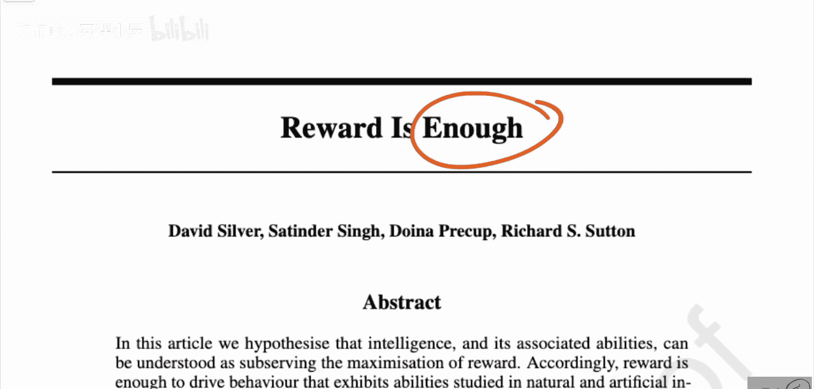

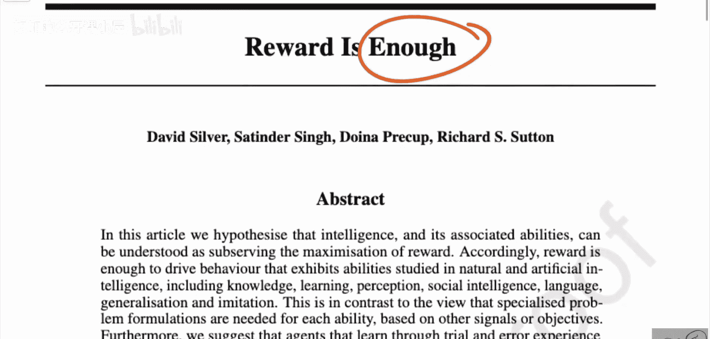

上一节我们介绍了课程背景，本节中我们来看看论文的核心观点。

论文的摘要指出，本文假设智能及其相关能力可以被理解为服务于奖励最大化这一目标。因此，**奖励足以驱动在自然和人工智能研究中被探讨的各种能力**，包括知识、学习、感知、社交智能、语言、泛化和模仿。

这与另一种观点形成对比，即认为每种能力都需要基于其他信号或目标的专门化问题表述。论文进一步提出，通过试错经验学习最大化奖励的智能体，可以习得展现上述大部分（即使不是全部）能力的行为。因此，强大的强化学习智能体可能构成通向人工通用智能的解决方案。

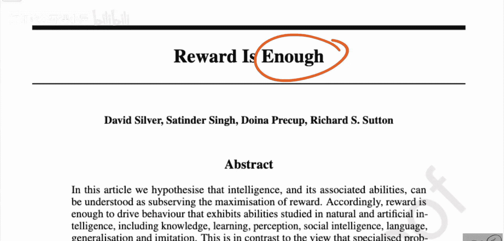

论文的核心假设可以表述为以下公式：
**智能 ≈ 在复杂环境中最大化奖励**

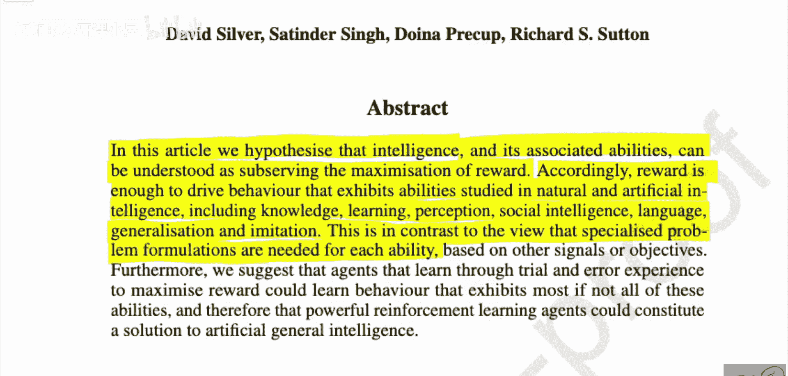

## 假设的例证与阐释

在理解了核心假设后，我们通过具体例子来加深认识。

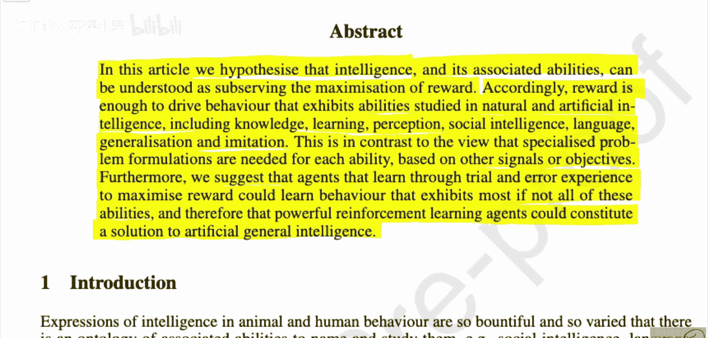

作者用两个例子来说明这一假设：
1.  **松鼠**：其目标是最大化食物（橡果）的消耗。为了达成这个目标，它需要发展出感知、攀爬、评估坚果质量、埋藏并记住位置等一系列能力。
2.  **厨房机器人**：其目标是最大化清洁度。为了有效清洁，它需要学会感知环境、操控物体、清洗，甚至可能发展出社交能力（例如点外卖以减少烹饪产生的污渍）。

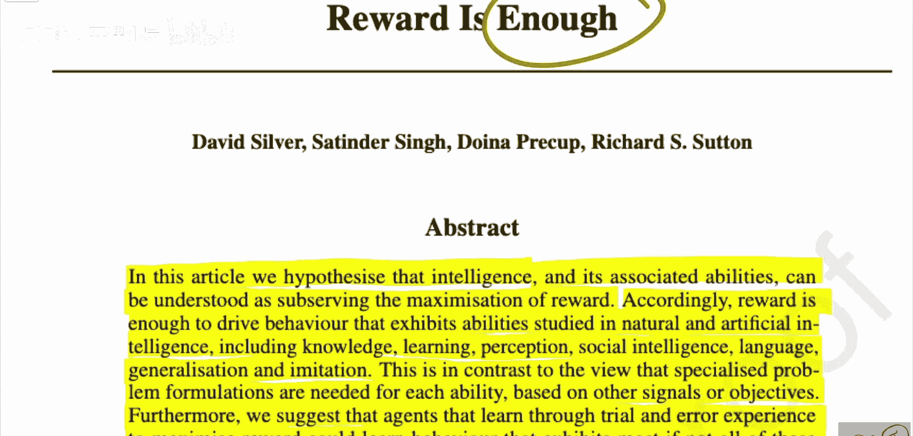

这些例子表明，为了在复杂环境中最大化一个单一的奖励信号，智能体必须自然而然地衍生出多种看似独立的子能力。下图直观地展示了这一概念：


## 与其他研究范式的对比

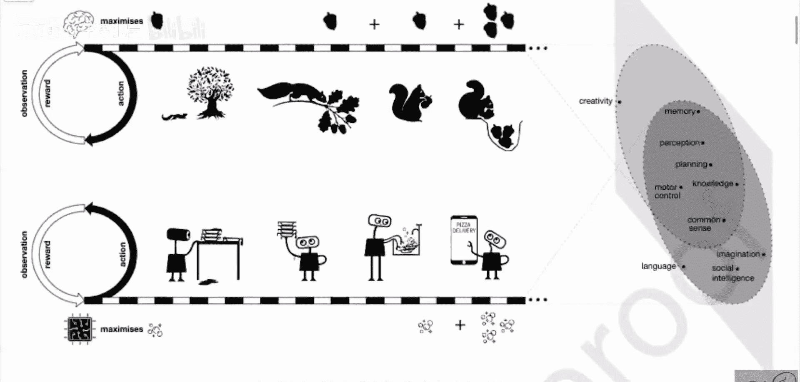

现在，让我们将“奖励就够了”的视角与其他研究方法进行对比。

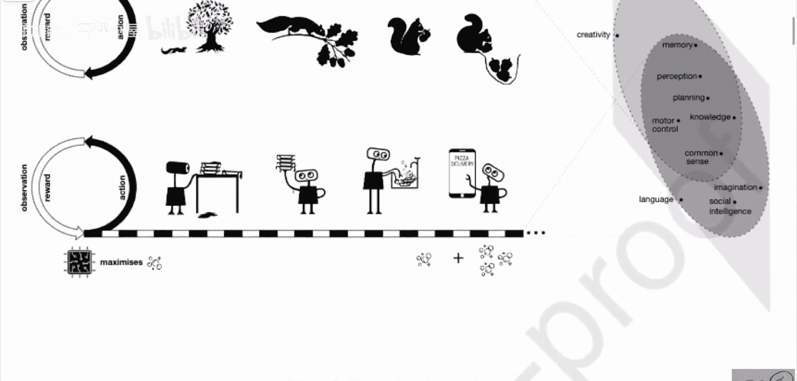

论文指出，通过奖励最大化的视角来审视智能，可能提供更深刻的理解，因为它解释了**某种能力为何会出现**（例如，躲避鳄鱼是因为不想被吃掉）。相比之下，当每种能力都被理解为实现其自身专门化目标的解决方案时，“为何”这个问题被回避了，重点放在了“能力做什么”上。

一个单一的目标（奖励最大化）可能提供更广泛的理解，甚至可能催生新的智能形式。作者以AlphaZero为例：在围棋和国际象棋中，仅仅通过最大化获胜的奖励，AlphaZero自发地发现了全新的战术和开局方法，而这些并非人为教授的。

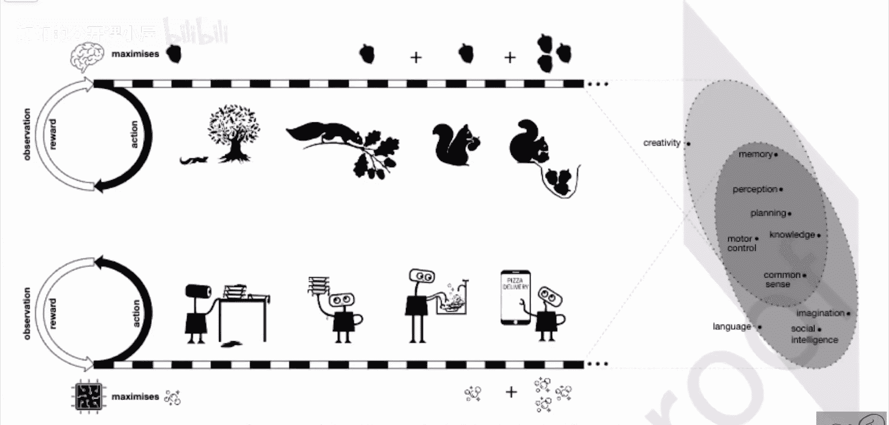

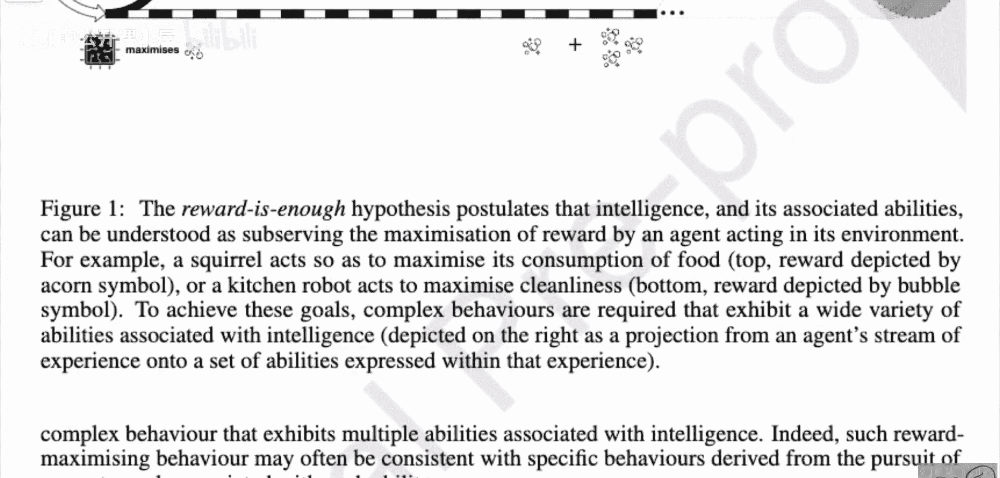

## 形式化框架：强化学习

为了更精确地讨论，我们需要将问题置于标准强化学习框架中。

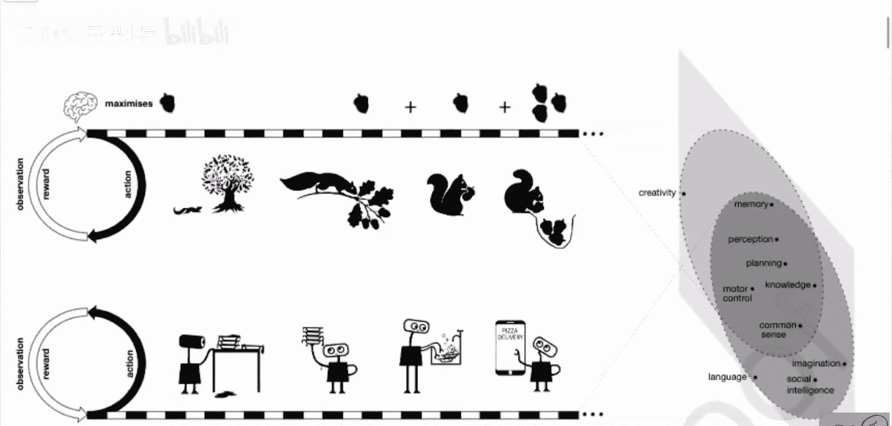

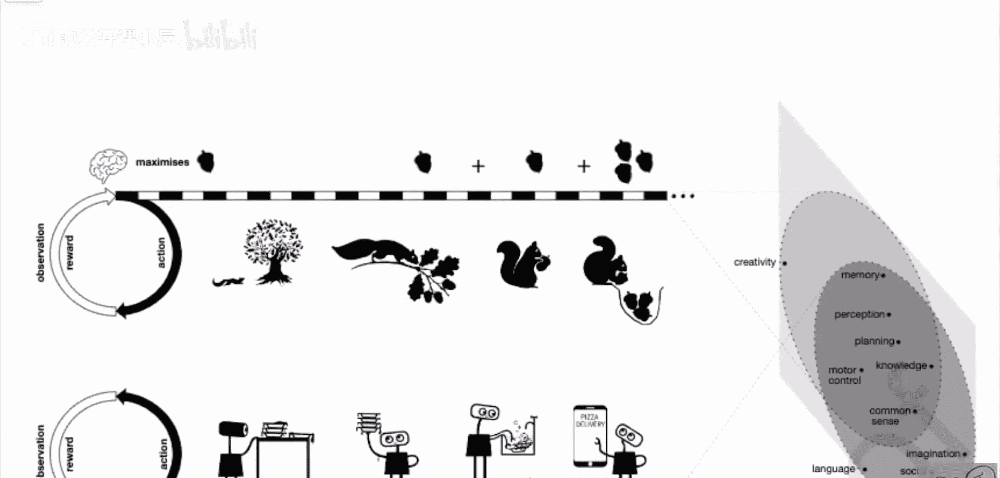

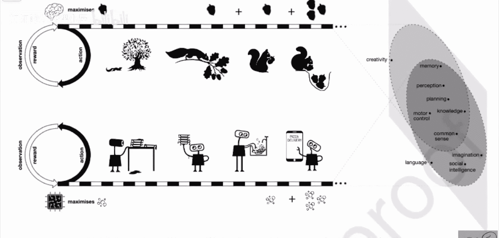

在该框架中，智能体与环境持续交互。智能体在时间步 `t` 观察到状态 `s_t`，并据此采取动作 `a_t`。环境接收动作，转移到新状态 `s_{t+1}`，并给出一个标量奖励信号 `r_{t+1}`。智能体的目标是学习一个策略 `π`，以最大化其获得的累积奖励期望值。

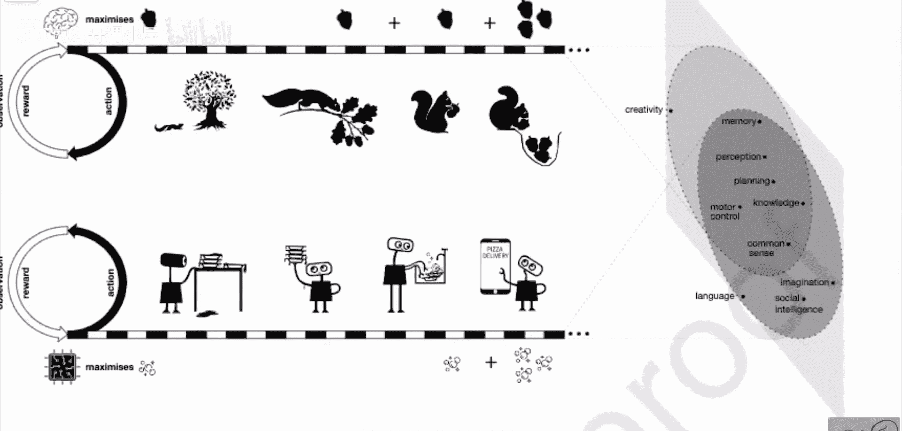

在这个形式化描述中：
*   **智能体**：指决策过程本身。例如，松鼠的大脑是智能体，而其身体被视为环境的一部分。
*   **环境**：包含智能体之外的一切。在多智能体系统中，其他智能体也被视为环境的一部分。
*   **奖励**：是驱动一切学习和行为衍生的单一信号。

其交互过程可以用以下代码块表示的核心循环来描述：
```python
# 强化学习交互循环伪代码
state = env.reset()
while not done:
    action = agent.act(state)  # 智能体根据状态选择动作
    next_state, reward, done = env.step(action) # 环境反馈
    agent.learn(state, action, reward, next_state) # 智能体学习
    state = next_state
```

## 对假设的讨论与思考

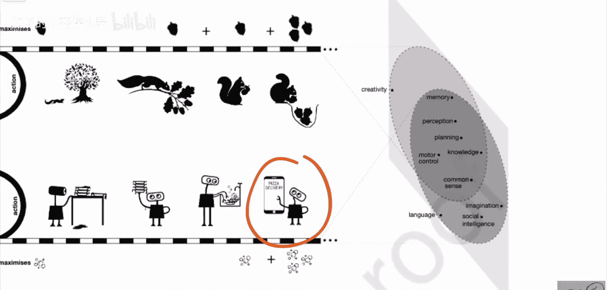

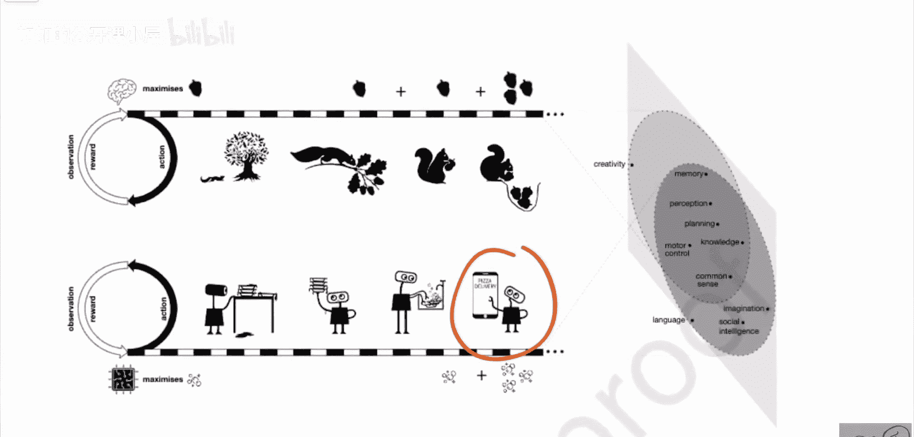

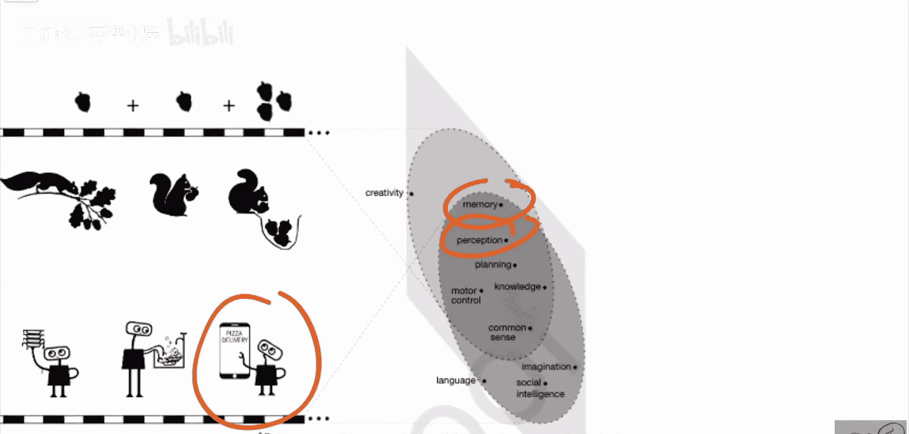

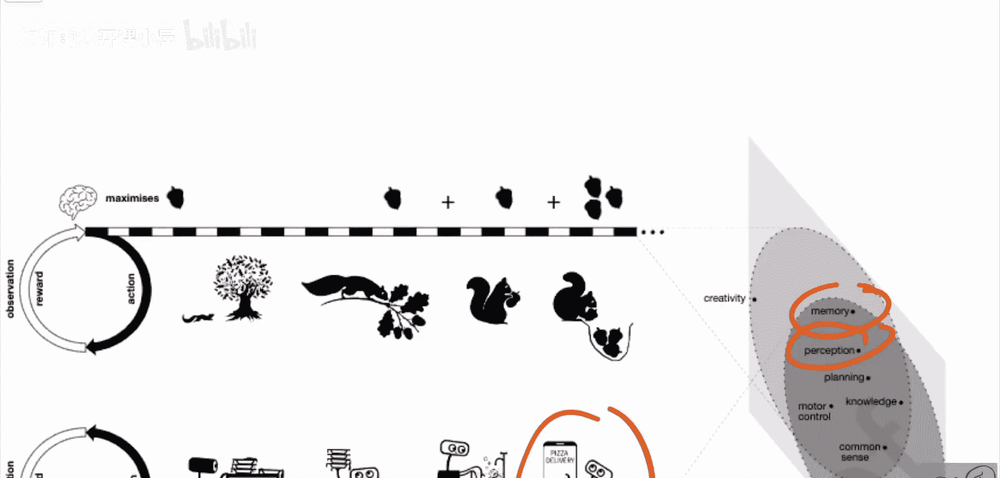

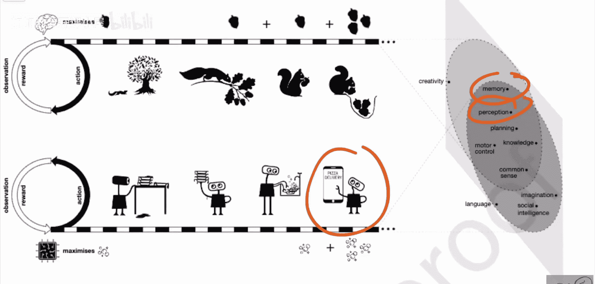

尽管论文提出了一个简洁有力的观点，但我们在接受它时也需要进行一些批判性思考。

论文的威力很大程度上依赖于“足够复杂的环境”这一前提。作者心中所想的这种环境，很可能就是**真实世界**本身（无论是物理世界还是互联网）。在如此复杂的环境中，为了最大化一个长期奖励，智能体确实需要整合多种认知能力。

然而，这一假设也面临挑战。例如，如何设计一个既能提供丰富学习经验，又能在计算上可行的复杂环境？奖励函数本身是否可能难以设计或定义？稀疏奖励问题如何解决？这些都是在实践“奖励就够了”这一理念时需要面对的实际问题。

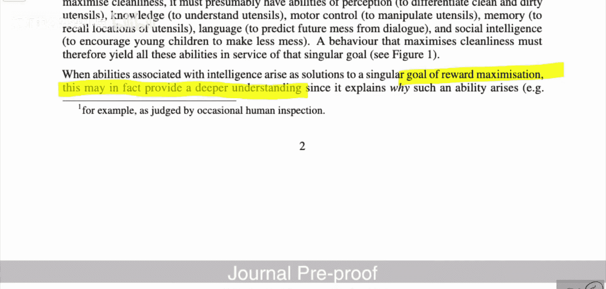

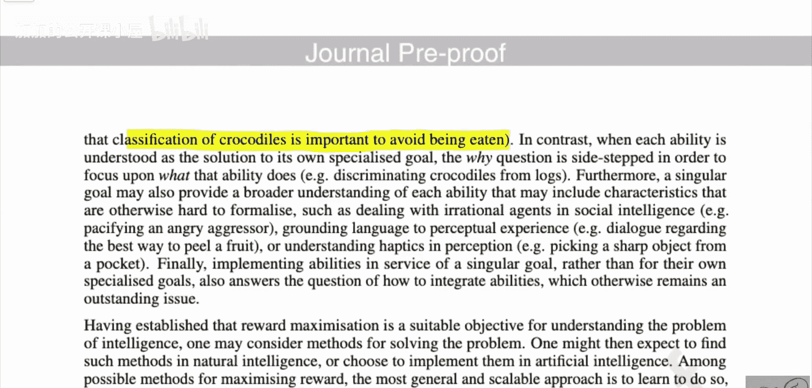

## 总结

本节课中我们一起学习了论文《Reward is Enough》的核心内容。

我们探讨了其核心假设：在足够复杂的环境中，最大化奖励是驱动智能及相关能力（如感知、学习、社交等）出现的充分条件。我们通过松鼠和厨房机器人的例子理解了这一观点，并将其置于标准的强化学习框架中进行形式化。同时，我们也对比了该观点与其他专门化研究路径的不同，并对其有效性和实践挑战进行了简要讨论。

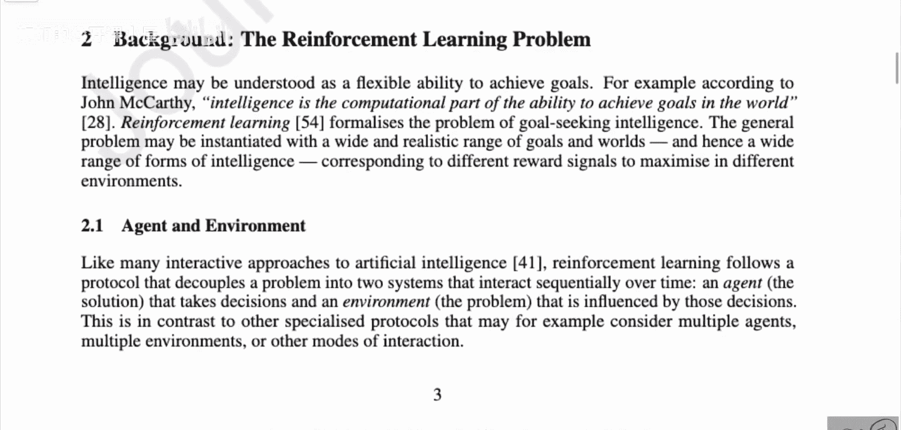

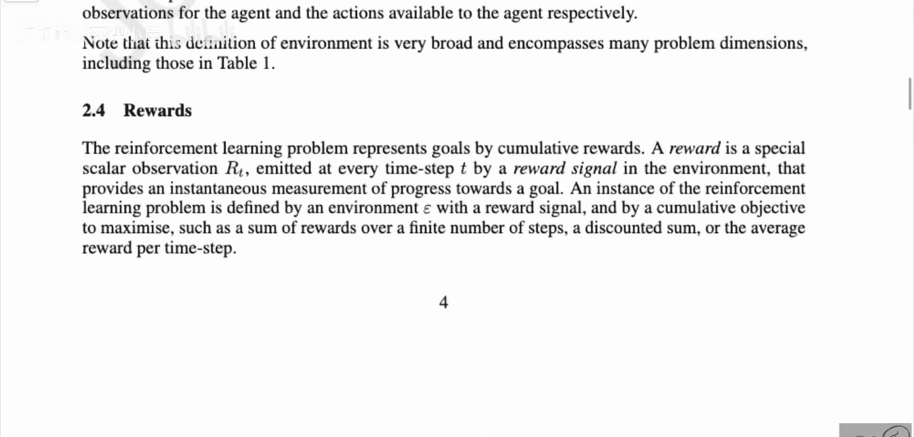

这篇论文提供了一个迈向通用人工智能的简洁而统一的视角，即专注于构建能够在复杂环境中有效最大化奖励的强化学习智能体。尽管前路充满挑战，但它为研究方向提供了重要的启发。