# 039：高效且模块化的隐式微分

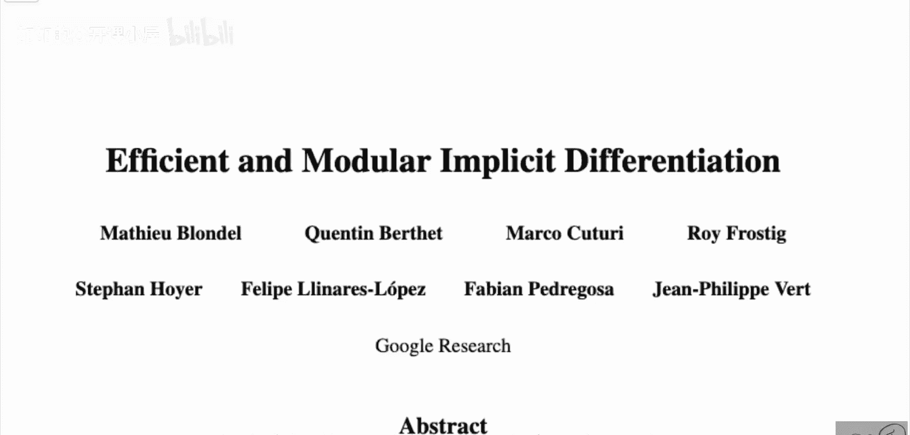

在本节课中，我们将学习一篇来自谷歌研究团队的论文，主题是“高效且模块化的隐式微分”。这篇论文的核心思想是扩展了像TensorFlow或PyTorch这类框架中的自动微分概念，使其能够处理多级优化问题。这意味着我们可以对内部优化循环进行微分，而无需展开该循环，也无需以可微分的方式重新实现优化过程。这为许多研究领域（如元学习和超参数优化）提供了极大的便利。

## 背景与动机

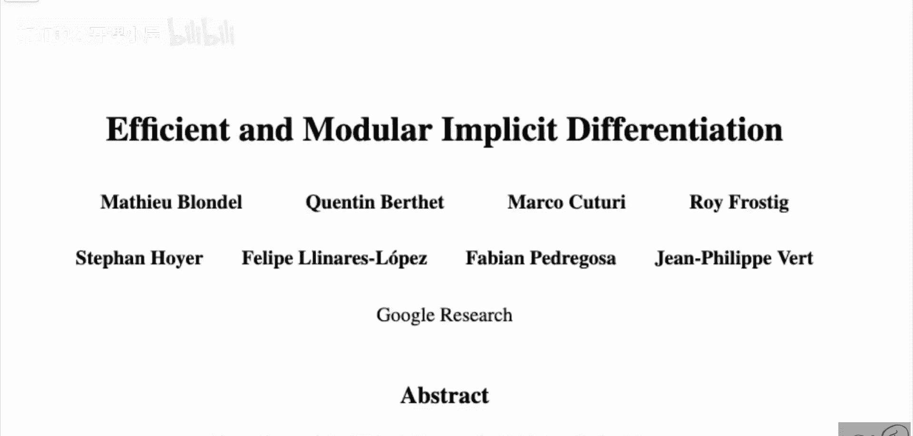

上一节我们介绍了论文的核心目标。本节中，我们来看看其提出的背景和动机。

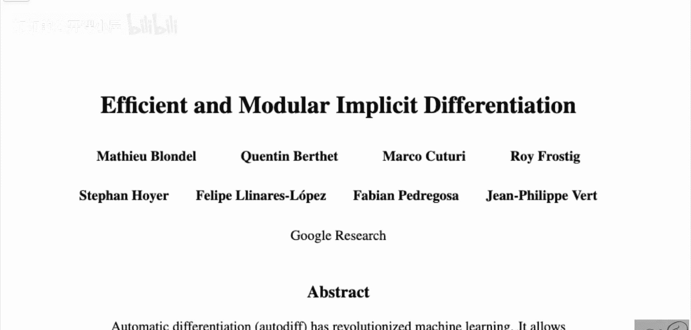

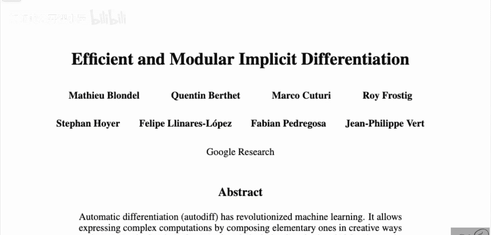

自动微分技术已经彻底改变了机器学习领域。它允许我们通过创造性地组合基本运算来表达复杂的计算，并免去了手动计算导数的负担。回顾早期的深度学习论文，作者往往需要花费大量篇幅来推导所提出架构的梯度，以便实现它。而现在，有了自动微分框架，我们只需组合一系列函数，然后调用梯度计算即可。这无疑是推动过去几年深度学习革命的重要因素之一。

然而，当前自动微分主要处理的是前向计算图的直接微分。论文指出，近年来，对**优化问题解**的微分吸引了广泛关注，其应用包括将优化过程作为神经网络的一层，以及双层优化问题，如超参数优化和元学习。这里的核心挑战在于，我们不仅需要对解本身进行反向传播，还需要对**找到该解的路径**进行微分。

## 元学习示例

上一节我们提到了元学习是隐式微分的一个重要应用场景。本节中我们通过一个具体的例子来理解其需求。

考虑一个元学习场景，我们有多个相关但不同的任务（例如，根据口味、卡路里或其他营养成分对食物进行分类）。每个任务都对应一个神经网络，它们架构相同但最优参数（即“解”）不同。元学习的目标是找到一个**初始参数点**，使得从这个点出发，对任何一个新任务进行微调时，都能快速收敛到该任务的最优解。

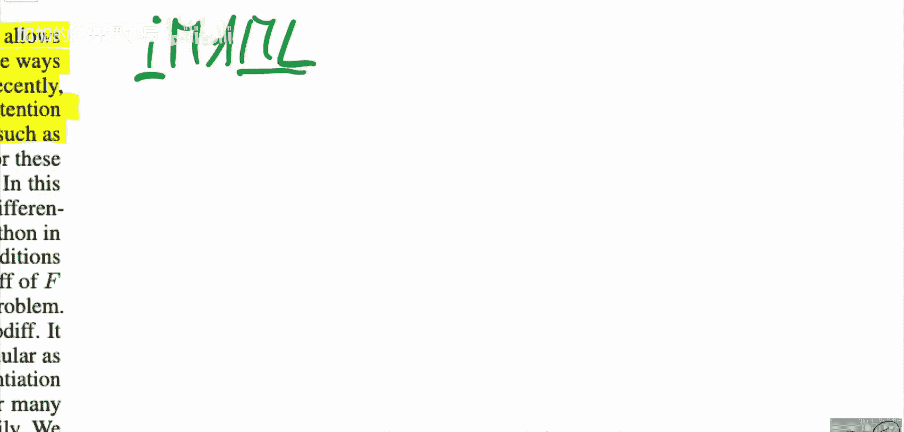

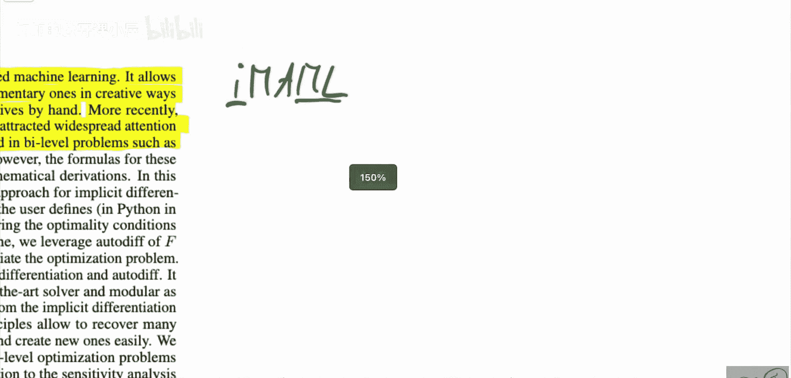

为了评估一个初始化点的好坏，我们需要知道从这个点出发，优化到每个任务最优解后的性能。这本质上要求我们计算**最优解相对于初始化参数的梯度**。而这个最优解本身，是通过一个内部的优化过程（如梯度下降）得到的。因此，我们需要对这个内部的优化循环进行反向传播。

## 传统方法的局限性

上一节我们了解了为什么需要对优化过程进行微分。本节中我们来看看传统方法是如何做的，以及其局限性。

传统上，要对一个优化过程（如梯度下降）进行微分，通常需要**展开**这个循环。假设我们使用梯度下降更新权重 `W`，其更新公式为：
`W_{t+1} = W_t - η * ∇_W L(W_t)`
其中 `η` 是学习率，`L` 是损失函数。

如果我们进行 `T` 步更新，最终权重 `W_T` 可以写成一个关于初始权重 `W_0` 的冗长表达式：
`W_T = W_0 - η * ∇_W L(W_0) - η * ∇_W L(W_1) - ...`
这里 `W_1` 本身又包含 `W_0`，如此嵌套。自动微分框架（如PyTorch）可以跟踪这个展开的计算图并进行反向传播。

然而，这种方法存在几个显著问题：
*   **计算开销大**：展开的表达式会非常庞大，导致前向和反向传播速度慢，内存消耗高。
*   **实现复杂**：通常，TensorFlow或PyTorch中的优化器（如SGD、Adam）本身并不可微分。为了展开循环，我们需要用可微分的操作重新实现整个优化过程，这非常繁琐。
*   **缺乏通用性**：过去，针对特定问题（如某些元学习算法）的隐式微分需要单独、复杂的推导，没有统一的框架。

## 论文的核心贡献

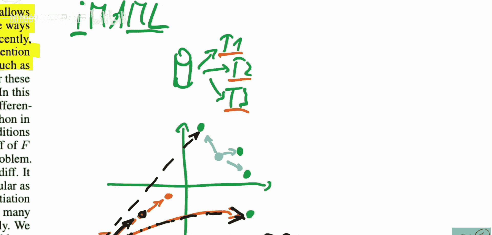

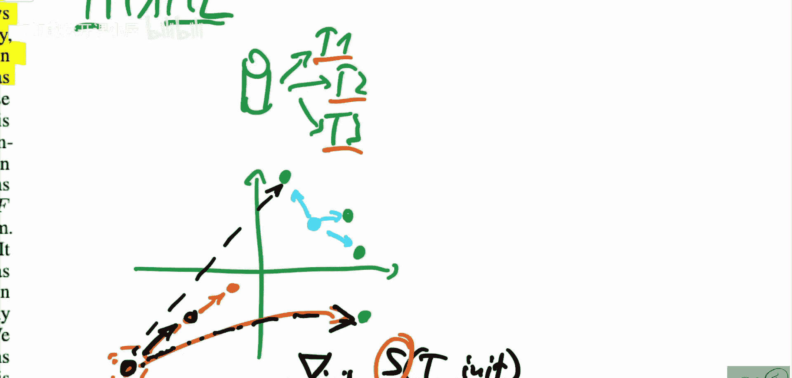

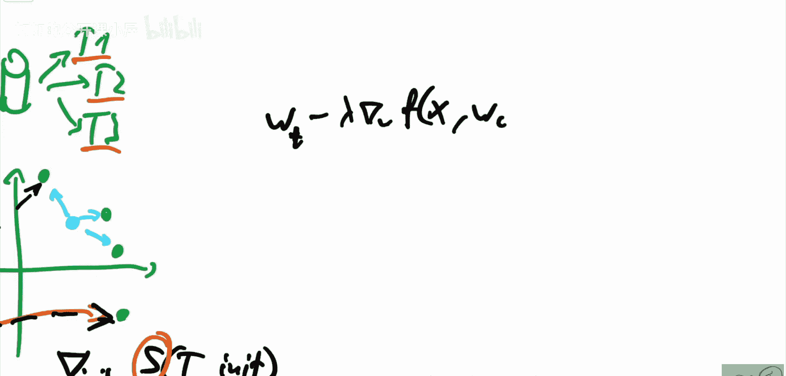

上一节我们看到了传统方法的不足。本节中我们来看看这篇论文提出的统一框架如何解决这些问题。

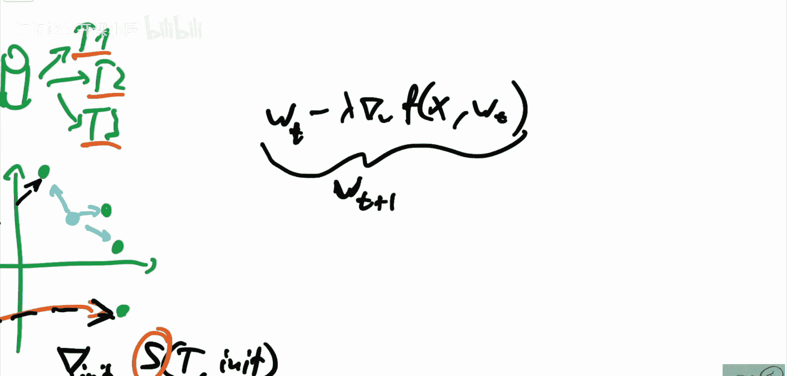

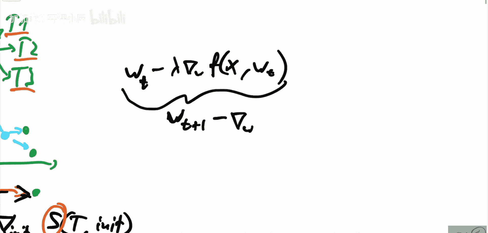

这篇论文提供了一个**统一、模块化的框架**，用于对一大类优化问题的解进行高效隐式微分。其核心思想是，不通过展开优化循环来计算梯度，而是利用**隐函数定理**，直接建立最优解与输入参数之间的关系，并求解由此产生的线性系统来计算梯度。

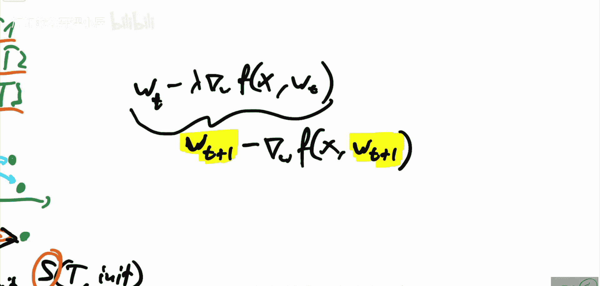

以下是该框架的几个关键优势：
*   **无需展开**：避免了展开整个优化循环带来的巨大计算和内存开销。
*   **无需重写优化器**：可以直接利用现有的、不可微的优化器（如SciPy中的求解器）来获取最优解，然后框架能自动计算该解关于输入参数的梯度。
*   **统一且通用**：论文证明，许多过去需要特殊推导的实例（以及许多新问题）都可以纳入这个框架，有时能更轻松地求解。
*   **提供理论保证**：框架还提供了一些近似保证，增强了其实用性。

## 总结

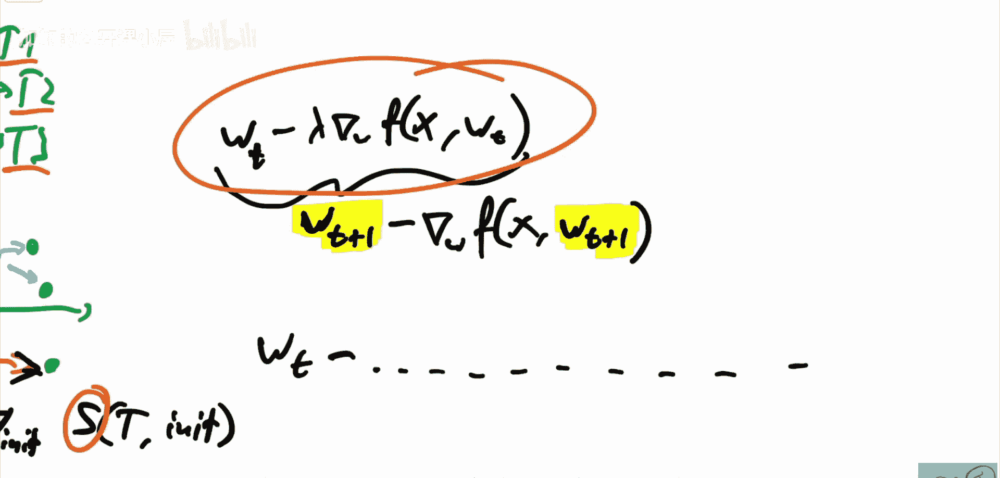

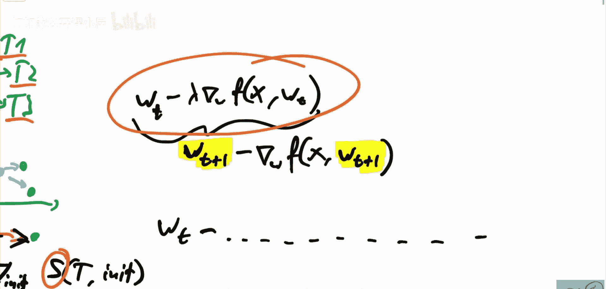

本节课中我们一起学习了“高效且模块化的隐式微分”这篇论文。我们了解到，该论文扩展了自动微分的范畴，使其能够优雅地处理需要对内部优化过程进行微分的场景，例如元学习和超参数优化。通过避免展开优化循环和重写优化器，它提供了一个高效、统一的解决方案，有望降低相关领域的研究和工程门槛，并激发新的应用。虽然其背后的数学（如隐函数定理）有一定技术性，但论文提供的代码和框架使得非专家也能利用这一强大工具。