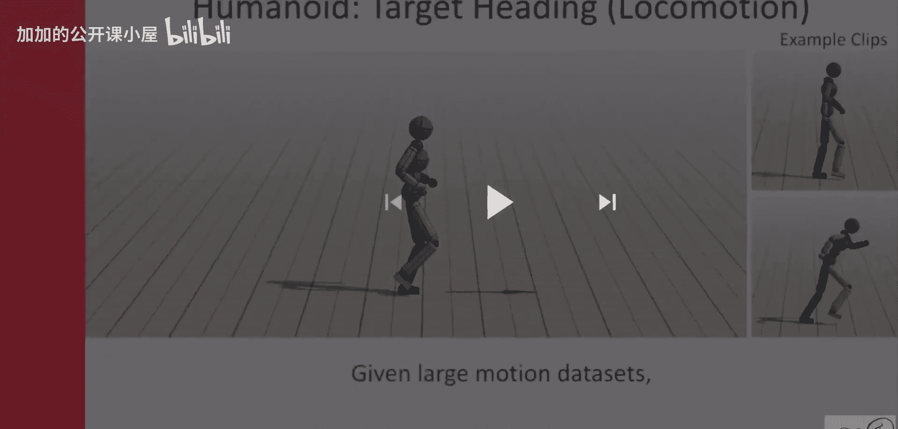
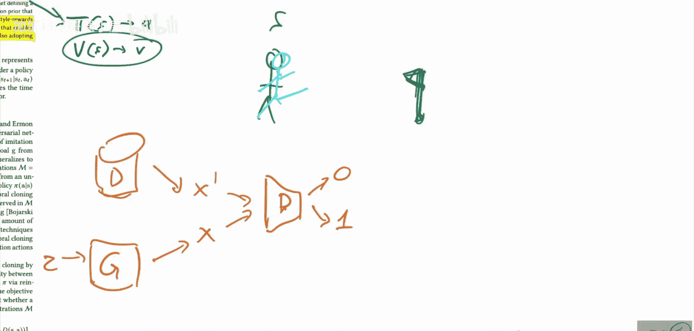

# 040：对抗性运动先验的风格化应用（论文详解）🎬🤖

在本节课中，我们将要学习一篇名为《对抗性运动先验的风格化应用》的论文。这篇论文由Xibbin Peng、Pitrobi、Sergei Levine和Anju Kaazzawa共同完成，属于控制与强化学习领域，但有一个独特的“转折点”。我们将探讨如何训练一个物理智能体，使其在完成特定目标（如走向并击打目标）的同时，还能遵循某种给定的运动风格。

## 概述

论文的核心思想是混合两种技术：实现目标的强化学习，以及遵循特定风格的模仿学习。这种风格由专家演示数据集提供，而“遵循风格”的部分是通过对抗性学习的方式实现的。最终，智能体既能完成任务，又能展现出酷炫、自然的特定风格动作。

## 任务与环境设定

上一节我们介绍了论文的混合目标，本节中我们来看看具体的任务设定。

任务通常是让智能体达成一个高级目标，例如到达某个地点、击打物体或穿越障碍。这些目标通过奖励函数来定义。智能体被放置在一个物理模拟环境中，它是一个具有关节的3D模型（类似人类或恐龙），可以通过对关节施加力来行动。

*   **状态空间**：智能体可以观察自身所有关节的位置、速度等信息，以及目标的大致方向和距离。
*   **动作空间**：智能体可以控制各个关节的运动。
*   **奖励函数**：通常设计为鼓励智能体接近目标，例如，离目标越近，获得的奖励越高。这里使用的是密集奖励，因为论文的重点不在于解决强化学习的基础难题。

## 风格数据集

除了任务目标，我们还有一个关键输入：风格演示数据集。

这个数据集并不一定是“如何完成任务”的演示。它可以是任何体现特定风格的运动数据。例如，一个数据集可能包含正常的跑动和行走，而另一个数据集可能包含僵尸式的行走动作。我们的目标是将数据集的风格与完成任务的智能体行为结合起来。例如，训练出一个能“以僵尸步态走向目标”的智能体。

## 双奖励信号模型

那么，如何将任务目标和风格要求结合起来呢？论文的解决方案是使用两个独立的奖励信号。

*   **目标奖励**：由经典的强化学习方法生成，衡量智能体达成任务目标的程度。
*   **风格奖励**：衡量智能体动作与风格数据集的相似程度，这部分由“对抗性运动先验”模型提供。

这两个奖励信号会共同用于训练智能体的策略函数和价值函数。训练采用标准的策略梯度方法，策略函数根据状态输出动作，价值函数评估状态的价值，两者都通过优势估计进行更新。

## 对抗性运动先验

上一节我们提到了风格奖励，本节中我们来看看它是如何通过“对抗性运动先验”计算出来的。

风格奖励的计算依赖于一个生成对抗网络。GAN的基本结构大家应该熟悉：生成器接收随机噪声，尝试生成逼真的数据样本；判别器则负责判断输入样本是来自真实数据集还是生成器。

在本文中，GAN处理的数据不是图像，而是**状态转移**。

*   **状态转移**：指智能体从一个状态 `S`（例如，站立姿势和目标的相对位置），通过执行一个动作 `A`（例如，抬腿），过渡到新状态 `S‘` 的过程。
*   **数据形式**：真实数据集中的样本是这种 `(S, A, S')` 的状态转移对，它们体现了专家（或风格）的运动模式。
*   **判别器任务**：判别器 `D` 的任务就是判断一个给定的状态转移是来自真实风格数据集（真实），还是来自当前正在学习的智能体策略（生成/伪造）。

以下是GAN对抗训练过程的简化表示：

**公式：min_G max_D V(D, G) = E_(x~p_data)[log D(x)] + E_(z~p_z)[log(1 - D(G(z)))]**

其中，`G` 是生成器（在这里，生成器就是智能体策略本身，它“生成”状态转移），`D` 是判别器，`x` 是真实数据，`z` 是噪声（在这里，`z` 可以理解为当前状态和策略）。

智能体（作为生成器）的目标是生成能让判别器误以为是真实风格数据的状态转移，从而获得高的风格奖励。判别器的目标是准确区分。通过这种对抗过程，智能体逐渐学会生成符合给定风格的动作模式。

## 总结

本节课中我们一起学习了《对抗性运动先验的风格化应用》这篇论文。我们了解到，该方法通过结合**目标导向的强化学习奖励**和**基于对抗性学习的风格奖励**，成功训练出既能完成复杂物理任务（如行走、击打），又能保持丰富、自然风格（如僵尸步态）的智能体。其核心创新在于使用GAN框架下的“对抗性运动先验”来量化并引导智能体的运动风格，从而实现了任务执行与风格化表现的精妙平衡。