# 041：交叉协方差图像变换器（Facebook AI 机器学习研究论文详解）

在本节课中，我们将要学习一篇由Facebook AI、Inria和Sorbonne大学提出的论文，它介绍了一种名为XCiT（交叉协方差图像变换器）的新型架构。该架构的核心是提出了一种“转置”的注意力机制，旨在解决传统Transformer在处理高分辨率图像时面临的二次复杂度问题。

## 概述：传统Transformer的挑战与XCiT的提出

Transformer模型在自然语言处理领域取得了巨大成功，近年来在计算机视觉领域也展现出巨大潜力。其核心的自注意力操作能够在所有标记（如单词或图像块）之间建立全局交互，从而实现对图像数据的灵活建模，超越了卷积操作的局部交互限制。

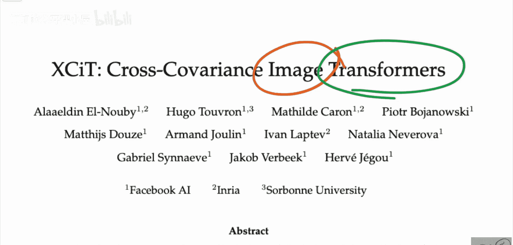

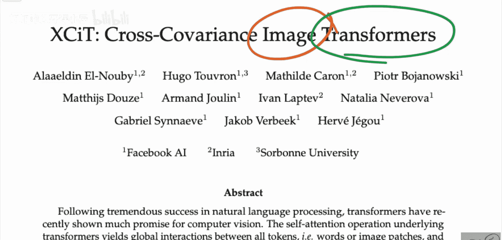

然而，这种灵活性带来了时间和内存上的二次复杂度，这阻碍了Transformer应用于长序列和高分辨率图像。XCiT论文正是为了解决这一问题而提出的。

## 核心创新：交叉协方差注意力机制

上一节我们介绍了传统Transformer面临的挑战，本节中我们来看看XCiT提出的解决方案。

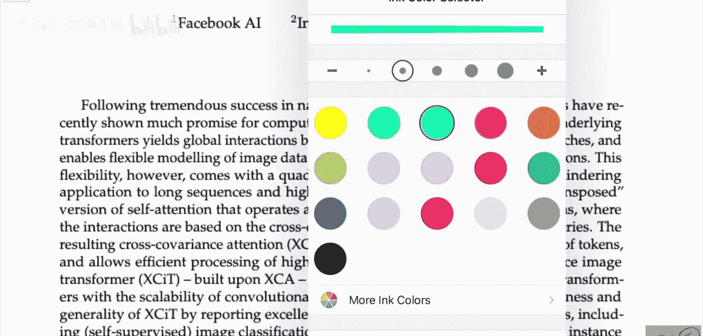

论文提出了一种转置版本的自注意力机制，它不是在标记（tokens）之间操作，而是在特征通道（channels）之间操作。其交互基于键（keys）和查询（queries）之间的交叉协方差矩阵。

由此产生的交叉协方差注意力在标记数量上具有线性复杂度，从而允许高效处理高分辨率图像。论文基于这种交叉协方差注意力构建了完整的架构，并将其命名为XCiT（交叉协方差图像变换器）。它结合了传统Transformer的准确性和卷积架构的可扩展性。

以下是交叉协方差注意力与传统自注意力的核心区别图示：

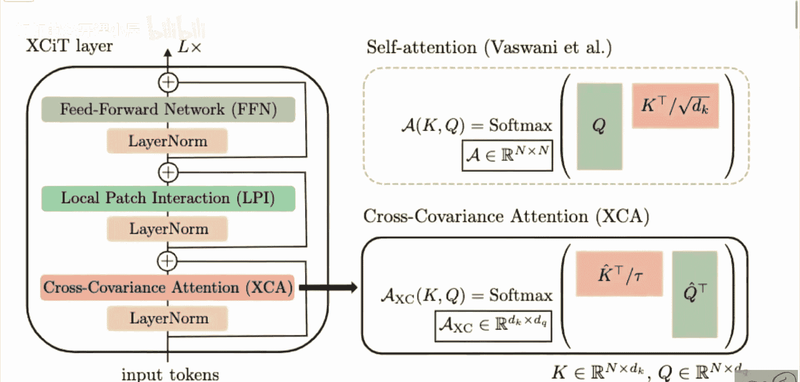

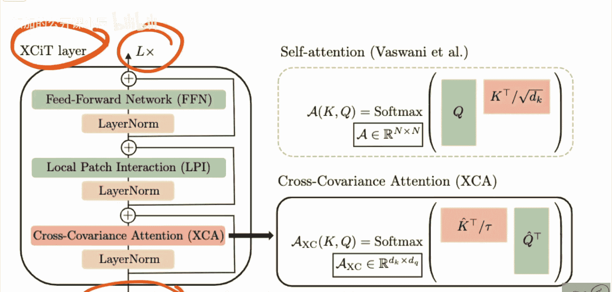

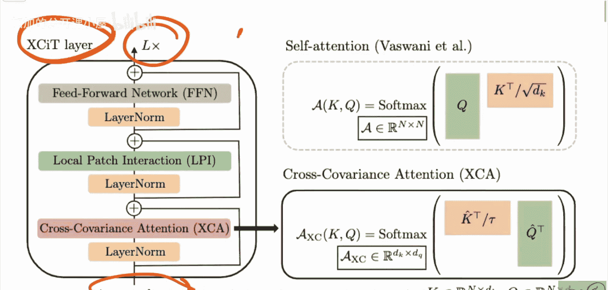

在XCiT层中，传统的自注意力块被两个新块取代，底部的块就是交叉协方差注意力。从数学角度看，这个想法很简单，但思维方式有些不同。

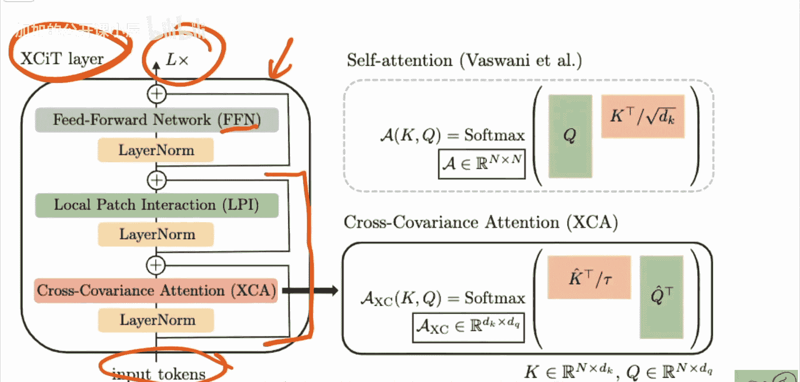

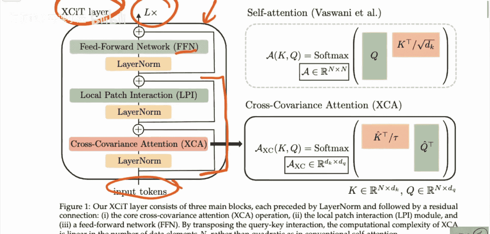

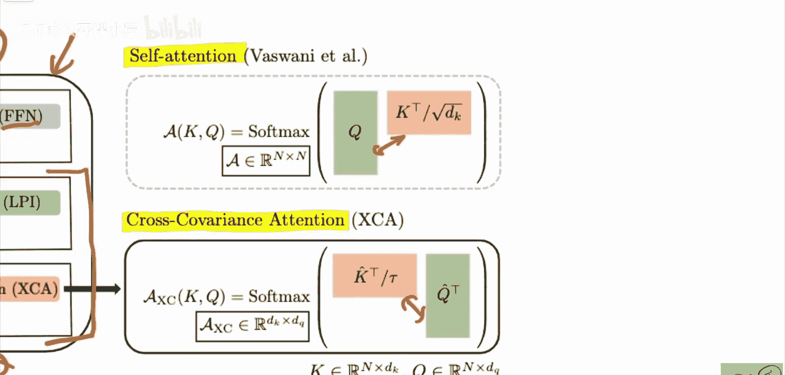

## 工作原理：从标记注意力到通道注意力

为了理解交叉协方差注意力，我们先快速回顾一下常规的自注意力是如何工作的。

在常规自注意力中，我们有一系列标记（例如，图像被分割成的多个图像块）。每个标记会生成一个查询向量和一个键向量。查询向量表示该标记想从其他标记了解什么信息，而键向量则表示该标记包含什么信息。通过计算每个查询与所有键的内积，我们得到一个动态的注意力权重矩阵，它决定了信息在不同标记之间流动的强度。这个过程可以表示为以下公式：

**Attention(Q, K, V) = softmax(QK^T / √d_k) V**

其中，Q是查询矩阵，K是键矩阵，V是值矩阵，d_k是键向量的维度。

在交叉协方差注意力中，我们的视角发生了转变。我们不再将标记序列视为主要操作对象，而是将特征通道视为序列。

假设我们有N个标记，每个标记有C个特征维度。在交叉协方差注意力中，我们关注的是这C个通道。每个通道会生成一个查询向量和一个键向量，但这次查询和键是跨所有N个标记计算得到的。信息的路由不再是从一个标记到另一个标记，而是从一个特征通道到另一个特征通道。

这意味着，模型会观察整个序列（所有图像块）在第一个特征通道上的表现，并决定这个通道应该从其他通道获取什么信息。这类似于让一个专门检测“眼睛结构”的通道，与一个专门检测“嘴巴结构”的通道进行通信，从而协同推断图像中是否存在一张脸。

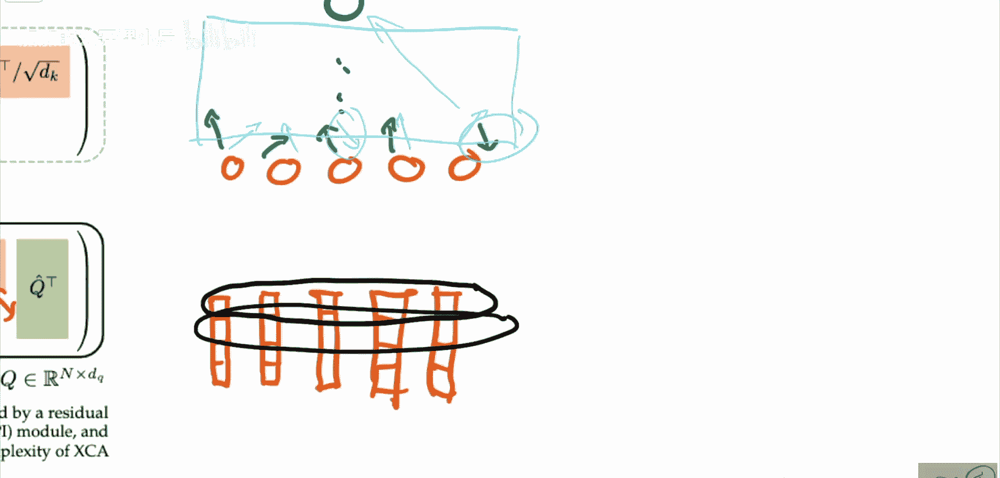

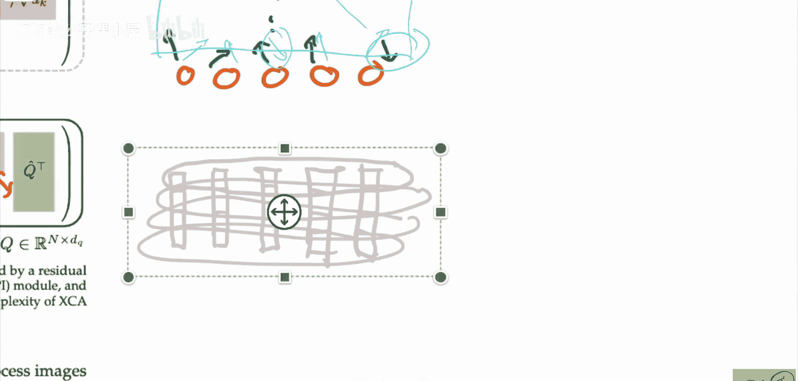

## 架构与优势

XCiT的整体架构由多个XCiT层堆叠而成。每个XCiT层包含交叉协方差注意力模块和前馈神经网络模块。

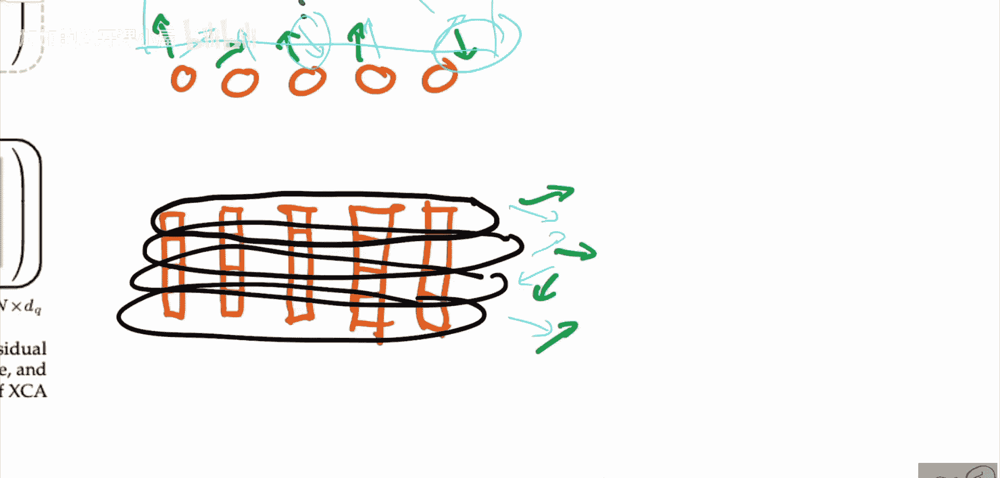

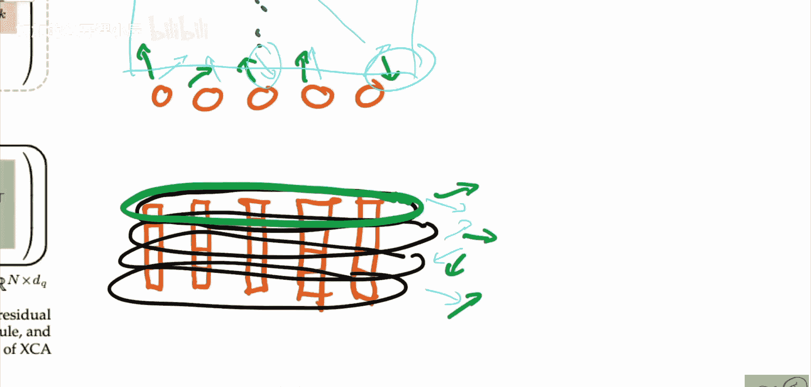

以下是XCiT架构的优势总结：
*   **线性复杂度**：交叉协方差注意力的计算复杂度与标记数量N呈线性关系，而非传统注意力的二次关系（O(N^2)）。
*   **高效处理高分辨率图像**：线性复杂度使得模型能够处理更高分辨率的图像，而不会导致内存和计算成本爆炸式增长。
*   **性能优异**：论文报告了XCiT在ImageNet图像分类、目标检测、实例分割等多个基准测试上取得了优秀的结果，证明了其有效性。

## 总结

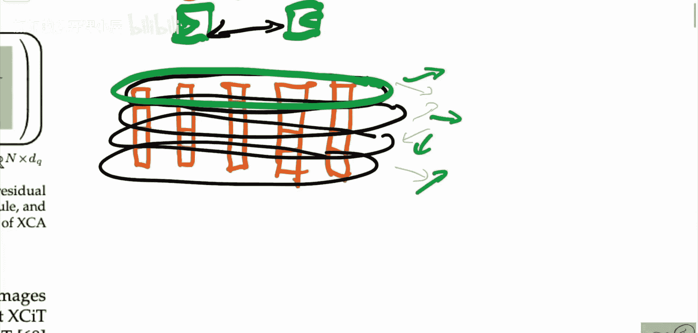

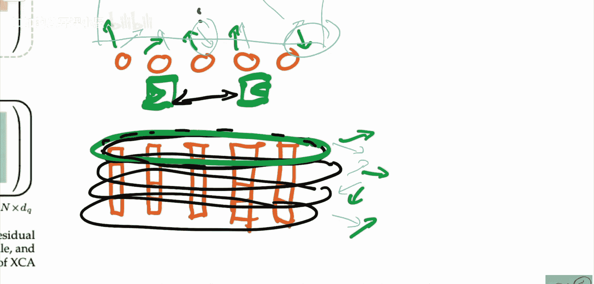

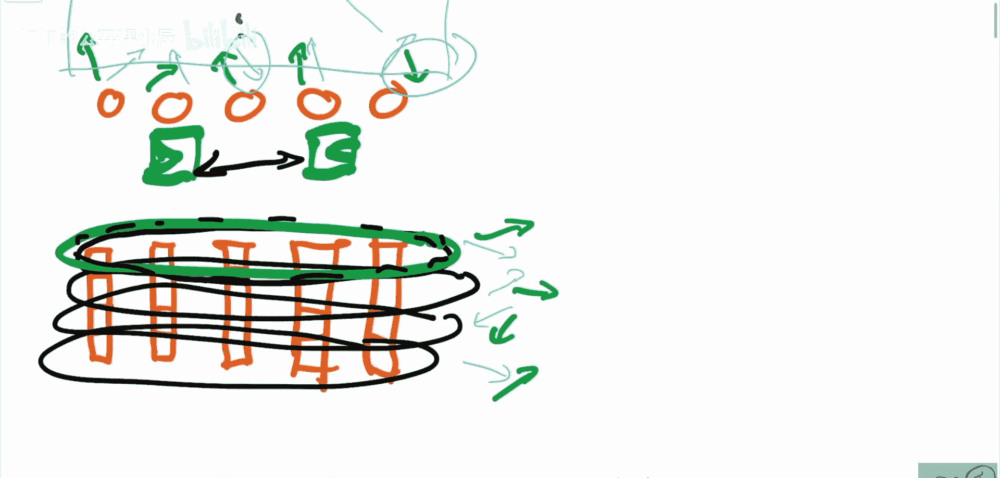

本节课中我们一起学习了XCiT（交叉协方差图像变换器）这篇论文。我们了解到，为了克服传统Transformer在视觉任务中因二次复杂度带来的限制，XCiT提出了一种创新的交叉协方差注意力机制。该机制将注意力的操作维度从“标记之间”转换为“特征通道之间”，从而将复杂度降低为线性，使其能够高效处理高分辨率图像。虽然其思维方式与传统注意力不同，但XCiT在多项视觉任务上展现出了强大的性能，为视觉Transformer的发展提供了一条新的思路。