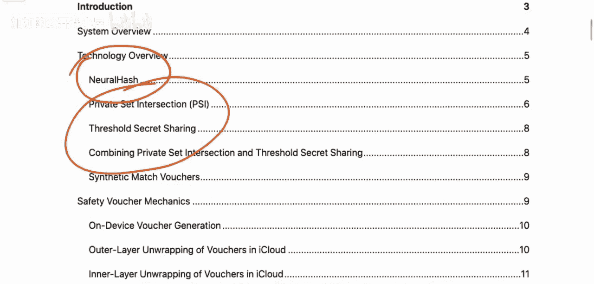
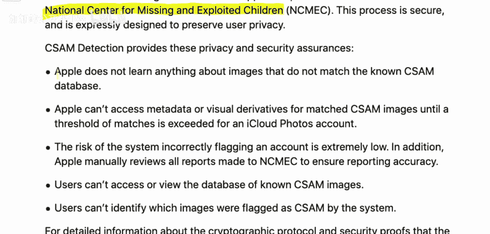
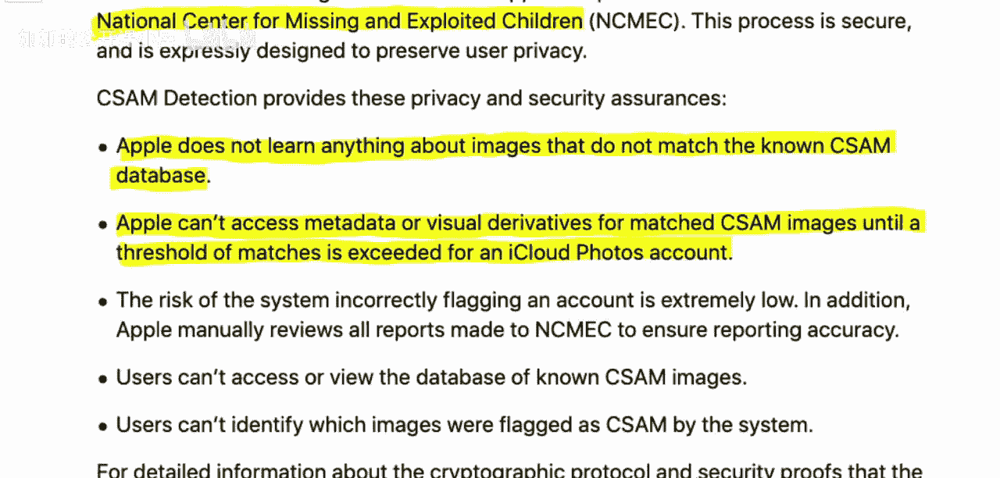
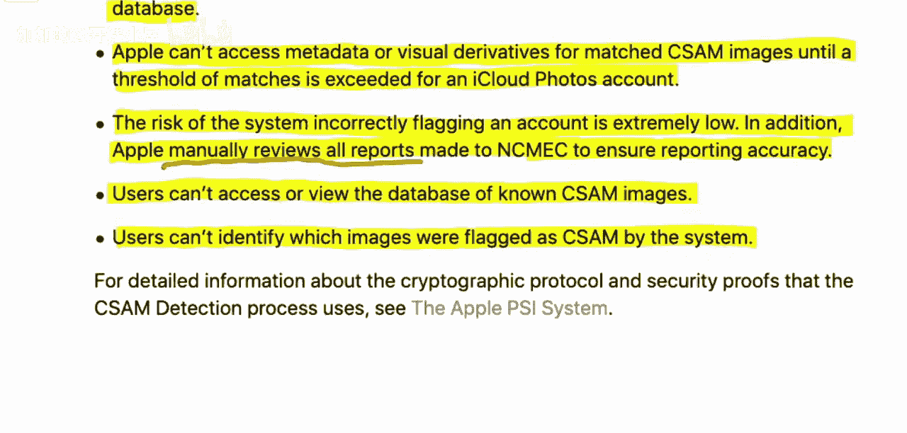
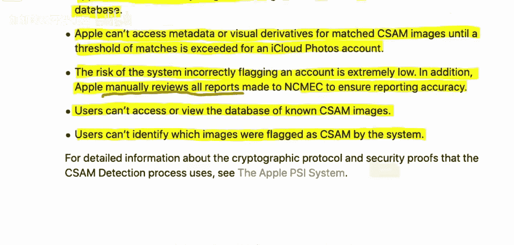
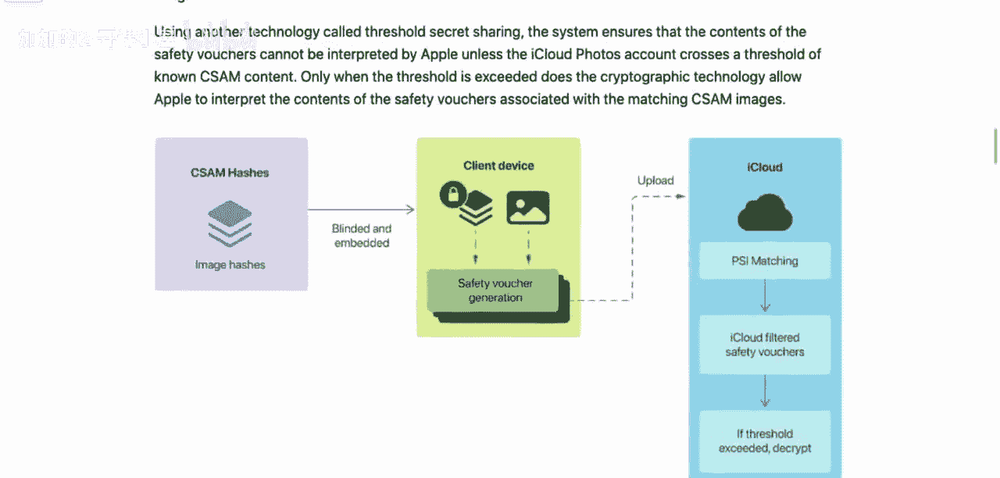
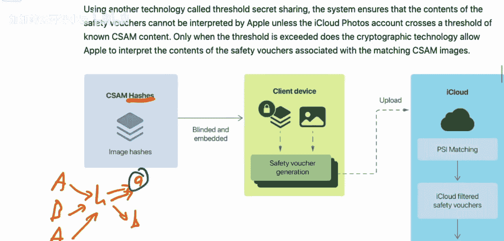

# 043：NeuralHash算法与隐私权衡

在本节课中，我们将学习苹果公司用于检测用户iCloud照片中儿童性虐待材料（CSAM）的技术方案。我们将详细解析其工作原理、涉及的机器学习与密码学技术，并探讨该系统在隐私保护与内容检测之间的权衡。

上一节我们介绍了课程背景，本节中我们来看看苹果CSAM检测系统的核心组成部分与设计目标。

## 系统概述与设计目标

苹果系统的设计目标非常具体。它旨在识别和报告那些在其iCloud照片账户中存储已知CSAM材料的用户。其范围受到严格限制：系统不会持续扫描你手机上的所有内容，而只会在你准备将照片上传到iCloud时，计算一个“安全凭证”并随照片一同上传。它仅用于检测“已知的”材料，这些材料来自美国国家失踪与受虐儿童中心提供的数据库。这意味着系统无法识别尚未被录入该数据库的新材料。

为了平衡检测需求与用户隐私，苹果为系统设定了多项严格要求。

以下是系统必须满足的核心隐私要求：

1.  **对非匹配图像一无所知**：苹果不能获取任何与已知CSAM数据库不匹配的图像信息。苹果无法直接访问或扫描用户iCloud中加密的照片来进行比对。
2.  **匹配阈值解密**：在单个iCloud账户的匹配数量未超过某个阈值（例如5个）之前，苹果无法访问任何已匹配图像的元数据或视觉衍生信息。只有超过阈值，相关数据才能被解密以供审核。
3.  **极低的误报率**：系统错误标记账户的风险必须极低。此外，苹果承诺对所有提交给政府的报告进行人工审核，以确保准确性。
4.  **用户无法窥探系统**：用户既不能访问CSAM数据库，也不能通过系统行为推断出具体是哪张图片被标记为匹配。

## 系统架构与工作流程

上一节我们明确了系统的设计约束，本节中我们来看看系统是如何在满足这些约束下工作的。整个流程融合了哈希算法、密码学和阈值秘密共享技术。

其核心架构如下图所示：

以下是系统工作流程的分解步骤：

1.  **数据库侧（苹果服务器）**：
    *   对已知的CSAM数据库中的每张图片，使用**NeuralHash**算法计算一个哈希值。哈希函数 `H(image)` 能生成一个较短的、理论上能唯一标识该图像的数字串（哈希值）。
    *   公式表示：对于数据库中的图片 `I_db`，计算 `hash_db = NeuralHash(I_db)`。
    *   这些哈希值被存储在一个服务器端的数据库中。

2.  **客户端侧（用户设备）**：
    *   当用户准备将一张图片 `I_user` 上传到iCloud时，设备本地同样使用NeuralHash算法计算该图片的哈希值：`hash_user = NeuralHash(I_user)`。
    *   设备利用一个密码学技术——**阈值秘密共享**——来处理这个哈希值。它将 `hash_user` 拆分成多个“份额”，单独一个份额无法还原出原始哈希值。
    *   设备使用一个由苹果提供的、与CSAM数据库哈希值相关联的公共密钥，为这些份额生成一个密码学承诺，称为“安全凭证”。

3.  **上传与匹配**：
    *   用户设备将图片 `I_user`（已加密）和对应的“安全凭证”一同上传到iCloud。
    *   苹果服务器收到后，会尝试使用CSAM数据库的哈希值来“打开”这个安全凭证。**只有在上传图片的哈希值 `hash_user` 与数据库中的某个哈希值 `hash_db` 完全匹配时，这个打开操作才会成功**。
    *   如果匹配成功，服务器则记录一次针对该账户的“有效份额”获取。

4.  **阈值触发与人工审核**：
    *   服务器持续为每个用户账户累计匹配成功的次数。
    *   只有当某个账户的匹配次数**超过预设的阈值**（如图中的“Threshold = t”），服务器才能收集到足够多的“份额”来重构出该用户所匹配图片的哈希值，并进而解密出相关的元数据（如图片标识）。
    *   达到阈值后，系统会生成报告，并由苹果的人工审核团队进行最终核查，确认无误后才会依法上报给相关机构。

## 核心组件：NeuralHash算法

上一节我们概述了端到端的流程，本节中我们深入看一下处于流程前端的核心识别技术——NeuralHash。这是一个基于神经网络的感知哈希算法。

与传统的加密哈希（如SHA-256）不同，感知哈希的目标是对于视觉上相似或经过轻微修改（如缩放、裁剪、调色）的图片，能产生**相同或极其相似**的哈希值。这对于检测经过编辑的已知CSAM图像至关重要。

其工作原理可以简化为：
1.  图片通过一个预训练的神经网络（如卷积神经网络），转换为一个高维的特征向量。
2.  对该特征向量进行一系列处理（如二值化），最终输出一个固定长度的二进制串（例如128位），这就是NeuralHash值。
3.  代码概念上可表示为：`neural_hash = binarize(neural_network(image))`

然而，这也引出了该算法的一个主要弱点：**对抗性攻击**。由于神经网络是连续且可微的，攻击者可以通过对图像添加人眼难以察觉的微小扰动（对抗性噪声），使得神经网络提取的特征发生巨大变化，从而生成一个完全不同的NeuralHash值。这使得系统可能被“轻易规避”。

## 隐私权衡与潜在风险

本节课我们一起学习了苹果CSAM检测系统的技术方案。我们来总结一下其中的关键权衡与争议点。

该系统通过结合NeuralHash、阈值密码学等技术，在架构上确实试图实现其隐私保护目标：苹果在阈值未达到前无法知晓非匹配图像内容，也无法获取匹配图像的详细信息。

但是，这种权衡存在几个核心争议：
1.  **系统可能被滥用**：一旦该检测框架被建立，理论上只需更换服务器端的哈希数据库，该系统便可被用于扫描其他类型的内容，这构成了潜在的“任务蠕变”风险。
2.  **存在规避手段**：如前所述，针对NeuralHash的对抗性攻击可能让恶意用户轻易绕过检测。
3.  **安全与隐私的悖论**：我们面临一个根本性的权衡：一个容易被规避的系统，与一个一旦被非善意行为者控制就可能产生严重后果的系统，这两者结合在一起是否值得部署？

最终，这不仅仅是技术问题，更是一个社会与政策的权衡问题：我们为了阻止非法材料的传播，愿意在个人隐私方面接受何种程度的妥协？本节课的技术解析为我们提供了思考这一问题的具体基础。