# 044：学会深度思考 🧠

在本节课中，我们将学习一篇名为《PonderNet》的论文。这篇论文提出了一种新颖的循环神经网络架构，其核心思想是让网络能够根据问题的复杂程度，动态地决定需要“思考”多少步再给出答案。对于简单问题，网络可以快速输出；对于复杂问题，网络则可以进行多步计算。我们将探讨其工作原理、优势以及实验结果。

## 概述

上一节我们介绍了PonderNet的基本概念。本节中，我们来看看论文提出的背景和动机。

在标准的神经网络中，无论输入问题的复杂度如何，网络执行的计算量（即前向传播的层数或步骤）通常是固定的。这并不符合人类或传统算法的思考方式：简单问题快速解决，复杂问题则需要更多思考步骤。

PonderNet旨在克服这一限制，它引入了一种循环计算原则，允许网络为每个输入样本自适应地决定计算步骤数，在预测精度和计算成本之间取得平衡。

## 核心思想与架构

上一节我们了解了PonderNet要解决的问题。本节中我们来看看它的具体实现架构。

PonderNet的架构本质上是一个循环网络，但在每一步计算后，网络都会评估一个“停止概率”，以决定是否应该在此刻输出最终结果。

以下是PonderNet架构的核心组件描述：

1.  **输入**：`X`，即模型的输入数据。
2.  **隐藏状态**：`H_n`，表示在第 `n` 步计算时的网络状态。
3.  **步函数**：`S`，这是一个可循环调用的函数（例如RNN单元、LSTM或任何可递归应用的模块）。它接收当前隐藏状态，并输出新的隐藏状态、当前步的预测结果以及一个关键的“停止概率”。
4.  **输出与停止概率**：在每一步 `n`，步函数 `S` 产生：
    *   该步的预测输出 `y_n`。
    *   一个停止概率 `λ_n`，它表示**在之前未停止的条件下，当前步选择停止的概率**。

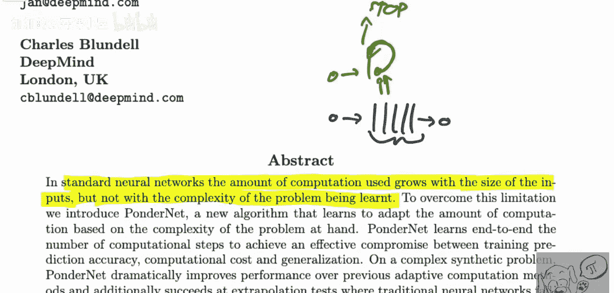

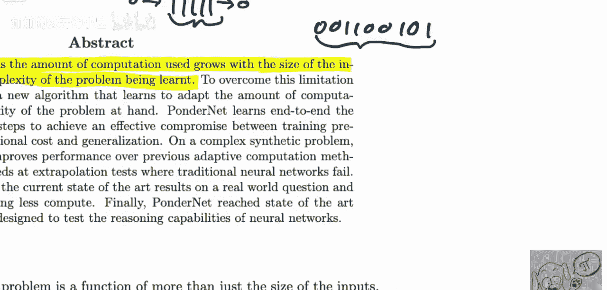

这个过程可以形式化地表示为：
`H_n, y_n, λ_n = S(H_{n-1})`，其中 `H_0` 由输入 `X` 初始化。

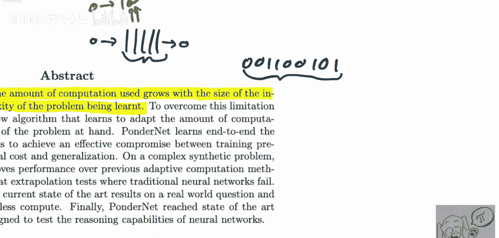

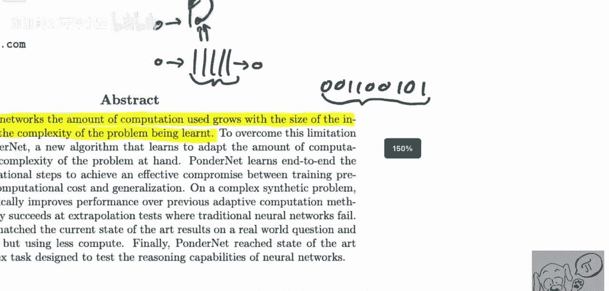

网络会持续运行步函数 `S`，直到根据停止概率 `λ_n` 决定停止，并将最后一步的 `y_n` 作为最终输出。这种“条件停止概率”的设计是PonderNet的一个关键创新，使其训练更加稳定。

## 与先前工作的对比

上一节我们介绍了PonderNet的架构。本节中我们来看看它与其他动态计算模型（如ACT）的区别。

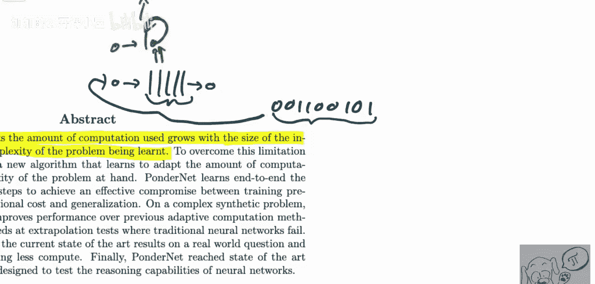

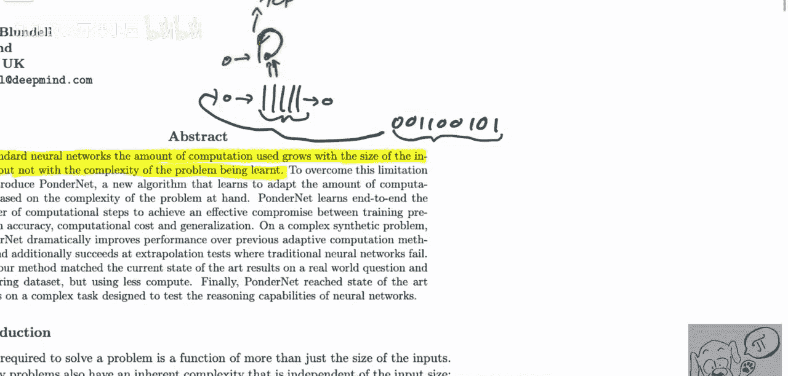

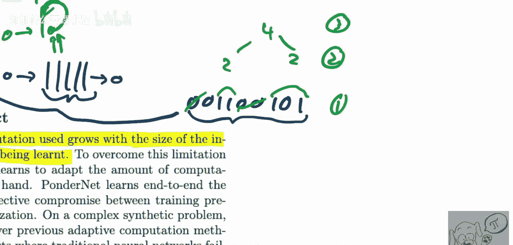

PonderNet并非第一个尝试让网络动态决定计算量的模型，但它解决了先前方法的一些痛点。

以下是PonderNet相较于之前模型（如自适应计算时间模型）的主要优势：

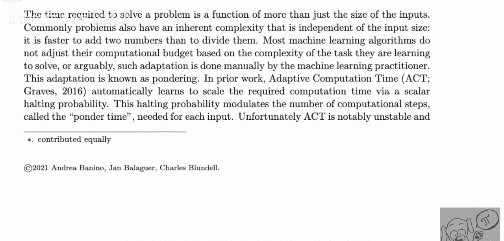

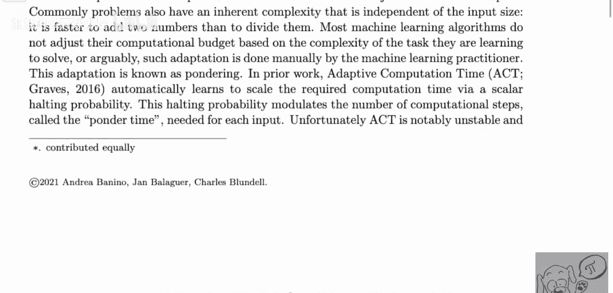

*   **完全可微分**：PonderNet的整个计算过程（包括停止决策）是端到端可微分的，这允许使用低方差的梯度估计进行训练。
*   **无需强化学习**：一些早期方法使用强化学习来学习停止步数，这会引入高噪声。PonderNet避免了这一点。
*   **无偏梯度估计**：论文指出，PonderNet能提供无偏的梯度估计，这在之前的模型中难以实现。
*   **条件停止概率**：如前所述，`λ_n` 定义为“在未提前停止的条件下于当前步停止的概率”，这种建模方式更为自然，带来了更好的性能。

## 实验与任务

上一节我们讨论了PonderNet的理论优势。本节中我们来看看它在具体任务上的表现。

为了验证PonderNet在处理需要动态计算的问题上的能力，论文选择了一系列构造性的算法任务进行测试，而非常见的图像分类基准。

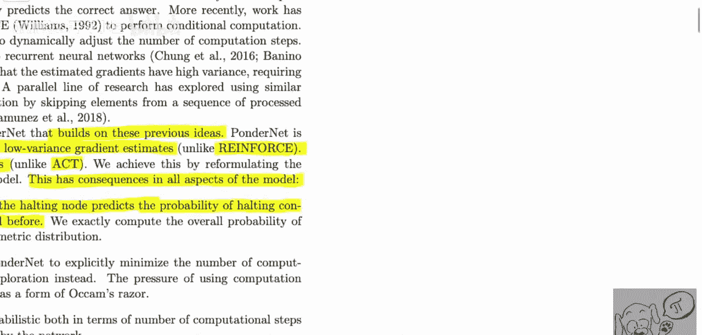

一个典型的任务是**奇偶校验问题**：给定一个由0和1组成的序列，判断序列中“1”的个数是奇数还是偶数。解决这个问题需要对整个序列进行“全局”计算。对于短序列或“1”很少的序列，可能很快就能得出答案；而对于长且复杂的序列，则需要更多的计算步骤。PonderNet在这种任务上展示了其根据问题复杂度自适应调整“思考”步数的能力。

实验表明，PonderNet能够有效学习到这种动态计算策略，在保证准确率的同时，降低了简单样本上的计算开销，并提升了泛化能力。

## 总结

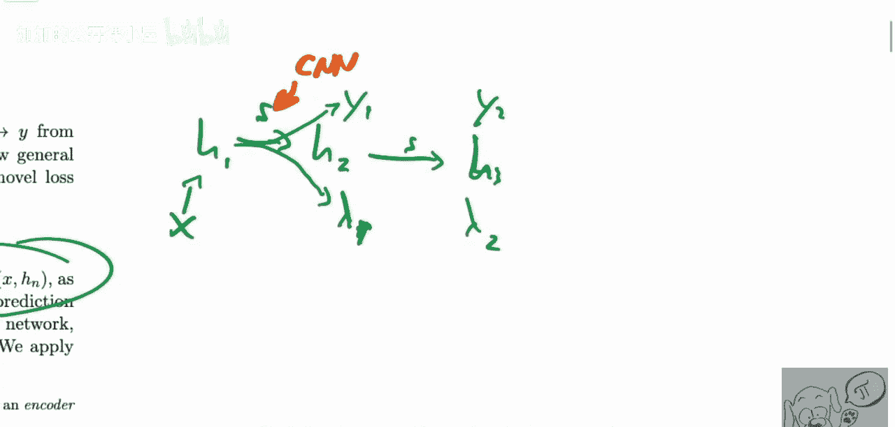

本节课中我们一起学习了PonderNet这篇论文。我们了解到，PonderNet提出了一种让神经网络根据输入问题复杂度来自适应决定计算深度的新方法。其核心是一个循环架构，每一步都会输出一个“条件停止概率”，从而动态控制计算流程。这种方法在需要算法式推理的任务上表现优异，并且通过完全可微分的设计，实现了更稳定、高效的训练。PonderNet为我们思考如何将深度学习与动态算法过程相结合提供了一个新颖而有力的视角。