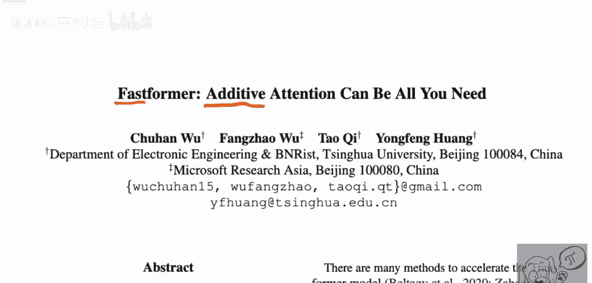
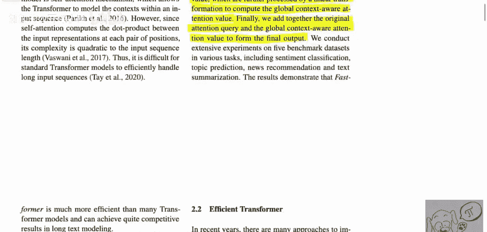
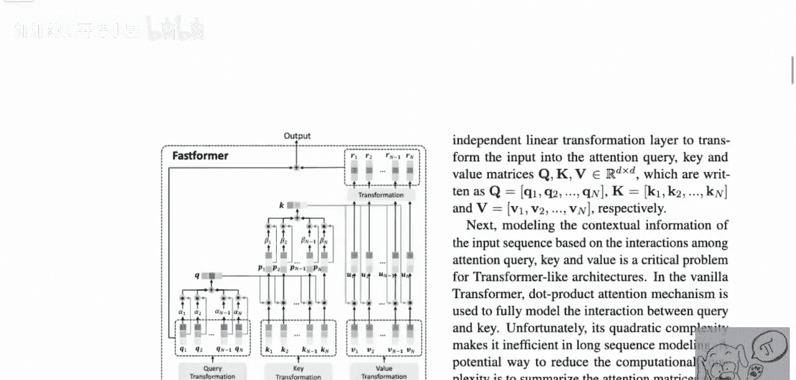
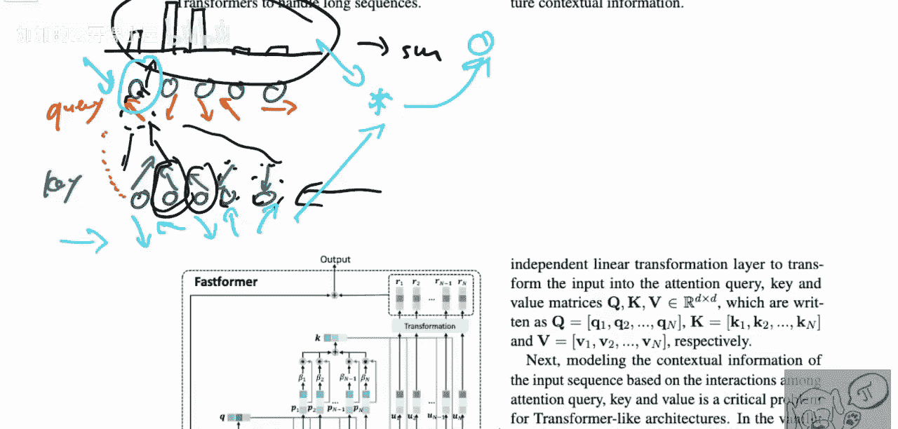

# 045：加法注意力可能就是你所需的一切（机器学习研究论文解析）

在本节课中，我们将学习一篇名为《Fastformer：加法注意力可能就是你所需的一切》的论文。这篇论文提出了一种名为“加法注意力”的新型注意力机制，旨在解决传统Transformer模型中注意力计算复杂度高的问题。我们将详细解析其核心思想、工作原理，并与经典注意力机制进行对比，以帮助初学者理解这一创新方法。

## 1：引言与背景

Transformer模型在自然语言处理等领域取得了巨大成功。然而，其核心组件——注意力机制——存在一个显著问题：计算复杂度与输入序列长度的平方成正比。这意味着处理长序列时，计算成本会急剧增加。

为了解决这个问题，研究人员提出了多种加速方法，但往往在长序列上效率不足，或者性能下降过多。本篇论文提出的Fastformer模型，旨在通过一种名为“加法注意力”的新机制，以线性复杂度实现高效的序列建模。

## 2：Fastformer的核心思想

上一节我们介绍了传统注意力机制的瓶颈。本节中，我们来看看Fastformer是如何通过“加法注意力”和“逐元素乘积”来绕过这个瓶颈的。

Fastformer的核心创新点有两个：
1.  **加法注意力**：用于以线性复杂度汇总全局上下文信息，而非计算所有词元对之间的交互。
2.  **逐元素乘积**：用于建模全局上下文与单个词元表示之间的交互。

其基本流程可以概括为：
1.  使用加法注意力，将输入的查询（Query）矩阵汇总为一个**全局查询向量**。
2.  通过**逐元素乘积**，计算注意力键（Key）矩阵与全局查询向量的交互，得到一个加权的键矩阵。
3.  再次使用加法注意力，将这个加权的键矩阵汇总为一个**全局键向量**。
4.  通过**逐元素乘积**，聚合全局键向量与值（Value）矩阵。
5.  将聚合后的结果进行线性变换，得到**全局上下文感知的值表示**。
6.  最后，将原始的查询表示与这个全局上下文感知的值表示相加，得到最终的输出。

## 3：与传统注意力机制的对比

为了更清晰地理解Fastformer的革新之处，让我们回顾一下传统的“乘法注意力”机制。

在传统注意力中，每个词元会生成三个向量：查询（`Q`）、键（`K`）和值（`V`）。注意力分数的计算涉及所有词元对之间的交互：

**公式：Attention(Q, K, V) = softmax( (Q * K^T) / sqrt(d_k) ) * V**

这里，`Q * K^T` 这一步的计算复杂度是 `O(n^2)`，其中 `n` 是序列长度。这就是所谓的“二次复杂度瓶颈”。

相比之下，Fastformer的“加法注意力”避免了这种成对的矩阵乘法。它首先将整个序列的查询信息压缩成一个全局向量，然后让每个词元的键与这个全局向量进行交互。这个过程是顺序的、线性的，因此复杂度降低为 `O(n)`。

## 4：模型架构详解

以下是Fastformer模型中加法注意力层的具体计算步骤，我们将结合图示进行说明：

1.  **生成全局查询向量**：对输入序列的查询矩阵 `Q` 应用加法注意力（例如，通过求平均或加权和），得到一个全局查询向量 `global_q`。
    *   **伪代码表示**：`global_q = additive_attention(Q)`
2.  **交互与全局键生成**：将键矩阵 `K` 与 `global_q` 进行逐元素乘积，得到一个交互后的矩阵。然后对这个矩阵再次应用加法注意力，生成全局键向量 `global_k`。
    *   **伪代码表示**：`interacted_k = K * global_q`， `global_k = additive_attention(interacted_k)`
3.  **生成最终输出**：将值矩阵 `V` 与 `global_k` 进行逐元素乘积，再经过一个线性变换层 `W`，得到上下文增强的值表示。最后将此表示与原始查询 `Q` 相加。
    *   **伪代码表示**：`output = Linear( V * global_k ) + Q`

通过这种方式，每个词元的最终表示都融合了从整个序列中提取的全局上下文信息，但计算过程是高效的。

## 5：论文主张与总结

本节课中我们一起学习了Fastformer模型。论文作者声称，Fastformer是已知最高效的Transformer架构变体之一。它通过用加法注意力替代乘法注意力，并引入逐元素乘积来建模交互，成功地将计算复杂度从二次降为线性。

这意味着Fastformer能够更高效地处理更长的文本序列，为需要长上下文建模的应用（如长文档理解）提供了新的可能性。实验部分也验证了该方法在多个基准数据集上，能在保持竞争力的性能的同时，显著提升训练和推理速度。

总结来说，Fastformer为突破Transformer的序列长度限制提供了一种新颖且有效的思路，即“加法注意力可能就是你所需的一切”。