# 046：线性偏置注意力机制实现输入长度外推 🚀

在本节课中，我们将要学习一篇名为《Train Short, Test Long: Attention with Linear Biases Enables Input Length Extrapolation》的论文，它也被称为ALiBi。这篇论文由Ofir Press、Noam A. Smith和Mike Lewis提出。其核心思想是，用一种新的、非常简单的系统来替代Transformer中的位置编码或位置嵌入，从而使这些Transformer能够在推理时外推到比训练时长得多的序列上。这意味着你可以在较短的序列上进行训练，而在推理时，即使序列长度远超训练长度，性能也不会下降。这种外推能力可以从2倍延伸到10倍甚至更长。

## 问题背景：为什么需要位置编码？

上一节我们介绍了ALiBi的目标，本节中我们来看看它要解决的核心问题：位置编码。Transformer模型自2017年《Attention Is All You Need》论文提出以来，就一直在处理位置编码的问题。

Transformer本质上并不是一个序列模型，而是一个集合模型。假设我们有一个由词元（token）组成的序列，例如在自回归文本生成任务中，我们想根据一系列词元预测下一个词元。Transformer在每一层都将一个输入序列转换为一个等长的输出序列。但与全连接网络不同，Transformer本身并不“知道”某个特定输入项在序列中的位置。

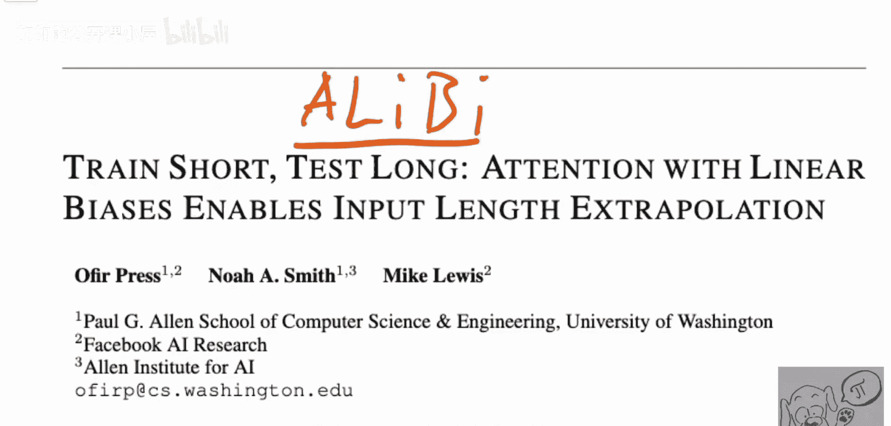

例如，对于某个节点，Transformer会生成一个查询（Query），并将其与由其他节点生成的键（Key）进行匹配，通过内积来路由信息。然而，如果这个节点在序列中的位置发生了变化，但只要它的键相同，信息路由的方式就不会改变。因此，对Transformer而言，输入项的位置无关紧要，它本质上将输入序列视为一个集合而非序列。

为了解决这个问题，原始的Transformer引入了位置嵌入。初始时，每个词元会获得一个标准的词嵌入（如Word2Vec或GloVe）。但同一个词可能出现在句子的不同位置，含义略有不同。因此，我们需要用位置嵌入来增强这些词嵌入。

一种简单的方法是为每个向量额外添加一个维度，并直接填入位置索引（如0, 1, 2...）。但这种方法效果不佳，因为数字在0到1等线性空间中的表示存在局限。因此，研究者们提出了多种方案。

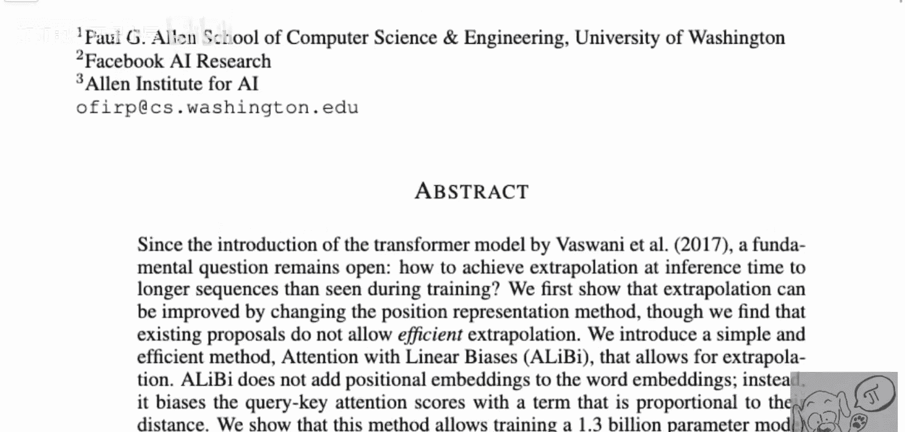

## 经典方案：正弦位置编码

原始论文提出的第一个方案是正弦位置编码。以下是其工作原理：

我们有一个序列。位置编码本身是一个向量。假设其中一个维度，我们根据位置索引一个非常长的正弦波。例如，第一个词元对应正弦波的0值，第二个对应约0.5，第三个对应约0.705，依此类推。

但仅凭一个维度的正弦波，不同位置可能获得相同的值（例如，某个位置和间隔一个周期的位置）。为了解决这个问题，我们在第二个维度使用频率加倍的正弦波，在第三个维度使用频率再次加倍的正弦波，以此类推。

通过叠加这些不同频率的正弦波，我们最终能为每个位置获得一个独特的向量表示。原始论文假设，这种设计能让Transformer推理词元间的距离。例如，如果两个词元在最高频率维度上值相近，那么它们可能距离较近；如果它们在多个维度上都相近，那么它们很可能就是相邻的。模型理论上可以学习任意两个词元之间的关系，并可能具备外推能力。

然而，事实证明这种方法的外推效果并不理想。本论文指出了两个主要原因：
1.  从这些嵌入中学到的函数，并不能很好地迁移到更长的序列上。
2.  这些位置编码向量是通过简单地**加**到词嵌入向量上来引入的。虽然这可行，但随着网络层数的加深，模型需要在每一层的计算中都携带并处理这些位置信息，这增加了复杂性。

## 改进思路：将位置信息注入每一层

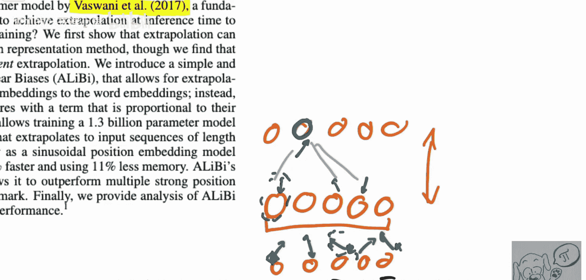

后续的一些改进工作意识到，不应仅仅在底层添加位置编码。更好的方式是在**每一层**都单独注入位置信息。这样，模型在每一层都能直接获取位置编码，而不需要从底层向上传递。

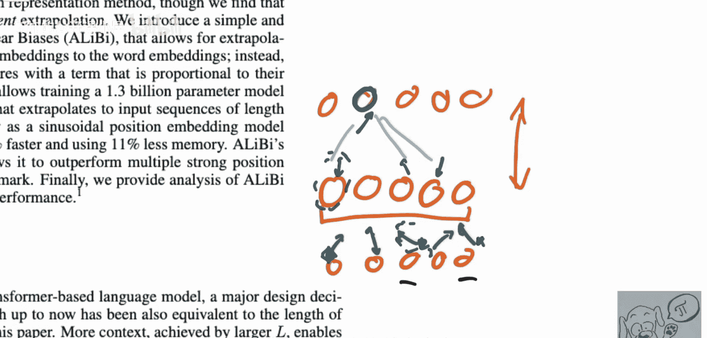

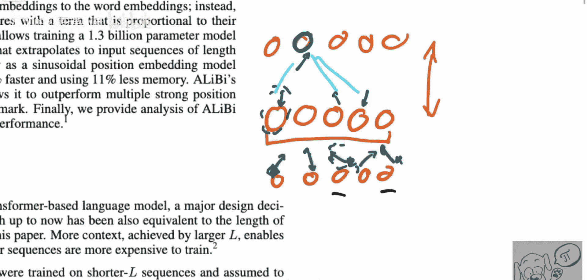

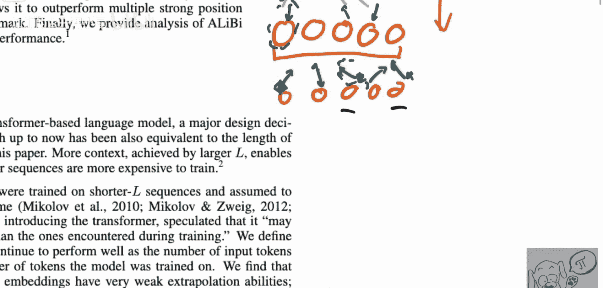

这为ALiBi方法的提出奠定了基础。在下一节中，我们将具体看看ALiBi是如何以一种更简单、更有效的方式，在注意力机制中直接引入位置偏置，从而实现强大的长度外推能力的。

## ALiBi的核心机制

ALiBi摒弃了传统的位置嵌入或编码。它不在输入中添加任何表示位置的向量，而是选择直接修改注意力机制的计算过程。

其核心思想是：一个词元应该更多地关注邻近的词元，而非远处的词元。ALiBi通过一个与相对距离成比例的**负偏置**来实现这一点。

具体操作如下：
在计算完注意力分数（Query和Key的点积）后，ALiBi会加上一个静态的、非学习的偏置项。这个偏置项只与查询位置和键位置的相对距离有关。

**公式**如下：
`注意力分数 = Q * K^T + m * (i - j)`
其中：
*   `Q * K^T` 是标准的查询-键点积。
*   `i` 是当前查询（Query）的位置索引。
*   `j` 是键（Key）的位置索引。
*   `(i - j)` 表示相对距离（对于因果语言模型，`j <= i`）。
*   `m` 是一个与注意力头相关的、预设的**负斜率**。

这个偏置 `m * (i - j)` 是一个**负数**（因为m为负，且`i-j`为正），并且它随着相对距离`(i-j)`的增大而线性减小（变得更负）。在应用Softmax函数之前，一个更负的值会被大幅抑制。这意味着，距离当前查询位置越远的键，所获得的注意力权重就会越低。

**关于m的取值**：
m的值不是学习得到的，而是为每个注意力头预先设定好的几何序列。例如，对于一个8头的注意力层，m的取值可能类似于：`[1/2^1, 1/2^2, 1/2^3, ..., 1/2^8]`。这样设计是为了让不同注意力头关注不同距离范围的上下文。

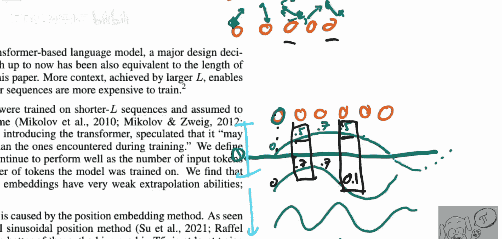

**代码描述**（概念性伪代码）：
```python
# 假设 Q, K 已经计算得到，形状为 [batch, heads, seq_len, dim]
# 计算标准点积注意力分数
scores = torch.matmul(Q, K.transpose(-2, -1)) / sqrt(dim)

# 生成ALiBi偏置矩阵
# 例如，对于seq_len=5，i和j从0到4
# 偏置矩阵 bias[i, j] = m * (i - j)， 其中 i 是查询索引，j 是键索引
# 对于因果注意力，j > i 的位置可以设为非常大的负数（如 -1e9）
positions = torch.arange(seq_len).unsqueeze(0) - torch.arange(seq_len).unsqueeze(1) # 相对距离矩阵
bias_matrix = m * positions # m 是对应注意力头的负斜率标量
# 将偏置加到注意力分数上
scores = scores + bias_matrix

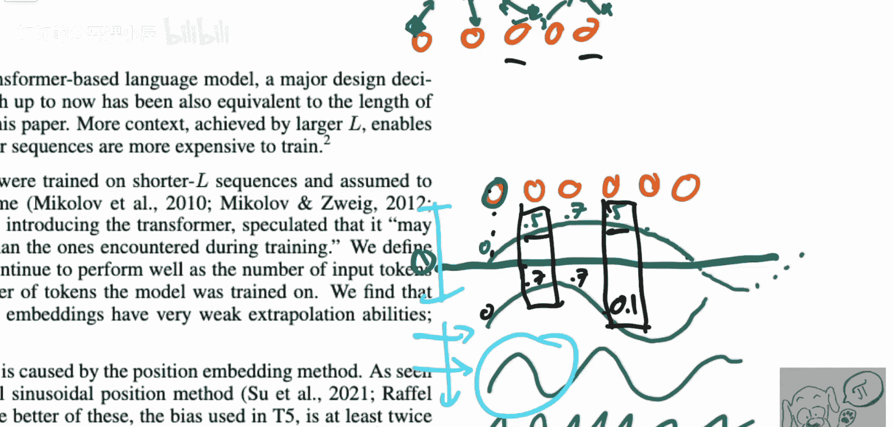

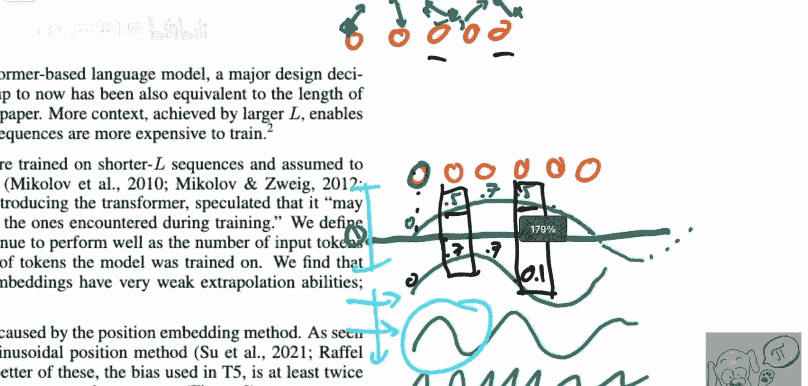

# 后续进行mask（如因果mask）和softmax操作
attention_weights = F.softmax(scores, dim=-1)
```

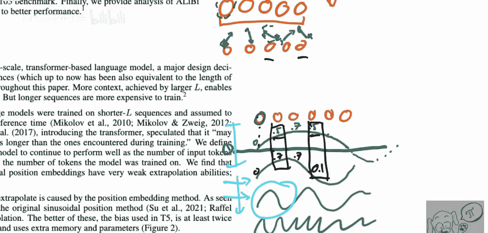

## 为什么ALiBi能实现长度外推？

ALiBi实现外推的关键在于其偏置是**相对**且**线性**的。
1.  **相对性**：偏置只依赖于`(i-j)`这个相对距离。无论序列绝对长度是多少，只要两个词元之间的相对距离相同，它们之间的注意力偏置就相同。模型在训练时学习的是基于相对位置的注意力模式。
2.  **线性外推**：由于偏置是距离的线性函数`m * (i-j)`，当模型在推理时遇到更长的序列（例如，`i`和`j`可以取到训练时从未见过的更大值，如1000和950），这个线性公式依然有效。模型不需要“理解”新的绝对位置1000是什么，它只需要知道1000和950之间的距离是50，并应用与训练时相同的线性规则`m*50`即可。这种线性关系可以自然地扩展到训练范围之外。

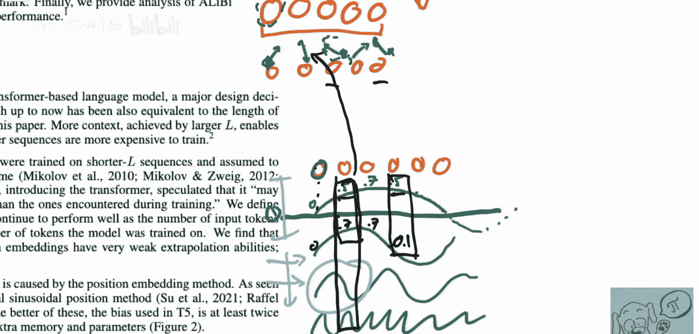

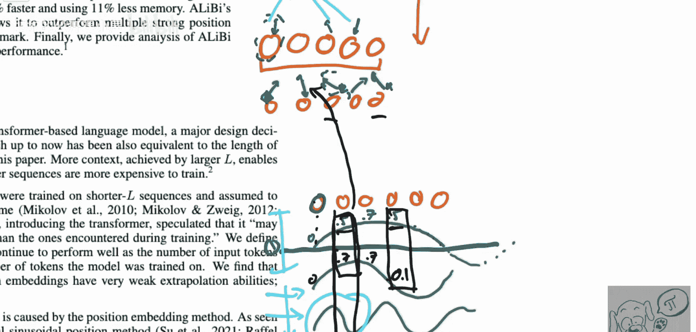

相比之下，正弦位置编码等绝对位置编码，其函数形式（如正弦波）在超出训练见过的位置范围时，模型没有学习过如何解释这些新的函数值，因此外推能力弱。

## 总结

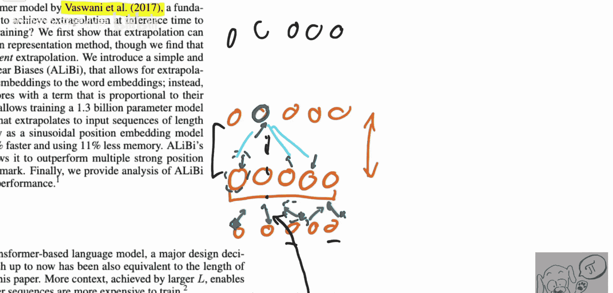

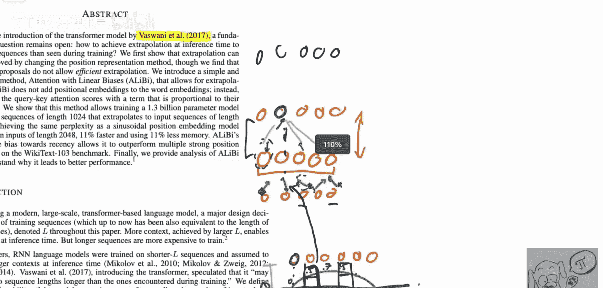

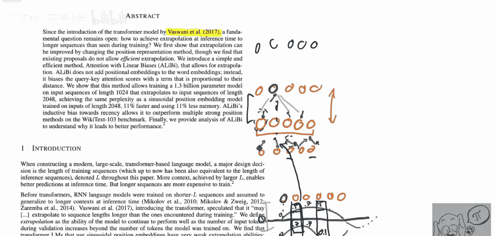

本节课中我们一起学习了ALiBi（Attention with Linear Biases）这一创新方法。我们回顾了Transformer需要位置编码的原因，以及传统正弦编码的局限性。ALiBi的核心贡献在于，它彻底抛弃了独立的位置嵌入向量，转而向注意力分数直接添加一个与相对距离成正比的线性负偏置（`m * (i-j)`）。

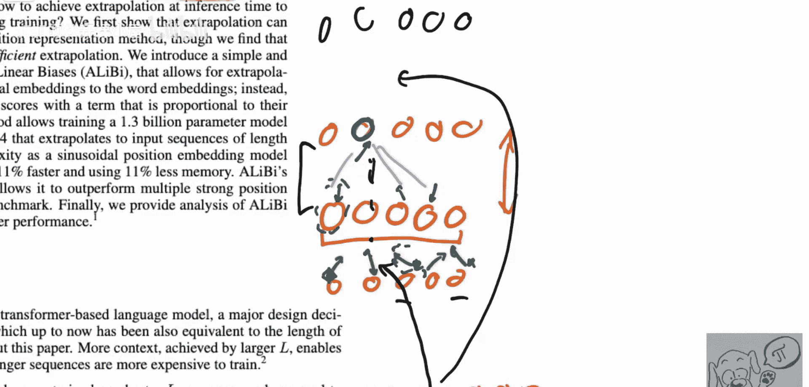

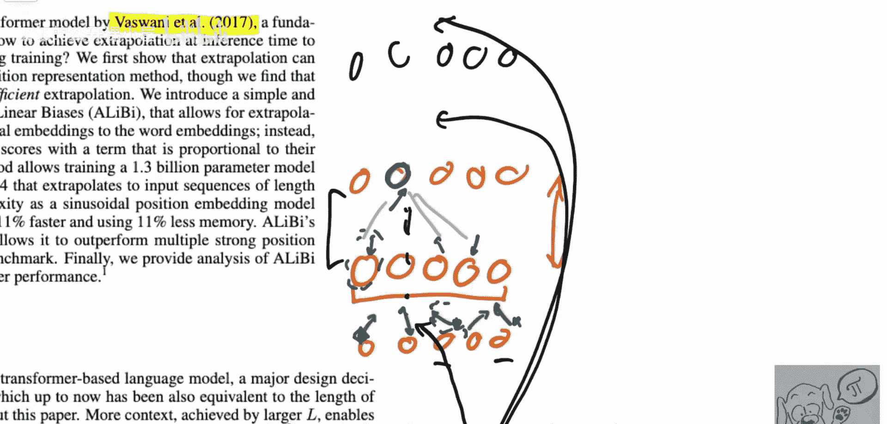

这种方法简单而有效，其**相对性**和**线性**特性使得模型在训练时学到的注意力模式能够直接应用于更长的推理序列，实现了出色的输入长度外推能力。你可以在训练时使用较短的序列以节省计算资源，而在部署时处理远超训练长度的文本，且性能下降很小。论文提供了开源代码，对于任何基于Transformer的语言模型项目，如果需要处理更长的上下文，ALiBi都是一个值得尝试的强大工具。