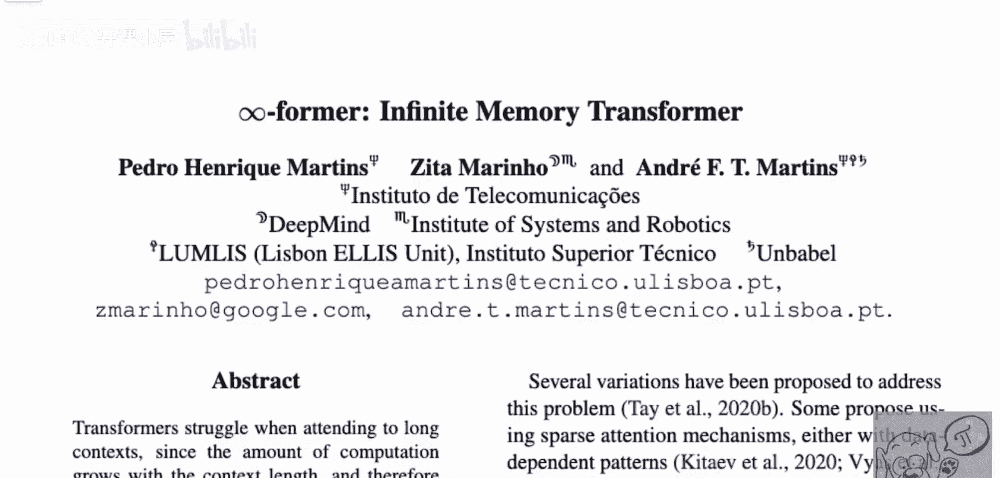
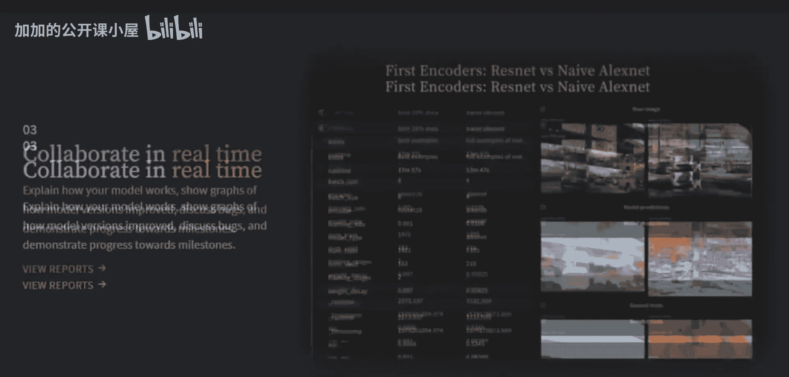
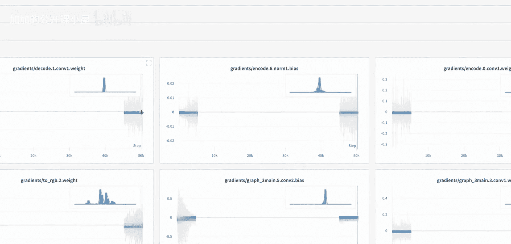
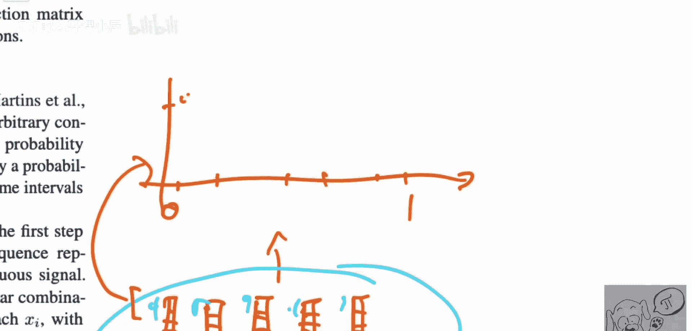

# 047：无限记忆Transformer

在本节课中，我们将要学习一篇名为“∞-former”的研究论文。这篇论文提出了一种能够处理无限长记忆的Transformer模型。我们将探讨其核心思想、工作原理以及实验结果。

## 概述

论文《∞-former: 无限记忆Transformer》由Pedro Enrique Martin、Ztamarino和Andre Ft Martin撰写。该模型的核心是提出了一种能够关注无限长过去记忆的Transformer架构。它通过构建一个被称为“长期记忆”的连续信号来实现这一点，这与大多数其他Transformer使用的离散信号不同。模型使用连续注意力机制，能够将过去的信息持续压缩到这个连续的长期记忆中，并在预测下一个词元时对其进行关注。此外，论文还引入了“粘性记忆”的概念，用于特别保留对未来预测至关重要的过去事件。

## 模型架构与工作原理

上一节我们介绍了∞-former的核心目标，本节中我们来看看它是如何实现无限记忆的。

### 从离散到连续的转变

经典Transformer处理的是离散的词元序列，每个词元对应一个嵌入向量。∞-former的关键创新在于，它将这个离散的信号转换为一个连续信号进行处理。

具体做法是，模型将嵌入向量的**每一个维度**单独处理。假设我们有一个包含5个词元的序列，每个词元有一个嵌入向量。对于嵌入向量的第一个维度，我们得到5个数值点：`[a1, a2, a3, a4, a5]`。

∞-former将这5个点绘制在一个连续的坐标轴上，例如区间`[0, 1]`。它将这个区间均匀地划分为5个点，分别对应5个词元的位置。然后，模型使用这些点`(位置, 数值)`来拟合一个**连续函数** `f(t)`，其中`t`在`[0, 1]`区间内。这样，原本离散的维度值就被表示为一个可以在任意`t`值处求值的连续信号。

**公式表示**：
对于嵌入向量的第`i`个维度，我们有离散值序列 `{v_i^1, v_i^2, ..., v_i^N}` 对应位置 `{t^1, t^2, ..., t^N}`。
模型的目标是学习一个连续函数 `f_i(t)`，使得 `f_i(t^j) ≈ v_i^j`。

### 连续注意力机制

拥有了连续的记忆表示后，模型需要使用注意力机制来查询这些记忆。∞-former采用了**连续注意力**。

在标准Transformer中，注意力是在离散的键`K`和值`V`集合上计算的。在∞-former中，长期记忆被表示为一个连续函数 `M(t)`。当需要计算注意力时，模型会生成一个连续的查询信号 `q(t)`。注意力权重不再是通过点积计算，而是通过计算查询`q(t)`与记忆函数`M(t)`在连续域上的**相似性**来获得，通常涉及积分操作。

**简化概念公式**：
`注意力输出 = ∫ [相似性(q(τ), M(t)) * 值(M(t))] dt`
这使得模型的计算复杂度不再依赖于过去词元的数量`N`，而只与用于表示连续函数的参数数量有关，从而实现了对“无限”长上下文的关注。

### 粘性记忆

为了确保关键信息不被连续压缩过程稀释，论文引入了“粘性记忆”。以下是其工作流程：

1.  模型会识别输入序列中特别重要的时刻或特征。
2.  这些重要时刻的离散表示会被直接存储到一个独立的、容量有限的记忆中。
3.  在进行预测时，模型可以同时关注连续的长期记忆和离散的粘性记忆，确保关键事件能被精确回忆。

## 实验与评价

在实验部分，论文展示了∞-former在长序列语言建模等任务上的性能。结果表明，它能够有效处理比传统Transformer长得多的上下文，同时保持可控的计算开销。

然而，也需要注意到一些权衡。模型用连续的、参数化的函数来近似无限记忆，这本质上是一种有损压缩。信息在连续化过程中可能丢失，其保真度取决于函数表示的容量。粘性记忆的引入正是为了缓解这一问题。这类似于LSTM等循环网络用有限状态来承载无限历史的概念。

## 总结

本节课中我们一起学习了∞-former模型。它通过将离散的词元序列嵌入转换为连续信号，并利用连续注意力机制，实现了对理论上无限长上下文的关注。同时，粘性记忆机制帮助模型保留关键信息。这项研究为突破Transformer的上下文长度限制提供了一种新颖的思路，即在连续空间中处理记忆和注意力。