# 048：地形变分自编码器学习等变性胶囊

在本节课中，我们将要学习一篇名为《地形变分自编码器学习等变性胶囊》的研究论文。这篇论文由T. Anderson Keller和Max Welling撰写，提出了一种新型的变分自编码器。其核心思想是，模型的潜在变量并非相互独立，而是以一种“地形”方式组织起来。这意味着，现实世界中的某种变换，可以被表示为模型潜在空间中的一种等价变换。我们将探讨如何构建一个模型，使其在训练过程中自然地实现这种对应关系。

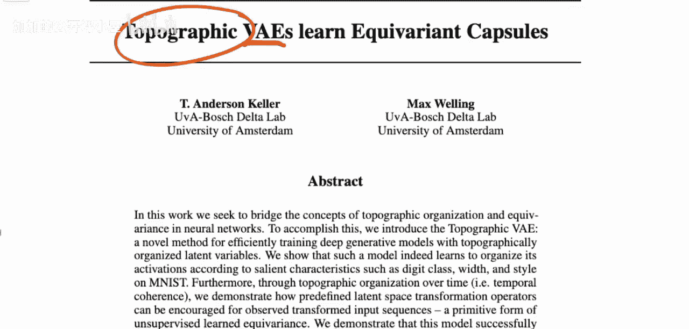

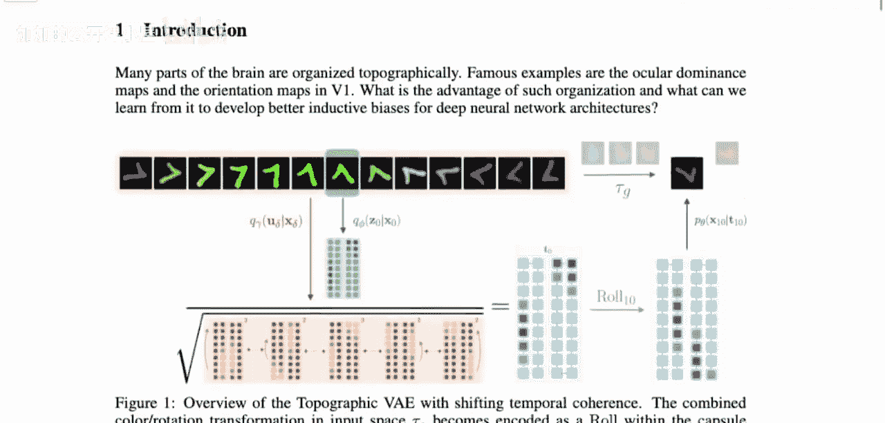

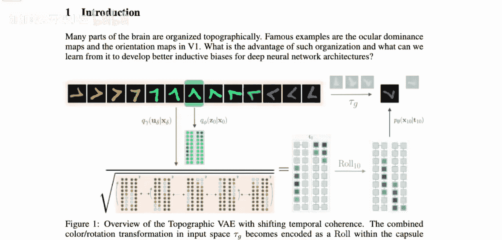

上一节我们介绍了论文的基本目标，本节中我们来看看论文提出的具体模型架构。

## 模型目标与输入

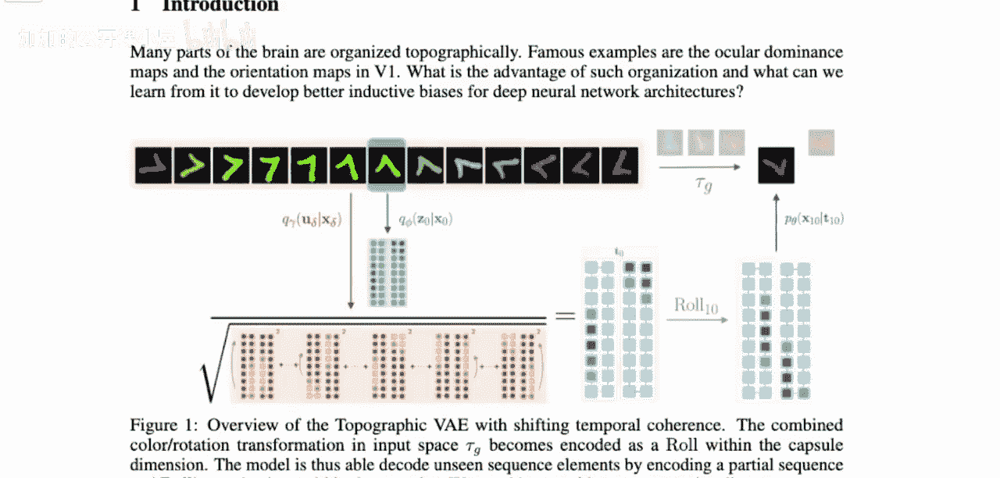

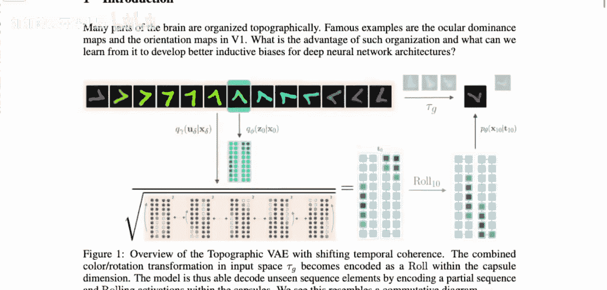

论文旨在构建一个生成模型，其输入数据不是单张图片，而是视频序列的帧。作者假设视频中的过渡是连续、单调且缓慢的。例如，一个数字“7”在序列中缓慢旋转并逐渐改变颜色。

模型将接收整个序列作为输入，但会聚焦于其中一张图片（称为焦点图像）。模型的目标是为这张焦点图像生成一个潜在表示 `Z_hat`。

在标准的变分自编码器中，我们可以将 `Z_hat` 送入解码器以重建原图。但本模型还有一个额外目标：我们希望通过对潜在空间执行特定操作（例如“滚动”操作），使其对应到输入序列中未来的图像。具体来说，如果将潜在表示滚动10步，解码后的图像应该对应原序列中10帧之后的画面，而不是输入的焦点图像。

## 模型架构详解

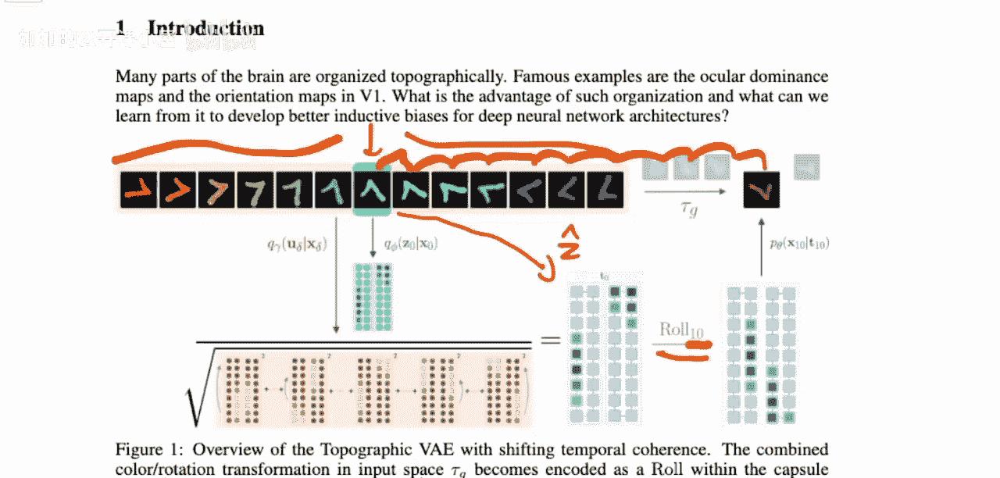

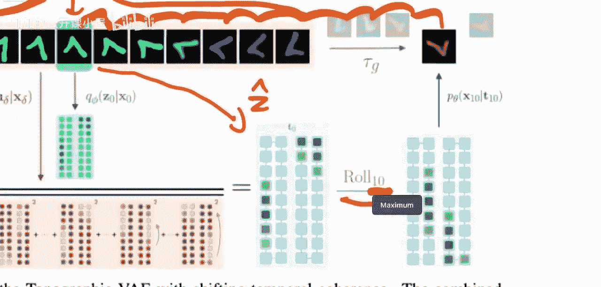

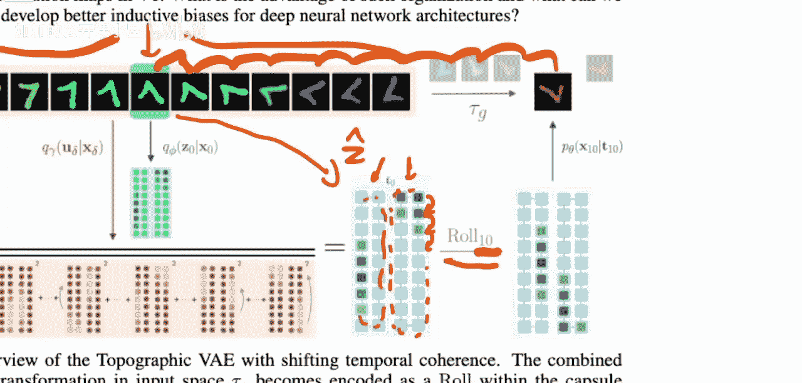

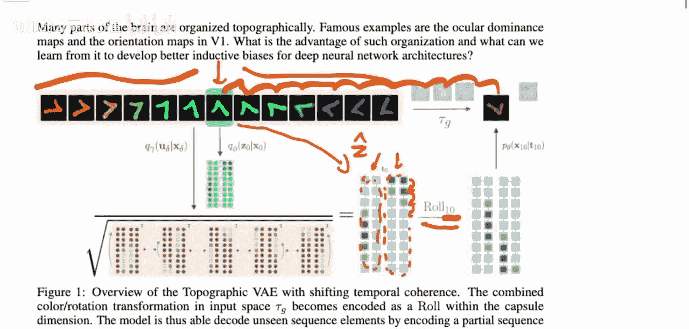

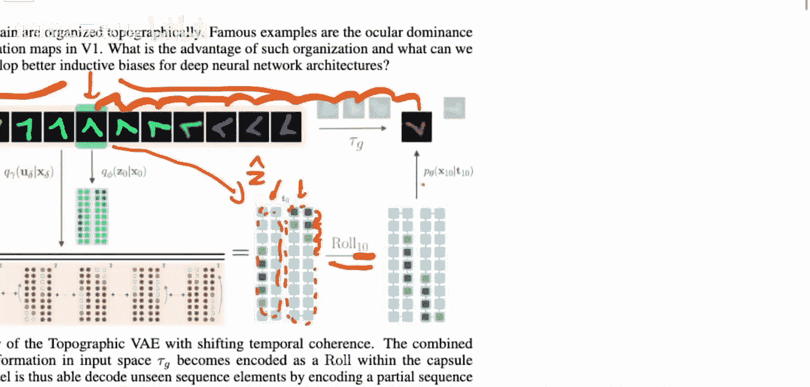

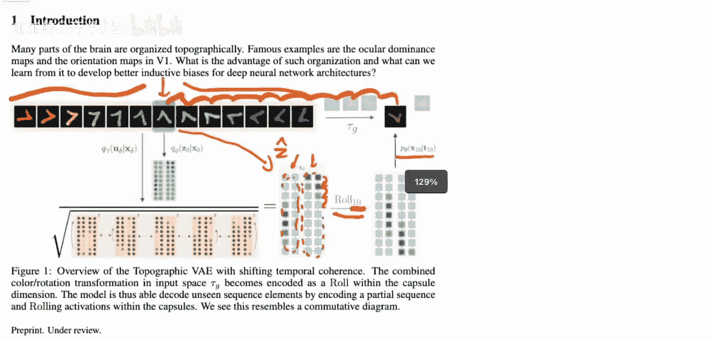

模型的潜在空间由多个被称为“胶囊”的结构组成。每个胶囊包含一组潜在变量。论文中使用的“滚动”操作，是指在潜在变量的维度上，将所有变量向前移动一位，重复此操作指定次数（例如10次）。这些胶囊被组织成一维环状结构，因此可以循环滚动。

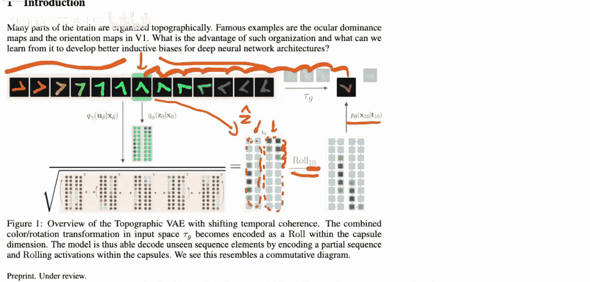

以下是模型的关键组成部分：

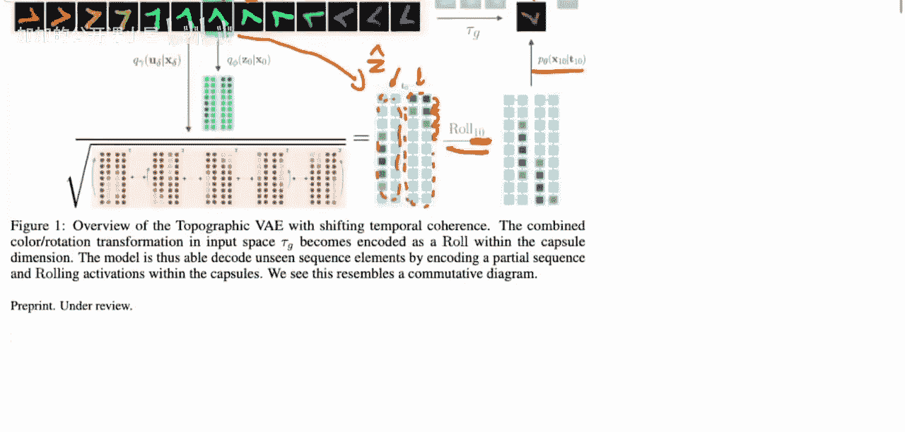

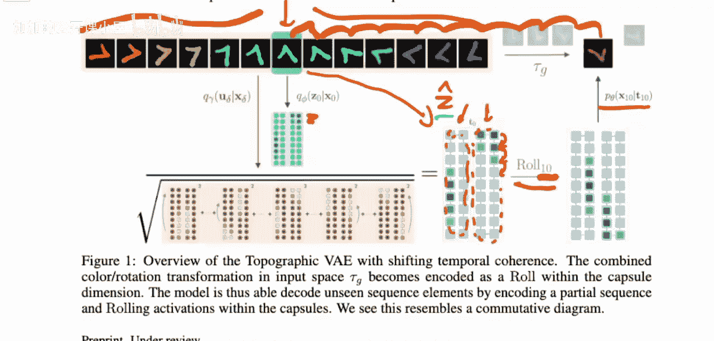

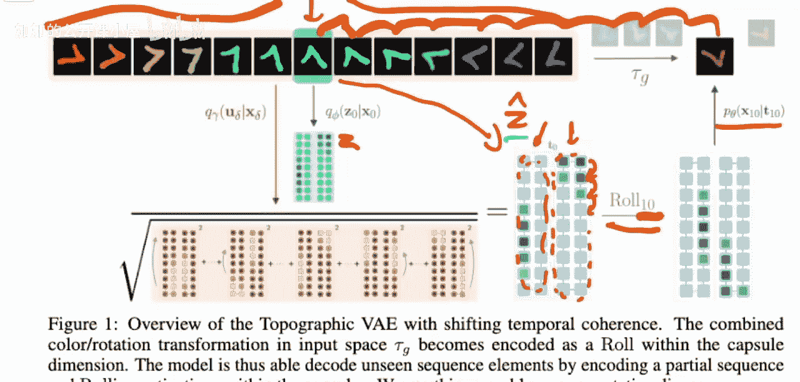

*   **编码器输出**：编码器不仅为焦点图像输出一个潜在变量 `z`，还为上下文窗口内的其他图像输出一系列 `u` 变量。
*   **潜在表示计算**：焦点图像的最终潜在表示 `Z_hat` 并非直接来自 `z`，而是通过一个归一化过程得到。具体做法是，将上下文窗口中所有图像的 `u` 变量平方后求和，再开方，然后用 `z` 除以这个结果。公式可以表示为：
    `Z_hat = z / sqrt( sum( u_i^2 ) )`
    这个过程鼓励模型从上下文信息中构建一个更稳定、更具变换感知的潜在表示。

## 与标准变分自编码器的对比

为了理解本模型的创新之处，我们先回顾标准变分自编码器。

在标准变分自编码器中，我们假设潜在空间由多个独立的高斯分布随机变量构成。编码器的任务是接收一张图像，并输出这些潜在变量的参数（均值和方差）。解码器的任务则是根据这些潜在变量值重建图像。两者被联合训练，以协作构建一个有意义的潜在空间。

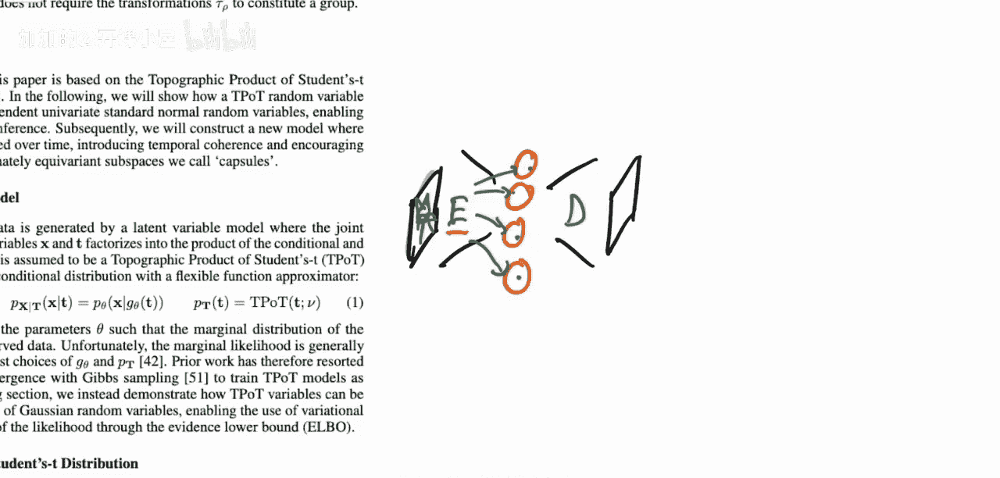

本模型与标准变分自编码器的核心区别在于对潜在变量结构的假设。标准方法假设潜在变量相互独立，而本模型通过引入“地形”组织和胶囊结构，明确地假设潜在变量之间存在特定的依赖关系，这种关系对应于现实世界中的连续变换。

论文采用了一种不同的建模思路：研究者首先提出一个关于数据如何生成的假设性结构（即联合概率分布），规定潜在变量之间如何相互作用。在这个整体结构中，那些复杂、未知的部分（如非线性映射）则由神经网络来学习。这种方法旨在通过正确的结构先验，引导模型学习到具有等变性质的潜在表示。

本节课中我们一起学习了《地形变分自编码器学习等变性胶囊》这篇论文的核心思想。论文提出了一种新型的变分自编码器，其潜在空间以地形方式组织，旨在让潜在空间内的变换与现实世界中的连续变换（如视频帧间的变化）等价对应。模型通过接收视频序列作为输入，并利用特殊的胶囊结构和归一化计算，鼓励编码器学习到这种等变特性。这种方法与标准变分自编码器独立潜在变量的假设形成对比，代表了一种通过引入结构性先验知识来引导模型学习的高级思路。