# 050：重审2014年NeurIPS实验

在本节课中，我们将学习一篇关于学术会议同行评审过程的论文。这篇论文重新审视了2014年NeurIPS会议进行的一项著名实验，旨在探究评审结果在多大程度上是随机的、主观的，而非客观反映论文质量。我们将了解实验的设计、原始发现，以及作者基于长期数据（如论文引用量）进行的新分析。

## 背景：2014年NeurIPS实验

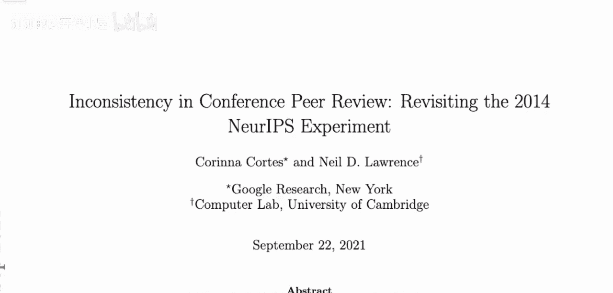

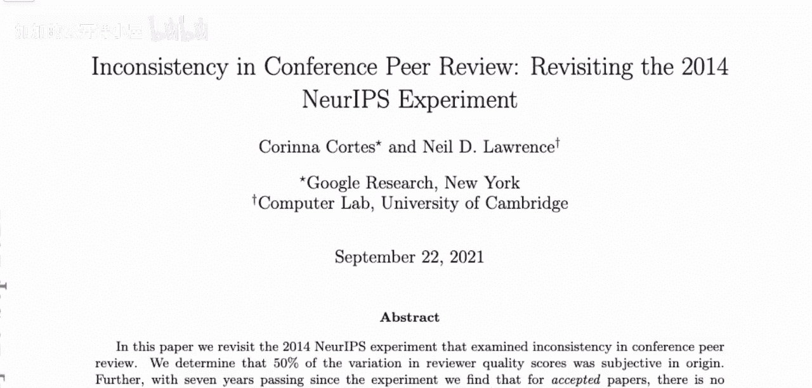

上一节我们介绍了本课程的主题。本节中，我们来看看这项研究的背景——2014年NeurIPS实验。

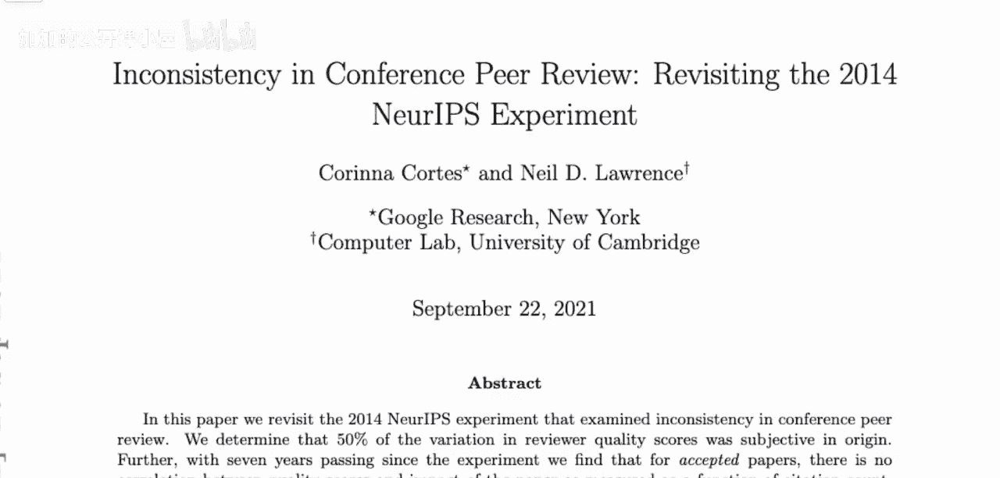

2014年NeurIPS会议组织者进行了一项实验，旨在评估会议评审过程中的随机性成分。实验核心设计如下：

以下是实验的具体步骤：
*   从所有提交的论文中，随机选取了约10%（共170篇）作为实验样本。
*   通常，一篇论文会分配给一个由若干审稿人和领域主席组成的“委员会”进行评审并做出录用或拒绝的决定。
*   在此实验中，每篇样本论文会被同时分配给两个独立的委员会（委员会1和委员会2）。
*   两个委员会的审稿人是从整个审稿人池中随机分配的两组不同人员。
*   每个委员会独立做出录用或拒绝的决定。
*   论文的最终录用规则是：只要**任一**委员会接受，该论文即被录用。

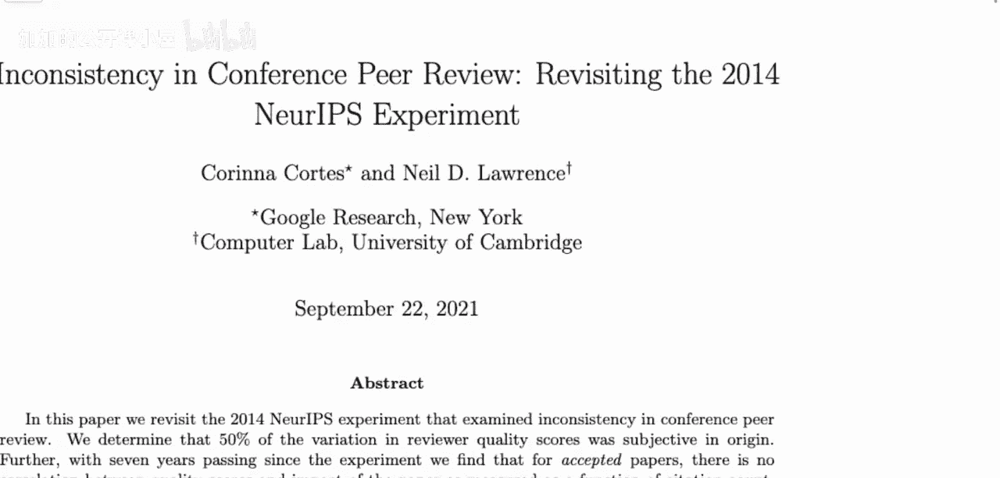

值得注意的是，2021年的NeurIPS会议重复了这项实验，这有助于我们评估多年来会议评审质量的变化。

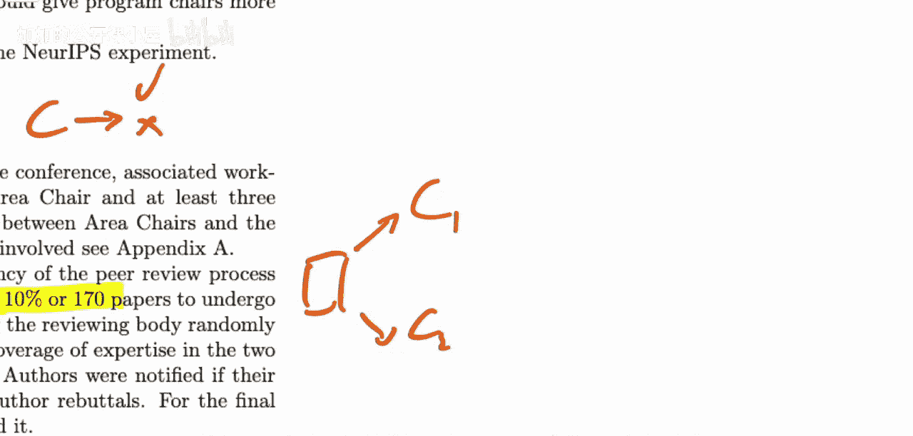

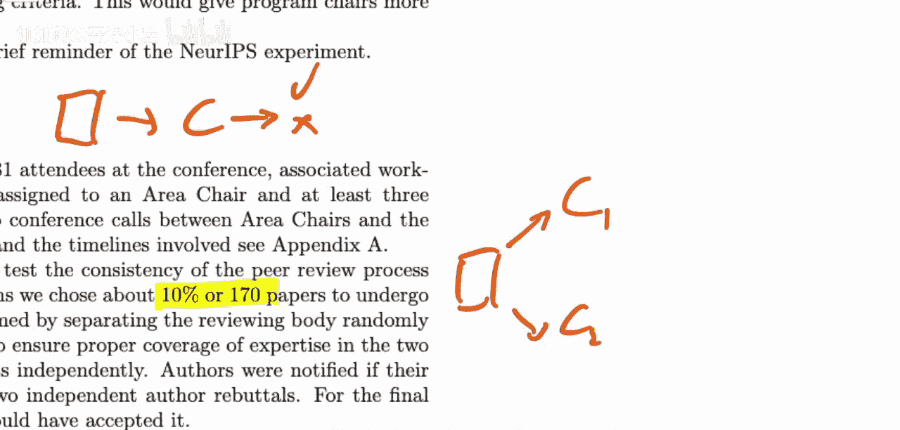

## 原始实验结果

了解了实验设计后，我们来看其原始结果。这项实验在当时引发了广泛讨论。

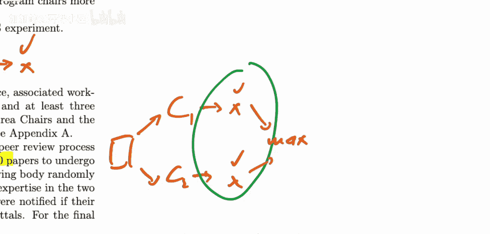

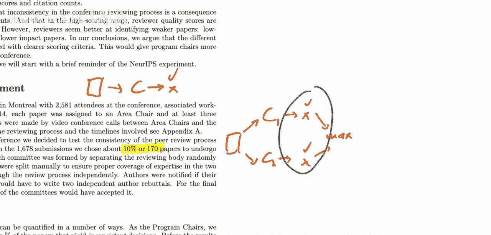

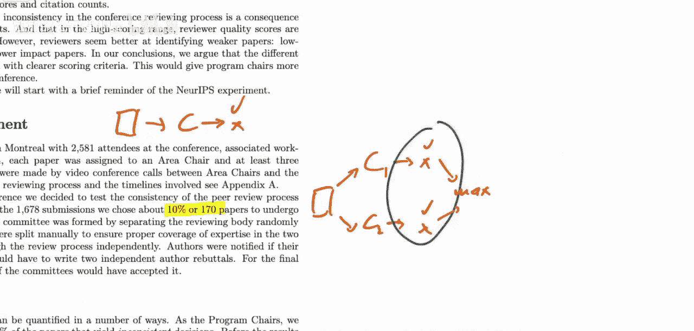

两个独立委员会对样本论文的评审结果如下：
*   对101篇论文，两个委员会均决定**拒绝**。
*   对22篇论文，两个委员会均决定**接受**。
*   对43篇论文，两个委员会的决定**不一致**（一个接受，另一个拒绝）。

这意味着，大约**25%** 的论文，其评审结果取决于被分配到了哪个委员会。从另一个角度看，如果会议只采用委员会1的决定，最终录用的论文集合将与只采用委员会2的决定有约一半的不同。这表明，最终会议上展示的论文，有相当一部分能入选存在一定的随机性。

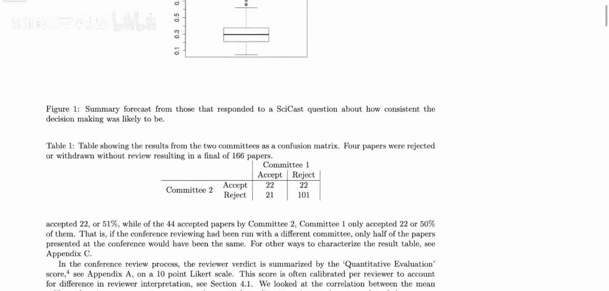

## 新分析：审稿人校准

原始实验揭示了评审结果的不一致性。本节中，我们将深入论文作者进行的新分析。第一部分是“审稿人校准”，旨在量化评审分数中客观与主观成分的比例。

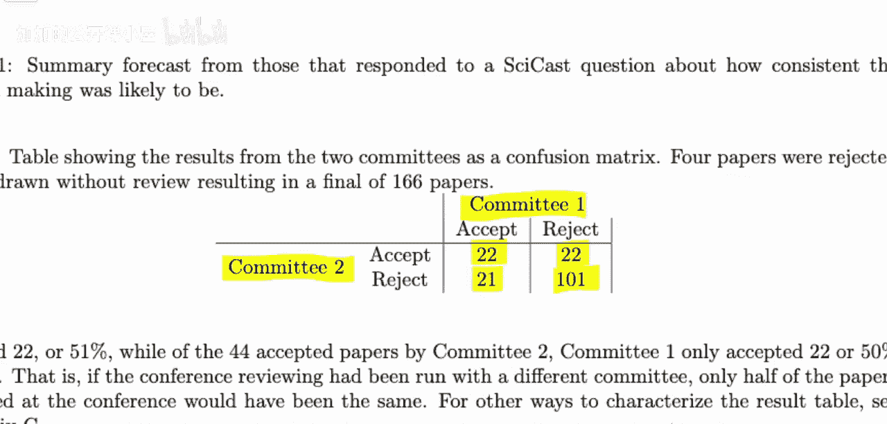

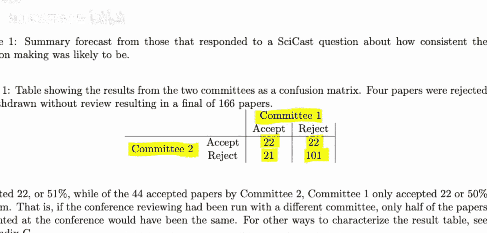

作者建立了一个线性模型来描述审稿人给出的分数。模型假设，审稿人`J`给论文`I`的分数 `Y_IJ` 由三部分组成：
`Y_IJ = F_I + B_J + E_IJ`
其中：
*   **`F_I`**：代表论文`I`的**客观质量**，这是审稿人试图评估的核心。
*   **`B_J`**：代表审稿人`J`的**校准偏差**。例如，不同审稿人对评分量表（如1-10分）的严格程度理解不同。
*   **`E_IJ`**：代表审稿人`J`对论文`I`的**主观评价**，这部分独立于论文的客观质量。

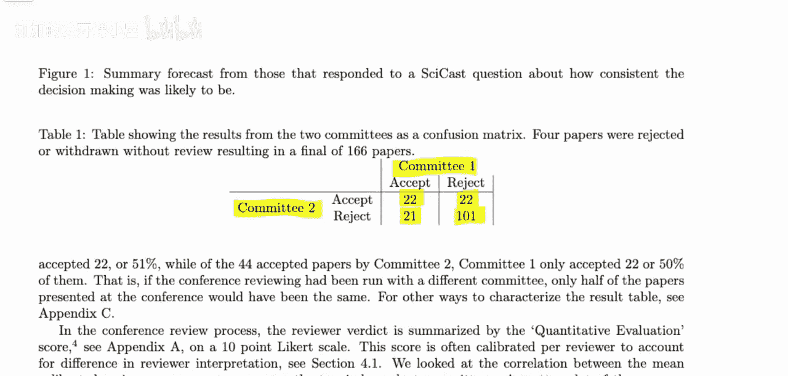

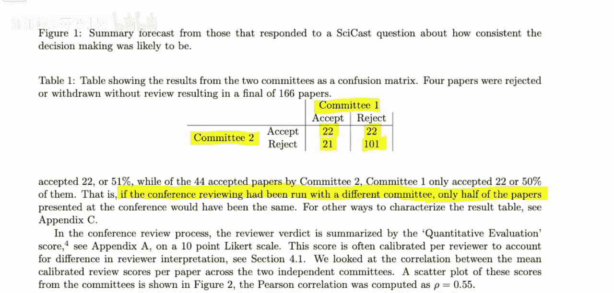

我们观察到的只有分数 `Y_IJ`。模型的目标是在校正了审稿人的普遍偏差（`B_J`）后，估计客观质量（`F_I`）和主观评价（`E_IJ`）对最终分数的相对贡献。

通过构建线性系统并采用正则化方法求解，作者得出了各部分的权重系数。分析结果显示，客观质量因子（`F_I`）和主观评价因子（`E_IJ`）的系数几乎相等。这意味着，在一个典型的审稿人评分中，大约**50%** 的方差来源于审稿人的主观评价。

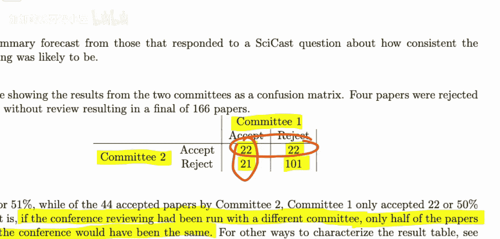

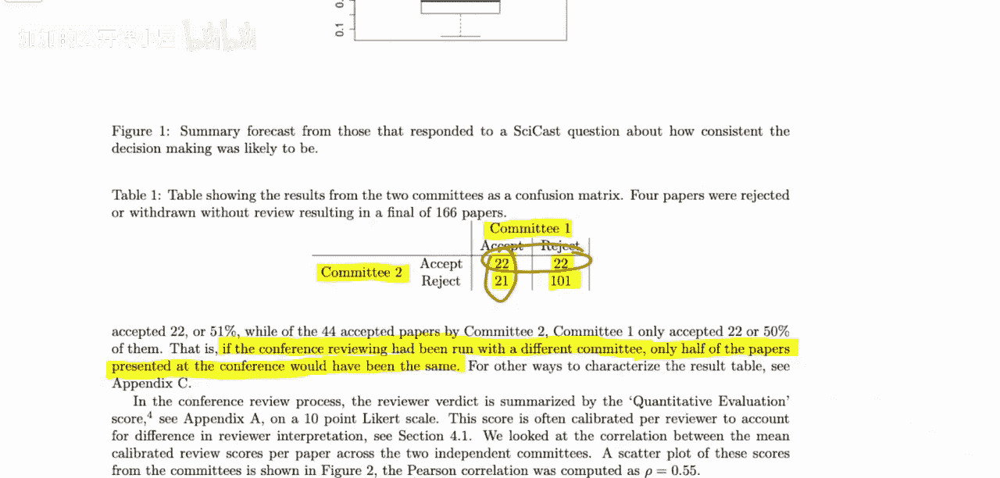

## 新分析：基于长期影响力的评估

除了分析评分本身，作者还追踪了这些论文的长期表现，以检验评审决策是否能预测论文的未来影响力。

他们比较了2014年实验中不同类别论文在后续年份（至2019年）获得的引用次数：
*   **一致接受**的论文（两个委员会都接受）。
*   **不一致**的论文（仅一个委员会接受）。
*   **一致拒绝**的论文（两个委员会都拒绝）。

以下是主要发现：
*   从**中位数引用量**来看，“一致接受”的论文表现最好，“不一致”的论文次之，“一致拒绝”的论文最低。这表明评审决策与论文的长期影响力存在正相关。
*   然而，当观察**引用量的分布**时，情况变得复杂。在“一致拒绝”的论文中，有相当一部分（约**10%**）最终成为了高被引论文（引用量进入前10%）。同时，在“一致接受”的论文中，也有相当一部分（约**20%**）后续引用表现平平（引用量处于后50%）。
*   因此，虽然评审结果在统计意义上与长期影响力相关，但**对于单篇论文而言，评审结果并不是其未来影响力的可靠预测指标**。许多高质量论文可能被拒绝，而一些被接受的论文影响力可能有限。

## 新分析：决策阈值的影响

最后，作者探讨了决策阈值的变化会如何影响录用论文的构成。

他们模拟了在不同录用率（即改变接受论文所需的分数阈值）下，最终被录用的论文集合的变化。分析发现，录用率微小的变化（例如从23%变为28%），就会导致近**一半**的录用论文被替换成另一批论文。这进一步说明了，会议最终的录用名单对评审过程中的微小波动非常敏感。

## 总结与启示

本节课中，我们一起学习了这篇重新审视2014年NeurIPS实验的论文。

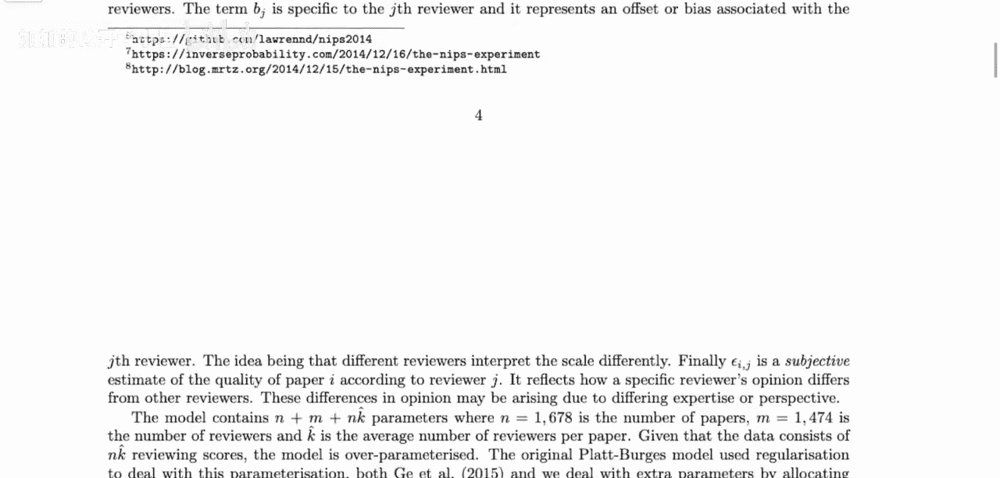

我们回顾了原始实验，它揭示出约有25%的论文评审结果取决于随机的审稿人分配。通过新分析，我们了解到：
1.  审稿人的评分中，约一半的方差源于其主观评价。
2.  会议评审结果与论文的长期引用量存在统计相关性，但无法可靠预测单篇论文的未来影响力。被拒论文中可能包含“沧海遗珠”，而被接受的论文也可能影响力一般。
3.  最终的录用论文集合对评审分数阈值的小幅调整极其敏感。

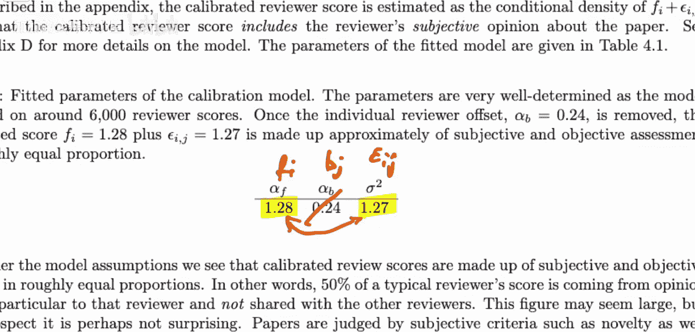

这些发现表明，学术会议的同侪评审系统虽然整体上能筛选出平均质量更高的论文，但其过程包含显著的随机性和主观性。因此，对于研究者而言，一次论文被拒并不必然代表工作质量低下；对于会议组织者和学术社区而言，这提示我们需要持续探索和改进评审机制，以提高其一致性和公正性。