# 051：我们能将深度学习扩展到何种程度？深度学习的收益递减 📉

## 概述
在本节课中，我们将一起解读一篇来自《IEEE Spectrum》的文章，题为《深度学习的收益递减》。这篇文章探讨了深度学习在取得惊人成就的同时，其性能提升所需付出的计算成本正变得难以持续。我们将分析文章的核心论点、数据支撑以及作者对未来的预测，并讨论其中的合理性与局限性。

## 深度学习的成就与历史背景 🏛️

上一节我们介绍了课程概述，本节中我们来看看文章如何评价深度学习的成就并回顾其历史。

文章开篇赞扬了深度学习在诸多领域取得的成就，例如语言翻译、蛋白质折叠预测以及围棋等复杂游戏。文章指出，深度学习虽然近年来才兴起，但其历史可以追溯到1958年。当时康奈尔大学的弗兰克·罗森布拉特设计了第一个人工神经网络。

罗森布拉特的雄心超越了他所处时代的能力。他曾指出，随着网络中连接数量的增加，传统数字计算机的负担很快就会变得过大。那么，为何深度神经网络如今能够成功？核心原因在于计算能力的巨大提升。根据摩尔定律，计算能力增长了约一千万倍。此外，我们还开发了专用硬件，如图形处理器和专门为机器学习设计的张量处理器。

这些更强大的计算机使得构建具有更多连接、神经元和更强复杂现象建模能力的网络成为可能。这正是推动当今人工智能大部分进步的深度神经网络。

## 当前的挑战：接近扩展极限 ⚠️

上一节我们回顾了深度学习的辉煌历史，本节中我们来看看文章指出的当前核心挑战。

文章将今天的研究者与罗森布拉特时代进行了类比，指出当今的深度学习研究者也正接近其工具所能达到的极限。文章声称，我们目前处于类似的境地：我们拥有能够取得成就的模型，并且知道扩大规模可以提高性能，但我们在扩展能力上正接近极限。

例如，有报道称萨姆·奥特曼表示GPT-4的规模不会比GPT-3大很多，它将通过更高效的训练、更智能的处理方式来提升性能，虽然会使用更多计算资源，但规模本身不会显著扩大。

## 过参数化：优势与代价 ⚖️

上一节我们讨论了扩展的物理极限，本节中我们来深入探讨一个使深度学习强大却也昂贵的关键特性：过参数化。

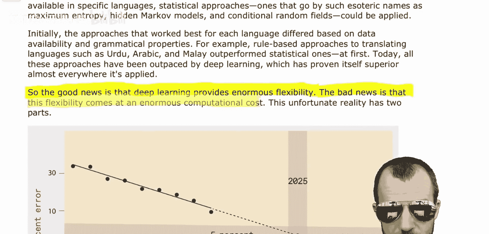

文章首先触及的关于深度学习的事实是深度网络是**过参数化**的。例如，Noisy Student模型拥有约4.8亿个参数，但仅在120万张带标签的ImageNet数据集图像上进行训练。当然，Noisy Student模型可能还利用了未标记数据。但不可否认，当今的神经网络是严重过参数化的，其参数数量超过了可用的数据点数量。

按照经典理论，这会导致严重的**过拟合**，即模型不仅学习到一般规律，也记住了训练数据中的随机噪声。然而，深度学习通过以下方式避免了这一陷阱：
*   随机初始化参数。
*   使用一种称为**随机梯度下降**的方法迭代调整参数以更好地拟合数据。

令人惊讶的是，这一过程已被证明能确保学习到的模型具有良好的**泛化**能力。需要指出的是，学界尚未完全确定深度网络为何在过参数化时不会过拟合，或者为何能良好泛化。虽然存在一些关于SGD的证明，但这些证明通常需要脱离现实情况的假设。但核心信息是正确的：深度网络是过参数化的，这可能是它们表现如此出色的原因之一。

过参数化带来了巨大的灵活性。文章指出，好消息是深度学习提供了巨大的灵活性，坏消息是这种灵活性带来了巨大的计算成本。

这一不幸的现实包含两部分：
1.  第一部分适用于所有统计模型：要将性能提高**K**倍，至少需要使用**K²**倍的数据点来训练模型。
2.  第二部分计算成本则明确来自过参数化。考虑到这一点，性能提升所需的总计算成本至少为**K⁴**。这意味着，要实现十倍改进，需要将计算量增加一万倍。

无论你是否认为这里的理论分析完全准确，文章作者收集的实际数据表明：理论告诉我们，计算需求需要至少随性能改进的**四次方**缩放；而在实践中，实际需求至少按**九次方**缩放。这意味着，当实际测量人们为实现给定性能需要扩展多少计算时，其需求远高于理论预测。

## 数据与预测：计算成本与碳排放 📊

上一节我们了解了过参数化带来的理论计算负担，本节中我们来看看文章用实际数据描绘的严峻图景。

文章提供了清晰的图表进行说明。左侧图表显示了ImageNet分类数据集的错误率随时间下降的趋势。自2012年AlexNet取得成功以来，随着新的最先进模型不断提出，错误率持续下降。如果简单 extrapolate，可以清楚地看到，到2025年左右，错误率应达到约5%。

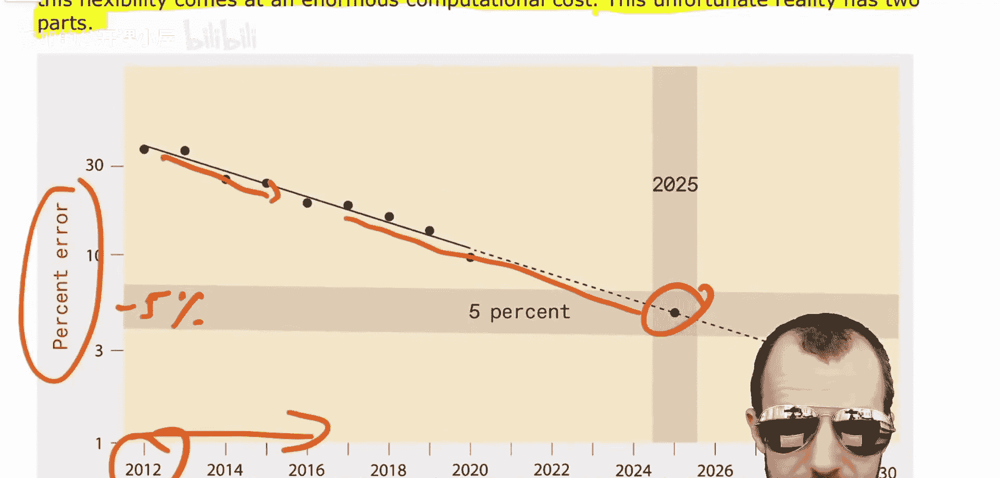

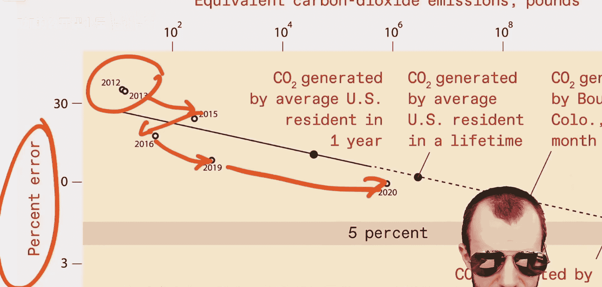

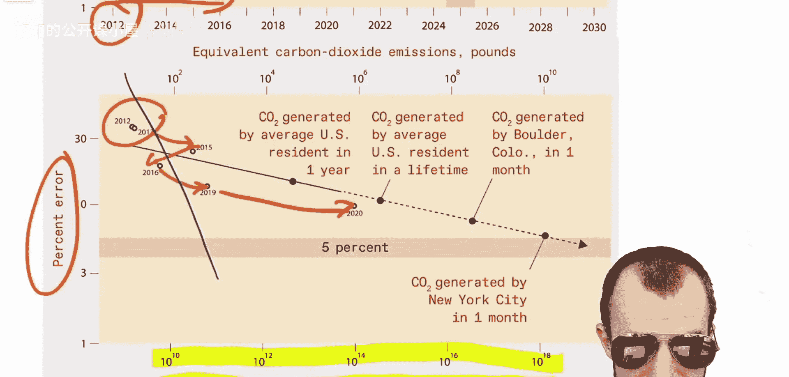

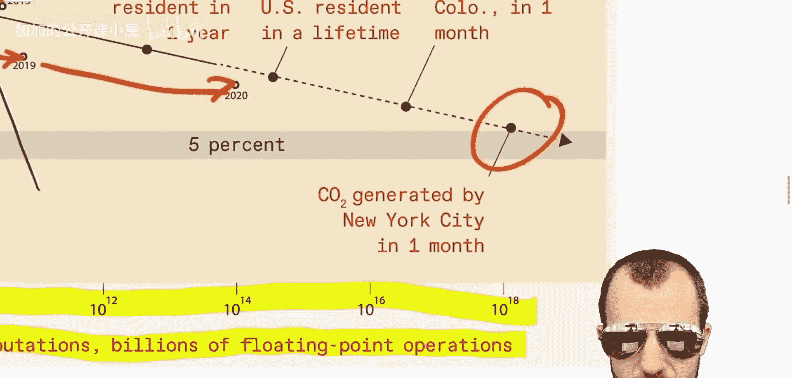

当然，这只是一个玩笑式的 extrapolation，因为要达到新的技术水平显然需要付出努力，而不仅仅是等待。文章在此图表上叠加了另一个图表，其Y轴同样是错误率百分比，但X轴是计算量。

请注意，X轴是对数刻度。这张图表似乎表明存在某种关系，甚至可能是可以 extrapolate 的线性关系。如果按照他们的 extrapolation 线，要达到5%的错误率，最终需要大约10¹⁸次浮点运算。

文章还将此与等效二氧化碳排放量进行了比较。目前，训练一次当前最先进模型所产生的二氧化碳排放量，介于美国居民年平均排放量和终身排放量之间。如果 extrapolate 到10¹⁸次浮点运算以实现5%的错误率，其排放量突然变得相当于纽约市一个月的排放总量。这相当令人震惊。

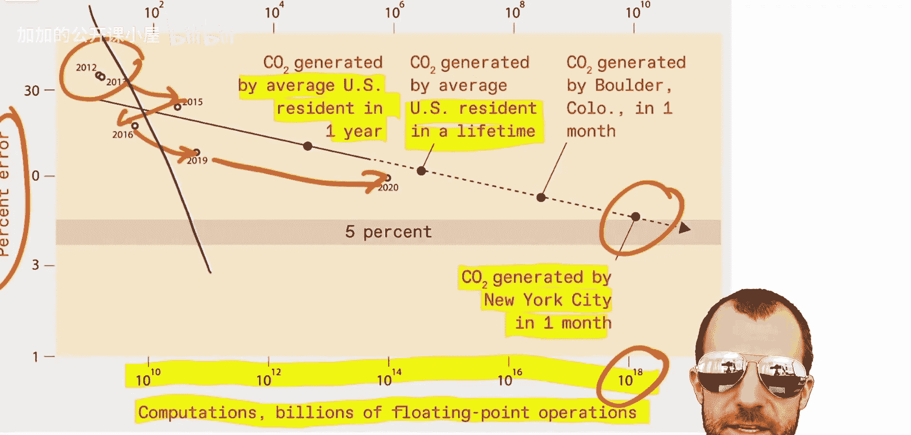

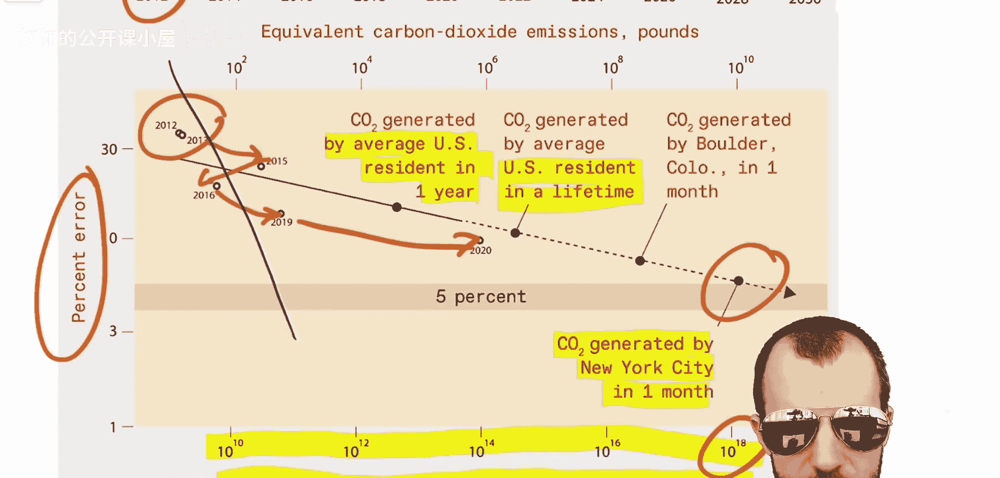

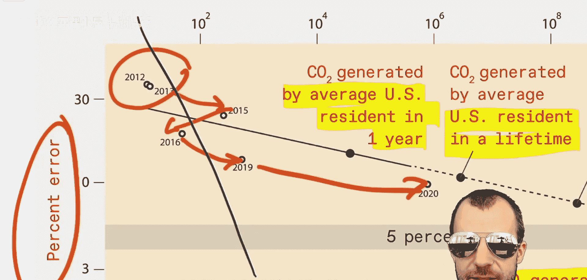

## 对预测的质疑与思考 🤔

上一节我们看到文章基于数据 extrapolation 得出的惊人结论，本节中我们来审视这些预测可能存在的问题。

尽管文章的研究和数据看似严谨，但我对此有几个疑问：
1.  **Extrapolation 的可靠性**：图表中的“之”字形波动并不真正支持可以简单地跨越这些技术进步进行 extrapolation。此外，2020年的数据点似乎偏离较远。因此，实际所需的计算增长斜率更接近我绘制的蓝线还是文章中的黑线，会造成指数级的差异。我怀疑能否在三年（从2022年到2025年）前就精确预测出5%错误率这个点。
2.  **碳排放的差异性**：并非所有能源都是等同的。例如，谷歌以其零排放为荣，因此如果谷歌训练一个模型，理论上没有等效二氧化碳排放。虽然“碳中和”、“零排放”这类说法有时可能存在争议，但大型公司确实可以将其工作负载分布到全球能源使用效率最高的地方。
3.  **技术进步的作用**：我认为这应该是此处的主要论点。我们过去几年取得的所有进步都不仅仅是规模扩大。规模扩大总是伴随着某种发明，使其更高效或更具扩展可行性。架构搜索、预训练技术等创新都极大地提升了效率，单纯的计算规模 extrapolation 可能忽略了未来类似突破的潜力。

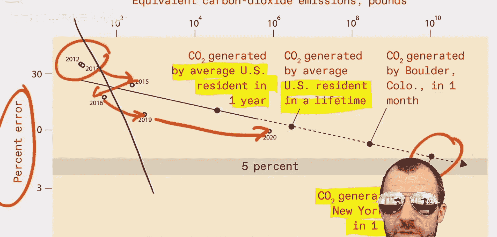

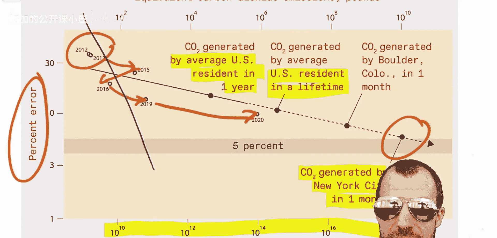

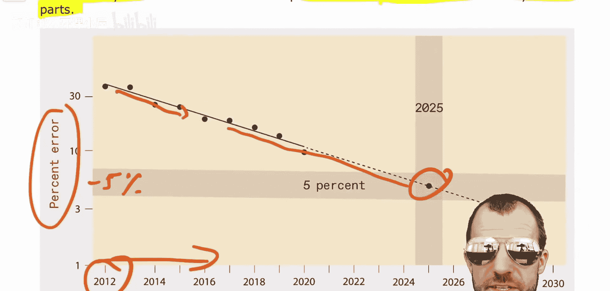

## 总结
本节课我们一起解读了《深度学习的收益递减》这篇文章。我们学习了深度学习的历史成就，分析了其过参数化的特性及其带来的巨大计算成本。文章通过数据 extrapolation 指出，单纯依靠扩大计算规模来提升性能，其成本（包括经济和环境成本）将变得不可持续，并预测了未来的计算与排放需求。同时，我们也对文章 extrapolation 方法的可靠性、碳排放计算的差异性以及忽略未来技术突破的可能性提出了质疑。这提醒我们，在追求AI性能提升的道路上，算法创新与计算效率的提升与单纯扩大规模同等重要，甚至更为关键。