# 052：小规模算法数据集上超越过拟合的泛化能力（论文解读）

在本节课中，我们将学习一篇来自OpenAI的有趣论文。这篇论文介绍了一种被称为“Grokking”的现象，即神经网络在小型算法数据集上训练时，会先完全过拟合，然后在持续训练很长时间后，突然获得完美的泛化能力。我们将探讨这一现象的背景、其与“双下降”现象的联系，以及论文中用于研究的特定数据集类型。

## 现象概述：什么是Grokking？

上一节我们介绍了本节课的主题。本节中，我们来看看论文提出的核心现象。

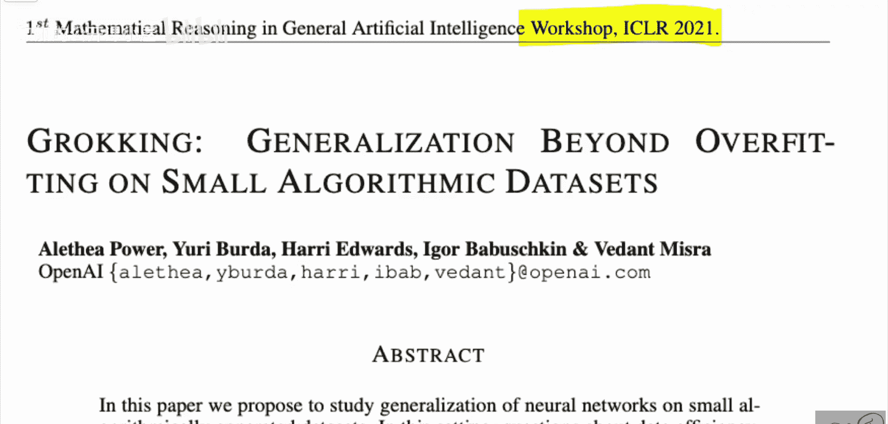

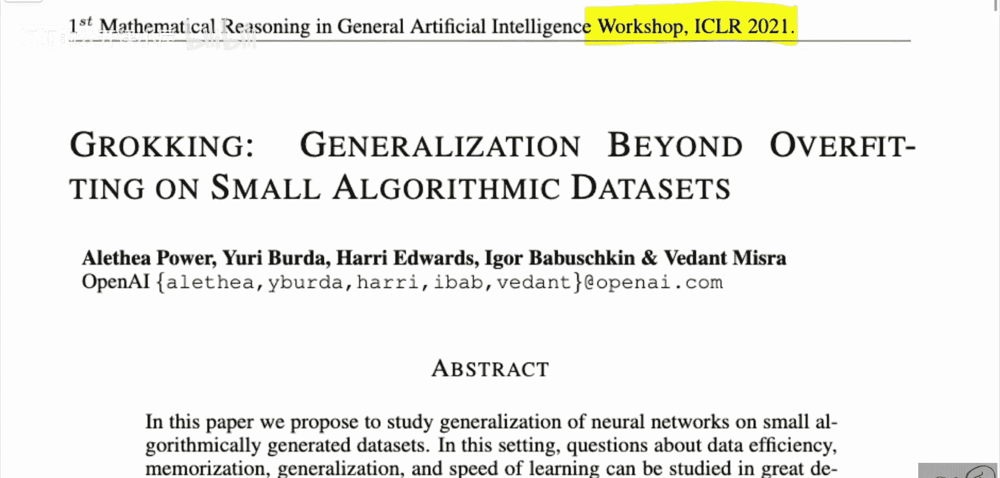

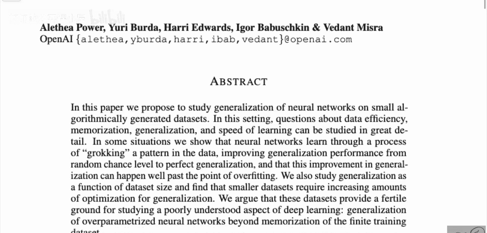

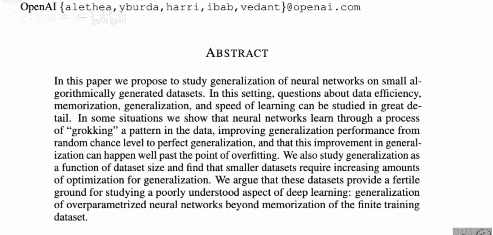

论文《Grokking: Generalization Beyond Overfitting on Small Algorithmic Datasets》由OpenAI的研究者提出。该论文展示了一种被称为“Grokking”的现象。具体表现为：神经网络在训练初期会完全过拟合训练数据，训练损失降至最低，训练准确率达到100%，但在验证集上的表现（泛化能力）却很差。然而，如果继续训练很长时间（通常需要数个数量级更多的训练步数），神经网络会突然“顿悟”，在验证集上的准确率也跃升至100%，实现完美泛化。

这种现象非常有趣，因为它表明即使在看似已经过拟合、没有希望的情况下，持续训练仍可能带来泛化能力的突破。论文在ICLR 2021的一个研讨会上发表，意味着这仍是一项进行中的工作，旨在揭示这一现象本身，许多内在机制尚不明确。

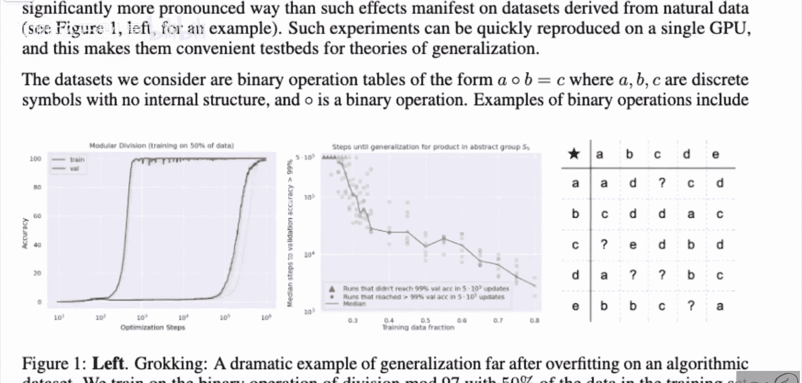

## 可视化Grokking现象

理解了基本概念后，我们通过图表来直观感受这一过程。

下图展示了Grokking现象的典型曲线。图中，红色曲线代表训练准确率，蓝色曲线代表验证准确率，横轴是优化步数（请注意，这是对数刻度）。

可以看到，训练准确率在少量步骤后迅速达到100%。然而，验证准确率起初可能有一个微小的波动，但随后长期保持在低位。直到训练步数达到 `10^4` 或 `10^5` 量级时，验证准确率才突然急剧上升，最终也达到100%。一旦网络开始泛化，它似乎会稳定保持这种状态，而不会再次退化。

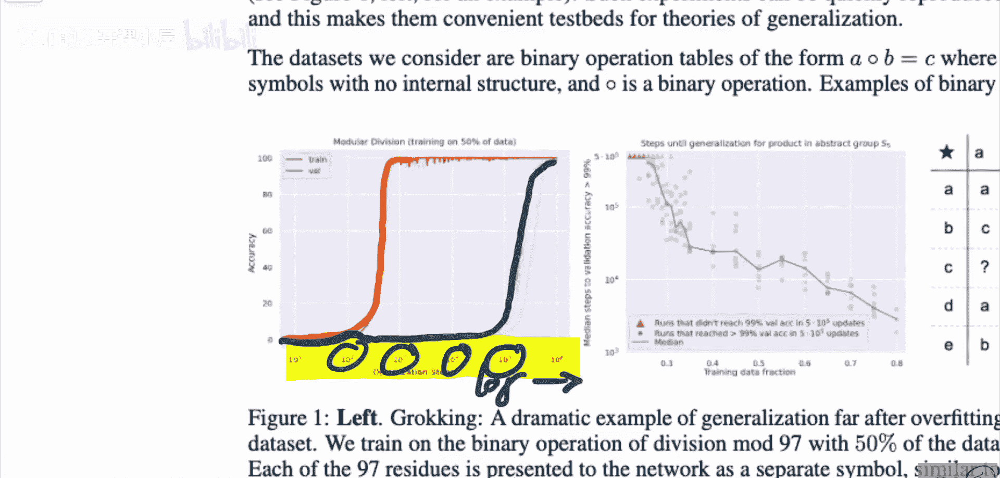

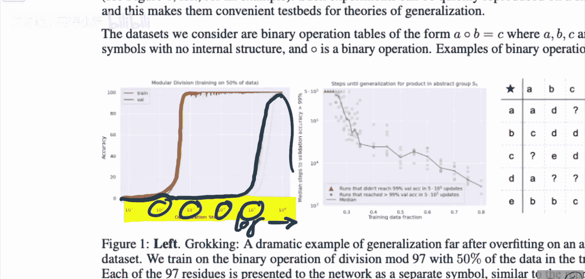

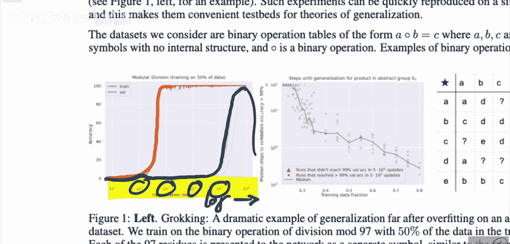

## 相关背景：双下降现象

在深入探讨Grokking的原因之前，有必要了解一个密切相关且可能相互关联的现象：双下降现象。

双下降现象揭示了模型复杂度与泛化能力之间的非单调关系。其典型图表如下所示：

在该图中：
*   **横轴**：神经网络的参数量。
*   **纵轴**：损失（或错误率）。通常包含两条曲线：训练损失和验证损失。
*   **关键点**：图中的每个点代表一个不同参数量、但都已训练至收敛的神经网络。

以下是其发展过程：
1.  **欠参数化区域**：随着参数量增加，模型拟合能力增强，训练损失和验证损失同步下降。
2.  **临界点/过拟合区域**：当参数量接近训练数据点数量（记为 `n`）时，模型开始过拟合。验证损失上升，而训练损失继续下降至接近零。
3.  **过参数化区域**：当参数量**超过** `n` 继续增加时，验证损失会**再次下降**，并且最终可能达到比欠参数化模型更低的水平，实现更好的泛化。

双下降现象表明，过度参数化的神经网络能够获得比经典统计学预期更好的泛化性能。Grokking现象可以看作是**在训练时间维度上**的双下降：模型在训练初期（对应“临界点”）过拟合，但通过极长时间的训练（对应进入“过参数化”的优化状态），最终实现了泛化。

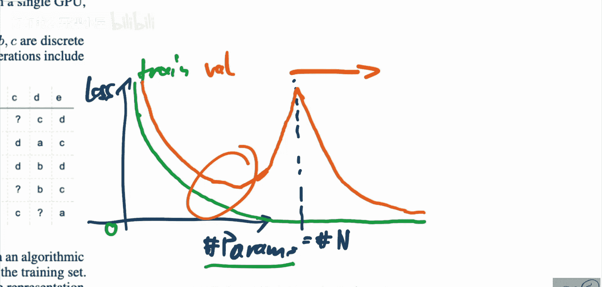

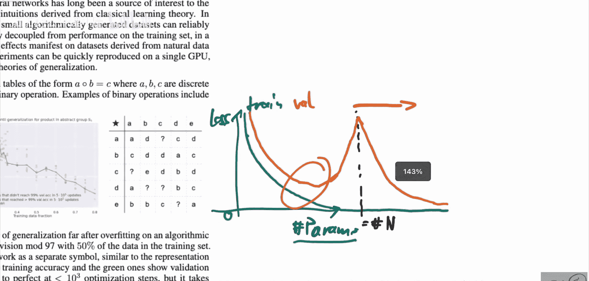

## 论文中使用的数据集类型

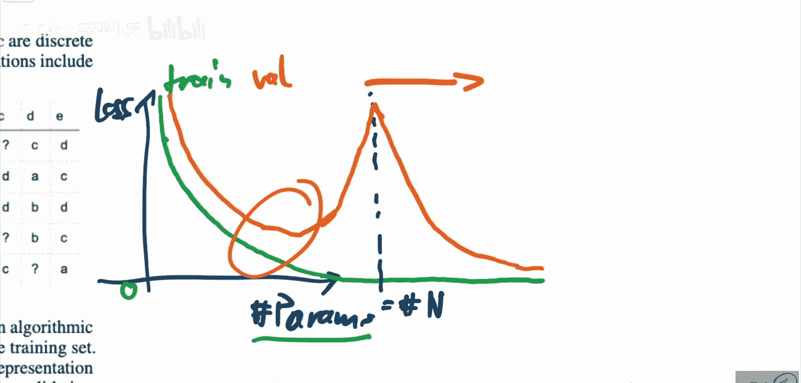

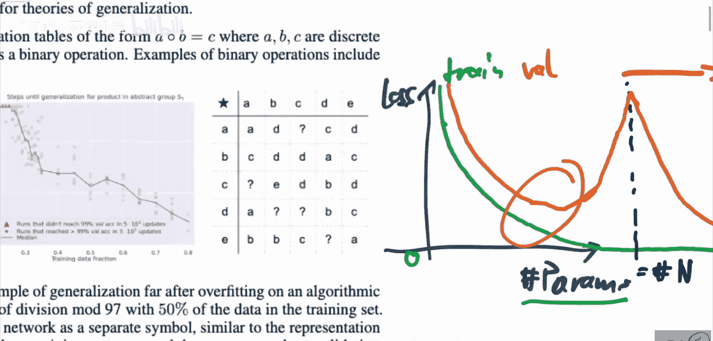

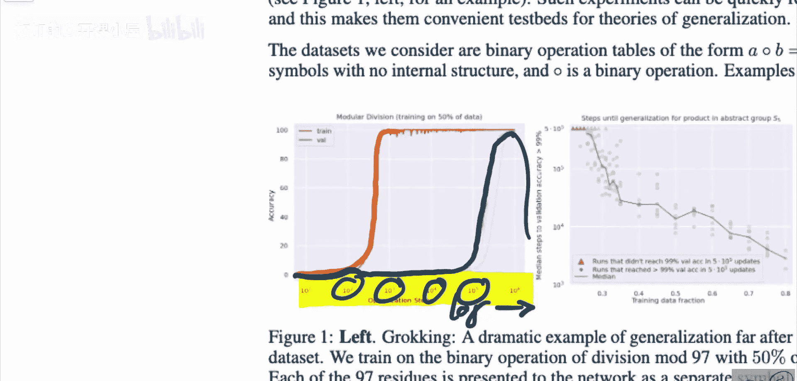

为了研究Grokking现象，论文使用了特定类型的合成数据集，这有助于控制变量并观察纯粹的现象。

以下是论文中主要使用的数据集类型：

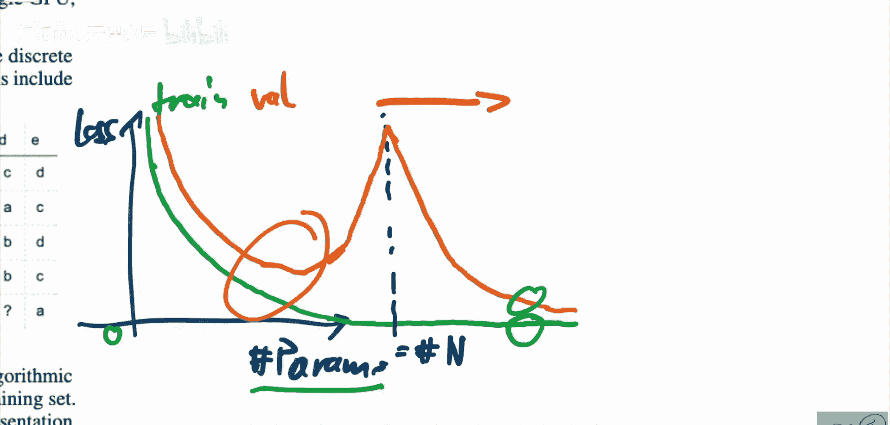

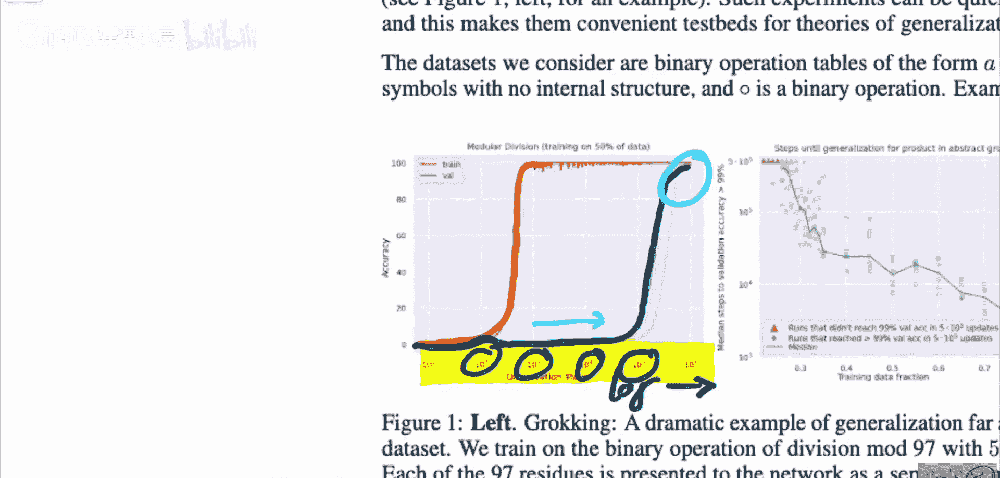

论文考虑的数据集是**二元运算表**。其基本形式为：给定一个运算 `∘`，对于输入 `a` 和 `b`，输出 `c`，即 `a ∘ b = c`。其中，`a`、`b`、`c` 是离散的、没有内部结构的符号。`∘` 代表一种二元运算。

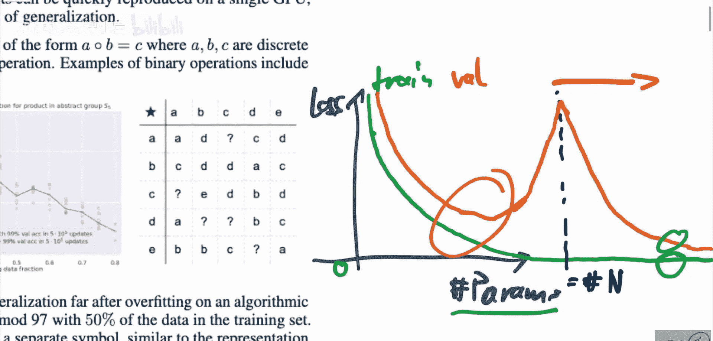

**公式表示**：`f(a, b) = c`，其中 `a, b, c ∈ S`，`S` 是一个有限的符号集合，`f: S × S -> S` 是一个确定的二元函数。

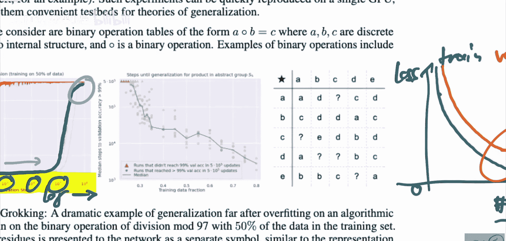

常见的二元运算例子包括加法、乘法、排列组合等。论文中进行了多种实验，其中一个核心例子是 **S5群**。
*   **S5群**：由5个元素的所有排列组成的群。该群共有 `5! = 120` 个元素。
*   **运算**：定义为排列的复合。例如，一个排列 `π1` 与另一个排列 `π2` 复合，得到一个新的排列 `π3`。
*   **数据表**：可以构建一个 `120 × 120` 的表格，其中每一行和每一列对应一个排列，表格内的条目就是两个排列复合的结果。

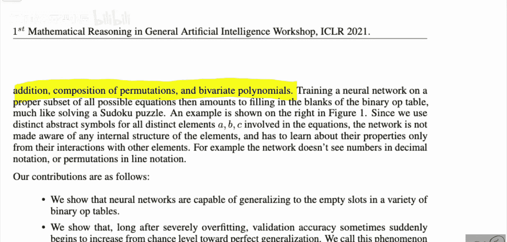

通过这种方式，研究者可以生成具有明确、复杂规则但数据量可控的合成数据集，用以观察神经网络学习这些规则的过程。

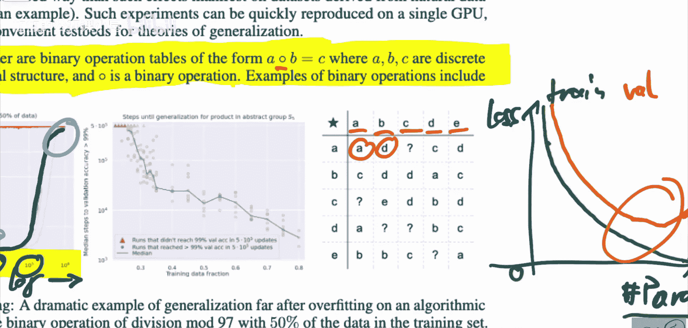
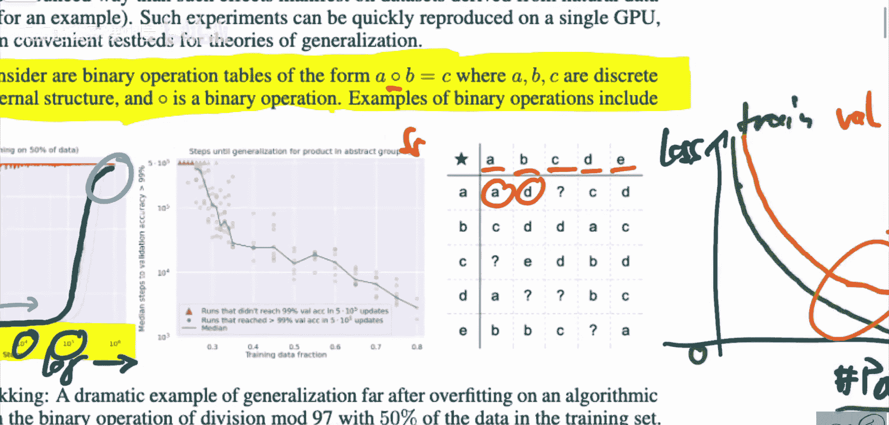
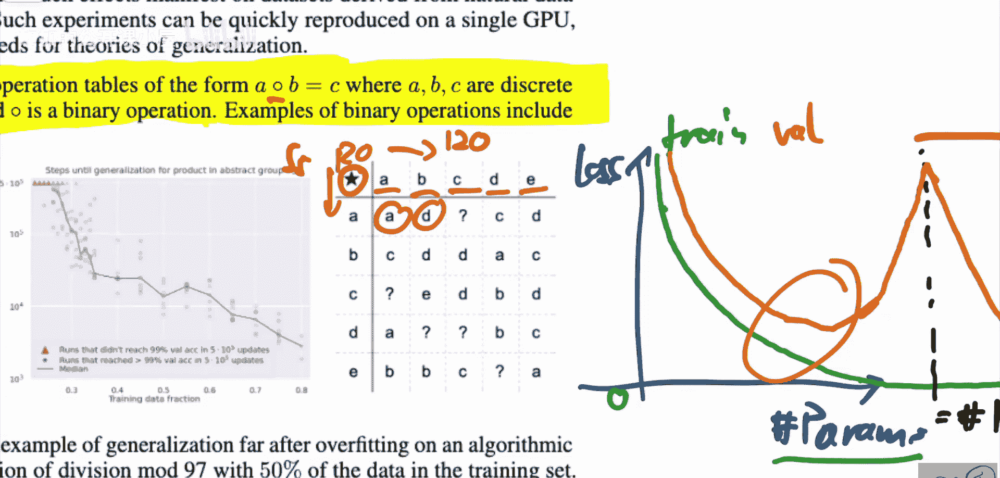

## 总结

本节课中，我们一起学习了OpenAI论文中提出的“Grokking”现象。我们了解到，神经网络在小型算法数据集上训练时，会先经历一个漫长的过拟合阶段，随后在持续训练极长时间后突然获得完美的泛化能力。我们将此现象与经典的“双下降”现象联系起来，后者描述了模型复杂度与泛化能力的非单调关系，而Grokking可以视为其在训练时间维度上的体现。最后，我们介绍了论文中用于验证该现象的合成数据集——二元运算表，特别是S5排列群运算表。这项研究揭示了深度学习优化过程中一个反直觉但有趣的特征，为理解模型如何从记忆转向泛化提供了新的视角。