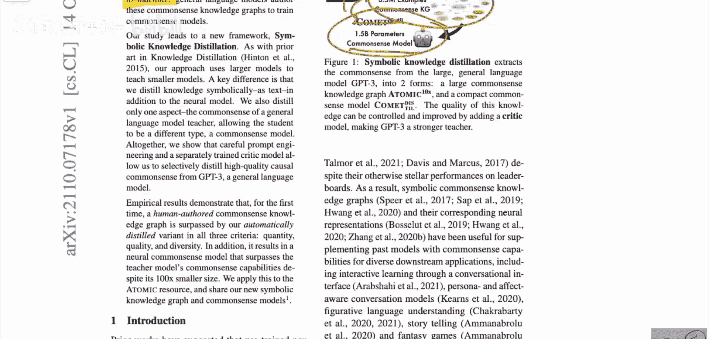
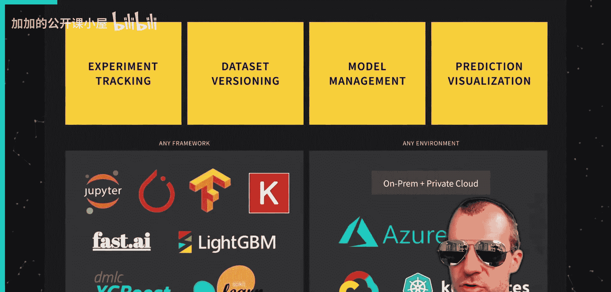
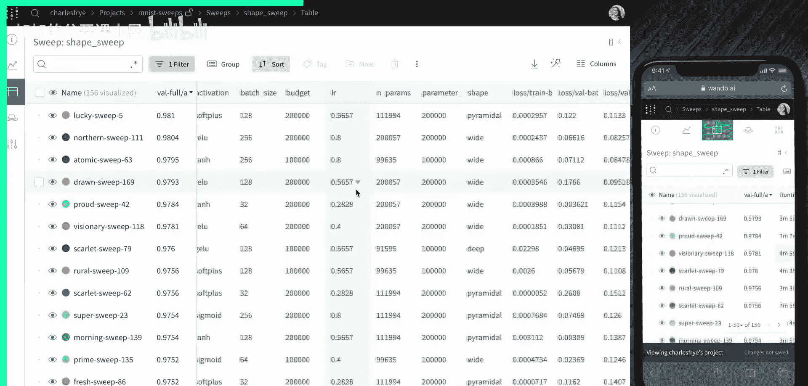
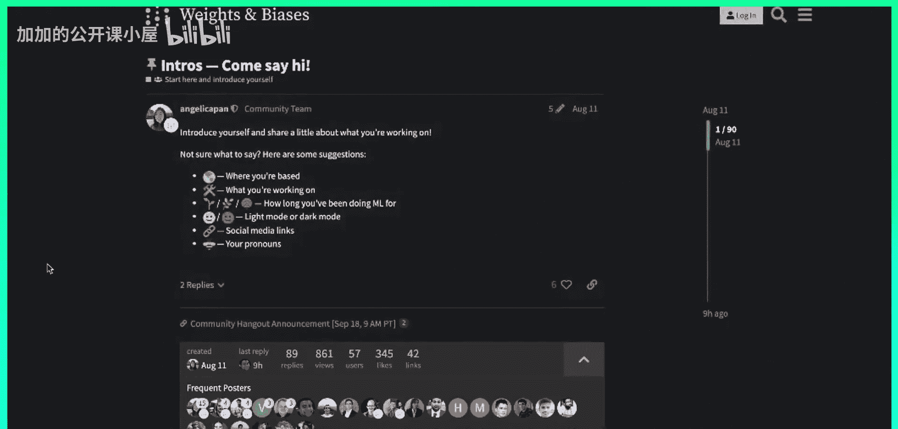
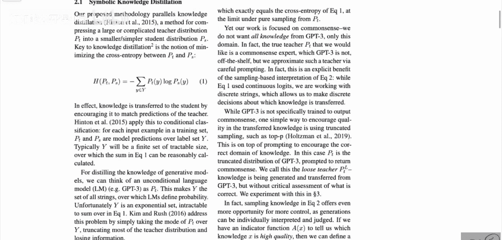

# 053：解析

在本节课中，我们将学习一篇名为《符号知识蒸馏：从通用语言模型到常识模型》的论文。这篇论文由华盛顿大学和艾伦人工智能研究所的Peter West等人撰写，提出了一种从大型语言模型中自动提取符号知识，并用于训练更小、更专业的常识推理模型的新方法。

## 概述

传统上，构建常识知识库需要大量人工标注，成本高昂。本文提出了一种新范式：**从机器到语料库再到机器**。具体来说，他们利用GPT-3这样的大型语言模型自动生成一个庞大的符号知识语料库，然后用这个语料库训练一个专门的常识模型。令人惊讶的是，最终得到的“学生”模型在某些方面甚至能超越生成语料的“教师”模型（GPT-3）以及基于人工标注数据训练的基线模型。

上一节我们介绍了论文的核心思想，本节中我们来看看任务的具体定义。

## 任务定义：常识推理三元组

论文的核心任务是生成**常识推理三元组**。每个三元组包含三个部分：

1.  **事件**：描述一个人或两个人所处的某种情境。例如：“X开始跑步”。
2.  **关系**：一个预定义的、表示因果或心理状态的常识关系。论文中使用了7种关系，例如“效果”或“反应”。
3.  **推断**：基于给定事件和关系得出的常识性结论。例如，对于事件“X开始跑步”和关系“效果”，一个可能的推断是“X变得健康”。

用公式表示一个三元组为：`(事件, 关系, 推断)`。

以下是一些来自论文的例子，帮助我们理解这个结构：

*   **事件**: X开始跑步
    **关系**: 效果
    **推断**: X变得健康
*   **事件**: X不受欢迎
    **关系**: 反应
    **推断**: X感到孤独

这个任务的关键在于，推断答案并非唯一，也非严格的逻辑推导，而是基于人类常识的合理推测。

## 基线方法与目标

在介绍新方法之前，我们需要了解现有的基线。

*   **ATOMIC-2020**：这是一个由人工标注构建的大规模常识知识数据集，包含了大量`(事件, 关系, 推断)`三元组。
*   **COMET-2020**：这是一个基于ATOMIC-2020数据集训练的深度学习模型。给定一个事件和关系，它可以预测出可能的推断。这是当前基于人工数据的**最佳模型**。

本文的目标是超越这些基线：
1.  自动生成一个比ATOMIC-2020规模更大、质量相当的语料库，称为**ATOMIC-10X**（规模约为10倍）。
2.  用这个新语料库训练一个模型，称为**COMET-DISTILL**，使其性能超越基于人工数据训练的COMET-2020模型。

上一节我们明确了任务和要超越的目标，本节中我们来看看论文提出的创新方法流程。

## 方法流程：从机器到语料库再到机器

论文的方法主要分为三个阶段，构成了“从机器到语料库再到机器”的范式。

### 阶段一：使用GPT-3生成初始语料库

首先，研究者利用**GPT-3**作为“教师模型”。他们设计了一系列提示（prompts），让GPT-3为大量种子事件生成可能的`(事件, 关系, 推断)`三元组。这样就得到了一个庞大的、由机器生成的初始语料库。

### 阶段二：对生成语料进行过滤与精炼

直接生成的语料质量参差不齐。因此，第二阶段的核心是**过滤**。他们巧妙地引入了少量**人工标注数据**作为“种子”或“指南”。通过训练一个分类器来评估机器生成的三元组的质量，并过滤掉低质量的数据，从而提升语料库的整体质量。这个过程是提升最终模型性能的关键。

### 阶段三：训练常识模型（知识蒸馏）

最后，使用过滤后的高质量机器语料库（ATOMIC-10X）来训练一个更小、更高效的模型，即**COMET-DISTILL**。这个过程类似于知识蒸馏：大型、通用的GPT-3（教师）的知识被“蒸馏”到了小型、专门的COMET-DISTILL（学生）模型中。

以下是整个流程的简要步骤列表：
1.  **提示生成**：设计提示，引导GPT-3生成三元组。
2.  **质量过滤**：利用少量人工数据训练过滤器，筛选高质量三元组，形成ATOMIC-10X语料库。
3.  **模型训练**：使用ATOMIC-10X训练COMET-DISTILL模型。

## 核心发现与意义

论文最引人注目的发现是：**经过适当过滤后，由机器生成的语料库（ATOMIC-10X）以及在此基础上训练的模型（COMET-DISTILL），在多项评测中均超越了基于纯人工数据（ATOMIC-2020）训练的基线模型（COMET-2020）**。

这意味着：
1.  **降低依赖**：减少了对昂贵、耗时的人工标注的依赖。
2.  **超越教师**：“学生”模型通过“蒸馏”和“过滤”过程，能够融合并优化“教师”模型的知识，甚至实现超越。
3.  **新范式潜力**：这种“从机器到语料库再到机器”的范式具有广泛的应用潜力，可推广到其他需要构建结构化知识或专业模型的自然语言处理任务中。

## 总结

本节课中我们一起学习了《符号知识蒸馏》这篇论文。我们了解了如何利用GPT-3自动生成常识知识三元组，并通过引入少量人工指导进行过滤，最终训练出性能卓越的专用常识推理模型。这项工作展示了大型语言模型作为知识源泉的潜力，以及通过“蒸馏”和“精炼”过程构建高质量、低成本专业模型的有效路径。