# 055：自回归扩散模型

在本节课中，我们将学习由Google Research的Emil Hogeboum等人提出的自回归扩散模型。这篇论文提出了一种新型的自回归模型，其核心特点是允许变量以任意顺序进行解码，这与用于生成模型的扩散模型有相似之处。我们将探讨其原理、优势以及实际应用效果。

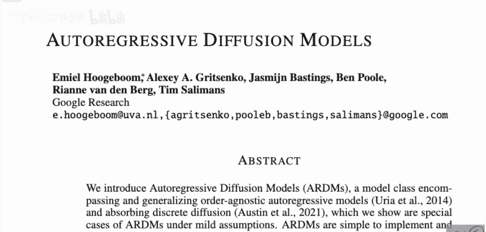

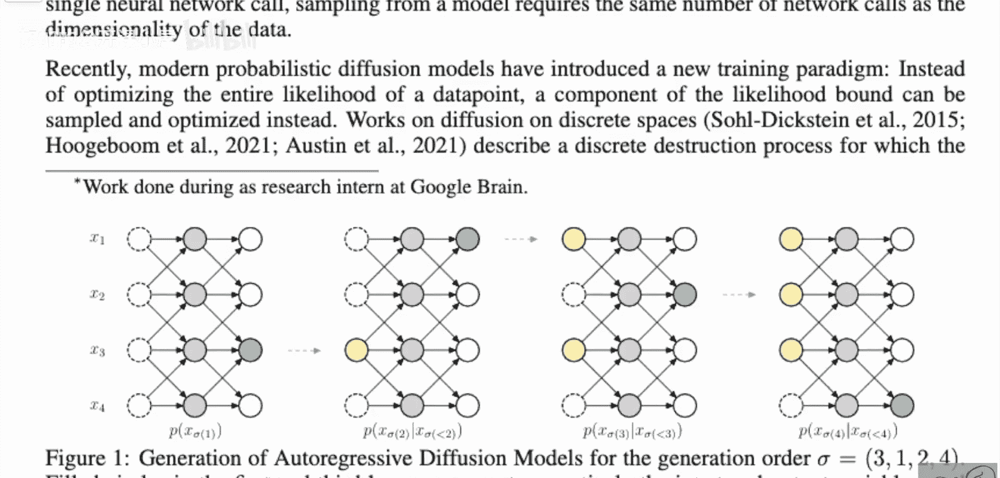

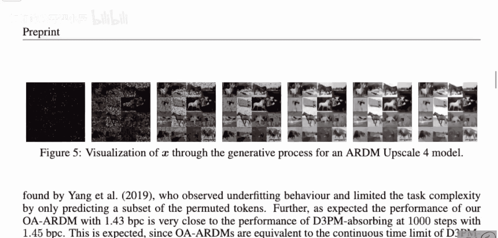

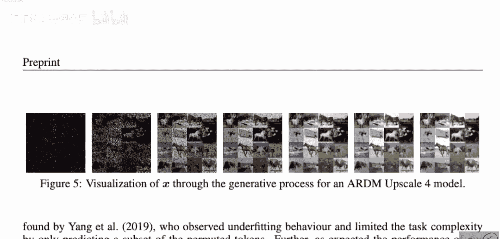

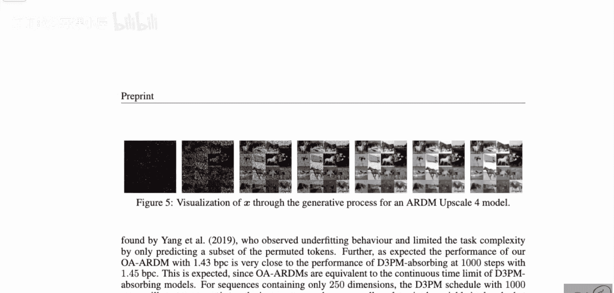

## 模型核心思想

上一节我们介绍了论文的基本目标，本节中我们来看看其核心思想。传统的自回归模型（如LSTM、GPT）在生成序列（如文本或图像像素）时，必须遵循一个固定的顺序，例如从左到右。自回归扩散模型则打破了这一限制。

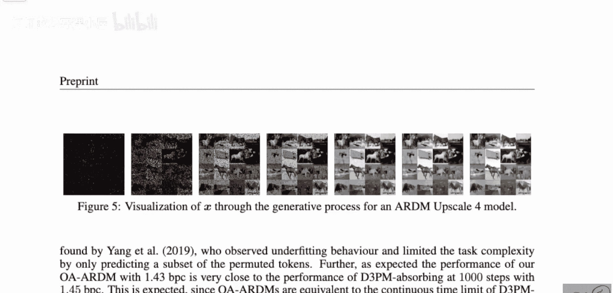

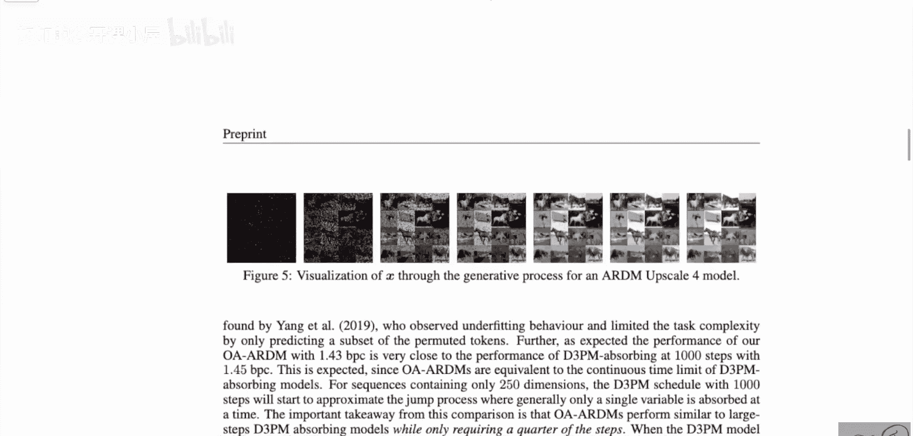

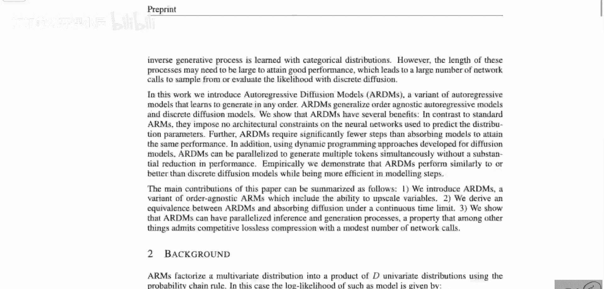

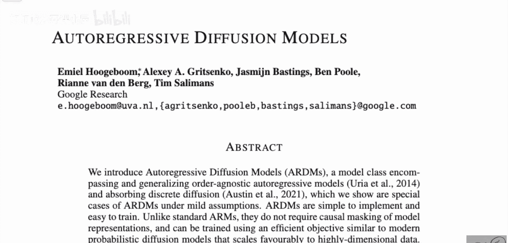

该模型允许在生成过程中以任意顺序选择下一个要解码的变量。这意味着，对于一张图像，模型可以先预测中间的一个像素，再预测边角的像素，顺序完全灵活。这种灵活性源于其特殊的训练目标，使得模型在任意解码顺序下都能有效工作。

以下是其核心运作方式的类比：
*   **传统自回归模型**：像按顺序填空，必须从第一个空开始，一个接一个。
*   **自回归扩散模型**：像玩数独，你可以选择先填写最有把握的那个格子，然后再解决其他部分。

## 与传统模型的对比

理解了核心思想后，我们将其与传统方法进行对比。传统的生成对抗网络（GANs）一次性生成整个样本（如图片），而自回归模型则按固定顺序逐步生成。

自回归扩散模型则提供了一种折中方案：它逐步生成（自回归特性），但顺序是任意的。此外，论文还引入了技术，允许一次解码多个变量，从而在需要时能显著加快生成速度。

以下是几种生成方式的直观对比：
1.  **GANs**：一次性输出完整图像。
2.  **传统自回归模型（如图像GPT）**：从左上角开始，严格按行扫描顺序逐个生成像素。
3.  **自回归扩散模型**：可以按任何顺序生成像素，甚至可以一次生成多个像素。

## 模型架构与工作原理

现在，我们来深入看看模型的具体架构和工作原理。模型的核心是一个神经网络，它在每一步都对整个样本的所有变量预测一个概率分布。

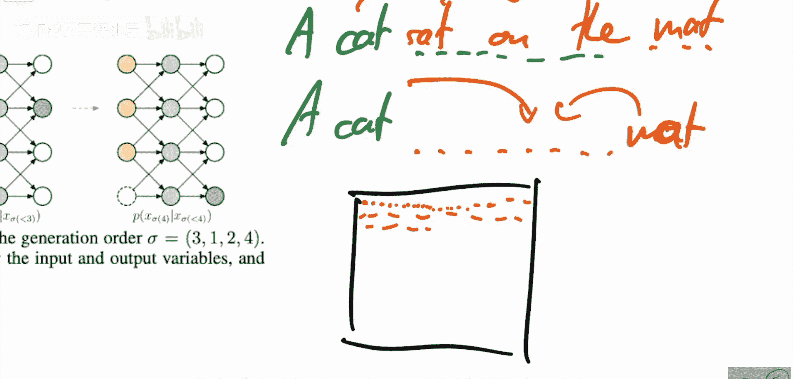

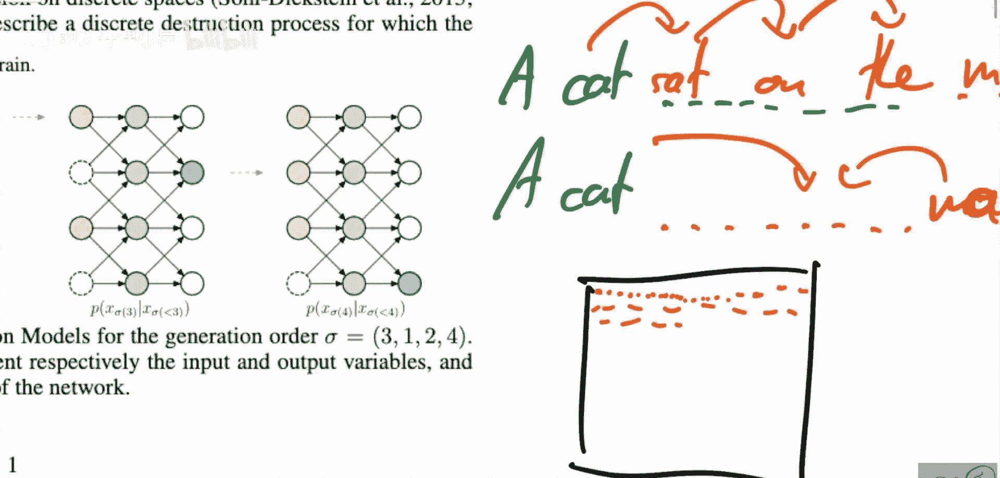

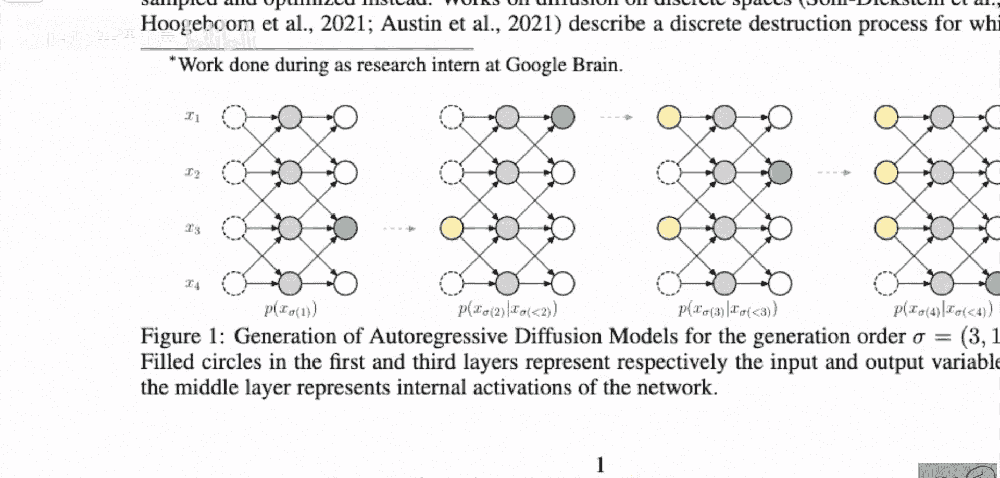

具体过程如下：
1.  开始时，所有变量都处于“未解码”状态（可视为被掩码）。
2.  神经网络接收当前状态（已解码和未解码变量的混合），并为**每一个**变量输出一个预测分布（例如，对于像素，是颜色的分类分布）。
3.  根据预定的策略（可以是预先设定的排列顺序，也可以是动态选择），从所有未解码的变量中选择一个或多个。
4.  从步骤2中对应变量的预测分布中进行采样（或取最可能的值），填充这些被选中的变量。
5.  更新样本状态，将新解码的变量值输入，重复步骤2-4，直到所有变量都被解码。

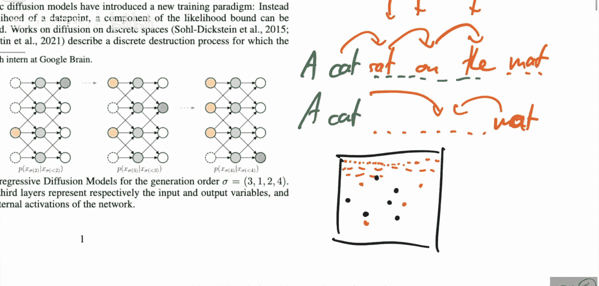

这个过程在数学上可以描述为：给定一个样本 `x` 和一个解码顺序排列 `σ`，模型学习预测在已知部分变量 `x_σ(<t)` 的条件下，下一个变量 `x_σ(t)` 的分布 `p(x_σ(t) | x_σ(<t))`。关键在于，同一个神经网络 `f_θ` 被用于所有解码步骤。

```python
# 伪代码示意核心循环
def generate_sample(model, initial_mask):
    sample = initial_mask # 初始为全掩码状态
    while not all_decoded(sample):
        # 神经网络为所有位置预测分布
        distributions = model(sample)
        # 选择要解码的位置（可按任意策略）
        positions_to_decode = select_positions(sample)
        # 从预测分布中采样值并填充
        for pos in positions_to_decode:
            sample[pos] = sample_from(distributions[pos])
    return sample
```

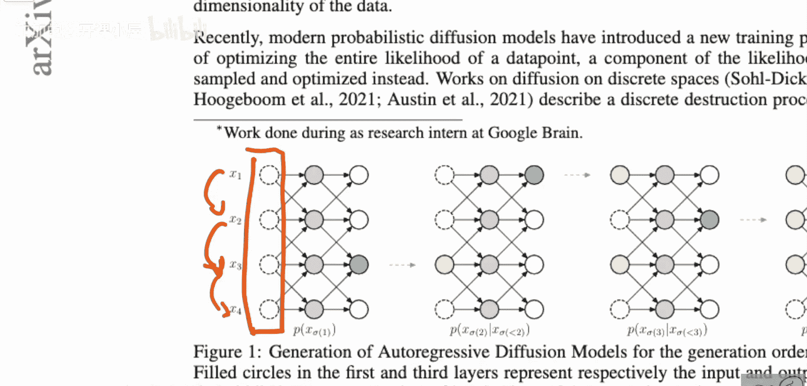

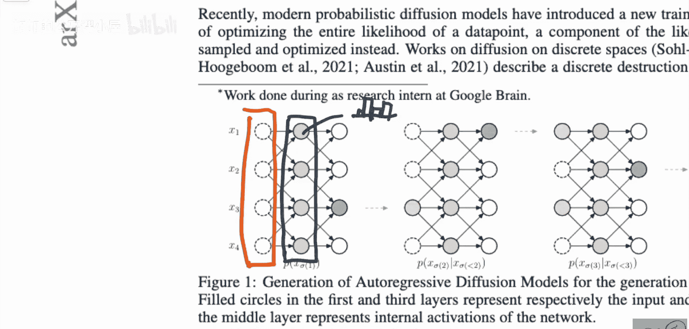

## 与BERT和扩散模型的联系

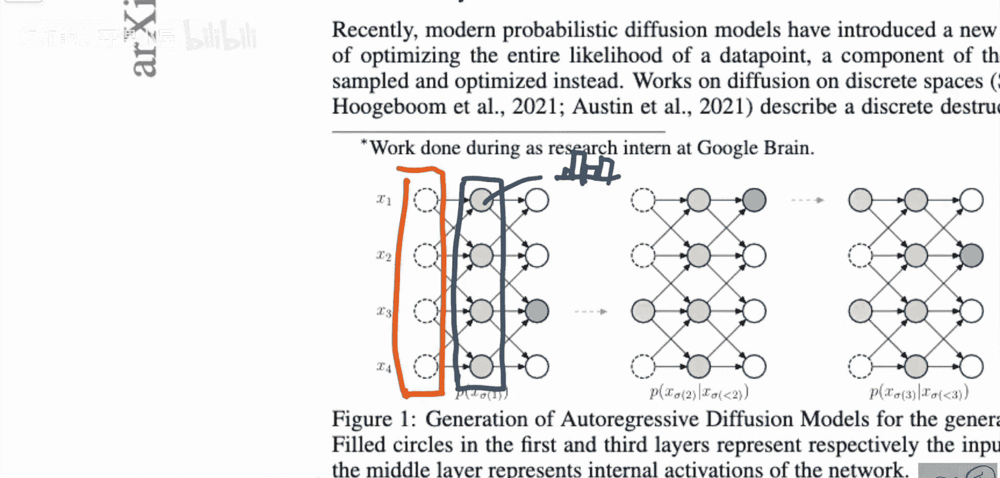

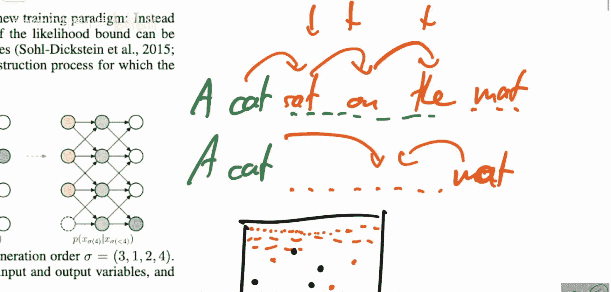

如果你觉得这个模型有些眼熟，那么你的直觉是对的。它的机制与BERT的掩码语言建模（Masked Language Modeling）任务非常相似。

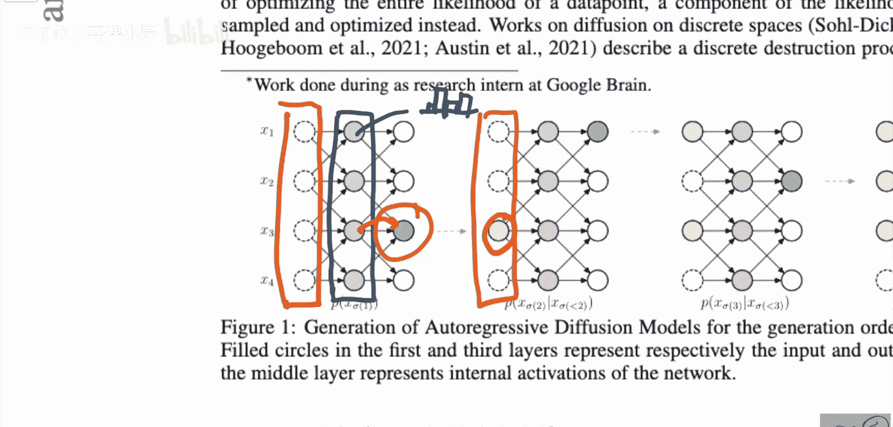

在BERT中，我们随机掩码句子中的一些词，然后让模型同时预测所有被掩码的词。自回归扩散模型可以看作是**将这个过程序列化**：每次只预测（解码）一个或几个被掩码的变量，然后用预测值更新输入，再重复这个过程。因此，它结合了自回归模型的序列生成特性和BERT式掩码预测的灵活性。

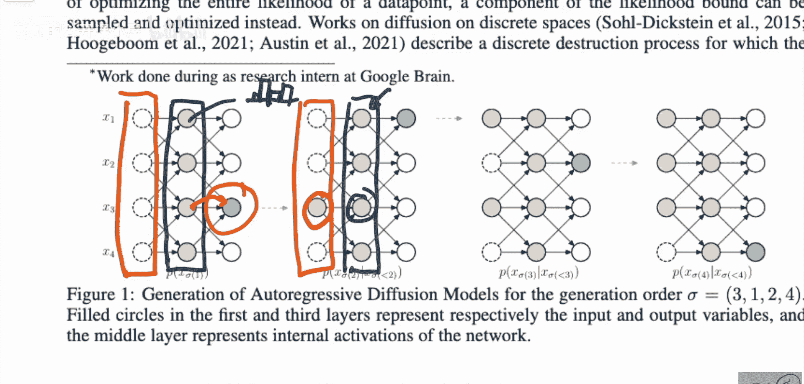

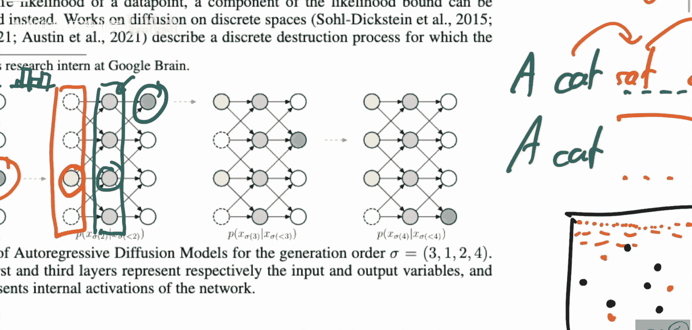

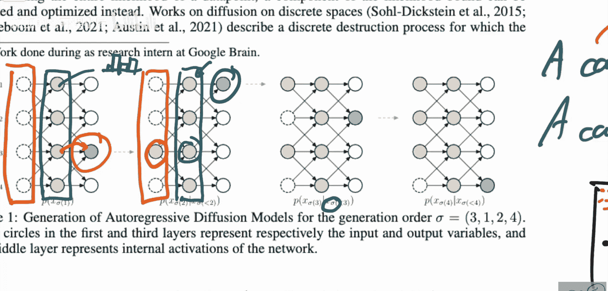

同时，论文也指出，该方法与吸收式离散扩散模型（Absorbing Discrete Diffusion）有紧密联系，并可以将其视为一种特例。这使得训练目标可以借鉴现代扩散模型的高效目标，并能很好地扩展到高维数据。

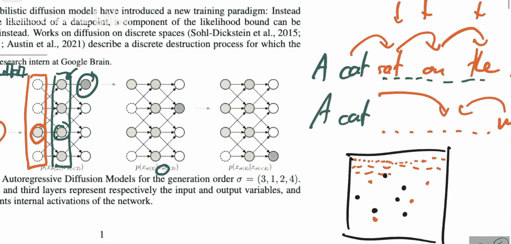

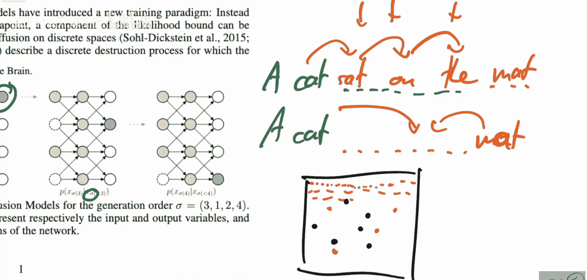

## 优势与应用

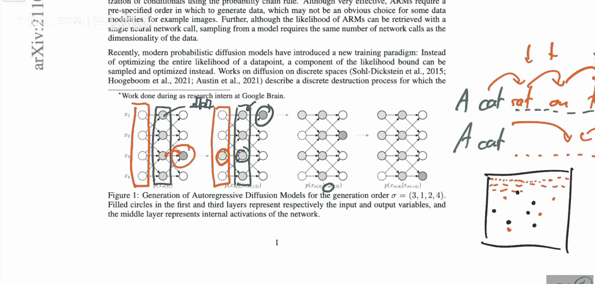

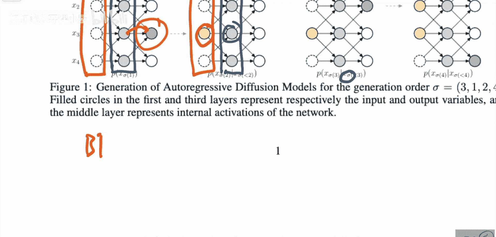

最后，我们总结一下自回归扩散模型的优势。论文指出，该模型实现简单、易于训练，因为它不需要像传统自回归模型那样进行因果掩码（causal masking）。在推理时，它支持并行生成，并可以根据给定的生成时间预算进行质量与速度的权衡。

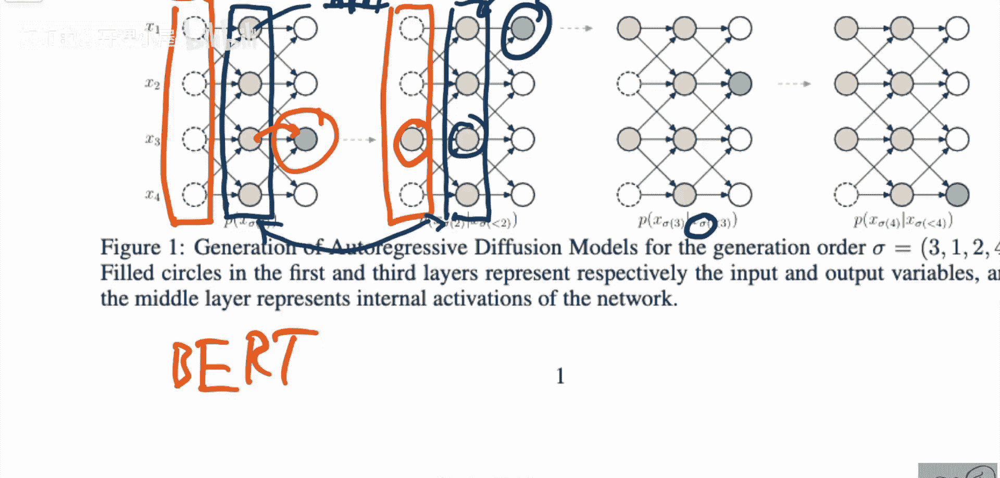

研究发现，在达到相同性能时，它比纯粹的离散扩散模型所需的生成步骤更少。此外，该框架还可用于无损数据压缩。

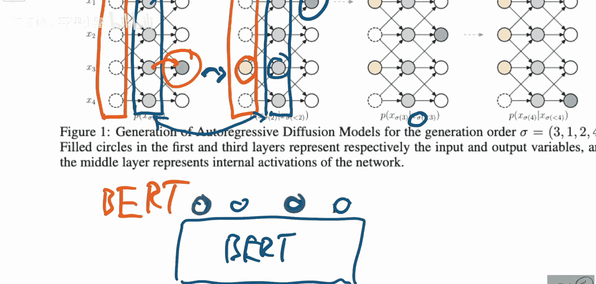

本节课中我们一起学习了自回归扩散模型。我们了解了它如何通过允许任意解码顺序来泛化和改进传统自回归模型，其工作机制类似于序列化的BERT掩码预测。这种设计带来了生成顺序的灵活性、训练的高效性，以及在生成速度与质量之间进行权衡的能力，为序列生成任务提供了一个新的强大工具。