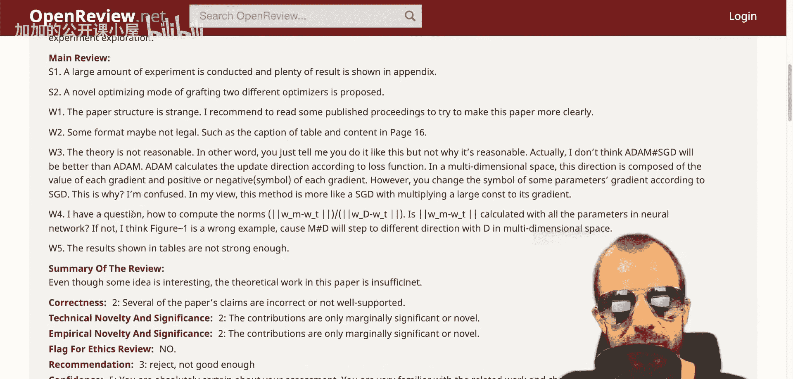
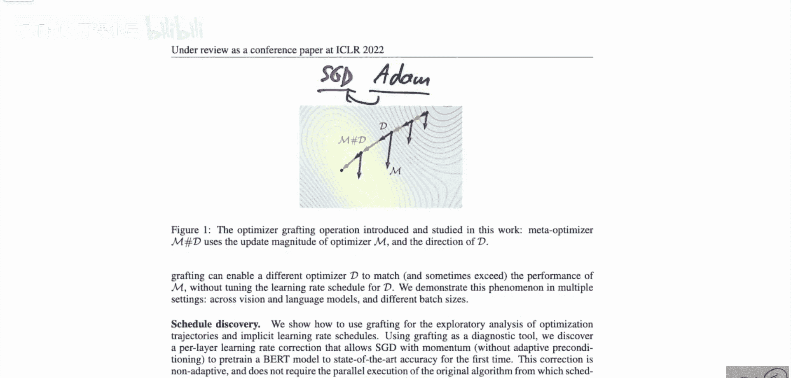

# 057：优化器调优的可迁移性 📚

在本节课中，我们将学习一篇名为《学习率嫁接：优化器调优的可迁移性》的机器学习研究论文。我们将探讨一种将一种优化器的学习率“嫁接”到另一种优化器上的技术，并分析其背后的原理与实验发现。

## 论文评审风波 💥

在深入论文内容之前，作者分享了一段关于该论文评审过程的插曲。作者在制作完本论文的视频解读后，查阅了其公开评审页面，并对其中一份评审意见感到惊讶。

以下是该评审意见的核心内容：

**优点1：** 论文进行了大量实验，并在附录中展示了丰富的结果。提出了一种新颖的、将不同优化器进行嫁接的优化模式。

**缺点1：** 论文结构奇怪。建议作者阅读一些已发表的会议论文，以使本文更清晰。

**缺点2：** 某些形式可能不合法。

**缺点3：** 理论不合理。论文没有提出理论，只是告诉读者这样做，但没有解释为何合理。

**缺点4：** 我有一个问题：如何计算这些范数？虽然论文中可能没有明确说明是L2范数，但如何计算向量的范数是清楚的。如果图1是个错误的例子，那么这就是个问题。

**缺点5：** 表格中展示的结果不够有力。

作者指出，这份评审意见存在一些矛盾之处（例如，既肯定了大量实验，又批评结果不够有力），并且部分批评显得主观或未基于论文内容（例如，“我不认为这会发生”）。评审者给自己的“熟悉程度”和“确定性”打了最高分，这与评审中出现的“我很困惑”和“我有一个问题”的表述形成了对比。作者借此表达了对某些不严谨评审过程的不满。

接下来，让我们正式进入论文内容的解读。

## 论文核心：学习率嫁接技术 🔬

上一节我们了解了论文的背景，本节中我们来看看论文提出的核心方法。

这篇论文由Naman Agarwal等人撰写（投稿ICLR时曾为匿名，内容与另一篇已公开论文高度相似），研究了一种称为“学习率嫁接”的技术。所谓“嫁接”，是指将一个优化器的学习率转移到另一个优化器上。

为了理解这个概念，我们可以参考论文中的示意图。想象我们有两个不同的优化器，例如**SGD（随机梯度下降）** 和 **Adam**。在标准流程中，每个优化器都会同时决定参数更新的“方向”和“步长”（即学习率）。



学习率嫁接的做法是：
1.  让一个优化器（如SGD）决定更新的**方向**。
2.  让另一个优化器（如Adam）决定更新的**步长**（学习率）。
3.  将两者结合，沿着第一个优化器指出的方向，按照第二个优化器给出的步长进行更新。

用伪代码可以简要描述为：
```python
# 假设有两个优化器 optimizer_A 和 optimizer_B
direction = optimizer_A.compute_update(gradients)  # A决定方向
step_size = optimizer_B.get_learning_rate()        # B决定步长
final_update = direction * step_size               # 结合得到最终更新量
```

这种方法的核心效果是，它将一个优化器所隐含的**学习率调度策略**转移到了另一个优化器上。


## 研究发现与意义 🧪

上一节我们介绍了学习率嫁接的基本原理，本节中我们来看看这种方法带来了哪些有趣的发现。

论文通过大量实验，得出了以下几个关键结论：

以下是论文的主要发现：
1.  **揭示优化器差异的本质**：研究发现，许多优化器（如Adam和SGD）之间的性能差异，很大程度上可能源于它们各自诱导出的**不同学习率调度策略**，而非更新方向本身的根本不同。当把Adam的学习率调度“嫁接”给SGD后，SGD的性能可以得到显著提升。
2.  **实现调优知识迁移**：这种方法允许将在一个优化器上精心调整好的学习率策略，迁移到另一个优化器上，从而可能减少对新优化器进行繁琐调参的工作量。
3.  **提供新的分析工具**：学习率嫁接作为一种工具，可以帮助研究人员剥离和单独研究“更新方向”和“步长策略”对训练动态和最终性能的各自影响。

## 总结 📝

本节课中我们一起学习了《学习率嫁接：优化器调优的可迁移性》这篇论文。我们首先了解了一段关于论文评审的轶事，然后重点探讨了“学习率嫁接”这一核心思想——即将一个优化器的学习率（步长）与另一个优化器的更新方向相结合的技术。



这种方法不仅是一种新的优化技巧，更重要的是它提供了一个独特的视角，帮助我们理解不同优化器之间性能差异的根源可能在于其隐含的学习率调度。论文的实验表明，通过这种嫁接，有时可以显著提升基础优化器（如SGD）的性能，这挑战了我们对某些高级优化器优势来源的传统认知。这项研究为优化器的理解和设计提供了新的思路。