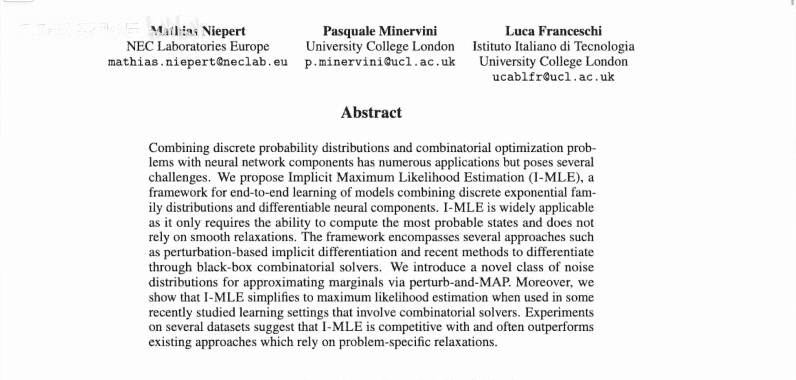
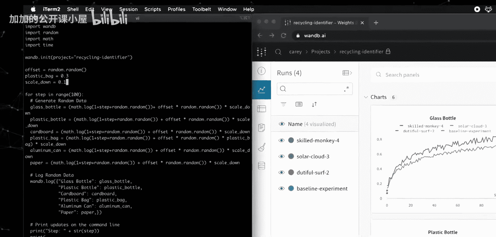
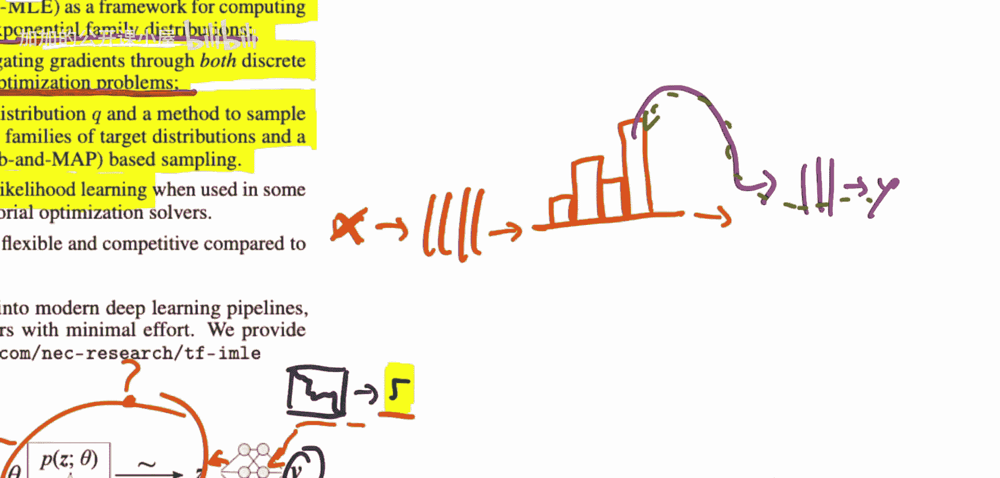

# 058：通过离散指数族分布进行反向传播（论文解读）📚

## 概述

在本节课中，我们将学习一篇名为《隐式最大似然估计：通过离散指数族分布进行反向传播》的论文。该论文由Mataniard、Pascal Minervinni和Lucca Francessky撰写，旨在解决神经网络中集成离散层（如组合优化求解器）时的梯度反向传播难题。我们将探讨其核心方法、技术贡献，并理解如何将其应用于实际任务。

## 论文背景与问题设定

上一节我们介绍了课程概述，本节中我们来看看论文试图解决的具体问题。

该论文的核心目标是设计一种能够处理神经网络中离散操作（如最短路径算法或整数线性规划求解器）的层，并使其能够进行有效的梯度反向传播。一个典型应用场景是从连续输入（如图像）中提取信息，输入到一个离散求解器中，最终输出一个连续或离散的预测结果。

例如，给定一张游戏地图（如《魔兽争霸》地图）的图像，任务可能是规划一条从左上角到右下角的最短路径。输入是连续的图像像素，而中间的求解过程是离散的最短路径算法，最终输出可能是路径长度或路径本身。如何将损失梯度从输出反向传播回负责图像理解的神经网络部分，是本文要解决的关键挑战。

## 现有方法与挑战

在深入新方法之前，我们先回顾一下已有的解决方案及其局限性。

已有方法如**直通估计器**（Straight-Through Estimator）尝试解决此问题，但其效果并不稳定，有时会失败。其他方法如**得分匹配**（Score Matching）也存在类似限制。这些方法在处理复杂的离散优化层时，往往无法提供可靠且高效的梯度估计。

## 隐式最大似然估计（IMLE）框架

上一节我们讨论了现有方法的不足，本节中我们将深入探讨本文提出的**隐式最大似然估计**框架。

论文提出将中间的离散过程建模为一个**离散指数族分布**。该框架的核心贡献是提供了一种计算此类分布参数梯度的通用方法。IMLE框架需要两个组成部分：
1.  一个目标分布族 **Q**。
2.  一种从复杂离散分布中采样的方法。

作者为此提出了两种目标分布族，以及一种基于**Gumbel-Max**技巧的噪声分布族用于采样。这使得整个系统（包括离散层）可以进行端到端的训练。

## 方法详解与公式描述

了解了IMLE框架的轮廓后，我们现在来看看其具体的数学描述和关键公式。

设离散层的输出为 **z**，它服从一个由参数 **θ** 定义的指数族分布 **P_θ(z)**。该分布的形式化描述如下：

**P_θ(z) ∝ exp(θ^T φ(z))**

其中，**φ(z)** 是充分统计量。IMLE的目标是最大化观测数据（或下游任务目标）的似然，通过优化参数 **θ** 来实现。其梯度估计的关键在于构建一个目标分布 **Q**，使得从 **Q** 中采样的期望与从 **P_θ** 中在真实数据下的期望相匹配。梯度可以通过以下形式的差异来近似：

**∇_θ L ≈ E_{z∼Q}[φ(z)] - E_{z∼P_θ}[φ(z)]**

通过巧妙地设计 **Q** 和采样过程，这个梯度可以被有效计算，从而实现通过离散层的反向传播。

## 实验评估与应用

理论框架需要实践验证，本节我们简要看看论文的实验结果。

作者在多个任务上评估了IMLE方法，包括组合优化和结构化预测任务。实验结果表明，与**直通估计器**等基线方法相比，IMLE在性能上更具优势，能够提供更稳定、更准确的梯度，从而带来更好的最终模型性能。此外，论文还指出，在某些特定设置下，IMLE可以简化为已有的显式最大似然学习方法，这表明其具有良好的通用性和包容性。

## 总结

本节课中，我们一起学习了《隐式最大似然估计：通过离散指数族分布进行反向传播》这篇论文。我们了解了在神经网络中集成离散优化层所面临的梯度传播挑战，回顾了现有方法的局限性，并深入探讨了IMLE这一新框架的核心思想、数学基础及其优势。该方法通过将离散过程建模为指数族分布，并设计特定的目标分布和采样策略，实现了对离散层参数的有效梯度估计，为在深度学习模型中无缝使用组合求解器等工具提供了有力的解决方案。