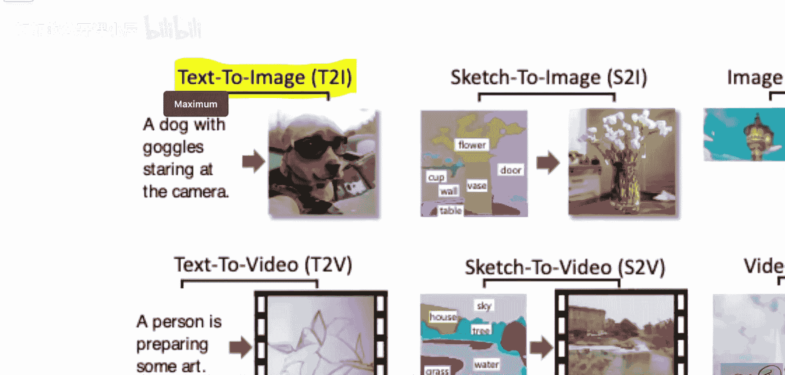
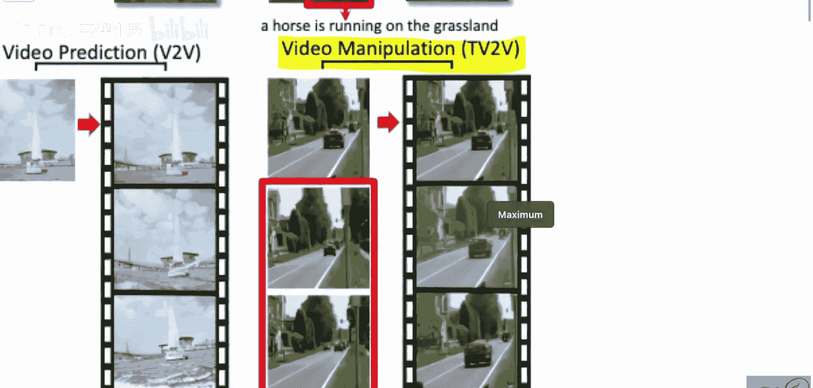
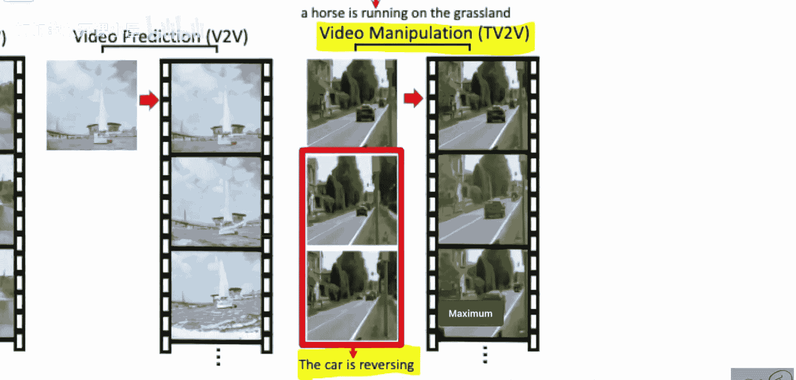
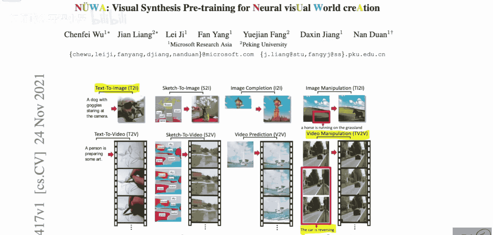
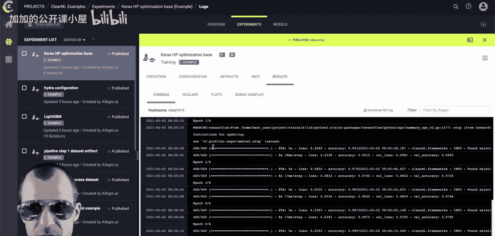
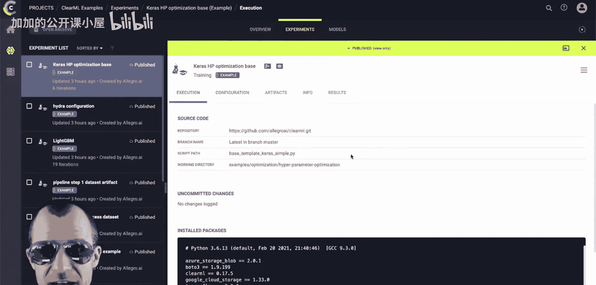
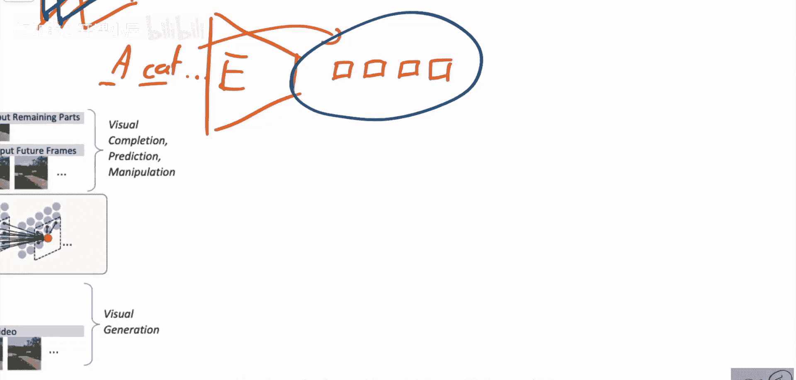

# 060：面向神经视觉世界生成的视觉合成预训练模型

在本节课中，我们将学习一篇由微软亚洲研究院和北京大学的研究者提出的论文。这篇论文介绍了一个名为NÜWA的模型，它能够支持多种视觉生成任务。我们将探讨其核心架构，特别是如何利用Transformer处理图像和视频这类大型数据点。

---

## 模型概述与任务范围

NÜWA模型旨在成为一个通用的视觉合成预训练模型。它能够支持多种生成任务，例如：
*   **文本生成图像**：输入一段文本描述，模型生成对应的图像。例如，输入“一只戴着护目镜的狗盯着摄像头”。
*   **视频操控**：根据文本指令修改视频内容。例如，将视频中“汽车向前行驶”改为“汽车正在倒车”。

除了文本引导的任务，模型也支持其他类型的输入，例如：
*   仅输入图像进行生成或编辑。
*   输入草图进行图像生成。
*   仅输入视频进行预测或补全。

因此，该模型的设计目标是通过统一的架构处理文本、图像、草图、视频等多种模态的输入和输出任务。

---

## 核心挑战与解决方案

上一节我们介绍了模型支持的任务范围，本节中我们来看看模型面临的核心技术挑战及其解决方案。

传统方法如Image GPT，将图像生成视为逐像素预测的语言建模任务。对于一个200x200的图像，需要建模长达40,000个像素的上下文，这已经超出了常规Transformer的处理能力。对于视频（多帧图像的堆叠），上下文长度会进一步爆炸式增长，使得直接应用Transformer进行像素级自回归生成变得不可行。

NÜWA的解决方案主要基于两点：
1.  **统一潜在空间编码**：将所有模态的输入数据（文本、图像、视频）编码到一个共同的、低维的潜在表示空间中。
2.  **局部注意力机制**：在这个压缩后的潜在空间中使用局部注意力进行建模，最终解码生成输出。

这种方法将高维的像素空间映射到低维的离散潜在空间，极大地降低了建模的复杂度。

---

## 模型架构详解

现在，让我们深入NÜWA模型的具体架构。下图展示了模型的整体流程：

模型的核心思想是使用编码器将各种输入数据转换到统一的3D潜在空间，然后通过一个基于Transformer的解码器在该空间中进行建模，最后解码生成目标输出。

### 输入编码：统一潜在表示

模型的第一步是为所有类型的输入构建一个共同的表示。目标是得到一个三维的“立方体”，其中每个元素都是一个嵌入向量。

以下是不同模态的编码方式：
*   **文本编码**：对于文本输入，编码过程相对简单。首先对文本进行分词，然后将每个词元（token）映射为一个嵌入向量。这样，文本自然地被表示为一系列离散的令牌序列，符合模型对潜在表示的要求。
*   **视觉编码**：对于图像或视频帧，需要使用视觉编码器（例如VQ-VAE）将其转换为离散的令牌网格。对于视频，会得到一系列这样的2D令牌网格，它们在时间维度上堆叠，共同形成一个3D的令牌立方体。

无论输入是文本、图像还是视频，最终都会被映射为这种3D的离散令牌表示，作为后续Transformer的输入。

### 核心：3D邻近注意力（3D Nearby Attention）

这是NÜWA模型的关键创新，用于在3D潜在空间中高效地进行自回归建模。

直接在全尺寸的3D令牌立方体上应用全局注意力计算量巨大。因此，论文提出了**3D邻近注意力机制**。其核心思想是：在预测当前位置的令牌时，模型只关注其空间和时间维度上最邻近的已生成令牌，而不是关注所有历史令牌。

这可以类比为在阅读时，你更关注当前句子周围的词汇，而不是整篇文章开头的内容。通过限制注意力范围，模型能够有效处理长序列，同时捕捉到视觉内容在空间和时间上的局部连续性。

### 训练与多任务学习

模型通过预测被掩盖的令牌进行预训练，类似于BERT的掩码语言建模任务，但这里是在3D令牌空间中进行。通过在不同任务（文本到图像、图像补全、视频预测等）的数据上进行预训练，模型学习到了一个通用的视觉-语言表示。

在具体执行下游任务时，模型会根据任务类型配置不同的编码器和解码器。例如，对于“文本到图像”任务，文本编码器将文本转换为令牌，而图像解码器负责将这些令牌解码为像素图像。这种设计使得一个统一的骨干网络能够适配多种生成任务。

---

## 总结

本节课中我们一起学习了NÜWA模型。这是一个旨在统一多种视觉合成任务的预训练模型。它通过将不同模态的数据编码到统一的3D离散潜在空间，并利用3D邻近注意力机制进行高效建模，从而解决了处理高维图像和视频数据时上下文过长的问题。虽然论文在某些实现细节上表述不够清晰，且代码尚未公开，但其提出的统一框架为视觉生成领域的发展提供了有价值的思路。