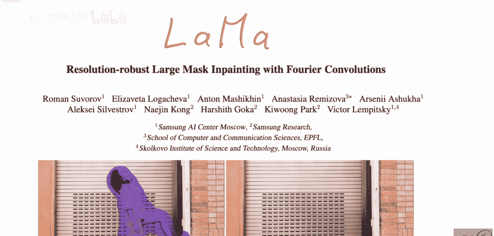
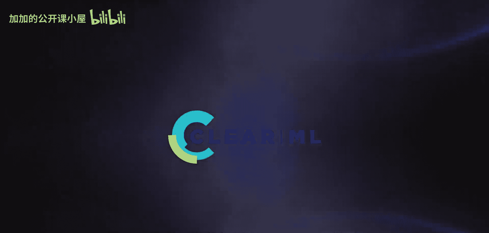
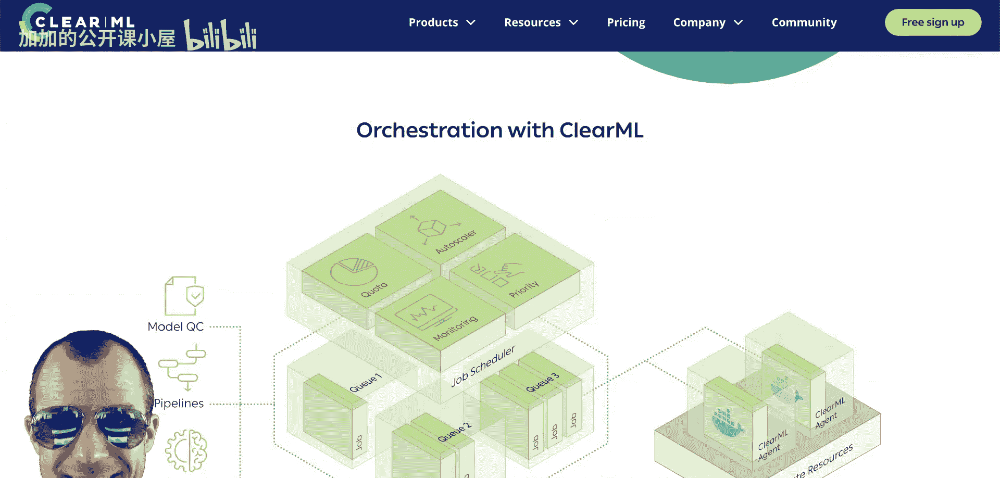
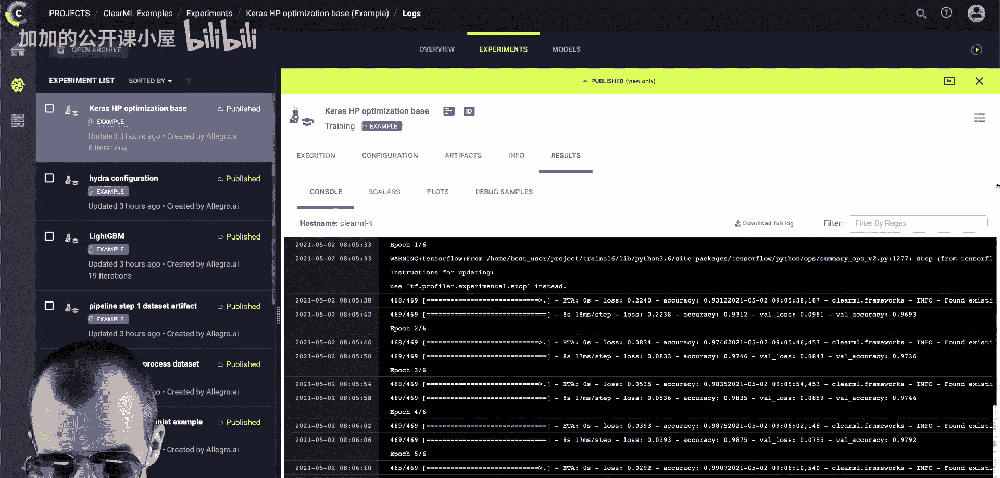
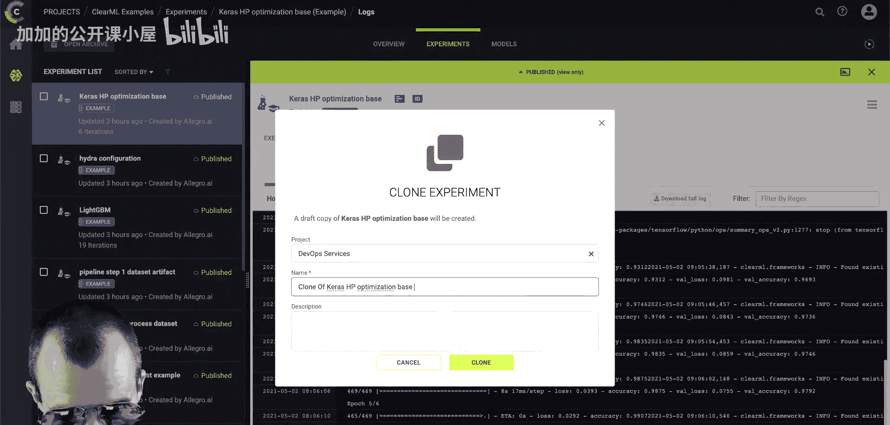
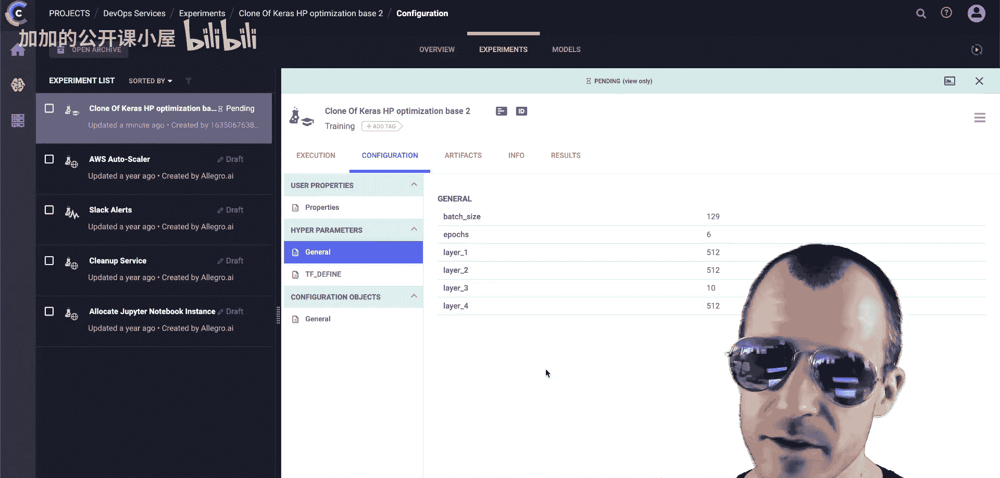
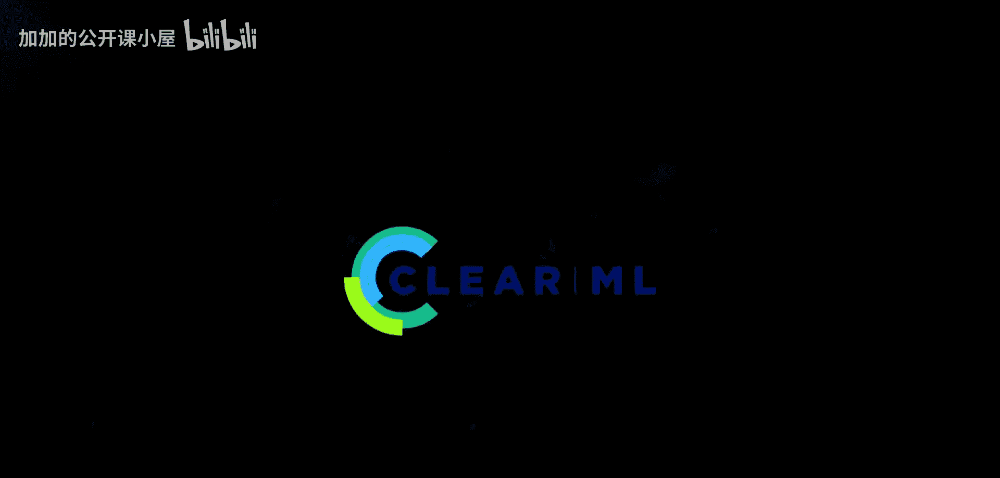
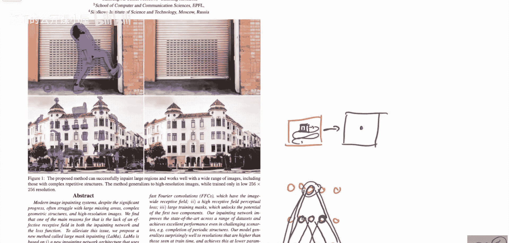

# 061：分辨率鲁棒的大掩模修复与傅里叶卷积（含作者访谈）

在本节课中，我们将学习一篇名为“分辨率鲁棒的大掩模修复与傅里叶卷积”的论文，该模型也被称为LaMa。它由三星AI中心、三星研究院、EPFL和斯科尔科沃科学技术研究所共同开发。我们将首先简要介绍论文的核心思想，然后探讨其技术细节。特别的是，本教程的后半部分将包含与论文第一作者的深入对话，以便更全面地理解这项工作。





## 模型能力展示

首先，我们来了解一下这个模型能做什么。模型能够接收一张图片，并在其上绘制一个掩模（即需要修复的区域），然后自动补全该区域。模型看不到掩模本身，它只看到未被掩模覆盖的部分，并被要求补全缺失的区域。








如上图所示，模型能够非常干净地填充这些区域。特别是，即使面对非常大的缺失区域，图中那些有规律的结构（例如门洞）也能被很好地保留和延续。这对于图像修复系统来说通常是非常困难的。

该研究有专门的项目网站，所有代码都已开源。网站上还提供了动态演示，可以更直观地看到模型的效果，尤其是处理图片中重复结构（如网格或线条）的能力。这些重复结构对于传统的基于卷积神经网络的修复模型来说尤其具有挑战性，因为卷积操作通常只考虑非常局部的上下文信息，而这些模式需要全局的上下文理解。这正是本篇论文要解决的核心问题。

此外，基于此模型已经开发了一些第三方应用。虽然这些应用并非作者本人开发，但它们展示了模型的实际应用潜力。代码也可以在Hugging Face Spaces和作者提供的Colab笔记本中找到。这些工具允许你上传图片，绘制掩模，并观察模型的修复效果。





## 核心思想：傅里叶卷积

上一节我们看到了模型强大的修复能力，本节中我们来看看其背后的核心创新点：**傅里叶卷积**。

该论文的核心思想正是这些傅里叶卷积，它们使得模型能够从一开始就考虑到图像的全局上下文信息。

那么，传统卷积神经网络的问题在哪里？问题通常在于卷积操作本身。在一个卷积操作中，对于图片上的一个特定点，卷积核只会考虑其**局部邻域**的信息。例如，一个3x3的卷积核，对于一个给定的像素点，它只会查看其上、下、左、右以及对角线方向共8个相邻像素加上自身。

**代码示例：标准卷积的局部性**
```python
# 伪代码示意：标准卷积操作聚焦于局部窗口
output[x, y] = sum( kernel[i, j] * input[x+i, y+j] for i in [-1,0,1], j in [-1,0,1] )
```

然后，这个卷积核会在整张图像上滑动，从而生成下一层的特征表示。那么，卷积神经网络是如何整合整张图像的信息的呢？答案是依靠**多层堆叠**。

通过多层卷积，每一层的神经元其感受野会逐渐增大。例如，第一层的一个神经元只能看到3x3的区域；第二层对应位置的神经元，由于接收了第一层3x3区域神经元的输出，其感受野就扩大到了5x5；随着层数加深，感受野会变得越来越大。

**公式描述：感受野的增长**
对于一个步长为1、卷积核大小为k的卷积层堆叠，第n层神经元的感受野大小可以近似表示为：
`RF_n = 1 + (k - 1) * n`

然而，正如我们之前所说，这需要很多层，需要网络的深度。特别是在图像修复应用中，我们通常需要的是**全局信息**。论文中处理的掩模通常非常大，对于一个只查看3x3像素邻域的卷积核来说，在修复区域的中心位置，可能连续好几层卷积都只能“看到”被掩模覆盖的像素，而完全无法获取掩模外部世界的任何信息。



如上图所示，在深色掩模区域中心，经过多层标准卷积后，有效信息可能仍然无法从外部传递进来。这就导致了修复效果不佳，尤其是对于大掩模和具有长程依赖性的结构（如规则纹理、长线条）。

傅里叶卷积的引入，正是为了打破这种局部性的限制，让网络在早期层就能建立全局连接，从而更有效地利用整张图像的上下文信息来完成修复任务。

## 总结


本节课中我们一起学习了LaMa模型，这是一个用于分辨率鲁棒的大掩模图像修复的先进方法。我们首先展示了模型在补全大面积缺失区域，特别是保留规则结构方面的卓越能力。然后，我们深入探讨了其核心技术——傅里叶卷积。我们了解到，传统卷积神经网络因局部感受野的限制，在处理大掩模修复时面临信息传递不足的挑战。而傅里叶卷积通过允许模型在特征层面进行全局交互，有效地解决了这一问题，使得模型能够更准确地理解和补全图像中缺失的部分，即使这些部分很大或需要长程的上下文信息。