# 062：基于文本引导扩散模型的逼真图像生成与编辑 🎨

在本节课中，我们将学习OpenAI发布的GLIDE模型。该模型是一种基于扩散模型的文本到图像生成系统，能够根据文本描述生成高度逼真的图像，并支持图像编辑功能，如修复和基于草图的编辑。

---

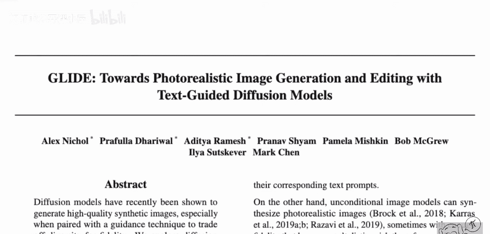

上一节我们概述了GLIDE的强大能力，本节中我们来深入了解一下其核心——扩散模型的基本原理。

扩散模型是一类不同于生成对抗网络或VQ-VAE的生成模型。其核心思想是通过一个逐步添加噪声（前向过程）和逐步去除噪声（反向过程）来学习数据分布。

**前向过程（加噪）**：从一张真实图像（如一只猫的图片）开始，逐步向其添加少量高斯噪声。经过足够多的步骤后，原始图像信息被完全破坏，最终得到一个纯噪声图像，其分布近似于标准正态分布。

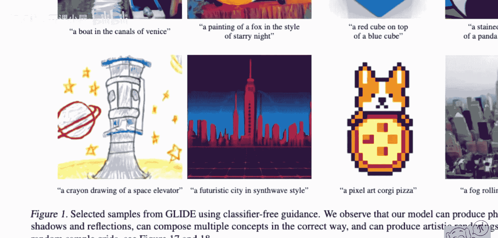

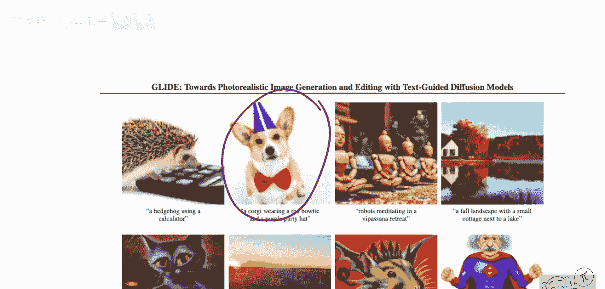

**反向过程（去噪）**：模型需要学习如何从加噪后的图像中预测并去除噪声，以恢复出更清晰的原始图像。由于每一步添加的噪声很小，模型理论上可以学会这个逆变换。

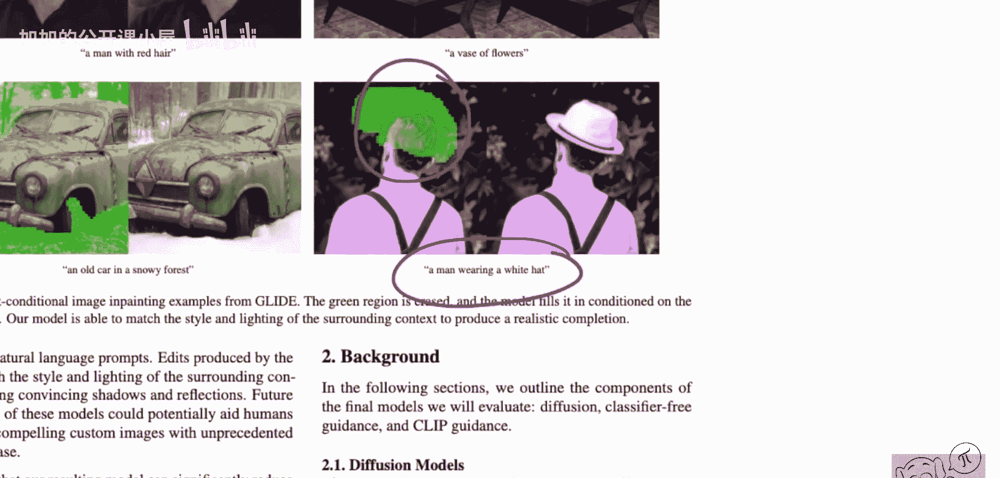

如果模型学会了从任意噪声步骤中预测更清晰的图像，那么我们就可以从纯噪声（标准正态分布采样）开始，让模型一步步“去噪”，最终生成一张全新的、清晰的图像。这就是扩散模型生成图像的基本流程。

---

理解了扩散模型的基础后，我们来看看GLIDE模型是如何将文本信息融入这个过程的。

GLIDE的核心创新在于使用文本信息来引导扩散模型的生成过程。模型在训练时，不仅接收带噪声的图像，还接收对应的文本描述。这样，模型在学习去噪的同时，也学会了将文本语义与视觉内容对齐。

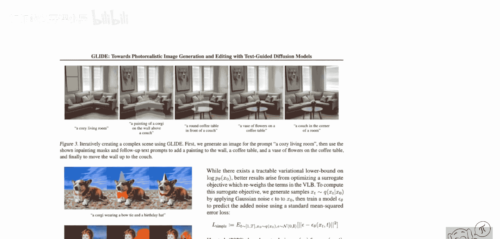

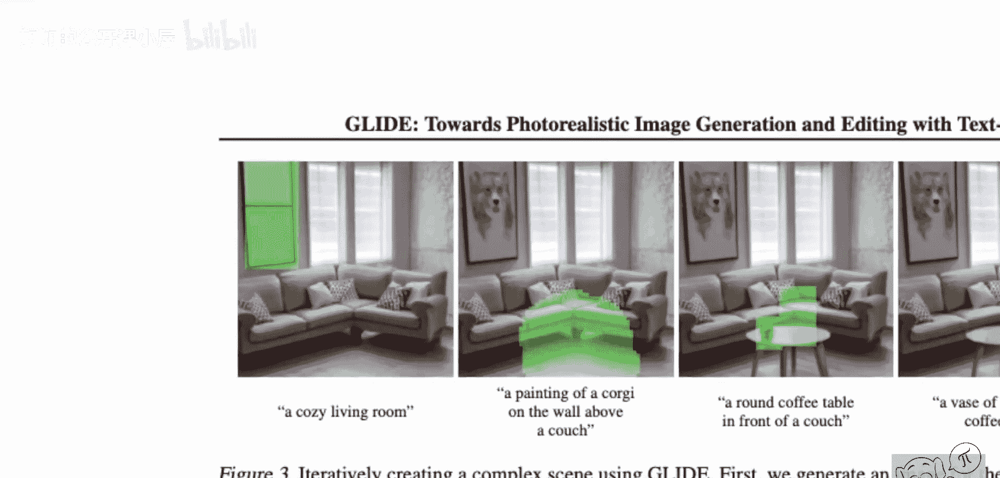

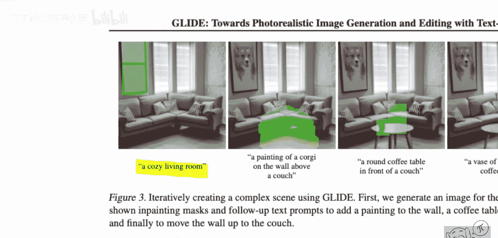

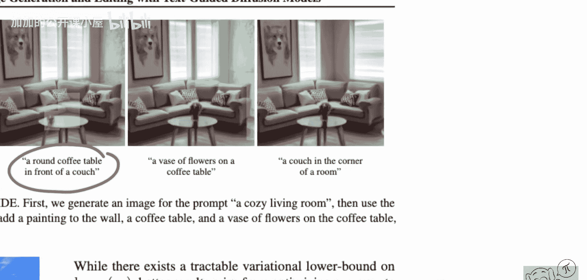

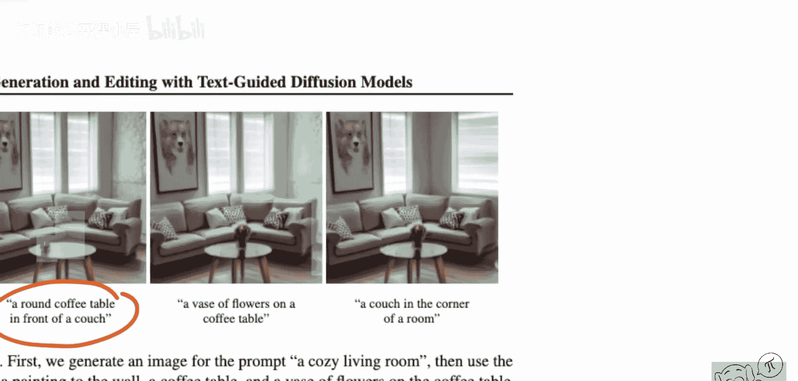

以下是模型架构的关键组成部分：

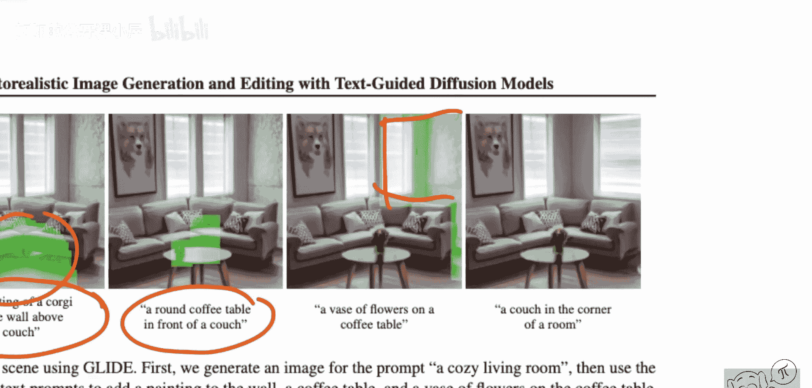

1.  **文本编码器**：使用一个Transformer模型将输入文本转换为一系列特征向量（文本嵌入）。
2.  **图像扩散主干**：一个U-Net结构的模型，负责执行去噪步骤。文本嵌入会通过交叉注意力（Cross-Attention）机制注入到U-Net的每一层中，指导图像生成的内容符合文本描述。

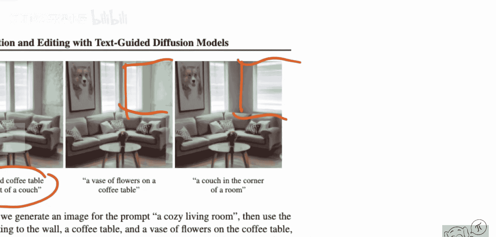

通过这种设计，在生成时，用户输入的文本提示词就能精确地控制最终输出图像的内容、风格和构图。

---

上一节我们介绍了GLIDE如何根据文本生成图像，本节中我们来看看它更强大的图像编辑功能。

GLIDE的扩散模型架构天然支持多种图像编辑任务，因为其生成过程是迭代的、条件可控的。研究人员在此基础上专门训练了用于编辑的模型变体。

以下是GLIDE支持的主要编辑功能：

*   **图像修复**：用户可以在图像上指定一个掩码区域，并给出描述该区域新内容的文本。模型将仅对掩码区域进行基于文本引导的生成，同时保持图像其他部分不变。
    *   **示例**：将一张照片中的窗户区域掩码，输入文本“一幅柯基犬的壁画”，模型会在窗户位置生成一幅柯基壁画。
*   **草图引导编辑**：除了文本和掩码，用户还可以提供简单的颜色草图。模型会综合文本、掩码区域和草图颜色信息进行生成，实现更精确的控制。
    *   **示例**：在天空区域绘制蓝色草图并输入文本“一朵云”，模型会在相应位置生成一朵符合草图形状和颜色的云朵。

这些功能使得GLIDE能够支持交互式的、渐进式的场景构建与编辑，用户可以通过多次操作逐步完善图像。

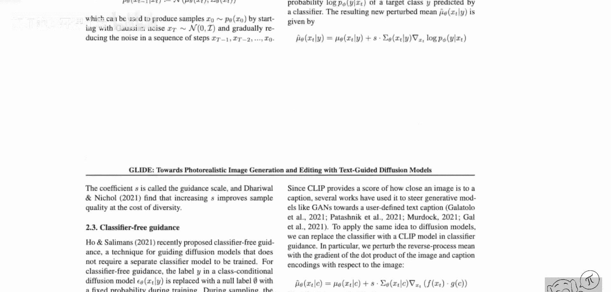

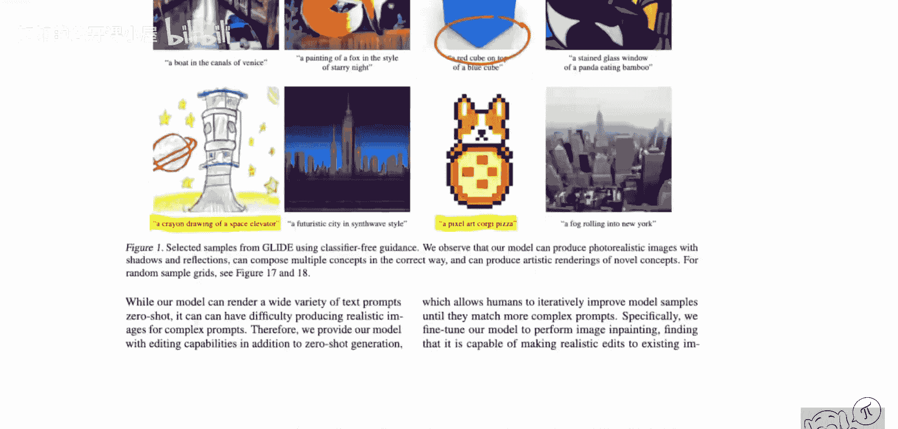

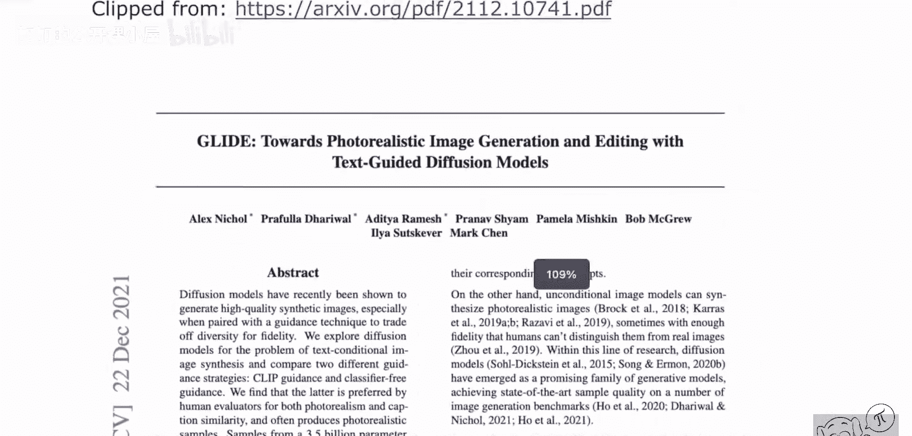

---

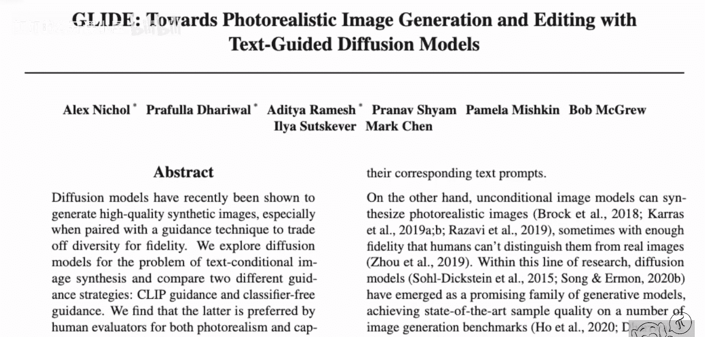

为了追求更高的图像质量和文本对齐度，GLIDE采用了一种称为“无分类器指导”的技术。

在条件扩散模型中，生成过程依赖于条件信息（如文本）。无分类器指导通过在训练时随机丢弃文本条件（例如，以一定概率将文本替换为空值），并在推理时放大模型在有文本条件和无文本条件时预测噪声的差异，来显著提高生成样本的质量和对文本的遵循程度。

**核心公式**：
在采样时，模型预测的噪声 `ε_θ` 被调整为：
`ε_θ = ε_θ(x_t, c) + s * (ε_θ(x_t, c) - ε_θ(x_t, ∅))`
其中：
*   `x_t` 是第t步的带噪图像。
*   `c` 是文本条件。
*   `∅` 是空条件（无文本）。
*   `s` 是指引导标，用于控制条件影响的强度。

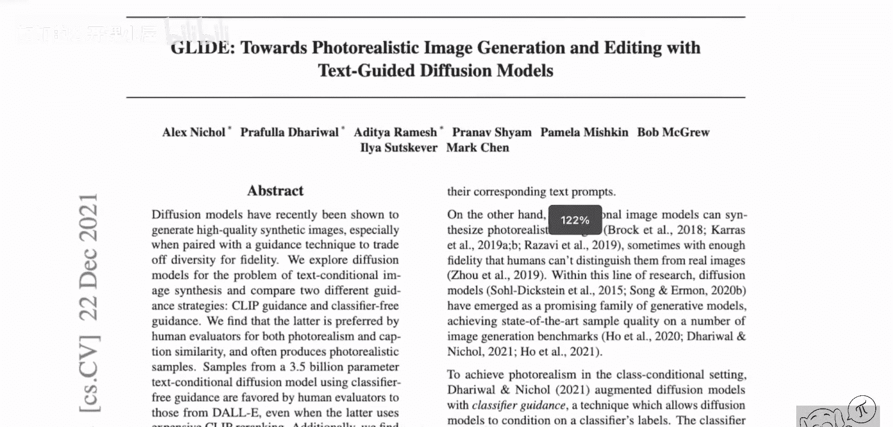

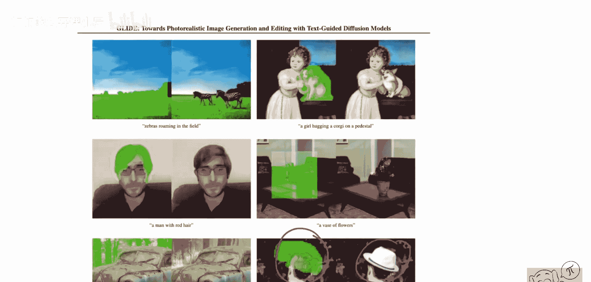

通过增大指导尺度 `s`，可以迫使模型生成更贴合文本描述、质量通常也更高的图像，但可能会降低多样性。

---

最后，我们通过对比来直观感受GLIDE模型的生成效果。

研究人员在MS-COCO数据集上对GLIDE与其他模型进行了对比评估。该数据集包含真实图像及其文本描述。

以下是观察到的结果：

*   **DALL-E**：作为早期的文本生成图像模型，其输出图像有时存在模糊感，细节和真实感相对较弱。
*   **GLIDE（无分类器指导）**：生成的图像在逼真度、细节丰富度和与文本描述的匹配度上均有显著提升。例如，对于描述“一辆绿色火车在轨道上行驶”，GLIDE能生成出细节清晰、颜色准确、符合物理光照的高质量火车图像。

这些对比表明，基于扩散模型架构并结合文本引导与无分类器指导的GLIDE，在生成逼真图像方面取得了突破性进展。

---

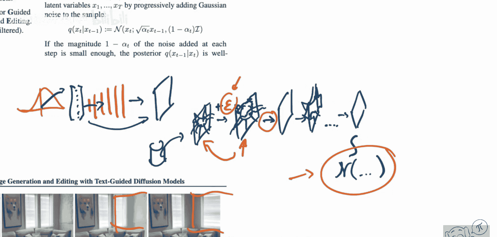

本节课中我们一起学习了OpenAI的GLIDE模型。我们从扩散模型的基本原理出发，了解了GLIDE如何通过文本编码器和U-Net架构实现文本引导的图像生成。进一步地，我们探讨了GLIDE强大的图像编辑功能，如修复和草图引导编辑。最后，我们介绍了提升生成质量的关键技术“无分类器指导”，并通过对比看到了GLIDE在生成逼真度和文本对齐度上的显著优势。GLIDE为文本到图像的生成和编辑任务树立了一个新的标杆。