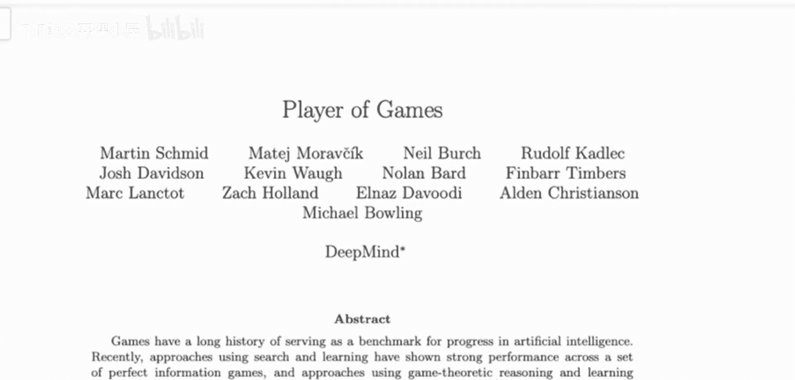
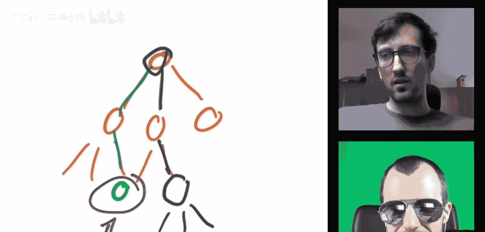

# 063：统一算法解析（与作者马丁·施密德合作）🎮

在本节课中，我们将要学习一篇名为《游戏玩家》的深度论文。这篇论文由DeepMind团队发表，提出了一种名为“游戏玩家”的统一算法，旨在能够玩转多种不同类型的游戏。我们将与论文的第一作者马丁·施密德一起，深入探讨该算法的核心思想、技术构成及其如何应对完美信息与不完美信息游戏的挑战。

---



## 概述：什么是“游戏玩家”算法？🤔

“游戏玩家”算法是一个旨在统一解决多种游戏的单一算法。它从国际象棋和围棋这类完美信息游戏出发，进一步扩展到如扑克和“苏格兰场”这类包含隐藏信息的不完美信息游戏。这类游戏的核心挑战在于，玩家无法像下棋一样看到全局信息，例如在扑克中你不知道对手的牌，在“苏格兰场”中你不知道对手的位置。


此前，针对扑克或“苏格兰场”的算法往往是为特定游戏量身定制的。“游戏玩家”算法则整合了一系列技术，例如**局部搜索**和**反事实遗憾最小化**等，将它们融合成一个通用框架。该算法像AlphaZero一样，通过自我对弈进行训练，并在推理时进行局部计算以决定最佳行动，而非遍历整个庞大的游戏树。

---

## 算法核心：从AlphaZero到不完美信息游戏 🔄

上一节我们介绍了算法的目标，本节中我们来看看其核心是如何借鉴并扩展现有技术的。

AlphaZero算法的成功在于结合了**自我对弈**和**蒙特卡洛树搜索**。在游戏树中，每个状态都有多个可能的行动，每个行动会导向一个新的状态，这使得穷举搜索计算量巨大。AlphaZero的做法是进行有限深度的搜索，在达到某个深度或时间限制时“截断”搜索，并使用一个**神经网络**来评估当前节点的优劣，即使游戏尚未结束。

**伪代码示意：AlphaZero风格搜索**
```python
def mcts_search(state, neural_net, max_depth):
    if is_terminal(state) or depth == max_depth:
        return neural_net.evaluate(state) # 价值评估
    else:
        # 选择、扩展、模拟、回溯...
        ...
```

然而，当面对不完美信息游戏时，情况发生了变化。玩家无法确定自己处于哪个确切的状态（因为存在隐藏信息），这使得直接应用AlphaZero的树搜索和价值评估变得困难。

“游戏玩家”算法的高层目标，正是希望保留AlphaZero中**由神经网络引导的、高效的树搜索**这一强大特性，并将其应用于不完美信息领域。它本质上是将AlphaZero与另一个成功攻克无限注德州扑克的AI——**DeepStack**的核心思想进行了融合。

---

## 关键突破：理解“游戏玩家”的价值函数 💡

理解了价值函数在“游戏玩家”算法中的作用，就理解了该算法60%到80%的复杂性和其对不完美信息的处理方式。

在完美信息游戏（如象棋）中，价值函数相对直观。它评估一个给定的棋盘状态对当前玩家有多有利。算法搜索到一定深度后，就调用价值函数来替代继续向下的搜索，从而估算从该状态往后发展的期望收益。

但在不完美信息游戏中，玩家面对的不是一个确定的状态，而是一个**信息集**——即根据玩家当前可见信息所能推断出的所有可能状态的集合。例如，在扑克中，看到自己手牌和公共牌后，对手可能持有的手牌组合就构成了一个信息集。

因此，“游戏玩家”算法的价值函数不再映射“状态->价值”，而是映射“**信息集->价值**”。它需要评估的是，在当前所知信息（信息集）下，继续游戏的期望价值是多少。这是算法处理隐藏信息的核心。

**公式描述：价值函数**
设 `I` 为一个信息集，`v(I)` 表示从信息集 `I` 开始，对于当前玩家的期望价值。



上图概念化地展示了在包含机会节点（如发牌）和对手隐藏行动的序列中，算法如何利用价值函数（紫色方块）来评估某个决策点（绿色方块）的未来收益，从而指导搜索。

---

## 技术融合：算法的主要组成部分 ⚙️

以下是构成“游戏玩家”算法的主要技术组件：

*   **自适应搜索**：像AlphaZero一样，算法不会盲目搜索所有分支，而是根据当前策略和价值函数的引导，智能地决定探索游戏树的哪些部分。
*   **不完美信息价值函数**：如上所述，这是算法的核心。神经网络被训练来准确评估信息集的价值，为搜索提供可靠的截断评估。
*   **自我对弈训练**：算法通过与自己反复对弈来改进策略和价值函数，无需人类数据。
*   **反事实遗憾最小化思想**：从DeepStack等扑克AI中汲取灵感，利用CFR相关的概念来处理信息集上的策略优化和均衡求解。

---


## 总结与展望 🎯

本节课中我们一起学习了“游戏玩家”这一统一算法。它通过巧妙地将AlphaZero的搜索框架与处理不完美信息的技术（如信息集价值评估）相结合，实现了在包括完美信息游戏（象棋、围棋）和不完美信息游戏（扑克、苏格兰场）上的强大性能。其核心创新在于设计了适用于信息集的价值函数，使得高效的、神经网络引导的树搜索能够扩展到隐藏信息的复杂场景中。

这项研究展示了迈向通用游戏AI的重要一步，一个算法即可应对多种截然不同的游戏形式。尽管目前主要在论文提及的四种游戏中验证，但其框架为处理更广泛的游戏类型奠定了理论基础。