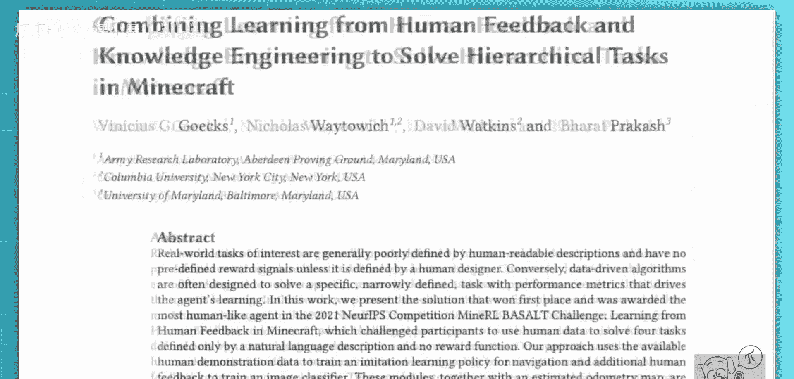
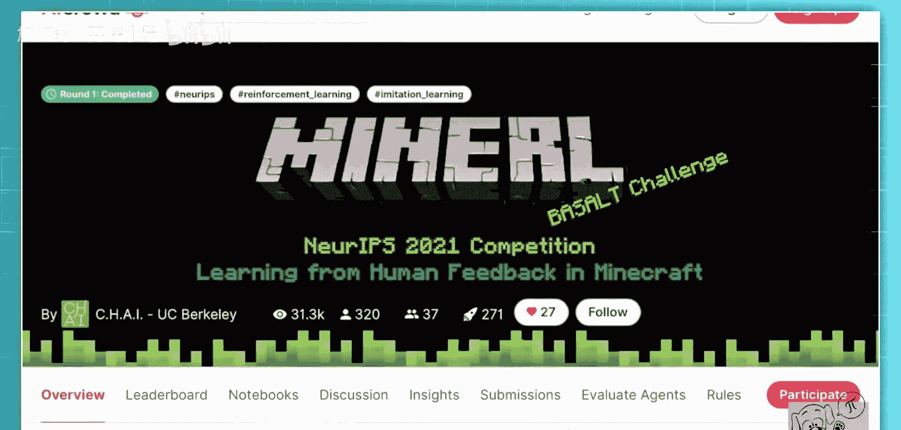
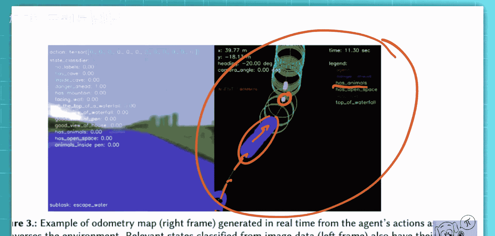

# 064：结合人类反馈与知识工程解决《我的世界》分层任务

## 概述

在本节课中，我们将要学习一篇关于强化学习的论文。该论文介绍了一支团队如何赢得《我的世界》RL BASALT挑战赛。我们将探讨他们如何结合行为克隆、状态分类器和硬编码状态机来解决复杂的开放世界任务。

## 任务与挑战简介

今天我们要看的是这个。这是一个在《我的世界》中的智能体，它正试图建造一个瀑布。目标是爬上一座山，找到一个合适的位置，放置一些水，然后转身为瀑布拍一张漂亮的照片。这是“我的世界RL BASALT竞赛”的四个任务之一。这就是我们今天要讨论的内容。我们不仅要讨论挑战和竞赛，我们还将很快与获胜团队——Cairos团队进行交谈。

这只是引言，我想简要介绍一下背景，以便稍后在作者访谈中你能跟上。如果你不了解《我的世界》或这类竞赛的基础知识，这部分内容将用5到10分钟。

我再展示另一个例子，让你感受一下这些智能体能做什么。我实际上没看过很多。我不知道这里会发生什么，不知道这是否成功。这些是评委在竞赛中看到的实际视频。竞赛由人类评判，没有奖励函数。你只需提交10个视频给人类评委，他们负责评估这些视频的质量、拟人化程度等。

它刚才有点没对准瀑布。看看它能否转身。是的，可以。正如你所想，它并非在所有10个任务中都完美无缺，但足以赢得这场竞赛。那么，这个团队是如何做到的呢？

如果你不知道《我的世界》是什么，它是一款游戏，画面看起来像是90年代的，所有东西都由方块构成。但它是一款非常酷的游戏。这是一个完全开放的世界，你可以做任何事。你可以制作物品，可以破坏所有方块并在其他地方重建，可以收集物品并合成新的、更好的物品。例如，你可以合成一把镐，用它来开采矿石，然后可以建造一个熔炉来冶炼铁矿石，接着可以制造铁制工具等。这个世界是完全程序化生成的，关卡并非每次都相同。这是使这些挑战如此困难的原因之一。另一个原因就是你在这里拥有的巨大自由度。

现在，智能体已经花了相当长的时间寻找建造瀑布的好地方。看起来它在这里卡住了。我想这可能是失败案例之一，或者它能出来。它出来了。多么巧妙的操作。看起来这里是个建造瀑布的好位置。是的，放下水，走开，转身，拍下包含羊的照片。很漂亮。

## 团队解决方案概述

获胜团队的工作也形成了一篇论文，名为《结合人类反馈与知识工程解决《我的世界》中的分层任务》，并附有开源代码。你可以查看并重新训练他们的智能体，研究他们的代码并进行改进。代码采用MIT许可证，对你完全开放。

那么，是什么让这个团队提交了获胜方案呢？挑战本身是只给你一个简短的任务字符串。例如，“寻找洞穴”。智能体应搜索洞穴，并在进入一个洞穴时结束回合。这就是任务的完整描述。如前所述，没有奖励函数。你会得到每个任务40到80个人类演示，但并非所有演示都完成了任务，还有一个代码库，仅此而已。

这个团队提出了以下解决方案。他们在核心构建了一个所谓的“状态机”，但我想从其他地方开始讲起。我想从他们如何使用人类演示开始。

## 利用人类演示数据

他们拥有人类解决此任务的演示数据，并据此训练了一个导航策略。这是通过行为克隆训练的。你试图让一个智能体模仿人类的移动。他们从人类演示中剔除了所有与环境交互的部分，使其仅包含从A点到B点的导航。这是一个他们可以随时激活的策略。

正如你在这里看到的，这催生了他们所谓的“学习或工程化的子任务”之一。他们有一系列这样的子任务。其中之一就是这个导航子任务，显然是学习得到的。

## 子任务与策略设计

其他一些子任务则是硬编码的。例如，当到了在某个点放置瀑布的时候，当你认为找到了建造瀑布的好位置时，堆叠方块并将水放在顶部的动作就是一个硬编码的策略。因此，这些子任务部分是硬编码的，部分是学习得到的，并由这个状态机控制。

## 状态分类器的作用

在这个状态机之上，状态机本身由一个状态分类器控制。这个状态分类器是他们设计的东西。他们从游戏中获取图片（帧），并收集额外的人工标注数据。对于每张图片，他们让人类标注，例如，“这是在洞穴内吗？”（你在这里可以看到，如果你玩过《我的世界》就会知道），“前方有危险吗？”（指应该避开的大片水域之类），“有动物吗？”（这对某些任务很重要）。他们构建了这个状态分类器，它也是学习得到的。现在，这个状态分类器将控制状态机。

我不确定他们是否在论文中为某个任务展示了状态机，但在随附的演示文稿中确实有。状态机控制着在任何给定时刻哪个子策略处于活动状态。

我来试着画一下，你会在演示文稿中看到。例如，对于“制造瀑布”任务，你开始，然后到达一个点，你想问：“这里适合放置瀑布吗？”这是从智能体的视角判断。如果“否”，则转到“探索”子策略。如果“是”，则转到“前往那里”子策略。“前往那里”子策略被激活。这些就是我们看到的子策略，要么是学习得到的，要么是硬编码的。例如，“探索”子策略，你可以想象，可能只是四处走动，直到状态分类器告诉你确实找到了一个好位置。

那么，是什么在“否”和“是”之间做决定呢？正是这个状态分类器，这个经过训练的状态分类器。在某个时刻，它会告诉你：“现在你找到了一个好位置”，然后你就可以切换策略。从那里开始，在“前往那里”之后，你会到达另一个决策点。决策点可能是：“你在一堵大墙前面吗？”如果是，使用“跳跃”策略；如果否，使用“行走”策略等。

## 状态机与拓扑地图

如你所见，状态机本身是硬编码的。人类想出了“我们需要做什么来完成这些任务”。但各个步骤可以是学习得到的或硬编码的策略。这就是他们完成任务的方式。他们使用状态分类器来始终告知在状态机控制下，当前应该激活哪个具体的子任务。

他们有时还需要的是这个估计的拓扑地图。这是通过查看迄今为止执行的动作来构建的。他们构建了智能体的俯瞰地图。随着智能体在环境中移动，他们能够记住一些东西。例如，这里有动物。他们会记住动物的位置、水域的位置等。这允许他们在后续阶段如果需要返回某个地方时，能够有效地再次找到它，例如在瀑布子任务中。

## 总结

本节课中，我们一起学习了Cairos团队赢得《我的世界》RL BASALT挑战赛的解决方案。他们通过结合**行为克隆**学习导航策略，设计**硬编码的状态机**来规划任务流程，并训练**状态分类器**来根据游戏画面做出决策，从而在缺乏明确奖励函数的复杂环境中成功完成了任务。这种方法巧妙地融合了学习与工程，为解决开放世界分层任务提供了有价值的思路。