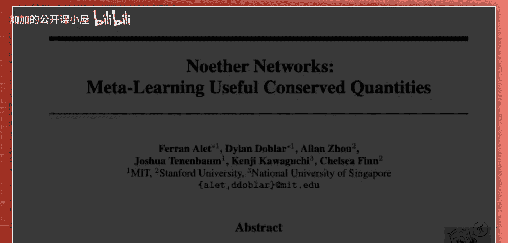
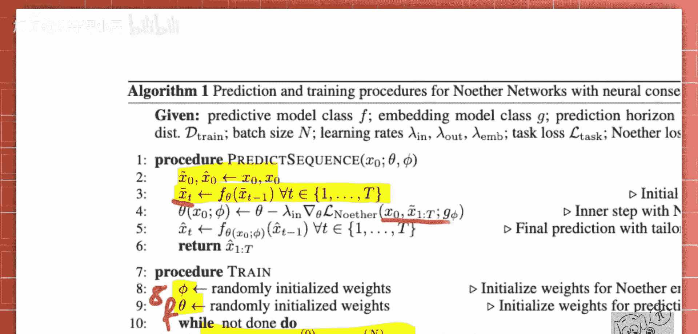

# 065：元学习有用的守恒量

在本节课中，我们将学习一种名为“诺特网络”的模型。该模型旨在通过元学习的方式，自动发现并利用动态系统中的守恒量，以提升神经网络对系统未来状态的预测能力。我们将从核心直觉开始，逐步解析其工作原理和训练过程。

## 概述

诺特网络的核心思想是：在预测动态系统（如物理过程视频）时，系统内部往往存在守恒量（例如能量、动量）。如果神经网络能学会识别并保持这些量，其预测将更加准确。本方法不是直接编码已知的物理对称性，而是通过一个辅助网络动态地学习守恒量，并在前向传播过程中即时调整主预测网络，以强制其预测结果遵守这些守恒约束。

## 诺特定理与核心直觉

上一节我们概述了诺特网络的目标。理解它的基础是诺特定理。该定理粗略地表述为：**对于一个动态系统的每一个连续对称性，都存在一个对应的量，其值随时间保持守恒**。

例如，一个由引力相互作用的行星系统，在三个坐标轴方向上都具有平移不变性（对称性）。诺特定理断言，对于每一种对称性，必然存在一个守恒量。在此例中，对应的守恒量就是线性动量。

因此，空间平移的对称性伴随着线性动量的守恒。我们并不总是明确知道这些守恒量。诺特网络的直觉在于，**了解这些守恒量能为预测提供额外信息**。这是一种可以免费获取并利用的信息。

## 问题设定：动态系统预测

现在，我们来看看诺特网络要解决的具体问题：动态系统预测。一个典型的例子是预测一段展示物理交互过程的视频帧序列。

例如，一个物体在斜面上滑下，然后与另一个物体碰撞。目标是预测此视频的后续帧。我们可以训练一个神经网络逐帧进行预测。如果有充足数据，这种方法可能效果不错。

然而，在数据有限的情况下，我们需要为模型注入归纳偏置。通常的做法是直接编码已知的对称性（例如已知的物理定律）。虽然编码对称性非常有效（正如几何深度学习所示），但前提是需要预先定义它们，这可能很繁琐。

诺特网络提出了一种更简便的方法：**与其直接编码对称性，不如强制模型遵守守恒约束**。根据诺特定理，这两者是等价的。如果一个系统守恒某个量，那么它本质上就编码了该系统的一种对称性。

## 诺特网络架构与工作流程

了解了问题背景后，本节我们深入探讨诺特网络的架构和前向传播工作流程。下图展示了单次前向传播的完整过程：

整个过程可以分为几个关键步骤：

1.  **初始预测**：首先，我们将初始帧输入一个前向预测神经网络 `F_theta`。这个网络负责逐帧预测未来状态，生成一系列初始预测输出 `x_tilde`。在数据有限的场景下，这些初始预测可能并不精确。
2.  **守恒量提取**：我们同时准备了一个守恒量提取网络 `G_phi`。**`G` 网络的目标是学习并输出系统应守恒的某个量**。它将每一对连续帧作为输入，并将其映射到一个嵌入空间（输出可以是一个标量或一个向量）。
3.  **计算诺特损失**：我们将所有预测帧（或连续帧对）输入同一个 `G` 网络，得到一系列输出。理想情况下，如果预测序列遵守了某种守恒律，那么所有 `G` 的输出应该相同。诺特损失 `L_N` 正是衡量这些输出差异的损失函数。其定义如下：

    **公式**：
    `L_N = Σ_t || G_phi(x_{t-1}, x_t) - G_phi(x_0, x_1) ||^2`
    或
    `L_N = Σ_t || G_phi(x_{t-1}, x_t) - G_phi(x_t, x_{t+1}) ||^2`

    本质上，该损失要求所有 `G` 网络的输出尽可能一致。
4.  **即时网络调整**：这是诺特网络最核心的一步。**我们利用计算出的诺特损失，对主预测网络 `F_theta` 的参数进行一步梯度更新**。这个更新发生在前向传播过程中，其方向是诺特损失相对于 `F_theta` 参数的梯度。

    **代码描述（概念）**：
    `theta‘ = theta - α * ∇_theta L_N`
    其中 `theta‘` 是临时更新后的参数，`α` 是步长。
5.  **最终预测**：使用临时更新后的参数 `theta‘`，主预测网络 `F_theta‘` 重新对初始帧进行前向传播，生成最终的预测序列。

这个过程可以看作是在前向传播内部进行了一次快速的“内部优化”，目的是让预测网络即时学会做出符合所学守恒律的预测。研究发现，即使只进行一步梯度更新，效果也已足够。

## 训练算法

我们已经了解了单次前向传播的流程，现在来看看整个模型是如何被训练出来的。以下是诺特网络的训练算法概要：

以下是训练步骤的分解：

1.  **初始化**：随机初始化主预测网络 `F_theta` 和守恒量提取网络 `G_phi` 的权重。
2.  **批次训练**：对每一个训练批次，重复以下过程：
    *   **序列预测**：运行上一节描述的完整诺特网络前向传播过程。这包括初始预测、计算诺特损失、对 `F` 网络进行一步内部更新，并得到最终预测序列。
    *   **计算任务损失**：将最终的预测序列与真实的目标序列进行比较，计算一个标准的预测任务损失 `L_task`（例如均方误差）。
    *   **更新网络参数**：**同时根据任务损失 `L_task` 和诺特损失 `L_N` 来更新两个网络的参数**。`F_theta` 和 `G_phi` 的权重都会通过反向传播进行优化。

通过这种训练方式，`G_phi` 网络学会提取有助于提升预测精度的守恒量，而 `F_theta` 网络则学会如何利用 `G_phi` 提供的守恒量信息，在推理时进行自我调整，做出更符合物理规律的预测。

## 总结

本节课中，我们一起学习了诺特网络。我们从诺特定理的直觉出发，理解了守恒量与系统对称性的等价关系。诺特网络创新性地将这种关系用于动态系统预测，它通过一个辅助网络 `G` 自动从数据中学习守恒量，并在前向传播过程中通过内部梯度更新，强制主预测网络 `F` 的输出遵守这些守恒约束。这种方法在数据有限的情况下，通过引入物理归纳偏置，有效提升了对动态系统长期预测的准确性和稳定性。