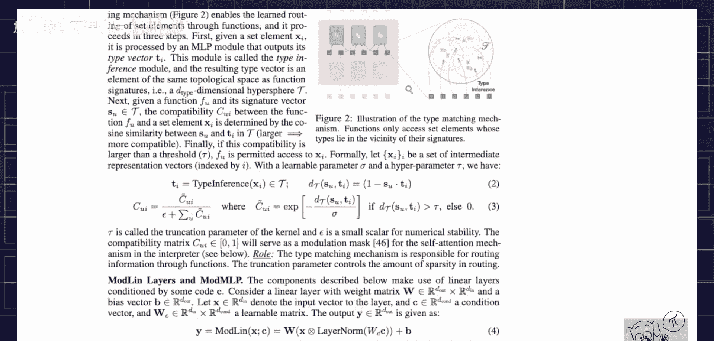

# 066：架构详解与核心机制

在本节课中，我们将学习一种名为“神经解释器”的新型神经网络架构。该架构旨在通过模块化和动态推理机制，提升模型在抽象逻辑推理、数据分布偏移和小样本学习等任务上的泛化能力。我们将深入探讨其核心组件和工作原理。

---

## 概述

神经解释器模型重新审视了神经网络的构建方式。其核心思想是模拟人类处理信息的过程：将复杂任务分解为一系列抽象的、模块化的功能组件，并通过动态组合这些组件来达成目标。该架构在形式上与Transformer模型有相似之处，但引入了独特的模块化函数和动态路由机制，以实现更灵活和高效的推理过程。

---

## 神经解释器是什么

上一节我们介绍了神经解释器的设计理念。本节中，我们来看看其具体构成。神经解释器模型接收一系列令牌（Token）作为输入，例如视觉嵌入或文本片段，这与标准Transformer类似。

模型由一系列称为“脚本”的计算块组成。每个脚本内部包含多个独立的“函数”。与Transformer中所有令牌流经相同的、固定的层叠结构不同，在神经解释器中，每个输入令牌会被动态地路由到当前脚本内的一个或多个特定函数中进行处理。

以下是神经解释器脚本内部的核心流程：
1.  **令牌输入**：一组令牌进入一个脚本。
2.  **动态路由**：每个令牌根据其内容，被分配（路由）到该脚本内的一个或多个函数中。目标是实现处理的稀疏性，即每个令牌只与少数函数交互。
3.  **函数内计算**：每个函数接收所有被路由给它的令牌，并在其内部执行一系列计算层（如注意力层和多层感知机）。
4.  **输出与循环**：函数处理完成后，输出更新后的令牌。关键之处在于，**同一个脚本会被循环应用多次**。在每一次循环中，路由决策会重新计算，因此同一个令牌在脚本的不同循环步骤中，可能被路由到不同的函数组合中。这实现了功能的动态组合。

---

## 函数模块：共享参数与专属代码

上一节我们介绍了脚本和函数的动态路由流程。本节中，我们来看看函数内部的具体实现，特别是其参数结构。

每个函数可以看作一个独立的计算模块。为了在模块化与参数效率之间取得平衡，神经解释器采用了一种参数共享方案。每个函数 `F` 的计算可以抽象地视为：

`输出 = F(输入令牌 X, 全局共享参数 W, 函数专属代码 C)`

其中：
*   **`W` (全局共享参数)**：这部分参数在所有函数之间共享，类似于一个“解释器”的基础能力。它代表了所有函数共有的底层计算逻辑。
*   **`C` (函数专属代码)**：这是一组专属于每个函数的、可学习的参数。正是 `C` 的不同，使得函数 `F1`、`F2`、`F3` 彼此区分，具备不同的 specialized 功能。可以将 `C` 理解为定义该函数独特行为的“代码”。

这种设计是对动态计算思想的一种体现。当然，从原理上讲，每个函数也可以完全独立，不共享任何参数（`W`），仅依靠各自的专属代码（`C`）来工作。但共享部分参数能有效提升模型的参数效率。

---

## 动态路由机制

上一节我们了解了函数的构成。本节中，我们聚焦于决定令牌流向的关键：动态路由机制。

路由机制决定了在每个脚本的每个循环步骤中，哪些令牌被发送到哪些函数。其灵感来源于注意力机制，但作用在不同的层面上。

每个函数都学习一个特定的路由向量（在论文中常记为 `S`）。同时，每个输入令牌也会产生相应的表征。路由决策基于令牌表征与各函数路由向量之间的兼容性（例如通过点积计算相似度）来计算。简而言之，令牌会倾向于被路由到其表征与函数路由向量最匹配的那些函数中去。

这个过程在每个循环步骤中都会**重新计算**，从而允许模型根据上一步的处理结果，动态地调整下一步的计算路径，实现真正的条件计算流。

---

## 总结

本节课中，我们一起学习了神经解释器架构的核心思想与机制。我们了解到，该模型通过将计算组织成模块化的“函数”，并引入**动态路由**机制，使得网络能够根据输入内容动态地组合这些函数。此外，函数的参数由**全局共享部分**和**专属代码部分**构成，平衡了灵活性与效率。这种设计旨在让模型更好地进行抽象推理，并提高对分布外数据和小样本任务的泛化能力。整个架构可以看作是对标准Transformer的一种具有循环和条件执行特性的泛化。