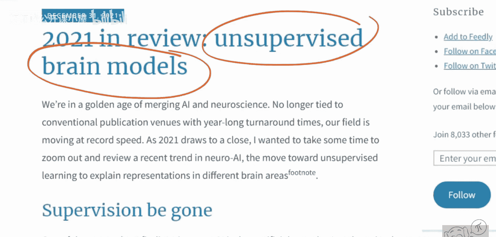
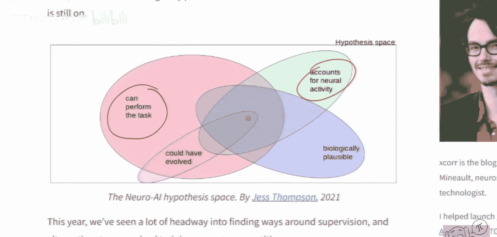
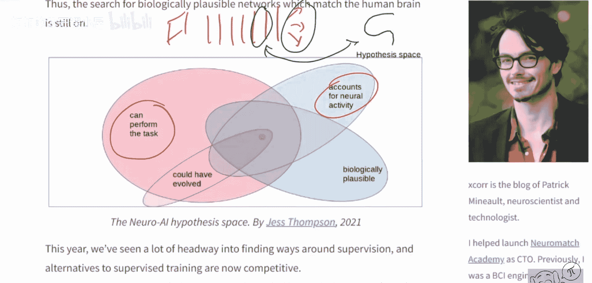
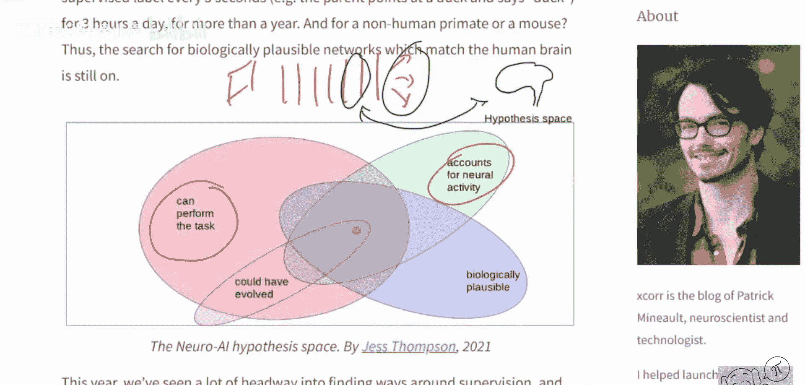
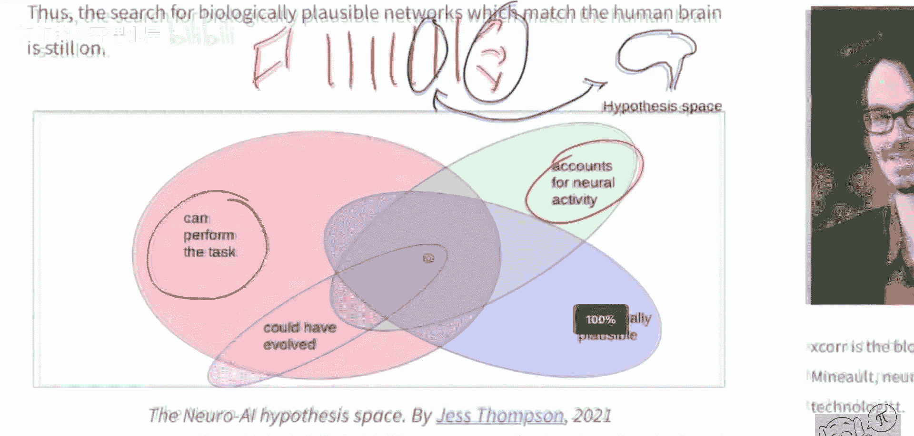
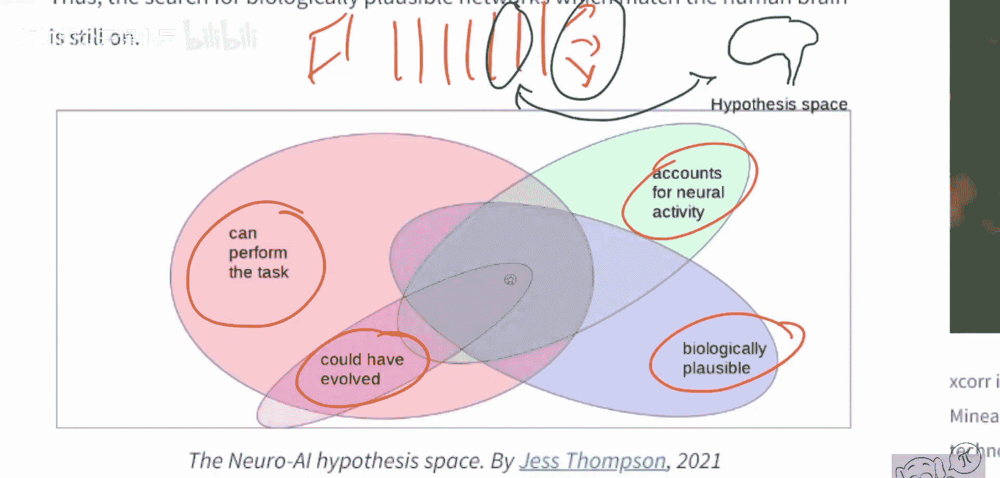
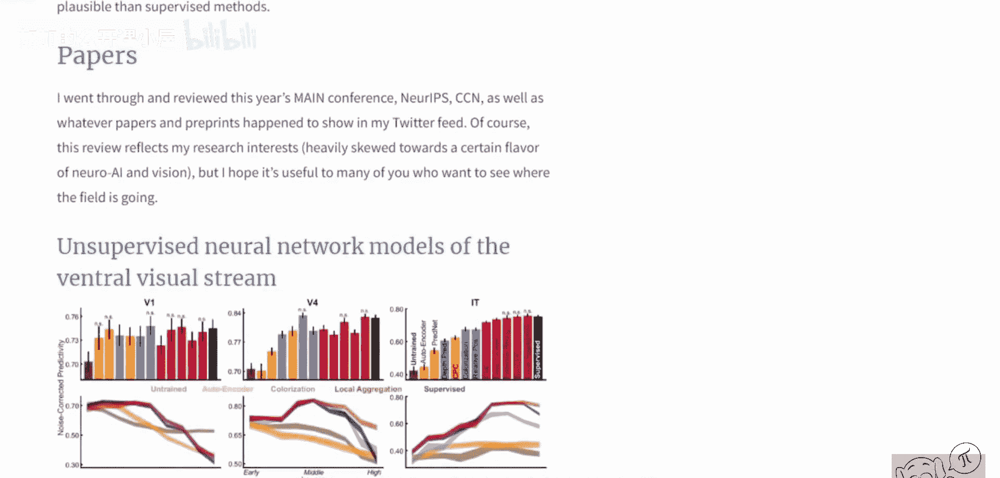
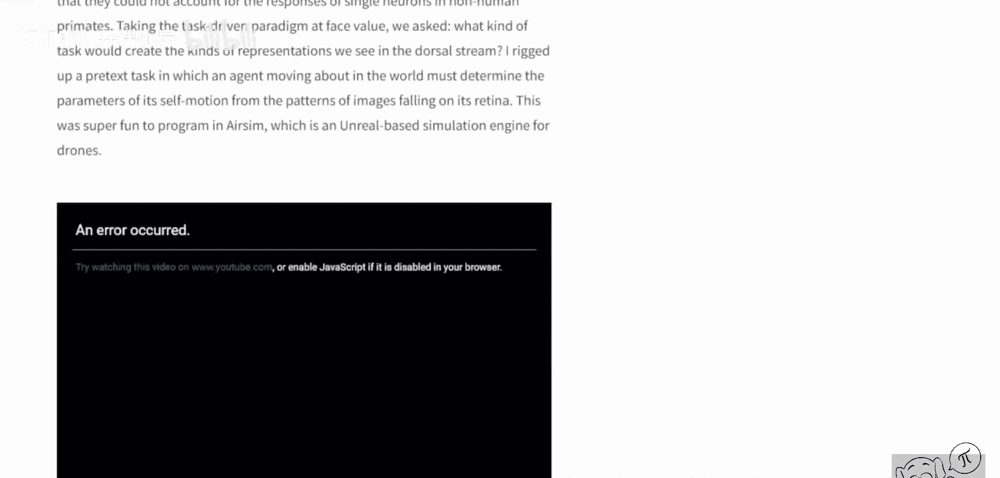

# 068：无监督大脑模型——深度学习如何启发神经科学？

## 概述
在本节课中，我们将探讨深度学习与神经科学之间的交叉领域，特别是无监督学习模型如何帮助我们理解大脑的工作机制。我们将跟随神经科学家Patrick Mineault的见解，了解如何利用深度学习模型来解释大脑活动，并探讨这一领域的最新进展和开放性问题。

## 引言
神经科学的核心问题是理解大脑如何工作。深度学习作为一种受神经科学启发的工具，为构建能够执行特定任务的端到端模型提供了可能。现在的问题是，这些人工模型与解决相同任务的大脑，其运作方式是相同还是完全不同？

## 深度学习作为神经科学的工具
神经科学家想知道大脑如何学习。一个关键问题是，人工构建的深度网络是否能解释神经活动。这意味着，深度网络中的信号是否与我们在大脑中观察到的信号相同或相关。

这成为了神经科学家的重要工具。他们希望看到，深度网络中的中间表征（例如，图像经过网络层层处理后的中间状态）能够与大脑信号（如fMRI或电极记录）相关联。如果能建立这种关联，就表明深度网络所做的事情与大脑有相似之处，这可能帮助我们理解大脑。

神经科学的“圣杯”是找到一个模型，它能够：
1.  执行与人类相同的任务。
2.  能够解释神经活动。
3.  在生物学上是合理的（例如，反向传播机制能否在大脑中实现仍存在争议）。
4.  其演化过程是可以设想的，甚至可能有演化证据。

## 聚焦无监督模型
上一节我们介绍了深度学习作为理解大脑的工具，本节中我们来看看一类特别的模型：无监督模型。

我们将重点讨论自监督模型。自监督模型是指不需要人工标注标签进行训练的模型。其通常做法是遮挡输入数据的一部分，然后根据已知部分来预测被遮挡的部分。

例如，对于图像，可以遮挡图像的某一部分，然后根据剩余部分来预测被遮挡的部分。这是一种自监督方法。

此外还有对比学习方法，它也属于自监督范畴。对比学习是指对同一张图像生成两种不同的视图（例如，在不同位置裁剪），然后训练一个模型来识别这两个视图属于同一张图像，并将它们与另一张无关的图像区分开来。

事实证明，如果我们构建通过自监督、对比学习，尤其是多模态方式学习的模型，最终得到的模型能够相当好地解释大脑活动。

## 领域现状与机遇
在访谈中，Patrick进一步深入探讨了神经科学领域的高层问题。他指出，对于当前从事深度学习并对神经科学感兴趣的研究者来说，这是一个非常开放的领域。

Patrick表示，该领域存在大量待发表的论文空间，并且像NeurIPS这样的顶级会议非常欢迎将深度学习与神经科学联系起来、或试图解释神经科学现象的论文。

## 总结
本节课中，我们一起学习了深度学习与神经科学的交叉研究。我们探讨了如何利用无监督和自监督深度学习模型来解释和预测大脑神经活动，并了解了这一领域的基本思路、核心方法以及广阔的研究前景。这为理解大脑的学习机制提供了新的计算模型和理论框架。