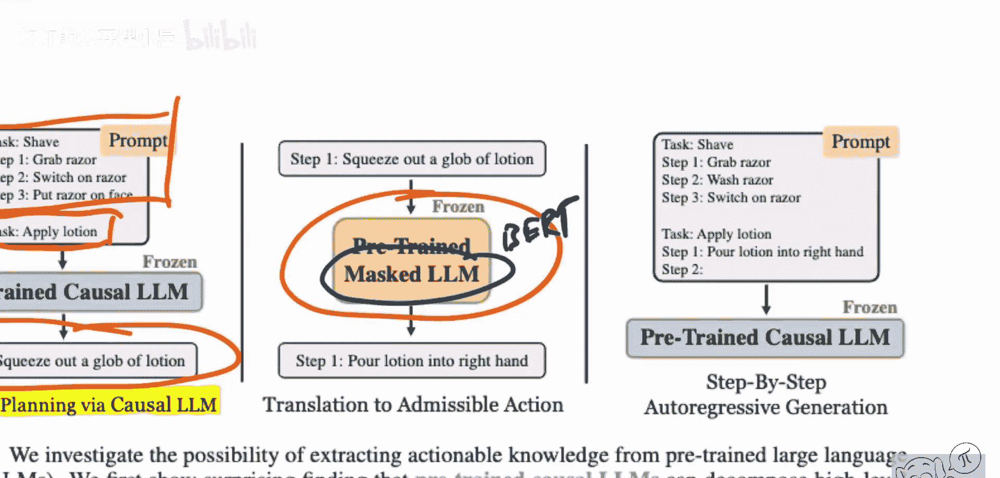

# 069：为具身代理提取可操作知识

在本节课中，我们将学习一篇探讨如何利用大型语言模型（如GPT-3）作为零样本规划器，为具身代理（如虚拟家庭环境中的机器人）生成可执行任务计划的论文。我们将了解其核心方法、面临的挑战以及提出的改进方案。


上一节我们介绍了论文的研究目标和基本环境设定，本节中我们来看看论文提出的核心改进方法。

## 环境与任务设定

论文的研究环境是一个名为“虚拟家庭”的模拟环境。该环境定义了一系列**预定义的动作**（如 `walk`、`find`、`switch on`）和**对象**（如 `living room`、`television`）。任务（例如“刷牙”）需要由一系列符合环境语法的动作步骤来完成。环境内部维护着世界状态，动作执行需满足**前置条件**（例如，必须先 `find` 电视，才能 `switch on` 电视）。

## 基线方法：零样本规划

基线方法非常简单直接。研究人员使用一个大型语言模型（如GPT-3），并为其构建一个提示。这个提示包含一个示例任务及其步骤，格式如下：

```
任务：示例任务
步骤1：[动作1]
步骤2：[动作2]
...
```

然后，模型接收一个新任务（例如“刷牙”），并基于提示的格式生成一个计划。生成计划后，使用两个指标进行评估：
1.  **可执行性**：计划中的步骤是否符合环境语法，能否被解析和执行。
2.  **正确性**：由人类评估者判断计划在常识上是否合理、能否达成目标。

实验发现，随着模型规模增大，生成计划的**正确性**上升，但**可执行性**却下降。这是因为大模型虽然知识丰富，但生成的动作描述可能不符合环境严格的语法。

## 改进方法

为了解决可执行性问题，论文提出了三种改进方法。

### 改进一：翻译模型

此方法引入第二个预训练模型（如Sentence-BERT），作为一个“翻译器”。它的作用是将语言模型生成的、可能不符合语法的自然语言步骤，“翻译”成环境可接受的标准动作。

**核心流程**：
1.  语言模型生成初始计划。
2.  对于计划中的每一步，使用翻译模型计算其与**所有预定义动作模板**的相似度。
3.  选择相似度最高的预定义动作作为替换。

这相当于一个检索过程，公式可简化为：
`最佳动作 = argmax(相似度(生成步骤, 预定义动作库))`

### 改进二：程序化翻译

此方法不依赖第二个模型，而是编写一套**启发式规则**（例如，关键词匹配、句法分析）来将生成的自然语言步骤映射到预定义动作。这是一种基于规则的标准化过程。

### 改进三：提示选择

此方法旨在优化给语言模型的初始提示。研究人员从数据集中尝试多个不同的（任务，计划）示例作为提示，并选择那个能让模型在验证集上产生最高可执行性计划的示例。这本质上是一种**上下文学习**的优化。

以下是三种改进方法的简要对比：

*   **翻译模型**：利用语义相似度进行软匹配，更灵活。
*   **程序化翻译**：基于硬编码规则，更直接可控。
*   **提示选择**：从源头（输入提示）改善生成质量。

## 总结



本节课中我们一起学习了如何将大型语言模型作为零样本规划器应用于具身代理任务。核心挑战在于弥合模型丰富的常识知识与环境特定动作语法之间的差距。论文通过引入**翻译模型**、**程序化翻译**和**优化提示选择**这三种方法，显著提升了生成计划的可执行性，为在不进行模型微调的情况下，利用大模型内部知识进行领域适配提供了有价值的思路。