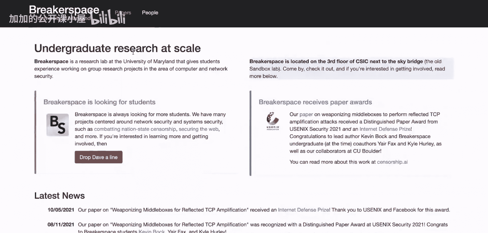
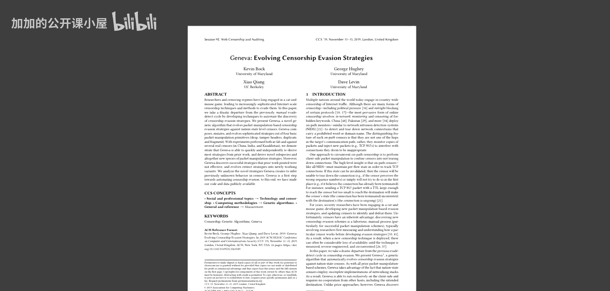

# 071：遗传算法、日内瓦计划与机器学习在安全领域的应用

在本节课中，我们将学习如何利用人工智能技术，特别是遗传算法，来对抗国家级的网络审查。我们将探讨日内瓦计划的工作原理、网络安全领域的现状，以及机器学习如何改变攻防双方的博弈。

---

## 概述

今天，我们与网络安全专家、日内瓦计划的核心成员凯文·巴赫进行对话。日内瓦是一个利用遗传算法来规避国家审查的系统。它能实时进化，以应对来自政府等大型实体的日益严峻的审查威胁。这一切都是通过对程序语法进行进化搜索来实现的。本次访谈将涵盖一系列主题，包括日内瓦计划的工作原理、成果、研究意义，以及更广泛的网络安全与人工智能交叉领域，包括如何入门以及该领域面临的主要问题和挑战。此外，日内瓦计划源于马里兰大学一个名为“Breaker Space”的项目，这是一个让本科生参与安全研究的实验室，非常值得关注。

## 访谈内容

### 嘉宾介绍

大家好，今天和我在一起的是凯文·巴赫。他是马里兰大学的博士生、网络安全研究员，也是“Breaker Space”项目的成员。他还因一个名为“日内瓦”的项目而受到关注，该项目使用遗传算法来规避国家审查。凯文，欢迎来到节目，感谢你的到来。

感谢邀请。我很高兴来到这里。

### 网络安全与人工智能的交叉

今天的目标有点不同，因为我对安全领域完全是个新手。本频道的大多数观众可能对机器学习更熟悉，对安全领域或世界各地的审查机制及应对措施了解不多。因此，今天我将主要提出一些新手问题，并由你来引导我们了解这个世界。

也许你可以先简单介绍一下，你是如何进入这个领域的？当前网络安全领域有哪些主要方向吸引着你？

我认为安全和审查领域正处在一个非常酷的时期。人工智能和机器学习技术在其他领域爆炸式发展，并在最近几年真正开始进入安全领域。我们仍在探索这些技术可以应用于安全的所有不同场景，人们不断发现新的技术和应用，从更好的垃圾邮件检测方法，到识别恶意域名，再到基于人工智能的恶意软件扫描器等。安全领域仍在探索应用这些技术的新方法，这也是我最初将人工智能引入审查研究的一个动机，因为这个项目实际上是整个审查领域首次尝试使用人工智能和机器学习技术。

### 什么是网络审查？

谈到审查，你具体指的是什么？

当今世界有多种形式的审查，从政治压力、自我审查到内容删除等。我将把讨论范围缩小到我们实验室研究的那种类型：由国家在网络中实施的自动化审查。这意味着，如果你身处某些国家，当你尝试发出网络请求时，该请求在穿越国境时会被网络中称为“中间盒”的物理设备扫描、解析和检查。这些中间盒会审查你的请求，决定是否允许通过。如果答案是否定的，它们会注入流量、中断你的连接或采取其他破坏性措施。请注意，我刚才描述的过程中没有人工干预，完全由这些国家部署的中间盒或防火墙自动执行。

### 加密的局限性

一个天真的问题：为什么我不能直接加密我的流量，这样对外部来说所有流量看起来都一样？

这是个很好的问题。人们一直在尝试，比如使用HTTPS加密。不幸的是，HTTPS在首次建立连接时存在一个小的隐私泄露。在最初的“握手”阶段，作为协议的一部分，客户端必须声明要连接的域名，而这个声明是未加密的。因此，如果你向维基百科发起HTTPS握手，你发送的第一个数据包就会包含“Wikipedia”这个词。这被称为“服务器名称指示”字段。审查者只需读取这个字段，如果你试图连接被禁止的域名，他们就会中断你的连接。

所以HTTPS虽然接近，但并未完全解决问题。需要说明的是，HTTPS领域有一些试图修复此问题的进展，例如最近提出的加密SNI提案。但中国去年就开始审查这种加密的SNI了。你可以尝试加密，但审查者通常对公民加密所有流量的想法持敌对态度。

这有点像如果每个人都使用HTTPS，审查者就无法仅仅因为不喜欢某些流量而屏蔽所有HTTPS。但如果出现一种新的加密方式，可能只有那些“有东西要隐藏”的人才会使用，审查者就可以将其扼杀在萌芽状态。因此，世界其他地区需要尽快普及这些技术，使这种审查策略失效。

你说得完全正确。你实际上指出了一个更广泛的话题：连带损害。我们能否让一个协议变得如此流行和多样化，以至于如果审查者试图屏蔽它，就会对正常的服务造成不可挽回的损害，从而让审查行为付出有意义的代价？就像你指出的HTTPS，它无处不在，审查者不能直接关闭所有HTTPS。但对于尚未广泛部署的新HTTPS加密方法，审查者可以阻止其推广。因此，开发者和审查者之间正在进行一场有趣的竞赛。

### 审查与反审查的发展历程

现在，我们来谈谈更“天真”的方法。这个领域的发展是怎样的？过去尝试过什么？哪些方法被挫败了？这种猫鼠游戏在过去是什么样的？我能想到不同的东西，比如Tor，以及每个人都可以安装的VPN和隧道等。这些年来的总体发展是怎样的？

是的，研究人员和审查者之间的猫鼠游戏已经进行了二十年，并且在多个战线上演变。你说得对，Tor是一个重要的前线网络。我们开发了Tor并不断推进它。但不幸的是，Tor协议有一些局限性。审查者基本上可以枚举Tor的入口节点并屏蔽它们。所以一旦你进入Tor网络，通常就安全了，但他们会试图将你挡在外面。人们提出了各种技术，比如将流量伪装成Skype流量，但如果伪装得不够好，还是会被屏蔽。

有一个非常有趣的子领域，叫做基于数据包操纵的审查规避。其思想是，我们所有的通信都通过数据包进行，如果你以某种特定的方式调整这些数据包，就可能让审查者错过你。这也是猫鼠游戏的一部分：研究人员研究这些审查系统，找到一个漏洞，部署并使用它，然后审查者修复它，双方又回到起点。这个游戏一直在持续。

关于VPN，我快速说明一点。很多人，特别是去过中国的人，可能觉得使用VPN还行。VPN在许多地方有效，但在许多地方也无效。最近有个国家上了新闻，因为他们颁布了一项新法律，强制公民发誓不使用VPN才能在家中安装互联网。这听起来很疯狂。以中国为例，许多VPN在大多数时间有效，但研究人员注意到，在政治敏感事件（如选举）发生期间，许多VPN会神秘地停止工作，事件过后又神秘地恢复。