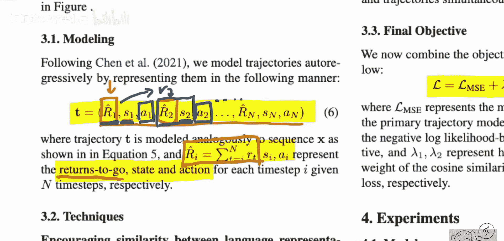

# 073：维基百科能否助力离线强化学习？📚

在本节课中，我们将学习一篇名为《维基百科能否助力离线强化学习？》的论文。这篇论文提出了一个看似违反直觉的观点：在语言数据（如维基百科文本）上预训练的模型，能够显著提升其在离线强化学习任务上的表现。我们将详细解析其核心概念、方法以及实验结果。

---

## 论文概述

这篇论文探讨了语言模型预训练对离线强化学习的潜在帮助。其核心发现是：一个在维基百科等文本数据上进行预训练的Transformer模型，经过微调后，在纯粹的离线强化学习任务上，其性能表现优于从零开始训练的模型。这一结果令人惊讶，因为语言建模与强化学习这两个领域看似毫无关联。

## 研究背景与动机

上一节我们介绍了论文的核心发现。本节中，我们来看看其研究背景。离线强化学习旨在仅利用预先收集的交互数据（轨迹）来学习策略，而不与环境进行实时交互。近年来，决策变换器等方法将强化学习问题构建为序列建模任务。

然而，训练此类模型通常需要大量数据。本文作者提出了一个新颖的思路：能否利用在大量无关联文本数据上预训练的通用语言模型，来提升离线强化学习的性能？他们对此进行了实验验证。

## 核心方法：从语言建模到轨迹建模

以下是论文提出的核心方法流程：

1.  **预训练阶段**：首先，使用标准的语言建模目标（如下一个词预测）在维基百科文本上训练一个Transformer模型。其目标是学习文本中的通用模式和结构。
    *公式表示：* `语言模型损失 = -Σ log P(单词_t | 单词_<t)`

2.  **微调阶段**：然后，将此预训练模型应用于离线强化学习任务。具体而言，将智能体与环境的交互轨迹表示为特定序列格式，并对模型进行微调，使其学习预测轨迹中的下一个“词元”。
    *序列格式示例：* `[状态_1, 动作_1, 累计回报_1, 状态_2, 动作_2, 累计回报_2, ...]`
    *代码概念：* 模型在微调时，输入是轨迹的历史部分，训练目标是准确预测序列中的下一个元素（如动作）。

3.  **推理阶段**：在模型部署时，给定一个期望的累计回报目标和当前环境状态，模型能够预测出应执行的动作。

## 实验结果与分析

上一节我们介绍了方法，本节中我们来看看关键的实验结果。作者在多个标准离线强化学习基准任务上进行了测试，并比较了不同预训练策略的效果。

以下是主要的实验发现：

*   **语言预训练的有效性**：在维基百科文本上预训练的模型，经过微调后，其最终获得的奖励显著高于从零开始训练的基线模型。
*   **收敛速度更快**：使用语言预训练模型进行微调，其损失函数达到收敛所需的训练步数更少。
*   **任务的特殊性**：作者尝试了其他预训练任务（如图像生成模型预训练），但并未观察到类似的性能提升。这表明，语言建模预训练带来的益处具有某种特殊性，而非简单的“预训练即有益”。

## 总结与启示

本节课中，我们一起学习了《维基百科能否助力离线强化学习？》这篇论文。我们了解到，尽管语言和强化学习任务看似无关，但在大规模文本数据上预训练的Transformer模型，其学到的通用序列建模能力可以有效地迁移到离线强化学习的轨迹预测任务中，从而提升模型性能和训练效率。

这一发现为强化学习研究提供了新的思路：可以利用更广泛、更容易获取的非领域数据（如互联网文本）来初始化模型，从而缓解强化学习中对大量交互数据的需求。当然，其背后的机理（为何语言预训练如此有效）仍是未来值得深入探索的方向。