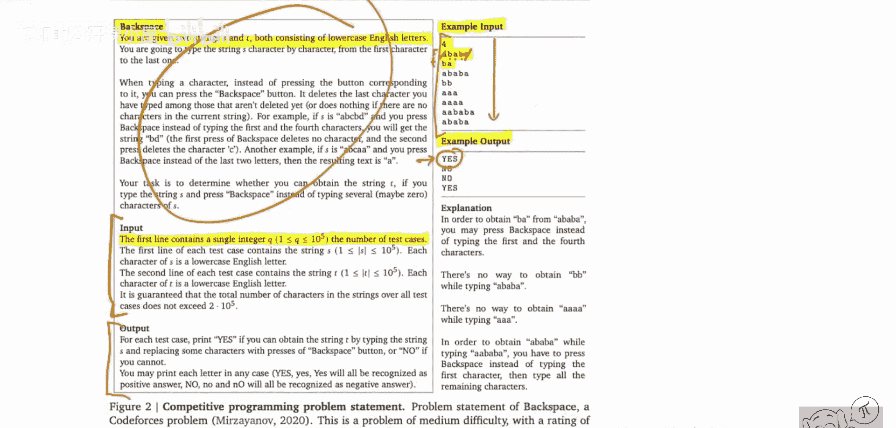

# 074：竞赛级代码生成（论文述评）


## 概述

在本节课中，我们将学习DeepMind开发的AlphaCode系统。这是一个能够自动解决竞赛级编程问题的系统。我们将了解它如何接收自然语言描述的问题，并生成能够解决问题的代码，以及它如何在人类编程竞赛中达到中等水平程序员的表现。

---

## 系统概览与背景

AlphaCode是一个由DeepMind开发的系统，能够进行自动化的竞赛编程。你可以向系统提供一个类似LeetCode风格的自然语言问题描述，系统将自行生成解决问题的代码。它通过结合语言建模、采样、过滤和聚类等一系列步骤，最终决定向评测服务器提交哪些解决方案。

令人震惊的是，该系统能够在人类编程竞赛中表现，其水平与这些竞赛中的普通程序员相当。这非常了不起，因为之前的系统远未达到人类水平。

## 问题示例与挑战

上一节我们介绍了AlphaCode的基本概念，本节中我们来看看它需要解决的具体问题类型。

以下是一个典型问题的示例。这是一个数据集中的一个数据点，也是需要解决的挑战之一。

**标题：Backspace**

**描述：**
你被给定两个字符串S和T，均由小写英文字母组成...

这里需要注意，描述使用的是自然语言。这是为人类设计的，因此自然语言是唯一的输入形式，没有其他机器可读的格式。这就是算法AlphaCode看到并作为输入的内容。

此外，还有对输入格式的自然语言描述、对输出格式的描述，以及一个重要的部分：一系列示例输入和输出。

**示例输入与输出：**
输入部分会说明第一行是一个整数，代表测试用例的数量，等等。例如，这里有四个测试用例。目标是判断是否可以通过在输入S时策略性地按下退格键（而不是输入S中的某个字母），来得到字符串T。

例如，从S = "ababa" 和 T = "ba" 开始。我们可以选择在输入第一个'a'时按退格键（此时无内容可删），然后输入'b'，再输入'a'，再输入'b'，最后在应输入最后一个'a'时再次按退格键，删除前一个字符，最终得到"ba"。因此，对于这个测试用例，我们输出"yes"。

我们的任务是编写一个算法，自动判断对于所有给定的测试用例，是否可能从S转换到T，并输出相应的答案。

这本身就具有挑战性。你只有在所有测试用例上都正确才能得分。评测服务器上还有更多隐藏的测试用例，包括检查各种边界情况（如超长输入、空输入、只包含特定字母的输入等）。你需要在所有情况下都正确才能获得分数。即使对人类来说，这也极具挑战性。

系统需要生成的输出代码类似这样：

```python
def solve():
    import sys
    input = sys.stdin.read
    data = input().split()
    t = int(data[0])
    idx = 1
    results = []
    for _ in range(t):
        s = list(data[idx]); idx += 1
        t_str = list(data[idx]); idx += 1
        # ... 复杂的处理逻辑，包括列表操作、循环、条件判断等
        if not s:
            results.append("YES")
        else:
            results.append("NO")
    print("\n".join(results))
if __name__ == "__main__":
    solve()
```

如你所见，这不是一个简单的代码片段，而是一个完整的算法。它包含读取输入、构建数据结构、执行循环和条件逻辑，最终输出正确结果。仅编写出这段代码的算法本身就已经很有挑战性。

这只是一个数据点。下一个数据点将是一个完全不同的问题，例如在图论中寻找最短路径，或者处理数字的分子分母等。这是一个非常多样化且极具挑战性的问题集合。一个算法能够应对这些挑战，是非常了不起的。

## 核心方法：训练与架构

如果你猜测这与大型语言模型和Transformer等有关，那么恭喜你，猜对了。但这其中还有更多内容，这确实是一项庞大的工程工作。我们应该认识到，通过持续的努力可以将系统性能推进到何种程度。

以下是AlphaCode实现的核心步骤：

首先，他们收集数据集。他们在GitHub的开源代码上进行预训练，这与OpenAI的Codex模型非常相似。OpenAI的Codex模型也是在GitHub代码上训练的，可以进行简单的代码补全。但AlphaCode的目标是解决更复杂的问题。

**1. 预训练：**
他们收集了约700GB的代码作为预训练数据集，并在此代码上运行标准的语言建模目标进行训练。

**2. 微调：**
随后，他们在合适的代码竞赛数据集上进行微调。这是一个混合数据集，从多个网站（如CodeForces、Description2Code等）爬取而来，包含了以往竞赛中的问题描述和解决方案。

## 推理过程：生成与筛选

上一节我们了解了AlphaCode如何训练，本节中我们来看看它在解决具体问题时是如何工作的。

AlphaCode并不只是生成一个解决方案。它的推理过程是一个多步骤的管道，旨在从大量可能方案中筛选出最有可能正确的少数几个。

以下是推理过程的主要步骤：

**1. 大规模生成：**
给定一个问题描述，系统首先使用其微调后的语言模型，生成非常大量（例如数十万甚至上百万个）的候选代码解决方案。

**2. 过滤与聚类：**
由于生成的解决方案数量巨大，且许多可能在功能上是相似或错误的，直接全部评测是不现实的。因此，AlphaCode会执行以下操作：
    *   **过滤：** 基于简单的启发式方法（如代码是否可编译、是否符合基本格式）快速丢弃明显无效的样本。
    *   **聚类：** 对剩余的解决方案进行聚类。其核心思想是，**不同的代码实现如果对一组给定的示例输入产生相同的输出，那么它们很可能在底层逻辑上是相似的**。系统会将产生相同输入输出行为的解决方案归入同一簇。

**3. 选择与提交：**
最后，系统从每个主要的簇中选取一个代表性解决方案（例如，选择该簇中概率最高的那个）。这样，最终提交的是一小组（通常为10个）多样化的、高概率的候选方案，而不是盲目提交成千上万个方案。这大大提高了在有限的提交次数内命中正确答案的几率。

## 总结

本节课中，我们一起学习了DeepMind的AlphaCode系统。我们了解到：
1.  AlphaCode是一个能够解决竞赛级编程问题的AI系统，在人类竞赛中达到了中等程序员的水平。
2.  其输入是纯粹的自然语言问题描述，输出是完整的、可运行的算法代码。
3.  系统通过**预训练（GitHub代码）** 和**微调（竞赛数据集）** 相结合的方式获得代码生成能力。
4.  其强大的关键在于复杂的**推理管道**：包括大规模生成候选方案、基于输入输出行为的**过滤与聚类**，以及最终提交一小簇多样化的高质解决方案。



AlphaCode展示了将大型语言模型与精心设计的工程流程相结合，可以解决极其复杂和开放性的任务，标志着AI在代码生成和问题解决领域迈出了重要的一步。