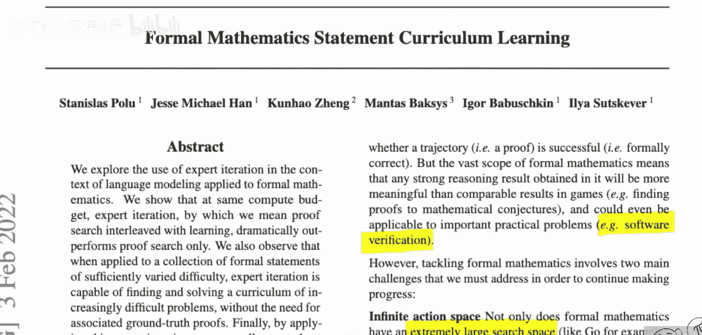
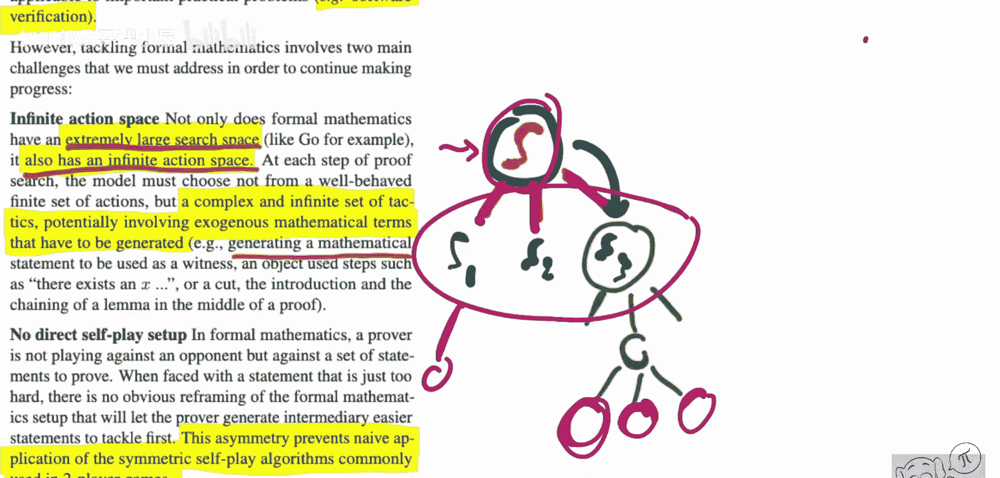

# 075：OpenAI攻克数学难题（论文详解）

## 概述

在本节课中，我们将学习一篇名为《形式化数学语句课程学习》的论文。这篇论文由OpenAI、EPFL和剑桥大学的研究人员共同发表，它提出了一种自动化系统，能够以符号化的方式证明数学定理。更令人惊讶的是，该系统成功解决了国际数学奥林匹克竞赛中的两道难题。我们将深入探讨其核心方法、技术原理以及超越数学领域的广泛意义。

---

## 人工智能能做数学吗

人工智能能做数学吗？这里指的不是简单的加法，而是纯粹的数学证明。

我们今天要看的这篇论文，提出了一种自动化系统，能以符号化的方式证明数学定理。更疯狂的是，该系统成功解决了两道国际数学奥林匹克竞赛的题目。国际数学奥赛是真正有天赋的高中生参加的竞赛。

该系统远远超越了之前尝试过类似任务的任何系统。因为使用算法进行证明的形式化数学和自动化数学，其发展远远落后于你可能熟悉的非形式化数学。许多先前的技术依赖于证明搜索，本质上是在一些启发式方法的指导下，通过暴力方式寻找证明。

这篇论文对此进行了巨大改进。它使用语言模型来指导证明搜索，并采用一种名为“专家迭代”的技术来自我提升。

---

## 构建难度递增的证明课程

上一节我们介绍了论文要解决的挑战，本节中我们来看看其核心方法。

该方法构建了一个由越来越难的待证明语句组成的课程。这项研究的意义不仅限于数学领域，它本质上是一种符号推理。这是一个模型教会自己学习越来越多的知识的过程，这对人工智能的许多领域都令人兴奋。

以下是该方法的流程。本视频是一篇论文综述，我将全面梳理论文内容，向你解释论文的主要内容、我认为的优缺点等等。看完这个视频，你应该能很好地理解论文内容。否则，就是我的失职。

在明天发布的下一期视频中，我将采访这篇论文的第一作者，这是一个巨大的荣幸。因为如果你看了这个视频，会发现我有很多未解的问题。我是形式化数学领域的新手，我想很多人也是。因此，尽管论文写得很好，我仍有很多疑问，甚至有一些批评。而当我与作者交谈时，所有这些都得到了解答。

所以，如果你观看明天的视频，你将深入了解这项研究背后的故事，它是如何产生的，什么方法有效，研究过程中如何解决问题等等。我采访的作者实际上已经看过我的论文综述，并能够直接回答我在那里提出的任何问题。

---

## 系统核心：语言模型与专家迭代

现在，我们来具体看看这篇论文。

今天，我们来看由OpenAI、EPFL和剑桥大学的研究人员发表的《形式化数学语句课程学习》。这篇论文提出将专家迭代技术应用于证明形式化数学语句的领域。这还不够，他们还引入了语言建模。

因此，在本文中，你有一个证明搜索器或证明搜索过程，它由语言模型引导，以专注于搜索数学证明。然后，专家迭代过程通过不断将系统已能证明的新语句纳入其训练集，使系统变得越来越好。因此，系统能够证明的语句领域或难度，随着每一次迭代而扩展。

这项工作的顶峰是，他们成功解决了两道国际数学奥林匹克竞赛的题目。国际数学奥赛是针对高中生的高难度数学挑战。这带来的影响远不止于数学领域。

因此，这项技术可以应用于任何需要代理对某种符号结构进行推理的领域。你知道，这范围很广，可以是现实世界中行动的代理，可以是强化学习，也可以是临床试验辅助等等。本质上，任何需要这种更形式化、更逻辑化推理类型的领域都可以应用。我们将深入探讨这篇论文及其工作。它建立在其他一些工作的基础上，但我认为可以单独来看。

---

## 领域挑战：巨大搜索空间与无限动作空间

他们在引言中声称，深度学习在许多任务上表现得非常好，比如语言建模、视觉图像生成等。然而，在需要大量规划和符号推理的任务上，尚未取得可比的成功。数学证明领域是一个很好的领域，因为它具有这些挑战，同时你也不太依赖外部数据。就像你可以在任何地方证明数学定理，并且可以快速验证一个证明。

这个领域的挑战在于，它具有极其庞大的搜索空间，以及无限的动作空间。当你证明一个数学语句时，你可能会做很多事情，甚至是无限多的事情。这不仅仅是操纵已有的符号，通常你还需要引入新的符号。例如，他们提到你可以生成一个“见证”，比如“存在一个x满足某些条件”，而x之前可能从未出现过。所以，你手头有无限多的东西可用。

现在的问题是，你如何证明一个语句？也许我们需要稍微了解一下这些数学证明系统是如何工作的，如果你真的以形式化的方式进行。

---

## 证明如何工作：构建证明树

在他们的系统中，有一个待证明的语句。我称之为语句S，它是一个形式化语句，本质上就是将教科书中的定理精确地形式化书写下来，但它不使用词语和语言，而是使用预定义系统中的语法。

为了证明这个系统，你需要做的是构建一棵树。你需要以某种方式将系统分解为多个子语句。你这样做的方式就像人类一样：你有一个证明思路，然后说，为了证明这一点，我需要以下三件事成立。所以，这三件事就是子语句1、子语句2、子语句3。通常，从原语句推导出这些子语句的过程，我认为被称为“策略”。你可以应用策略来将事物重新表述为其子部分。我这里说得非常不正式，因为正如你可能猜到的，我也是这个领域的新手。我希望采访能告诉我们更多关于这些如何工作的细节。

但据我理解，你想把这些东西分解成子语句，然后子语句又可以继续分解，这是一个上下文树语法。像这样的一个子语句应该可以独立于其他子语句被证明。你根据需要构建这棵树，直到叶子节点。叶子节点要么是定理的前提条件，要么是已知的引理，要么是基本的公理。一旦每个叶子节点都是已知或可假定为真的内容，那么你就证明了原始语句，因为这棵树就代表了证明。

---

## 核心难题：如何构建证明树

现在，如何构建这棵树就是关键问题。我可以从顶层语句推导出许多不同的子语句。而我推导出这些特定的、最终能引导我完成证明的子语句，这就是数学证明的魔力所在，也是数学家的工作。

你可能已经看出，这不是一件容易的事。你可能会想到像AlphaGo这样的东西，这是一个很好的类比。但AlphaGo有定义好的动作，所有它能做的事情都是明确定义的，比如它如何扩展搜索树。然而，在数学证明中，情况并非如此。存在一个复杂且无限的策略集合，可能涉及需要生成的外源性数学项。

因此，这是一个相当具有挑战性的领域。另一个问题是，这里没有直接的自我对弈设置。而在像AlphaZero这样的系统中，我可以通过自我对弈进行训练；但在数学证明中，没有对手，我无法进行两人对弈。