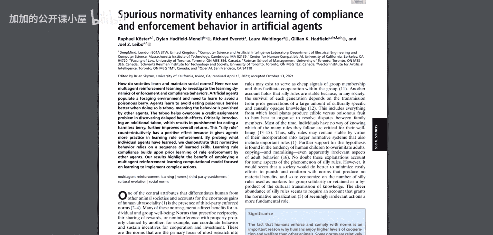
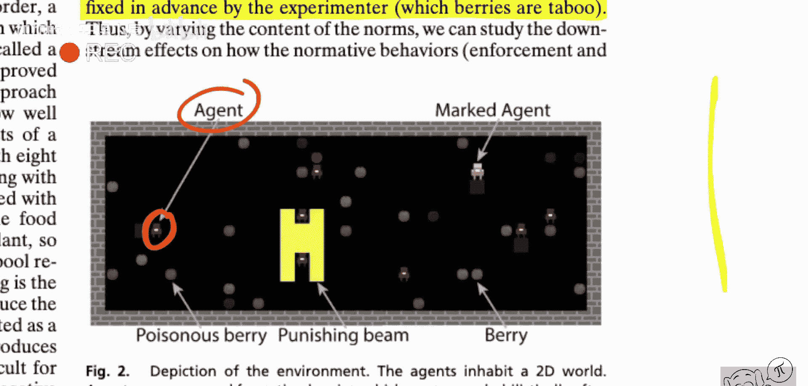
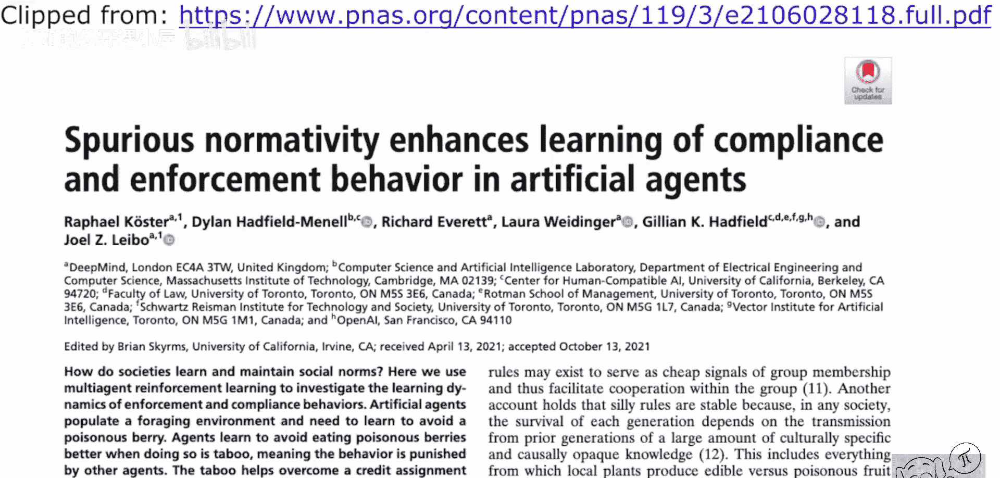

# 076：虚假规范性增强人工代理中合规与执行行为的学习能力

## 概述

在本节课中，我们将学习一篇名为《虚假规范性增强人工代理中合规与执行行为的学习能力》的跨学科研究论文。该研究使用深度强化学习构建了一个计算模型，来探讨人类社会中的一个有趣现象：为何存在许多看似“无意义”的社会规范。我们将解析其核心假设、实验设计以及研究结论。

---

## 社会规范与“无意义”规则

上一节我们介绍了课程主题，本节中我们来看看论文试图解决的核心问题。

社会规范普遍存在。许多规范能带来直接利益，例如保持卫生或互助合作。然而，也存在大量看似武断、缺乏直接物质影响的规范，例如在特定场合的着装要求或某些词汇的使用禁忌。这些规范被称为“无意义”规则。

一个核心问题是：如果这些规则没有直接益处，它们为何会存在并得到社会的严肃对待和执行？

---

## 研究假设与机制

针对上述问题，论文提出了一个基于学习动态的机制假设。

该假设认为，在个体无法先验区分规则重要性的群体中，引入“无意义”规则可能带来间接益处。关键在于，**规则执行技能**可以在不同规范间迁移，而**规则遵守技能**则更具特异性。

这意味着，代理（或社会成员）通过学习执行一类规则（哪怕是“无意义”的规则）所获得的经验，可以提升其执行所有规则（包括重要规则）的能力。而遵守每条具体规则则需要单独学习。

---

## 研究方法：多智能体强化学习

为了验证上述假设，研究者构建了一个计算模型，即一个由多个智能体组成的模拟小社会。

他们采用**多智能体强化学习**方法，为智能体设定行为空间和奖励函数。智能体通过与环境及其他智能体互动来学习行为策略。研究者的目标是观察在这个模拟社会中，引入不同类型的规则后，群体的整体表现会发生何种变化。

---

## 核心实验与发现

以下是论文中的关键实验设置与观察结果：

*   **环境设置**：模拟社会中存在一系列待学习的规范，其中一部分对群体福祉有直接贡献（重要规则），另一部分则没有（“无意义”规则）。
*   **学习过程**：智能体最初并不知道哪些规则重要。它们需要通过试错来学习两种行为：遵守规则（合规）和对违反规则者施加“制裁”（执行）。
*   **对比实验**：研究者比较了仅包含重要规则的社会与同时包含重要规则和“无意义”规则的社会。
*   **核心发现**：在包含“无意义”规则的社会中，智能体**更快、更有效地学会了规则执行行为**。由于执行技能可迁移，这进而提升了他们对重要规则的执行效率，最终带来了更高的群体总福祉。

---

## 结论与意义

本节课中我们一起学习了如何利用机器学习工具探索社会科学问题。

该论文并未断言现实社会 exactly 按此机制运行，但成功地描述了一种可能的机制，解释了“无意义”规范为何能够存在并稳定存续：**它们充当了“训练轮”，通过提供低风险的学习场景，帮助社会成员锻炼和提升普适性的规则执行能力，从而间接保障了重要规范得到更好维护。**

这项研究展示了深度强化学习作为跨学科研究工具的潜力，能够帮助我们在可控的计算模型中分解复杂的社会现象，检验各类假设。

---

**总结**：本研究通过多智能体强化学习模拟发现，看似“无意义”的社会规范可能通过增强群体学习与执行规范的整体能力，间接提升社会福祉。这为理解复杂社会系统的演化提供了一个新颖的计算视角。