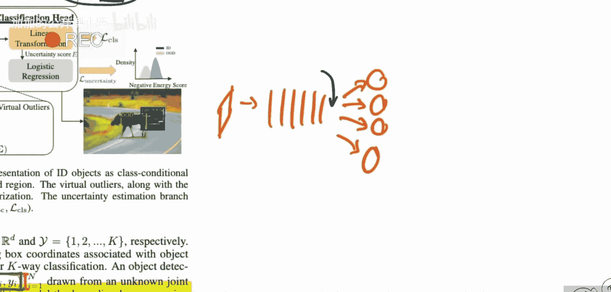
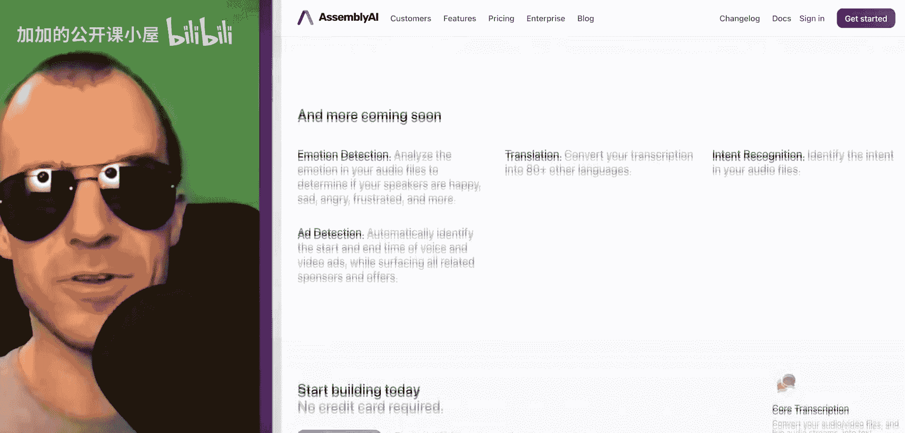
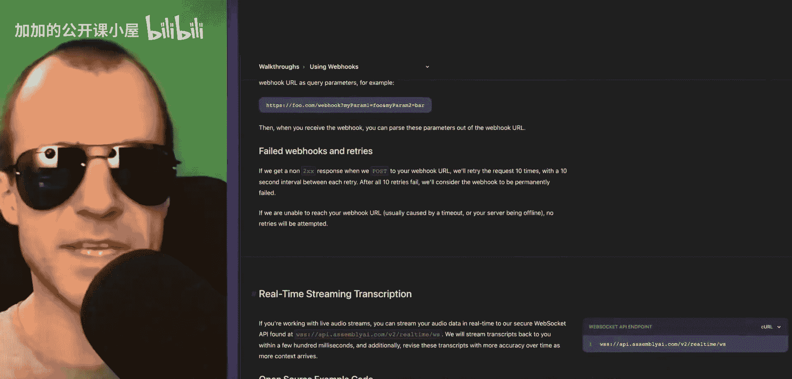
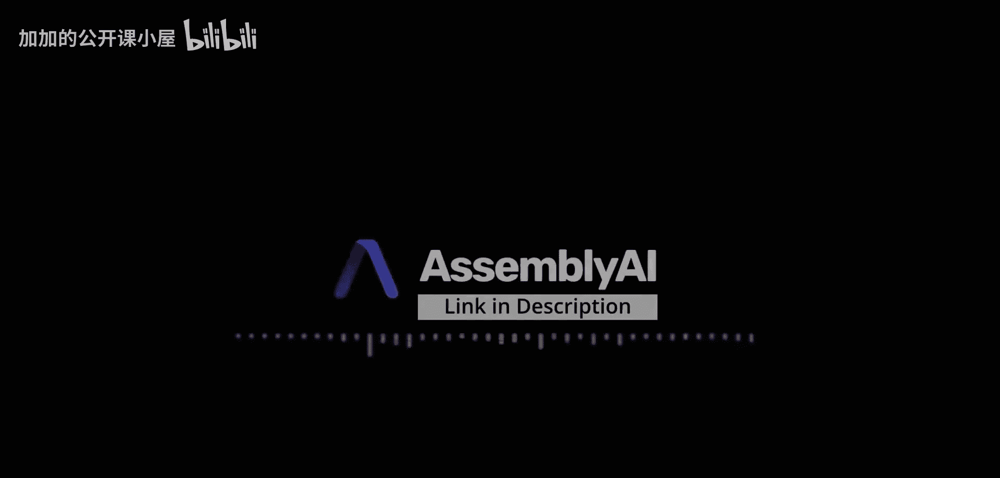
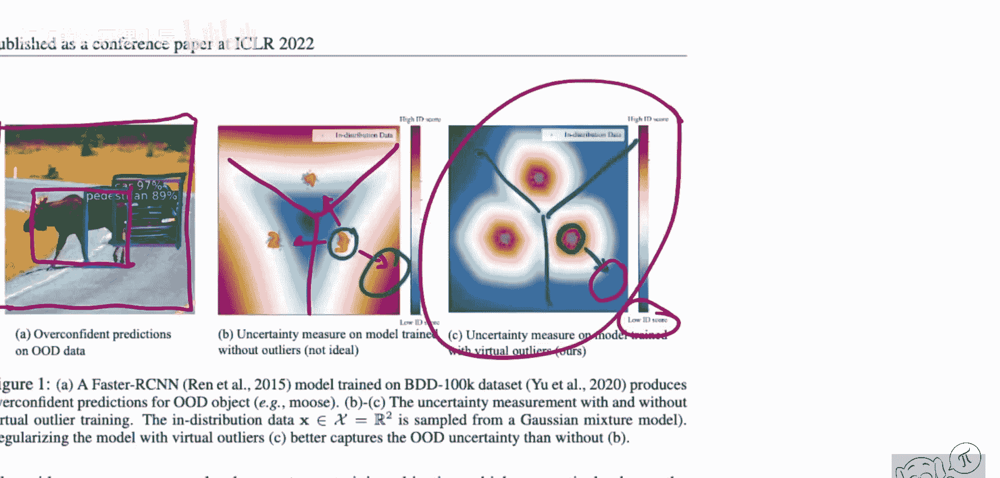

# 077：通过虚拟异常合成学习未知内容（论文详解）


## 概述

在本节课中，我们将学习一篇关于异常检测的论文《Learning What You Don‘t Know by Virtual Outlier Synthesis》。该论文提出了一种名为“虚拟异常合成”的技术，旨在帮助模型识别训练时未见过的“分布外”数据。我们将详细解析其核心思想、方法、贡献以及实验结果。

---

## 异常数据的挑战

我们都很熟悉异常数据点，它们通常不受欢迎。这些数据点为何会出现在分布之外，不在训练数据中，甚至是我们从未见过、未曾预料到的事物？这确实是个棘手的问题。

上一节我们提到了异常数据带来的困扰，本节中我们来看看论文提出的具体解决方案。

---

## 论文核心思想

这篇论文提出了一种技术，用于生成所谓的“虚拟异常”，即合成的分布外数据点。其核心思想是：与其尝试在原始数据空间中生成分布外样本，不如在模型的潜在空间中生成它们。这种方法更为简便，也更具实用性。



论文随后设计了一个损失函数，该函数旨在降低模型在异常数据点处的“能量”，同时提高模型在正常数据点处的“能量”。

---

## 论文评价与作者访谈

这篇论文非常有趣，因为它在多个基准测试上都取得了非常成功的结果。这项技术看起来确实有效。

然而，在阅读论文时，我持批判态度，提出了许多批评和开放性问题。正因如此，我邀请了论文作者进行了一次访谈。




本视频是一个全面的论文评述。我将详细解释论文内容、方法原理、主要贡献、实验结果、优点以及我认为的不足之处。在明天发布的下一期视频中，我将访谈论文作者。作者们将看过我的评述，因此能够回应我提出的任何批评和问题。请务必也观看访谈部分，因为能获得所有问题的解答是非常棒的体验。

---

## 技术演示：语音转录

你是否有一段需要转录的语音？那么，我正好有一个产品推荐给你。Assembly AI 构建了精确的语音转文本API，这意味着开发者只需几行代码就能自动转录和理解音频、视频数据。

这既可以通过传统方式实现——上传音频，获取转录文本；也能实时进行——通过WebSocket连接到其神经网络驱动的后端，实时获取语音对应的文本。这非常惊人。






但这还不是全部。除此之外，他们还有许多功能。例如，他们可以进行**摘要生成**、**主题检测**、**不良词汇检测**以及**音频内容审核**。我必须说，这确实做得很好。事实上，我已经将本视频上传到他们的API，屏幕上显示的文字就是模型的原始输出。你可以自行判断它的效果有多好。

我们来尝试一些瑞士德语词汇测试一下。虽然它是一个英语模型，但我们不妨试试看。

```
shley Gal half has Oh
```

看，这不是很棒吗？所以，去试试吧。他们甚至提供基础免费套餐。他们的文档非常详尽，提供了所有可发送参数的教程和示例。他们还有一个很棒的博客，介绍不同的功能集和应用其技术的各种方式。是的，这确实是一个非常酷的东西。

目前，我在这里只是浅尝辄止。他们做得远不止这些，功能之上还有更多功能。但最好是你亲自去查看。非常感谢 Assembly AI 赞助本视频，这真的很棒。请通过描述中的链接查看他们。祝你使用愉快。

---

## 论文方法详解：VOS

现在，我们来看论文《Learning What You Don’t Know by Virtual Outlier Synthesis》，作者是 Shiing du Zoing Wang Muai 和 Y Xuan Li。

这篇论文提出了一个模型，能够在目标检测网络中执行分布外检测。但不仅如此，他们虽然是在目标检测任务上展示的，但这实际上是一个通用的框架，用于在推理时检测分布外数据。

如果这真的有效，那将对许多应用，尤其是安全关键型应用意义重大。部署在某处作为分类器或检测器的网络，将能够准确识别出它们训练时未学习过的内容，比如某些分布外的类别。

在左边这个具体案例中，你看到一张图片，这是一个目标检测网络在推理时的情况。它正确识别了右侧的汽车。然而，它认为这里的驼鹿是行人。它甚至没有识别出整个驼鹿，而是识别出有一个物体，并将其类别归为“行人”。这可能是因为它在训练时从未见过驼鹿（“moose”的复数是什么？）。总之，它没见过驼鹿，因此无法正确分类。通常，这些网络对于它们未见过的类别会做出置信度非常高的错误预测。

这篇论文正是要解决这个问题，并提出了一种名为“虚拟异常合成”的技术，我们稍后会详细讲解。

正如我所说，这是一个通用框架。他们在目标检测上进行了演示，这是一个特别困难的任务，但该方法也可以应用于图像分类。他们指出，如果你有这样一张图片，并且在训练时没见过“驼鹿”这个类别，那么图像的大部分内容仍然属于分布内。除了驼鹿那一小部分，这整张图并不算特别“分布外”。然而，如果你进行目标检测，那么“物体本身”在这里就是分布外的。也许这反而让研究人员的任务变得稍微容易一些，因为他们较少遇到那种模棱两可的情况，比如半个数据点都是分布外的。

无论如何，他们在此提到，我们当前的网络常常难以处理未知事物，并且会给分布外的测试输入分配很高的后验概率。

---

## 分类器的局限性

为什么会这样呢？如果你训练一个典型的分类器，分类器只会尝试将不同类别彼此分开。你可以在中间这张图中看到这一点。这是神经网络最后一层（分类层之前）的投影，也就是在softmax层之前。最后一层（分类层）所能做的，只是通过数据点的分布来划定线性的决策边界。

模型看到这里有三个类别：类别1、类别2、类别3。它需要做的就是线性地分开它们。所以它会说，好吧，我把决策边界画成这样。这样我就基本上把类别分开了，因为对于分类损失函数来说，重要的是确保类别3的点远离类别1和类别2的点。

这也意味着，我越是远离类别1和类别2的方向，它就越可能属于类别3。因为我在训练时看到的全是类别3的样本，而我的全部目标就是将其推离或区别于类别1和类别2。所以很明显，如果我朝着类别3的方向走得更远，网络就会输出一个越来越确信这是类别3的分数，即使如你所见，数据都集中在这个区域，而在那个区域之外根本没有数据。然而，网络仍然非常、非常确信（这里红色表示相当确信）。

---

## 理想情况

理想的情况是，网络在训练数据所在的区域（这里）非常确信。然而，我们再次看到决策边界是这样的。但是，如果你走得更远，它应该说：等等，虽然这肯定不是类别1，也肯定不是类别2，它最可能是类别3，但是，我在那个区域附近没有见过任何训练数据，所以我也会输出一个较低的概率或置信度分数。我会说它是类别3，但我会给它分配一个低置信度，因为我在那个邻近区域没有见过实际的训练数据。

这一切看起来直观且合理，但这主要是因为在低维和高维空间中，数据特性非常不同，这种简单的投影视图可能会产生误导。作为人类，你看到这些数据会说：当然，这完全合理。然而，当你观察高维数据时，情况就变得非常不同了。请注意，我们的分类器之所以会做出左边那种行为是有原因的，因为右边那种行为本质上相当于对数据分布进行概率建模。



---

## 总结


本节课中，我们一起学习了《Learning What You Don’t Know by Virtual Outlier Synthesis》这篇论文。我们探讨了异常检测的挑战，理解了论文提出的“虚拟异常合成”核心思想，即在潜在空间而非数据空间生成异常样本，并通过能量损失函数训练模型区分分布内外数据。我们还分析了该方法在目标检测等任务上的应用潜力，以及当前分类器在处理未知数据时的局限性。这是一个旨在提升模型在安全关键应用中可靠性的重要研究方向。