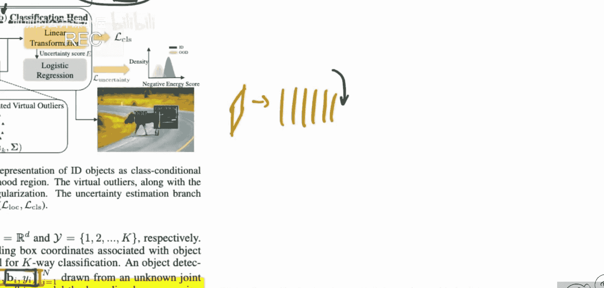
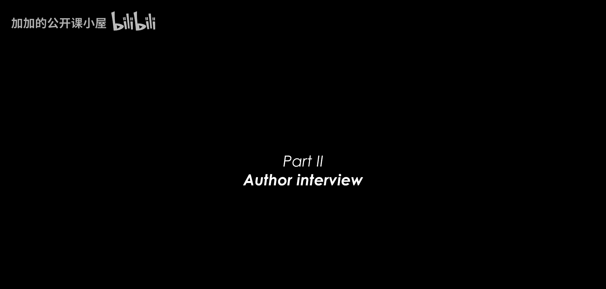
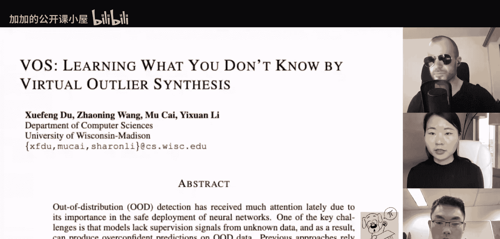

# 078：通过虚拟异常合成学习未知内容

在本节课中，我们将与论文《Learning What You Don‘t Know by Virtual Outlier Synthesis》的作者进行对话，深入了解这项研究背后的动机、发展过程以及核心思想。我们将探讨他们如何提出“虚拟异常”这一概念，并将其应用于更具挑战性的目标检测任务中。

## 研究背景与动机

上一节我们介绍了本次访谈的主题。本节中，我们来看看作者们最初是如何关注到这一研究方向的。

作者之一分享了其研究背后的驱动力。他致力于解决与现实世界紧密相连的实际问题。正如之前提到的，分布外检测对于在现实世界中部署机器学习模型至关重要。随着研究更接近真实场景，问题也变得更加困难和复杂。这一演变轨迹也体现在OOD检测领域多年的发展历程中。

以下是该领域早期研究的一些特点：
*   早期评估算法性能的基准在今天看来相当人为化。例如，在CIFAR-10上训练模型，然后在街景门牌号等数据集上进行评估。
*   这个看似简单的任务，研究社区花费了相当长的时间才取得进展。
*   经过多年努力，算法在降低误报率方面已做得更好。因此，现在正是开始解决目标检测方面更难题目的更好时机。

## 为何选择目标检测任务

上一节我们了解了研究的宏观背景。本节中，我们来探讨作者为何选择目标检测作为具体应用场景。

目标检测之所以重要，是因为它与现实应用有更直接的联系。例如，在自动驾驶场景中，图像远非CIFAR-10那样简单。现实世界中，我们会遇到包含多个对象的场景输入，其中一些是模型在训练时见过的分布内对象，另一些则不是。

因此，作者很高兴能与另一位研究员共同开始解决这些问题，该项目于去年春季学期启动。选择目标检测的动机非常自然，因为许多高风险场景（如自动驾驶）都建立在目标检测模型之上。这些模型不仅需要执行分类，还需要定位对象的位置。

## 从分类到检测的算法演进

上一节我们明确了目标检测任务的重要性。本节中，我们来看看解决方案是如何从图像分类任务中演化而来的。

作者希望超越图像级别的OOD检测，获得更细粒度的、能告知对象级别是否属于分布内的不确定性估计。论文中的图1完美地说明了为何需要对象级别的不确定性：一张图像可以同时包含分布内和OOD对象，因此不能仅推导图像级别的不确定性度量，必须进行更细粒度的对象级别分析。

虚拟异常合成这一算法思想的灵感，主要来源于作者团队2020年发表在NeurIPS上的一篇关于基于能量的OOD检测的论文。在那篇论文中，他们专注于图像分类设置，但从学习算法的角度，提出了一种称为“能量正则化学习”的框架。

该框架的核心思想是，不仅最小化分布内数据集上的风险，同时引入一个正则化器。这个正则化器的精神与本文所用方法非常相似，旨在最小化风险，或试图推动能量表面在已知分布与未知分布之间尽可能可区分。在图像分类设置中，他们使用了“异常暴露”技术，这依赖于一个与分布内数据集不重叠的外部不同数据集。