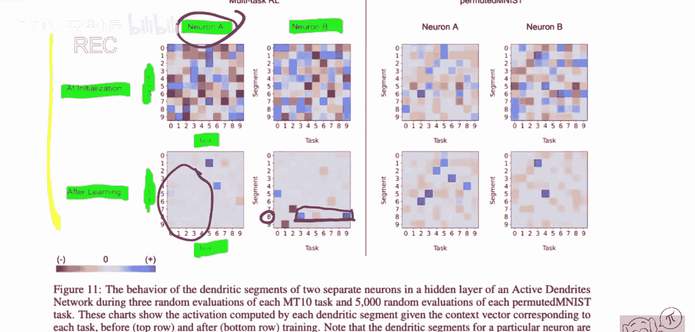
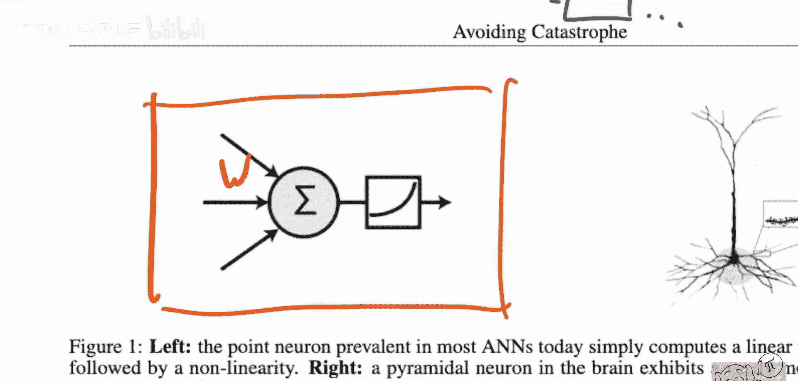

# 079：主动树突在动态环境中实现多任务学习（综述）

## 概述

在本节课中，我们将要学习一篇名为《避免灾难：主动树突在动态环境中实现多任务学习》的论文。这篇论文结合了来自生物学的“主动树突”概念和深度学习中多任务学习与持续学习面临的挑战，特别是“灾难性遗忘”问题。通过将生物学灵感引入深度学习模型，论文提出了一种新颖的解决方案。

## 论文背景与核心问题

这篇论文由Numenta、康奈尔大学和斯坦福大学的研究人员共同完成。它提出将生物神经元中“主动树突”的概念以及稀疏性特征，重新引入到深度学习的人工神经元模型中。

灾难性遗忘是多任务学习或持续学习中的一个现象。当网络需要同时或依次学习多个任务时，新任务的学习会严重干扰或完全覆盖旧任务的知识。使用反向传播的传统神经网络训练方法在处理这类问题时效果不佳。

论文主要关注两种场景：
1.  **多任务强化学习**：智能体在一个包含多个任务的环境中学习，每个回合可能面临不同的任务，奖励取决于当前激活的任务。
2.  **持续学习**：网络按顺序学习一系列不同的任务（例如，不同数据分布的分类任务），在学习新任务后不能遗忘旧任务。

在持续学习基准测试中，论文使用了“置换MNIST”数据集。该数据集对原始MNIST图像的像素应用固定的随机置换，每个任务使用不同的置换方式，从而创造出结构不同但语义（数字类别）相同的任务序列。

## 生物学灵感：主动树突

上一节我们介绍了深度学习在多任务学习中面临的灾难性遗忘问题。本节中我们来看看论文提出的生物学解决方案：主动树突。

生物神经元并非简单的加权求和单元。它们具有复杂的树状结构，称为树突。树突可以主动处理输入信号，而不仅仅是被动传导。某些输入（来自特定“上下文”或“任务”的信号）可以激活树突的特定分支，从而调制神经元对来自其他输入（主要感官信息）的反应。这允许单个神经元根据上下文选择性地响应不同模式。

论文将这种机制抽象并引入到人工神经网络中。核心思想是：让网络中的每个神经元具备根据“任务上下文”动态调整自身响应的能力。

## 提出的模型架构

基于主动树突的灵感，论文设计了一种新的神经网络层。该层的每个神经元接收两类输入：
1.  **主要输入**：即传统的输入数据（如图像像素、特征向量）。
2.  **上下文输入**：一个表示当前任务或环境的信号向量。

神经元的计算过程如下：
*   首先，一个稀疏的“上下文网络”根据上下文输入，为该神经元生成一个稀疏的“树突激活”向量。
*   然后，该神经元计算其所有树突分支（对应一组固定的权重）与主要输入的匹配度。
*   接着，使用树突激活向量对匹配度进行门控（调制），选出被激活的树突子集。
*   最后，神经元的输出基于这些被激活树突的加权和。

**公式描述**：
对于第 `i` 个神经元，其输出 `y_i` 可以简化为：
`y_i = σ( Σ_j (c_ij * g( w_ij · x )) )`
其中：
*   `x` 是主要输入。
*   `w_ij` 是第 `i` 个神经元的第 `j` 个树突权重。
*   `g(·)` 是树突匹配函数（如点积）。
*   `c_ij` 是由上下文输入决定的、稀疏的激活系数（0或1），由上下文网络产生。
*   `σ` 是非线性激活函数。

这种设计使得网络能够根据不同的上下文（任务），利用同一组神经元中不同的子网络（被激活的树突子集）进行处理，从而减少了不同任务间梯度更新的冲突。

## 方法优势与实验效果

这种基于主动树突的方法带来了几个关键优势：

以下是该方法的主要优点列表：
*   **缓解梯度冲突**：不同任务激活不同的树突路径，因此更新权重时，主要只影响与当前任务相关的子集，降低了任务间的干扰。
*   **实现参数软共享**：所有任务共享主要的神经元和树突权重池，但通过稀疏激活实现参数的高效复用，而非完全独立的网络。
*   **引入稀疏性**：稀疏激活符合生物特性，也能提高计算效率，并可能带来更好的泛化能力。

在置换MNIST和多任务强化学习环境中的实验表明，采用主动树突的神经网络显著减轻了灾难性遗忘。与标准前馈网络和某些持续学习方法相比，该方法在序列任务学习后，在旧任务上的性能下降更小，同时能有效学习新任务。

## 总结

本节课中我们一起学习了如何将生物神经元的“主动树突”机制引入深度学习，以解决多任务和持续学习中的灾难性遗忘问题。论文提出的模型通过让神经元根据上下文信号稀疏地激活不同的输入处理路径，实现了在同一网络架构内对多个任务的有效学习与记忆。这种方法为连接神经科学启发与人工智能实践提供了一个有趣的范例。