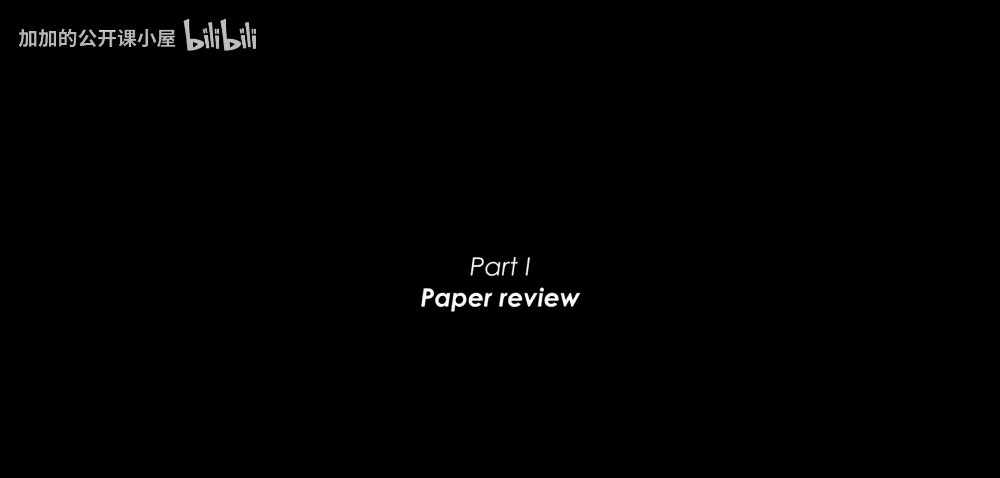
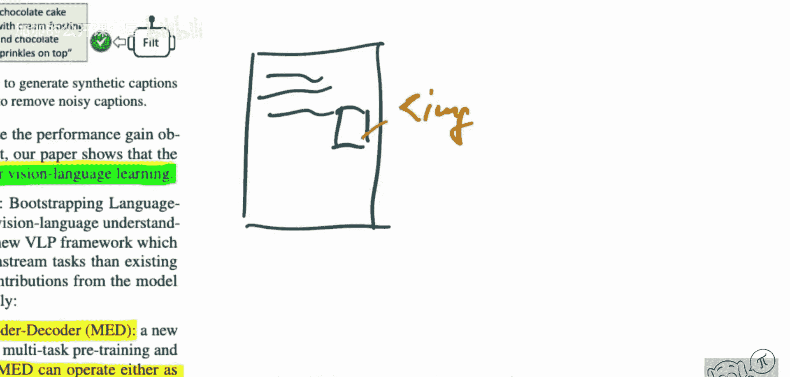

# 080：引导语言-图像预训练，实现统一视觉-语言理解与生成

## 概述

在本节课中，我们将学习一篇名为《BLIP：引导语言-图像预训练，实现统一视觉-语言理解与生成》的论文。这篇论文由Salesforce Research团队提出，它包含两个核心部分：一个新颖的多任务预训练模型架构，以及一个用于提升视觉-语言数据集质量的引导式数据增强方法。我们将逐一解析这些内容，目标是让初学者能够理解其核心思想和技术路径。

## 模型架构：统一理解与生成

上一节我们介绍了论文的整体目标，本节中我们来看看BLIP提出的核心模型架构。该架构旨在克服现有视觉-语言预训练模型的局限性。

现有方法主要分为两类：基于编码器的模型和编码器-解码器模型。基于编码器的模型（如CLIP）擅长判断图像与文本的匹配度，但难以直接用于文本生成任务。编码器-解码器模型擅长根据图像生成文本描述，但在图像-文本检索任务上表现不佳。

BLIP提出了一种**多任务混合编码器-解码器**架构，它能够同时处理理解型任务和生成型任务。该模型接收一个图像-文本对作为输入，并通过不同的模块和损失函数来学习多种能力。

以下是该架构的核心组件与任务：

*   **图像编码器**：使用Vision Transformer (ViT) 将输入图像编码为一系列嵌入向量。
*   **文本编码器**：与BERT相同，用于对文本进行编码。它通过一个额外的`[CLS]`标记来汇总文本信息，用于理解型任务。
*   **图像-文本编码器**：在文本编码器的基础上，通过交叉注意力机制融入图像信息，用于更深入的理解任务。
*   **图像-文本解码器**：在文本解码器（与编码器结构相同，但使用因果注意力掩码）的基础上，通过交叉注意力机制融入图像信息，用于生成任务。

该模型通过以下三个损失函数进行预训练：

1.  **图像-文本对比损失 (ITC)**：对齐图像和文本的特征空间，使匹配的图-文对特征相似，不匹配的对特征相异。其目标函数可简化为：
    `L_itc = -log(exp(sim(I, T+) / τ) / Σ exp(sim(I, T) / τ))`
    其中`sim`是相似度计算，`τ`是温度参数，`T+`是正样本文本。
2.  **图像-文本匹配损失 (ITM)**：这是一个二分类任务，模型需要判断给定的图像和文本描述是否匹配。它使用图像-文本编码器输出的`[CLS]`标记嵌入进行分类。
3.  **语言建模损失 (LM)**：训练模型根据给定的图像，自回归地生成对应的文本描述。它使用图像-文本解码器，其损失函数为标准的下一个词预测损失：
    `L_lm = -Σ log P(w_t | w_<t, I)`

通过这种设计，BLIP模型在预训练阶段就同时掌握了理解（检索、匹配）和生成（描述）的能力，为下游任务提供了灵活的模块化基础。

## 数据引导：CapFilt方法

上一节我们介绍了能够统一处理多任务的模型架构，本节中我们来看看支撑模型训练的高质量数据是如何获得的。论文指出，从网络爬取的图像-文本对通常存在噪声（即文本描述与图像内容不匹配），这会影响模型性能。

为此，BLIP提出了一种名为 **CapFilt（Captioning and Filtering）** 的数据引导方法，用于从噪声数据中清洗和增强高质量数据。该方法包含两个关键模块：一个**字幕生成器**和一个**过滤器**。

以下是CapFilt的工作流程：

1.  **微调字幕生成器**：首先，在一个人工标注的高质量小型数据集（如COCO）上，对BLIP模型的**图像-文本解码器**进行微调，使其成为一个高质量的字幕生成器。
2.  **生成合成字幕**：使用这个微调后的字幕生成器，为网络爬取的大量图像生成新的文本描述。这些合成字幕通常与图像内容高度相关。
3.  **过滤噪声数据**：同时，使用BLIP模型的**图像-文本匹配**模块作为过滤器。它对原始网络文本和合成字幕进行打分，判断它们与图像的匹配程度。只有匹配分数高于一定阈值的文本-图像对才会被保留。
4.  **合并数据**：最终，将人工标注的高质量数据、通过过滤器的原始网络数据以及生成的合成字幕数据合并，形成一个更大、更干净的预训练数据集。

这个过程形成了一个有效的引导循环：模型能力的提升帮助创造了更好的数据，而更好的数据又进一步提升了模型能力。

## 总结

本节课中我们一起学习了BLIP论文的核心内容。我们首先探讨了其创新的多任务预训练模型架构，该架构通过结合图像-文本对比学习、匹配和语言建模损失，统一了视觉-语言的理解与生成能力。接着，我们分析了CapFilt数据引导方法，它通过生成合成字幕和过滤噪声数据，有效地从网络数据中提炼出高质量的训练样本。BLIP的工作为构建更通用、更强大的视觉-语言基础模型提供了重要的架构设计和数据处理思路。