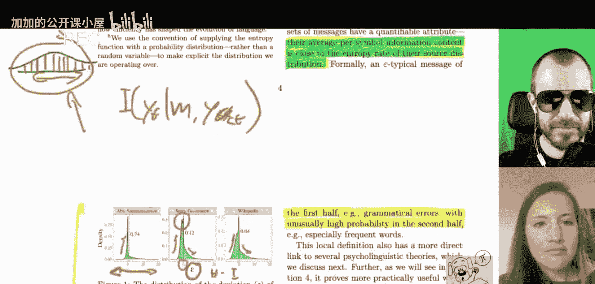
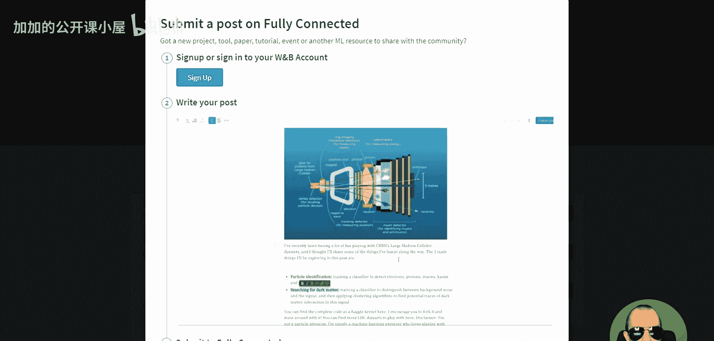
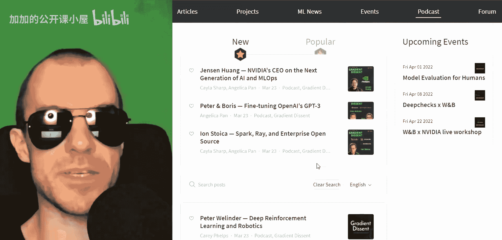
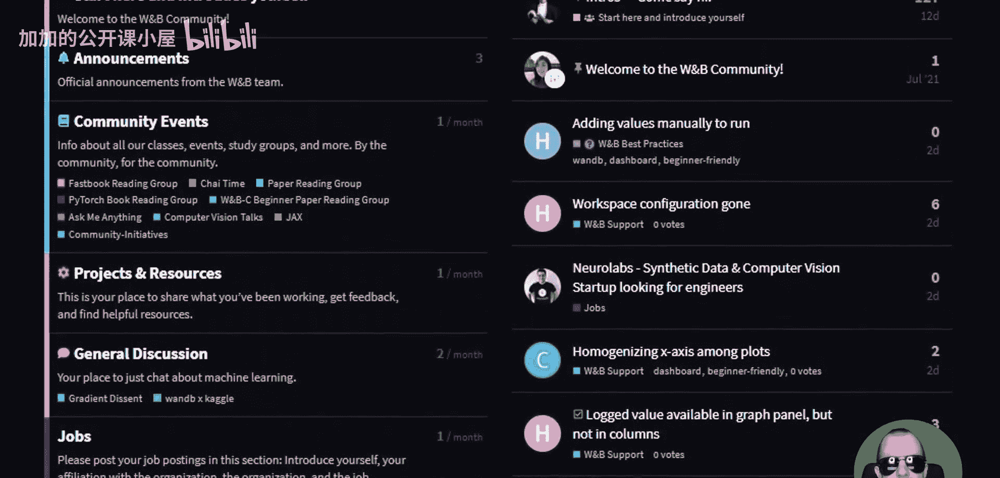
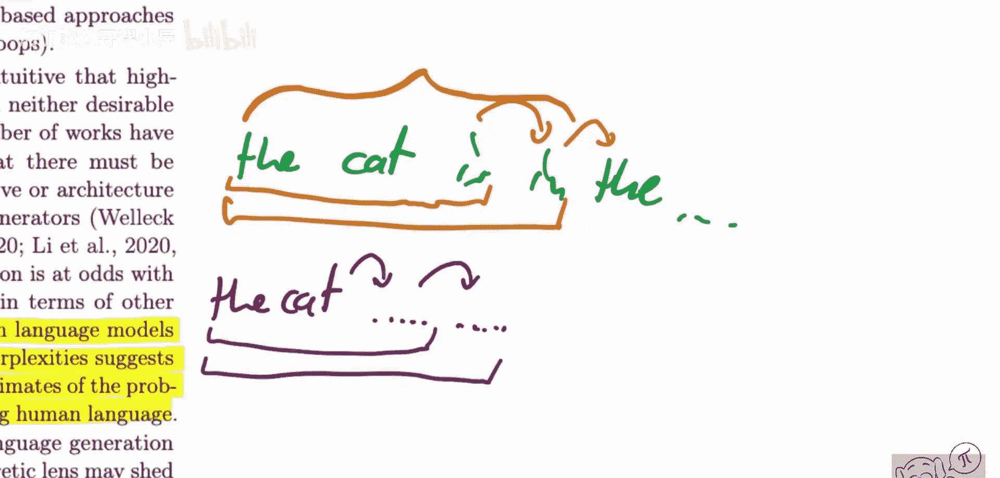

# 081：典型解码（让语言模型输出更接近人类表达！）🚀

## 概述
在本节课中，我们将学习一篇关于“典型解码”的重要论文。这篇论文提出了一种新的语言模型解码策略，旨在让模型生成的文本更接近人类的表达方式，即更有趣、更具信息量，而非仅仅是高概率但乏味的文本。我们将探讨其核心思想、原理、实现方式以及应用价值。

---

## 论文背景与重要性
请注意这篇论文。它并非来自谷歌、DeepMind、Meta等知名机构。然而，我认为它是一篇非常重要的论文。它讨论了典型采样，这是一种从语言模型中采样的新解码策略。

我们通常使用最大似然目标训练语言模型，这会给高概率词汇赋予很大权重。当我们使用这些模型生成语言时，无论是显式还是隐式地，我们都在重现这一点。我们让这些模型采样可能性非常高的字符串，这些字符串是乏味的、不像人类的。这不是我们人类的做法。我不会只说可能性很高的话，因为我实际上想说一些有趣的内容。这意味着，我偶尔应该说一些可能性较低的话。我应该说出一个你意想不到的词或句子，因为这才是传递信息的方式。

典型采样正是以有原则的方式做到了这一点。

---

## 核心概念：典型采样
上一节我们介绍了典型解码旨在解决的问题，本节中我们来看看它的核心概念。

典型采样基于信息理论。其核心思想是：人类在生成文本时，会在**可能性**和**信息量**（或趣味性）之间进行权衡。典型采样旨在通过一个原则性的方法，在解码过程中模拟这种权衡。

具体而言，它通过限制模型输出token的**信息量**（或“惊奇值”）在一个典型范围内来实现。信息量（或负对数概率）的公式为：
**信息量(x) = -log P(x)**
典型采样会从那些信息量接近整个分布信息量期望值的token中进行采样，而不是只选择概率最高或随机采样。

以下是其工作流程的简化描述：
1.  在每一步解码时，计算所有候选token的概率分布 `P(x)`。
2.  计算每个token的信息量 `I(x) = -log P(x)`。
3.  计算整个概率分布的信息量期望值（即熵）`H(P) = Σ P(x) * I(x)`。
4.  设定一个阈值范围（例如，围绕 `H(P)`），仅保留那些信息量在此“典型”范围内的token。
5.  从这些保留的token中重新归一化概率并采样。

这种方法确保了生成的文本既不太过平凡（高概率、低信息量），也不太过离奇（低概率、高信息量），从而更接近人类的语言生成模式。

---

## 方法优势与应用场景
典型采样的优势在于，它无需改变语言模型的训练方式。我们可以直接使用现成训练好的语言模型，并应用这种新的解码策略。

其应用场景广泛。例如：
*   **机器翻译**：可能更需要追求高概率的准确翻译。
*   **故事创作、文本摘要、代码生成（如AlphaCode）**：在这些任务中，我们通常希望牺牲一部分最大似然性，以换取更多的多样性、趣味性或信息量。典型解码在这些场景下尤其有价值。

---

## 现有解码策略的问题
论文首先指出了一个普遍问题：当前的语言模型在许多领域的语料库上具有极低的困惑度，但当用于生成文本时，其表现远非完美。生成的文本往往不理想，例如，过于通用、退化，或者如前所述，乏味、平淡。

这源于一个事实：许多现有方法试图找到概率最大的字符串序列。它们从概率分布中采样时，倾向于采样最可能的内容，因为模型就是这样被训练的。

让我们做一个简短的回顾。语言模型通常通过预测下一个token来训练。例如，给定“The cat is”，模型预测下一个词。在训练时，下一个词由数据集提供，数据中包含了自然的多样性和一些低概率事件。然而，在推理（解码）时，模型需要自己生成后续的token。如果每一步都只聚焦于寻找最可能的下一个token，就会导致生成的文本缺乏变化和趣味性，变得平庸。

---

## 总结
本节课中，我们一起学习了“典型解码”这一新的语言模型解码策略。我们了解到，传统方法倾向于生成高概率但乏味的文本，而人类语言生成会在可能性和信息量之间进行权衡。典型采样基于信息理论，通过确保生成token的信息量处于典型范围内，来模拟这种权衡，从而产生更自然、有趣、像人类的文本。这种方法无需重新训练模型，可直接应用于现有模型，在需要多样性和创造性的生成任务中具有很大潜力。