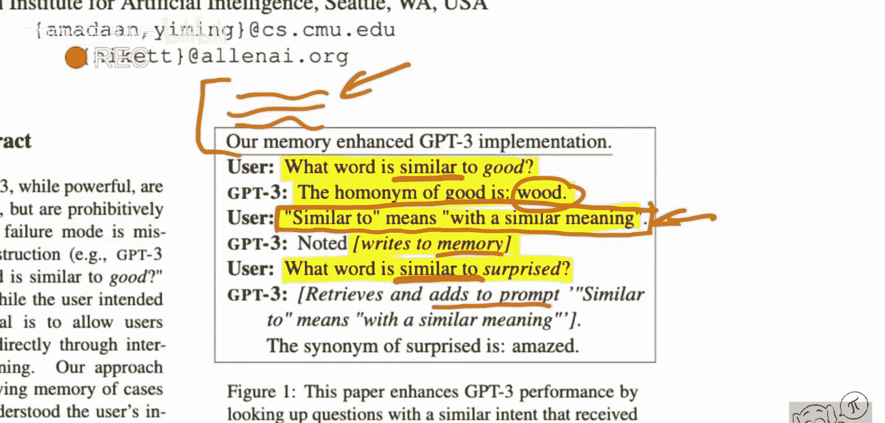
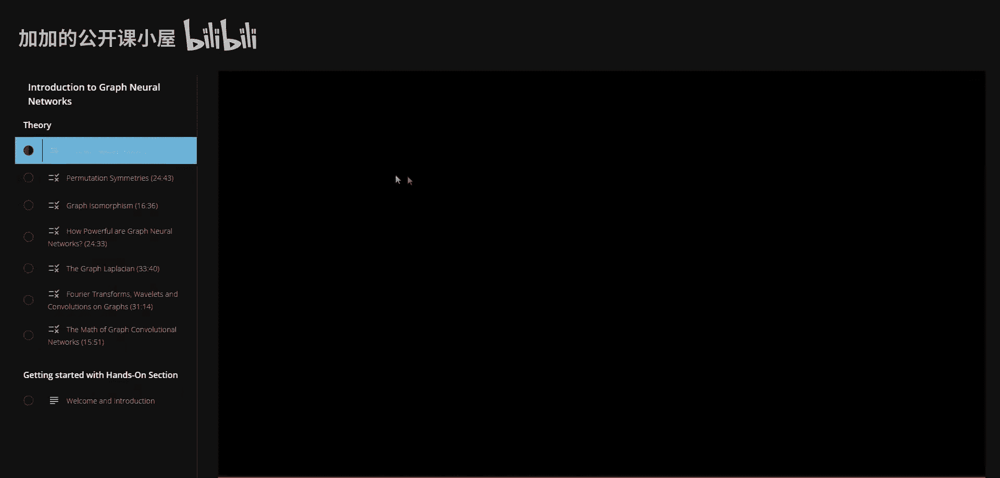
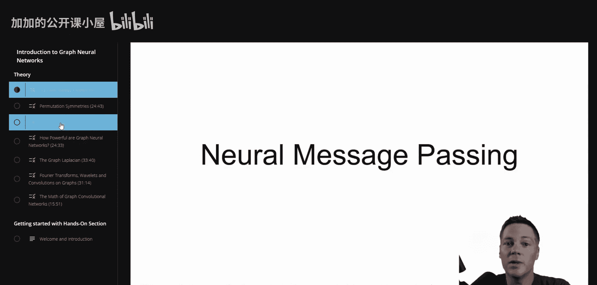
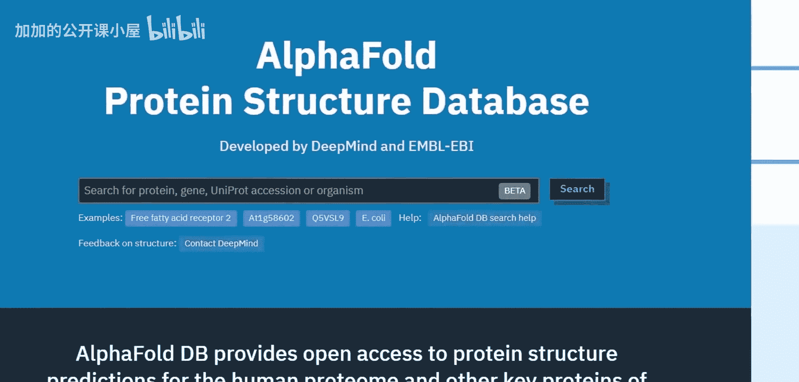
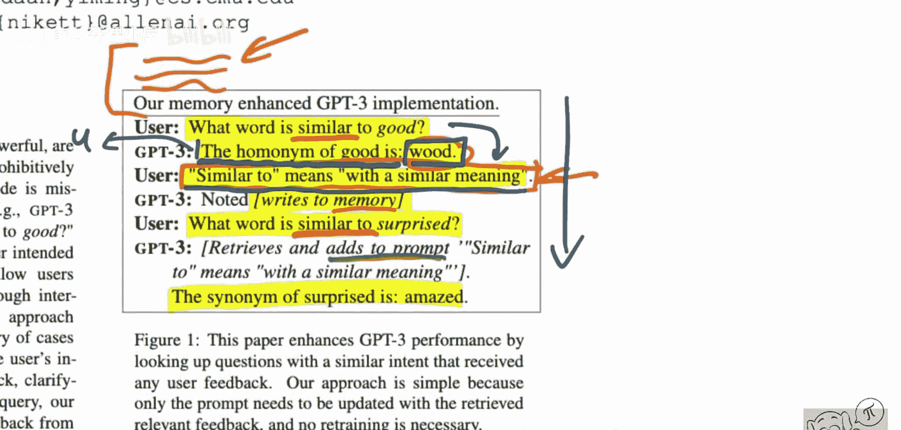

# 082：部署后通过记忆辅助提示编辑改进GPT-3

在本节课中，我们将学习一篇名为《部署后通过记忆辅助提示编辑改进GPT-3》的论文。这篇论文提出了一种新颖的方法，能够在大型语言模型（如GPT-3）部署后，通过用户交互和反馈来持续改进其性能。我们将详细解析其核心思想、工作原理以及潜在应用。

## 📚 论文概述

这篇论文由Amman Madan、Niottanon等人撰写。它提出了一种方法，能够在GPT-3等大型语言模型部署后，通过交互式用户反馈模式来提升其表现。

该方法的核心在于一个“记忆辅助”系统。当用户与模型互动时，如果模型给出了错误或不符合用户意图的回答，用户可以即时提供反馈。系统会将这些反馈存储到记忆中。当用户后续提出类似问题时，系统会从记忆中检索相关的反馈，并将其整合到新的提示中，从而引导模型给出更准确的回答。

## 🔧 方法详解

上一节我们介绍了论文的核心目标，本节中我们来看看该方法具体是如何工作的。

### 系统工作流程

系统的工作流程可以分为两个阶段：初始交互阶段和记忆辅助阶段。

**初始交互阶段（无记忆）**
1.  用户向GPT-3提出一个问题 `X`。
2.  GPT-3基于预设的提示模板生成回答，这个回答不仅包含答案本身，还包含模型对用户意图的“理解”。
3.  用户检查这个“理解”是否正确。如果正确，流程结束。如果不正确，用户提供自然语言反馈 `F`。
4.  系统将这次交互（问题 `X`、模型的错误理解、用户反馈 `F`）存储到记忆中。

**记忆辅助阶段**
1.  用户提出一个新问题 `X'`。
2.  系统首先查询记忆，寻找与 `X'` 语义相似的历史问题。
3.  如果找到相关记录，系统将对应的用户反馈 `F` 提取出来。
4.  系统将反馈 `F` 整合到给GPT-3的新提示中，引导模型正确理解用户意图。
5.  GPT-3基于这个增强后的提示生成最终回答。

### 核心组件

以下是该方法涉及的几个核心组件：

*   **记忆存储**：一个存储历史交互（问题、错误理解、用户反馈）的数据库。
*   **相似性检索**：当新问题到来时，系统需要从记忆中检索出最相关的历史记录。这通常通过计算句子嵌入向量的**余弦相似度**来实现。
    *   **公式**：`similarity = (A·B) / (||A|| * ||B||)`，其中A和B是句子的向量表示。
*   **提示编辑**：这是关键步骤。系统不是直接修改GPT-3模型，而是动态地编辑输入给模型的提示（Prompt），将检索到的反馈信息作为额外指导加入其中。

### 示例演示

让我们通过一个具体例子来理解整个过程：

1.  **第一轮（无记忆）**
    *   用户提问：`“What word is similar to good?”`
    *   GPT-3回答（包含理解）：`“The homonym of good is wood.”` （它理解为“发音相似的词”）
    *   用户反馈：`“Similar to means with a similar meaning.”` （用户澄清意图是“近义词”）
    *   系统将此次交互存入记忆。

2.  **第二轮（记忆辅助）**
    *   用户提问：`“What word is similar to surprise?”`
    *   系统检索记忆，发现新问题与“good”的问题在句式上相似（都是“similar to”结构）。
    *   系统从记忆中提取出针对“similar to”的反馈：`“Similar to means with a similar meaning.”`
    *   系统将反馈整合进提示，再提交给GPT-3。
    *   GPT-3基于增强提示回答：`“The synonym of surprise is amazed.”` （正确理解为“近义词”）

## 💡 方法优势与意义

该方法具有几个显著优势：

*   **无需重新训练模型**：它通过编辑提示（Prompt Engineering）来改进模型，无需对庞大的GPT-3进行参数微调，成本极低。
*   **交互式与个性化**：系统允许用户通过自然语言进行实时纠正，使得模型能够快速适应用户的特定表达习惯和偏好。
*   **从少量样本中学习**：模型能够从少数几次反馈中归纳出一般性的纠正规则，并应用于后续的类似问题中。
*   **通用性**：论文指出，该方法可以作为一个插件，应用于任何预训练的语言模型之上。

其意义在于，它为大型语言模型的“持续学习”和“个性化适配”提供了一条轻量级、实用的路径，更贴近人们对AI助手能够通过交互不断进步的设想。

## 🎯 总结

本节课中我们一起学习了《部署后通过记忆辅助提示编辑改进GPT-3》这篇论文。我们了解到，该方法通过构建一个记忆系统，存储用户对模型错误的反馈。当用户提出新问题时，系统会检索相似的历史反馈，并将其动态插入到提示中，从而引导GPT-3等大型语言模型给出更符合用户意图的答案。这种方法实现了对已部署模型的低成本、交互式改进，是提示工程和模型适配领域的一个有趣进展。