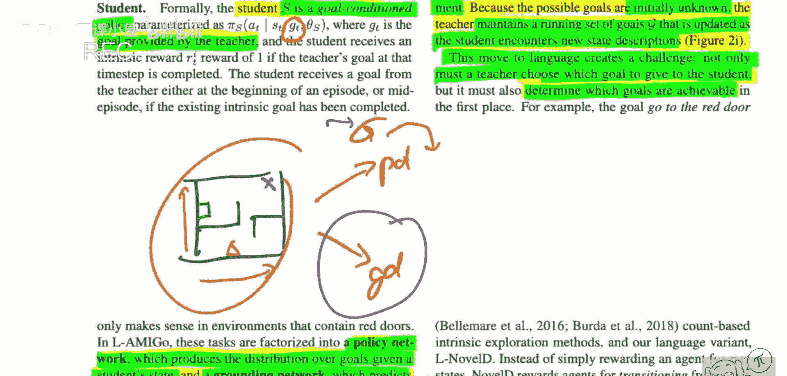
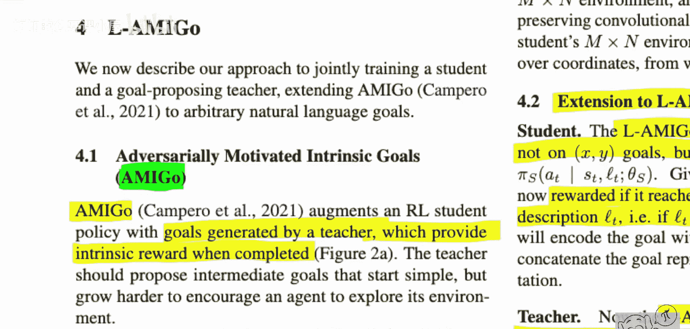

# 083：利用语言抽象提升内在探索能力

## 概述
在本节课中，我们将学习一篇名为《利用语言抽象提升内在探索能力》的论文。这篇论文由斯坦福大学、华盛顿大学、Meta AI和伦敦大学学院的研究人员共同完成。其核心思想是，在强化学习智能体面对奖励稀疏的环境时，如何利用语言描述来引导其进行更有效的内在探索，而非进行无意义的随机尝试。

## 论文背景与核心问题
上一节我们介绍了论文的基本情况，本节中我们来看看它试图解决的具体问题。

在奖励稀疏的复杂、长周期任务中，强化学习智能体通常难以取得进展，因为它们需要密集的奖励信号来学习。为此，研究者引入了**内在探索**或**内在动机**的概念，即为智能体发现新状态提供额外的内在奖励。

然而，实现有效内在探索面临两大根本性挑战：
1.  如何奖励环境中真正的进展，而非无意义的探索？
2.  如何判断一个状态不仅仅是表面不同，而是在语义层面具有新颖性？

这篇论文的解决方案是引入语言描述作为判断状态新颖性的依据。

## 语言作为抽象工具
上一节我们提到了利用语言解决探索难题的设想，本节中我们来看看语言为何能胜任这一角色。

论文指出，语言天然地对有意义的交互和技能获取所需的特征和行为具有强大的先验知识。因为语言本身就是人类为交流有用信息而发展出来的工具。语言既能描述具体动作（如“向左移动”），也能描述抽象目标（如“获得护身符并击败巫师”）。

在实验中，论文假设存在一个语言标注器函数 **L**。这个函数接收环境状态 **s** 作为输入，并输出对该状态的自然语言描述 **L(s)**。在初始阶段，论文将其视为一个“预言机”（即直接由游戏引擎提供），但未来工作可以考虑用语言模型（如CLIP）来学习这个函数。

## 方法论：用语言增强现有算法
了解了语言的作用后，我们来看看论文具体如何将语言整合到探索算法中。

论文没有提出一个全新的算法，而是选择了两种现有的、用于内在探索的先进算法，并通过融入语言信息来增强它们。这种做法的逻辑是：如果加入语言后性能得到提升，就能证明语言描述的有效性。

以下是论文增强的两种算法：

**AMIGO（对抗性激励的内在目标）**
该算法训练一个“教师”和一个“学生”。
*   **教师网络**：负责生成探索目标。
*   **学生网络**：是一个**目标条件策略 π(a | s, g)**，它接收状态 **s** 和教师提供的目标 **g**，并输出动作 **a**。学生的任务是完成教师设定的目标，并因此获得内在奖励。

**语言增强方法**：论文将状态的语言描述 **L(s)** 纳入考虑，使得目标生成和策略学习都能基于更丰富的语义信息，而不仅仅是原始视觉或状态输入。

## 实验环境
上一节我们介绍了方法的核心，本节中我们来看看验证这些方法的实验环境。

论文主要在**MiniGrid**环境中进行测试。这是一个程序化生成的环境，智能体（红色三角形）需要完成一系列动作，例如找到钥匙、打开门、最终获取奖励。由于环境每次生成都不同，且奖励稀疏，通过随机探索成功完成任务的可能性极低。

在这个环境中，语言描述 **L(s)** 是天然可用的（例如，“你看到一把水晶魔杖，意味着有东西可拾取”）。这为论文的假设提供了理想的测试平台。

## 核心贡献与总结
本节课中我们一起学习了《利用语言抽象提升内在探索能力》这篇论文。

论文的核心贡献在于，它提出并验证了**利用语言描述作为抽象工具，可以更有效地衡量环境状态的语义新颖性**，从而引导强化学习智能体在稀疏奖励环境下进行更有意义的内在探索。通过将语言信息注入到AMIGO等现有探索算法中，论文展示了这种方法能显著提升智能体在复杂任务中的学习效率和最终性能。

这项研究为结合自然语言处理与强化学习，解决探索难题，提供了一个新颖且有力的方向。