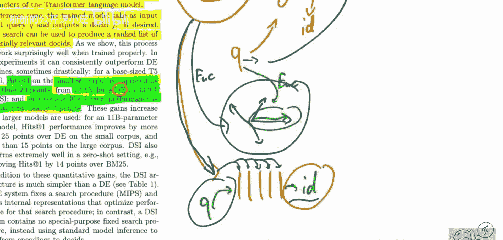

# 084：Transformer记忆作为可微分搜索索引

## 概述
在本节课中，我们将学习一篇名为《Transformer记忆作为可微分搜索索引》的研究论文。这篇论文提出了一种颠覆性的方法，它尝试将整个文档数据集“记忆”在Transformer模型的权重中，从而构建一个完全可微分的搜索引擎。我们将详细解析其核心思想、实现方法以及实验结果。

---

## 论文核心思想

上一节我们介绍了论文的概况，本节中我们来看看其核心思想。

传统搜索引擎通常依赖于倒排索引等数据结构。当用户输入查询时，系统需要检索索引，然后对结果进行排序。神经搜索方法，如双编码器，则将查询和文档分别映射为向量，通过计算相似度来检索。

然而，本文提出的方法截然不同。其核心思想是：**训练一个序列到序列的Transformer模型，使其能够直接根据查询输出最相关文档的ID**。这意味着，模型在训练阶段将整个语料库的信息编码到其权重中；在推理阶段，模型无需访问原始数据，仅根据查询就能“回忆”出正确的文档标识符。

这种方法本质上是将搜索问题转化为一个生成问题，模型需要生成目标文档的ID。其公式化表示如下：

**模型目标**：`P(doc_id | query)`

**训练过程**：最大化给定查询时，真实相关文档ID的条件概率。

---

## 与传统及神经搜索方法的对比

理解了核心思想后，我们来看看这种方法与传统方法的区别。

以下是几种主要搜索方法的对比：

*   **传统方法（如BM25）**：
    *   基于关键词匹配和统计特征（如TF-IDF）。
    *   需要构建和维护显式的索引数据结构（如倒排索引）。
    *   检索和排名是分离的步骤。

*   **神经搜索方法（如双编码器）**：
    *   使用神经网络将查询和文档编码为稠密向量。
    *   检索通过向量空间中的最近邻搜索（如计算内积）完成。
    *   模型负责表示学习，但检索过程本身通常不可微。

*   **本文方法（可微分搜索索引 - DSI）**：
    *   将整个语料库信息隐式地存储在模型权重中。
    *   模型直接输出文档ID，检索过程完全由前向传播完成。
    *   整个系统是端到端可微分的，可以轻松集成到更大的神经网络架构中。

---

## 方法实现与文档表示

上一节我们对比了不同方法，本节中我们深入探讨DSI是如何实现文档“记忆”的。

要让模型输出文档ID，首先需要解决如何表示文档的问题。论文中探索了多种将文档内容编码为模型可学习输入序列的方法。

以下是几种关键的文档表示策略：

*   **文档ID直接输入**：将文档的唯一标识符（如数字或哈希值）作为序列输入模型。模型需要学会将ID与内容关联。
*   **文档内容前缀**：将文档的标题或开头部分文本作为输入，后面接文档ID作为训练目标。这为模型提供了更多语义线索。
*   **结构化输入**：将文档的元数据（如作者、出版日期）与内容结合，形成结构化的输入序列。

模型架构采用标准的编码器-解码器Transformer。在训练时，模型接收代表文档的输入序列，并被要求生成该文档的ID。通过海量的（文档表示， 文档ID）配对数据进行训练，模型逐渐在其参数中建立起从文档语义特征到其唯一标识符的映射关系。

---

## 实验结果与分析

了解了方法如何工作后，我们来看看它的实际效果。

论文在多个标准信息检索数据集上进行了实验，例如Natural Questions（NQ）和MS MARCO。

实验结果显示出有趣的趋势：
*   在较小的数据集上，DSI方法相比强大的双编码器基线取得了显著提升（例如，在某个设置下，Hit@1指标从12.4%提升至33.9%）。
*   然而，在规模扩大30倍的大型数据集上，性能提升幅度减小（约7个点），虽然仍有改善，但优势不再那么巨大。

这个结果是可以理解的。DSI方法要求模型将知识“记住”在固定大小的权重中。当数据量较小时，模型更容易吸收并内化所有信息。随着数据量急剧增长，在有限容量内精确记忆所有文档的挑战性大大增加，因此性能增益会趋于平缓。

---

## 意义与展望

最后，我们来总结一下这项工作的意义和未来方向。

本节课我们一起学习了《Transformer记忆作为可微分搜索索引》这篇论文。它提出了一种新颖的、完全可微分的神经检索范式，将搜索引擎本身转化为一个生成模型。

这项工作的重要意义在于：
1.  **可微分性**：DSI可以作为模块无缝集成到更大的端到端系统中，例如具备检索能力的强化学习智能体。
2.  **架构探索**：它促使我们思考Transformer模型内部如何存储和关联知识。
3.  **简化流程**：它展示了将多步骤的检索-排序流程统一为单一模型的可能性。

当然，该方法也存在局限，主要在于模型容量对可记忆数据规模的限制。未来的工作可能探索更高效的参数化记忆方式、模型缩放律研究，或者将DSI作为混合检索系统中的一个组件。

总而言之，这篇论文为我们提供了一个全新的视角来看待检索问题，即“如果让模型直接告诉我们答案，而不是教它如何查找，会怎样？”这是一个简单、强大且富有启发性的想法。