# 085：基于遗憾的环境设计演进课程 📚

在本节课中，我们将学习一篇名为《ACCEL：基于遗憾的环境设计演进课程》的论文。这篇论文探讨了如何通过自动生成难度递增的训练环境（即“课程”），来教会一个智能体解决一系列具有挑战性的、程序化生成的任务。我们将重点理解“基于遗憾”的课程设计核心思想，以及它如何帮助智能体高效学习。

## 核心问题与直观演示 🎮

上一节我们介绍了课程学习的基本概念，本节中我们来看看论文试图解决的具体问题。

你在这里看到的是一群智能体，它们都从未见过这个关卡。这个关卡实际上是程序化生成的，智能体必须设法克服眼前的障碍。你可以看到这里有树桩和沟壑。绿色的智能体目前表现得相当好。巧合的是，绿色的智能体正是我们今天要讨论的论文中的主角。

这里的核心思想是，这些智能体从未见过这些环境，并且每次我点击重置时，环境都会被程序化重新生成。值得注意的是，在右侧这里有一些滑块，我可以用来控制程序化生成环境的不同属性，例如沟壑的宽度、台阶的数量。当我调整这些滑块时，你可以看到环境变得越来越具有挑战性。在某些时候，它们会变得极具挑战性。

那么问题来了：我们如何利用强化学习来训练一个智能体，使其能够解决这些具有挑战性的环境？因为很明显，如果我想让一个智能体解决像这样的环境（请记住，这是一个程序化生成的环境），我不能仅仅在同一个环境上反复训练它直到成功。如果我想训练一个智能体来解决这里非常困难的一系列环境，使用从零开始的强化学习几乎是不可能的，因为智能体几乎不可能获得任何成功——它们从未完成一个回合，从未获得好的奖励，总是在第一个障碍处就失败。

## 课程学习的解决方案 📈

上一节我们看到了直接学习困难任务的挑战，本节中我们来看看论文提出的解决方案：课程学习。

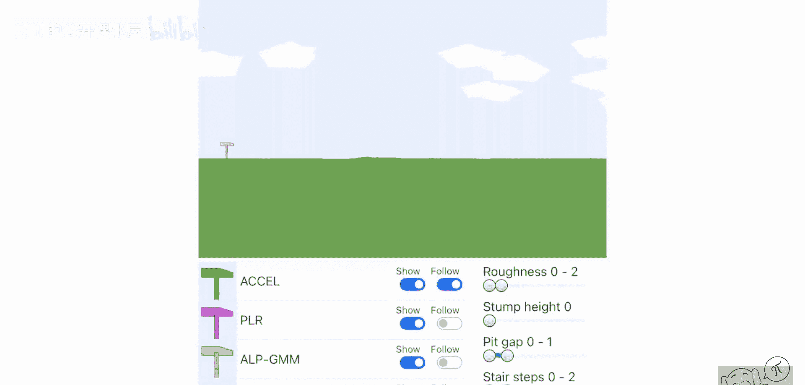

我们的想法是，我们希望制定一个课程。课程意味着我们将利用创建不同难度关卡的能力，来引导智能体学习越来越困难的环境。我们将从非常简单的环境开始，非常平坦的环境，里面没有太多沟壑或台阶。就像这样相当简单的环境。我们使用强化学习，试图教会智能体解决这个关卡。现在，它们中的大多数在这个关卡上会表现得相当不错。正如你所见，问题不大。有些会绊倒，有些不会，但这是可以解决的。

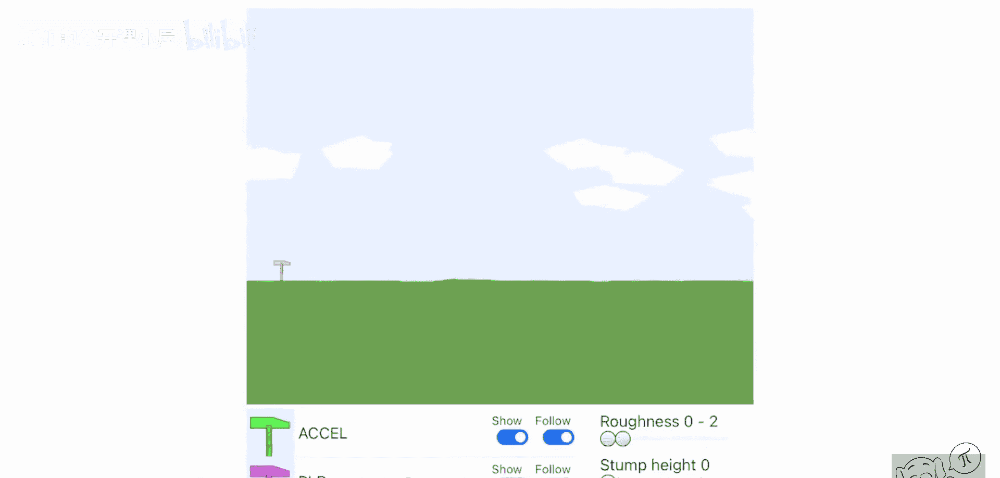

然后，随着智能体变得越来越好，我们将逐步增加关卡的难度。通过这种随时间增加的难度，智能体有机会学习越来越多的技能来解决这些关卡。因此，从零开始学习困难环境可能是不可能的。然而，如果我们为智能体设计一个正确难度序列的课程，就有机会成功。

这类似于人类的学习方式。你可能听说过，你需要在“最近发展区”内进行训练，这本质上意味着你总是要挑战自己当前能力范围之外一点点的任务，这样才能最大化你的学习进度。我们在这里通过随时间演进的课程，遵循的是同样的理念。

## 论文与算法概述 📄

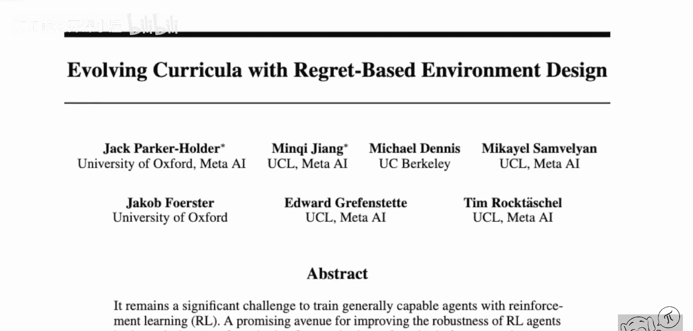

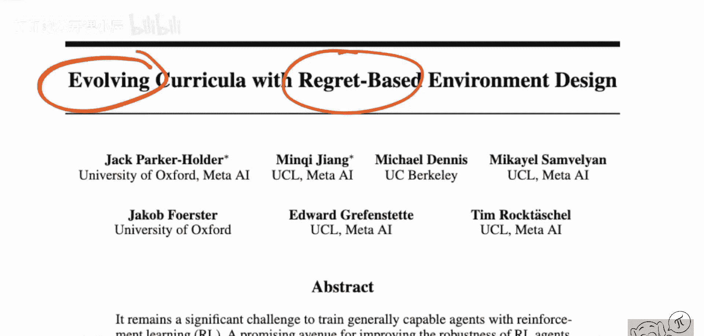

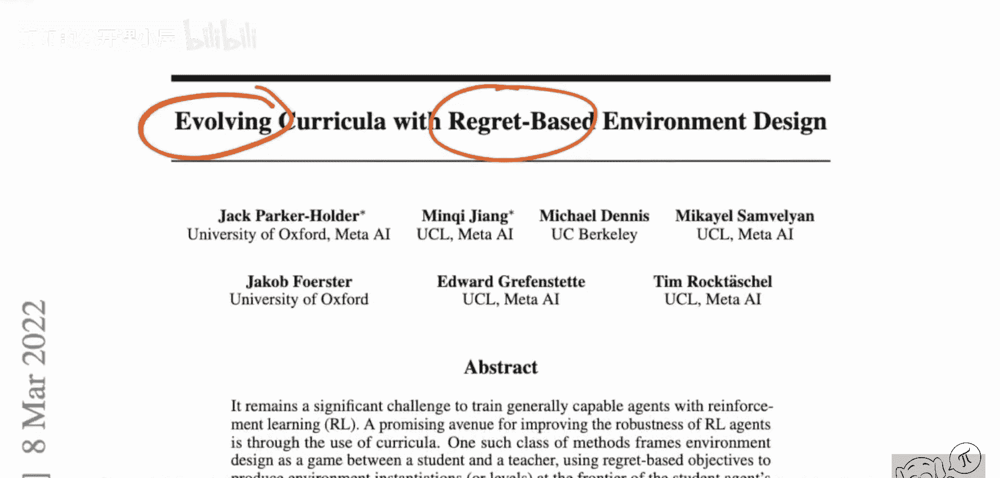

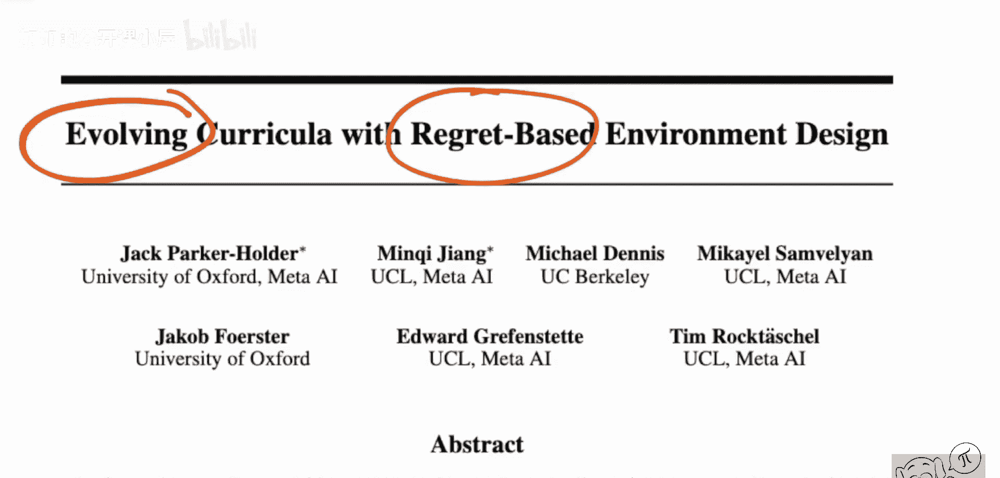

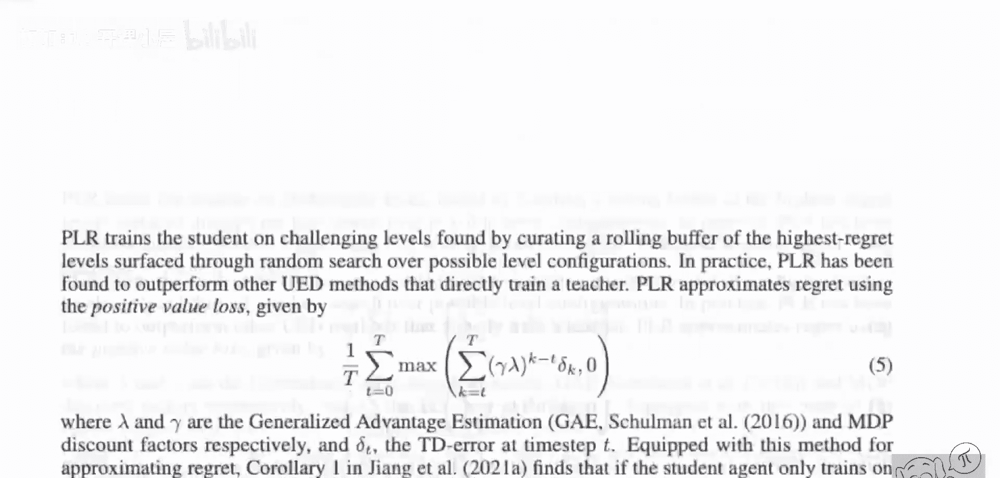

上一节我们了解了课程学习的直观理念，本节中我们来看看论文的具体方法和算法框架。

我们将要看的论文名为《Evolving Curricula with Regret-Based Environment Design》，作者是 Jack Parker-Holder、Minqi Jiang 等人，主要来自 Meta AI，并与 UC Berkeley、University of Oxford 等机构合作。这篇论文结合了基于遗憾的算法和进化方法这两种近期用于构建课程的技术。

论文提出训练一个单一的智能体（而非一组智能体），使其普遍能够解决各种难度的关卡。这是通过一个由教师算法提供的自动化课程来实现的。教师算法本身不是学来的，而是由这里展示的示意图定义的。它是基于遗憾的，这使其独立于特定领域的启发式方法。因此，该算法的目标是拥有一个通用的算法来设计这些课程，而不需要为所有需要解决的不同任务创建新的启发式规则。

## 算法核心组件与流程 ⚙️

上一节我们介绍了论文的目标，本节中我们来深入看看算法本身是如何运作的。

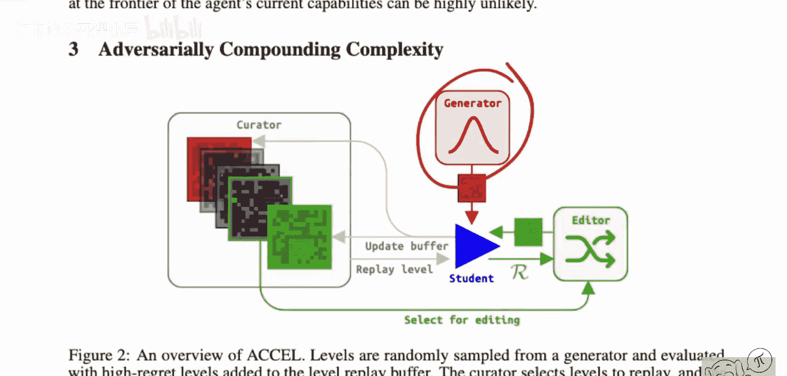

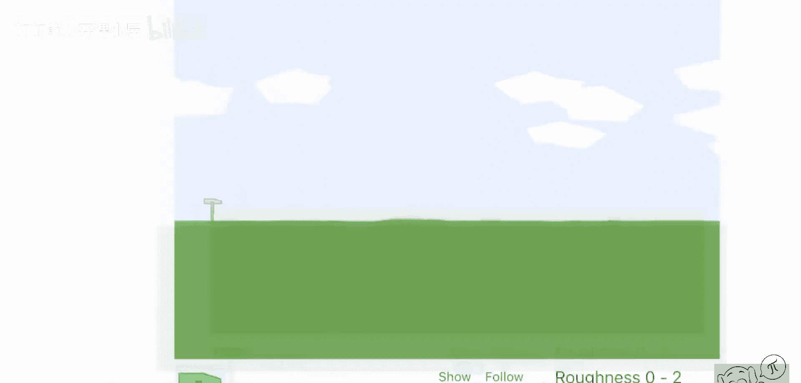

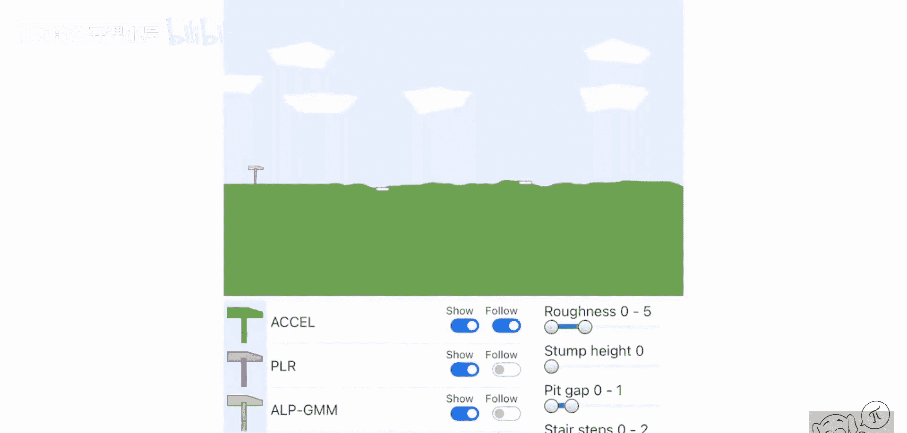

我们将看看它，这是算法本身的简要概述。它是如何做到的？如何让智能体逐步学习？最困难的问题是：你以多快的速度增加关卡的难度？因为如果你增加得不够快，你基本上会停滞在学习中；如果你增加得太快，又会遇到同样的问题，即智能体将无法跟上。

所以，你需要的是某种关卡生成器，这正是我们之前在网页演示中看到的。顺便说一下，你可以自己去尝试这个网页演示。你需要某种关卡生成器，本质上就是我右边这里的东西。我需要有能力创建不同的关卡。这不一定需要像这里一样参数化。例如，在他们描绘的这个迷宫世界中，我只有一个空房间，然后我有能力在其中放置方块。所以每个像素要么是墙，要么不是墙，仅此而已。那就是一个生成器。生成器可以只是放置方块，仅此而已。不需要像这里那样有一个控制难度的滑块，这一切都将完全自动完成，正如你将看到的。

## 从生成到筛选：构建有效课程 🧩

上一节我们介绍了关卡生成器，本节中我们来看看如何从生成的众多关卡中筛选出有效的训练内容。

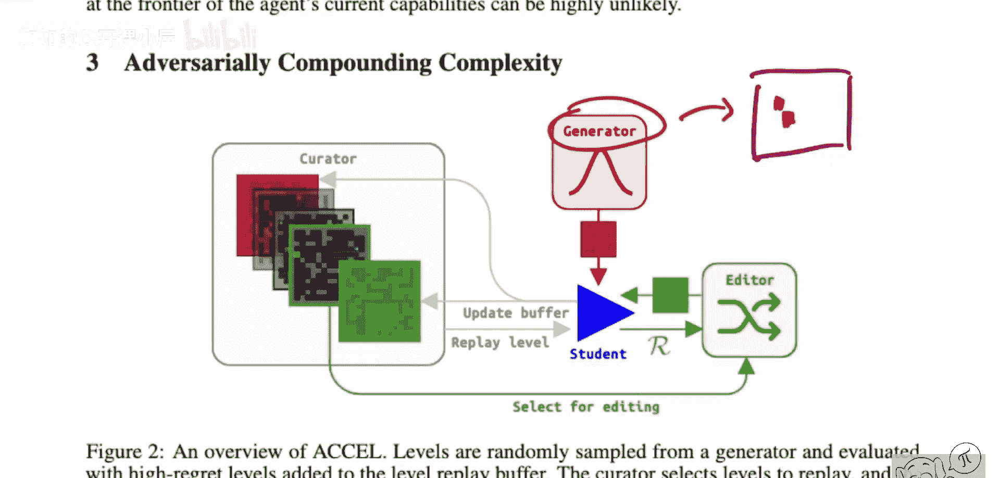

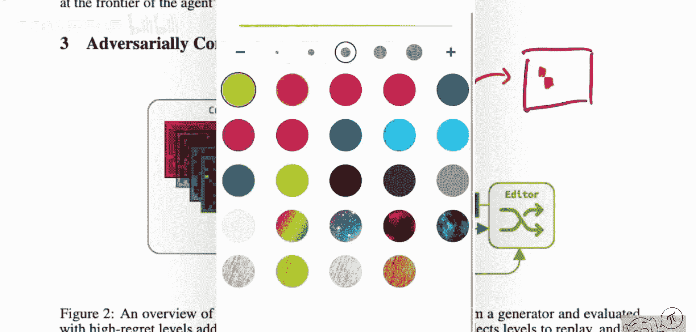

一旦我们有了生成器，我们其实已经可以构建某种课程算法了，对吧？我们可以只是从生成器中采样不同的关卡，然后在所有关卡上训练智能体。然而，这不会构成一个很好的课程，因为它可能会在整个过程中生成简单和困难的关卡，智能体可能能解决一些简单关卡，也许还能解决一些较难的关卡。但如果你没有正确地排序，很有可能会失败。主要是因为随着关卡设计空间变得越来越大，大多数关卡要么落在“太简单”的区域，要么落在“太难”的区域，而不会有很多落在“最近发展区”内，因此你不会有很多学习信号。

所以我们需要以某种方式过滤和策划我们生成的这些关卡。我们有一个生成器，生成器只是给我们一堆初始关卡。我相信你也可以在算法中访问生成器，等等。但想象一下，生成器只给我们一堆初始关卡。这是其中一个初始关卡。我需要换一种颜色，否则你看不见。这样更糟，谢谢。

所以生成器给我们一堆初始关卡，这些关卡交给“学生”。再次强调，这里的“学生”是一个单一的智能体，不是一组智能体。这里的进化方法不是针对学生，而是针对关卡本身。所以有一个学生在所有不同的关卡上训练。我们要做的是简单地评估：我们让学生在这个关卡上运行，看看它做得如何。我们将测量它的“遗憾”。学生的遗憾我们稍后会讲到，它本质上是对学生在该特定关卡上距离最优策略有多远的一个估计。我们想要做的是，严格选择那些具有高遗憾的关卡。

即那些学生距离最优策略还很远的关卡，因为那些是学生仍然可以学到东西的关卡。如果我们正确地做到这一点，那么这将自动按照难度序列排列这些关卡，使它们总是刚好在学生能力的边缘。你稍后会看到这是如何工作的。所以我们想要测量它们的遗憾，并且我们有这个缓冲区。缓冲区是所有我们目前认为对学生学习有趣的关卡的存放处。这个缓冲区由“策展人”管理。策展人本质上就是一个我们认为有趣的关卡集合。然后我们要做的是，我们可以重放这些关卡，这样我们就可以实际在关卡上训练学生。但是，如果我们只是在这些关卡上训练学生，那并不是很有趣，所以我们还需要一种方法来更新那个缓冲区。

---

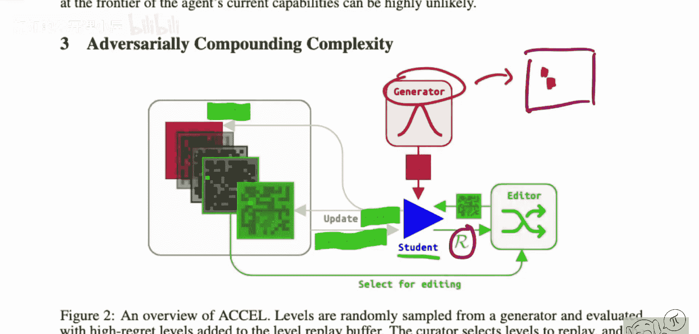

**本节课中我们一起学习了**“基于遗憾的环境设计演进课程”（ACCEL）的核心思想。我们了解到，通过一个能够程序化生成不同难度环境的生成器，并利用“遗憾”作为衡量标准来筛选那些刚好超出智能体当前能力范围（即“最近发展区”）的关卡进行训练，可以构建一个自动化的、高效的课程。这种方法避免了手动设计难度序列的麻烦，并能引导单一智能体逐步掌握解决一系列复杂任务的能力。关键步骤包括：生成初始关卡、评估智能体在各关卡上的“遗憾”、将高遗憾关卡存入缓冲区用于训练，并动态更新缓冲区以维持挑战性。