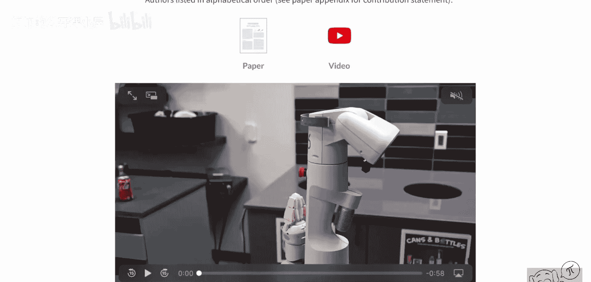
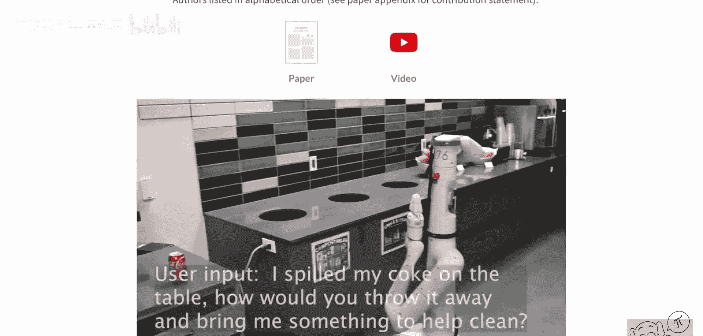
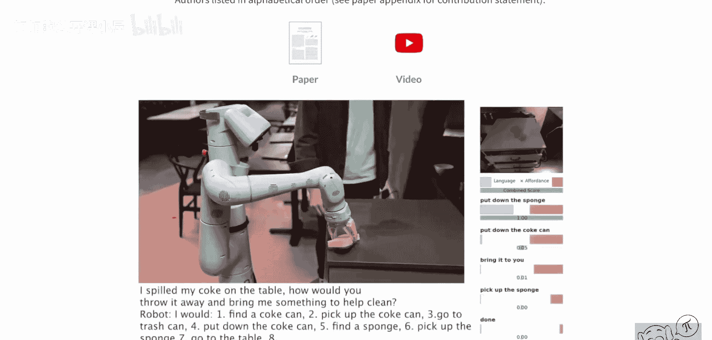
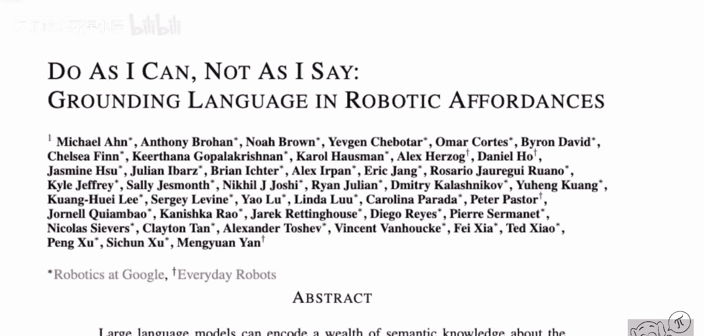
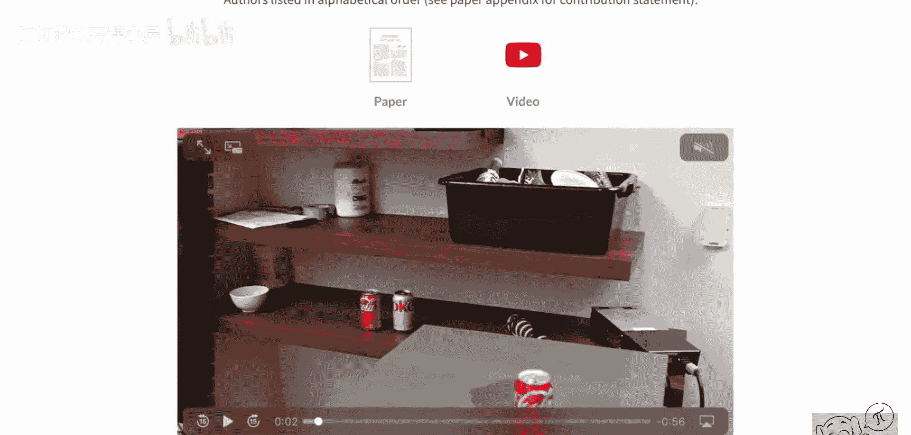
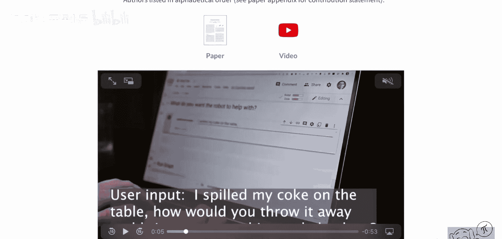
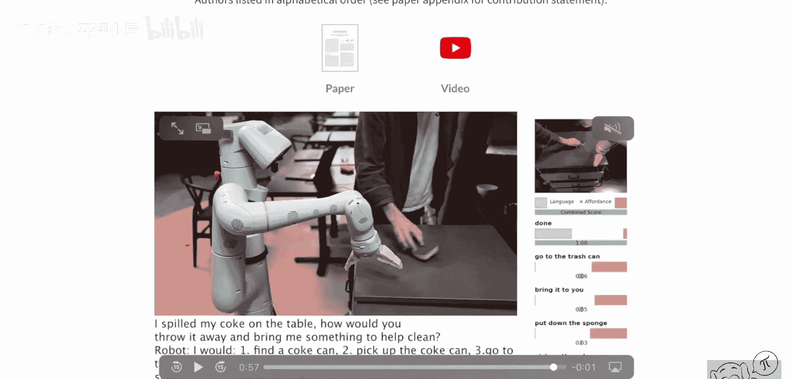
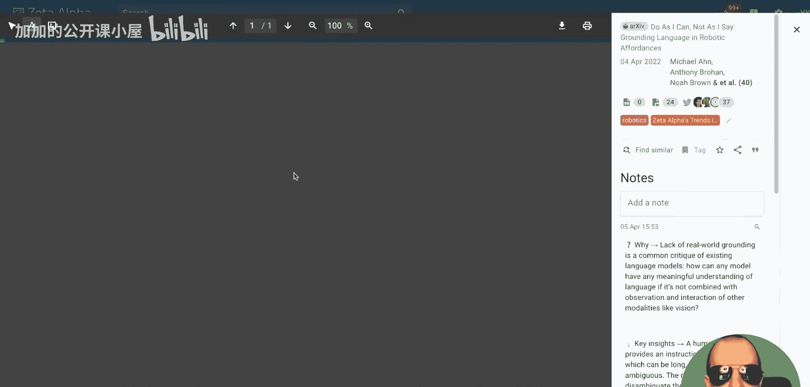
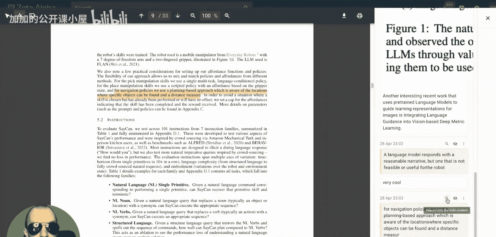

# 086：将语言基础建立在机器人可供性中（SayCan论文解析）🚀

## 概述
在本节课中，我们将学习一篇名为“Do As I Can, Not As I Say: Grounding Language in Robotic Affordances”（简称SayCan）的论文。这篇研究由谷歌机器人团队和Everyday Robots的研究人员完成，它探索了如何将大型语言模型与机器人在现实世界中的技能相结合，使机器人能够理解并执行复杂的自然语言指令。我们将通过一个生动的视频案例来引入问题，并逐步解析其核心方法。

---

## 视频案例引入
视频中，桌子上有一罐可乐被打翻了。人类向机器人发出指令：“我把可乐洒在桌子上了。你如何把它扔掉，并给我拿点东西来帮忙清理？”

机器人随后制定并执行了一个计划：
1.  首先，它说“我会找到一个可乐罐”。
2.  接着，它执行了“捡起可乐罐”的动作。
3.  然后，它“走向垃圾桶”。
4.  最后，它“放下可乐罐”——值得注意的是，它将罐子放在了垃圾桶旁边，而不是扔进去。这体现了机器人环保的意识，它知道罐子应该被回收，而非当作普通垃圾处理。

完成这部分后，机器人继续执行计划：
5.  它说“我会找到一块海绵”。
6.  它“捡起海绵”。
7.  然而，它并没有自己清理洒出的可乐，而是将海绵递给了人类。这引发了一个有趣的思考：未来的机器人或许不会替人类完成所有脏活累活，它们可能会“指挥”人类自己动手。

这个视频展示了机器人如何将一个简单的自然语言指令，分解并执行为一连串具体的物理动作。

---

## 核心问题与动机
上一节我们看到了一个成功的交互案例，本节中我们来看看这项研究旨在解决的核心问题。

作者指出，如果直接向一个大型语言模型（如GPT-3）提问“如何清理洒出的液体？”，模型可能会生成一个听起来合理的叙述性计划。然而，这个计划**可能并不适用于**需要在特定环境中执行该任务的特定智能体（例如机器人）。

以下是作者列举的例子：
*   **指令**：“我把饮料洒了，你能怎么帮忙？”
*   **GPT-3的回答**：“你可以尝试使用吸尘器。”

这个回答存在两个问题：
1.  环境中**不一定有**吸尘器。
2.  执行任务的机器人**可能不具备**操作吸尘器的能力（例如，需要插电、移动部件复杂等）。

即使通过提示工程（Prompt Engineering）告诉模型当前世界的部分信息，效果也有限。因此，我们需要一种更好的方法，将语言模型的高层语义知识与机器人在具体环境中的可行能力结合起来。

---

## 解决方案：SayCan方法
为了解决上述问题，SayCan论文提出了一种结合大型语言模型与机器人技能价值函数的方法。其核心思想是：**让语言模型提供与任务相关的高层知识，让机器人策略提供动作的可行性评估，两者共同决策。**

### 核心概念
假设我们有一个机器人，它已经学会了一系列用于**基础原子行为**的技能（例如“拿起某物”、“走向某处”）。这些技能能够处理低层的感知与控制。

关键的一步是，如果我们能让大型语言模型**感知到当前可用且可行的技能库**，那么模型就能同时理解**智能体的能力**和**环境的当前状态**。

### 方法流程
SayCan的工作流程可以概括为以下几个步骤：

以下是该方法的核心步骤分解：
1.  **理解指令**：机器人接收一个自然语言指令（例如，“清理洒出的可乐”）。
2.  **生成候选动作**：大型语言模型基于指令和上下文，生成一系列可能的下一个动作描述（例如，“找到可乐罐”、“拿海绵”）。
3.  **评估动作可行性**：对于每个语言模型生成的动作候选，机器人的**价值函数**会评估在当前环境下执行该动作的可行性概率，即 `P(可行性 | 动作， 当前状态)`。
4.  **计算综合得分**：将语言模型给出的动作概率 `P(动作 | 指令)` 与价值函数给出的可行性概率相乘，得到一个综合得分。
    *   公式表示为：`综合得分 = P(动作 | 指令) * P(可行性 | 动作， 当前状态)`
5.  **选择与执行**：选择综合得分最高的动作，由机器人执行对应的原子技能。
6.  **循环迭代**：执行完一个动作后，更新环境状态，重复步骤2-5，直到任务被判定为完成。

通过这种方式，系统确保每一步选择的动作既是符合语言指令意图的，又是在当前物理环境下实际可执行的。

---

## 工具推荐：Zeta Alpha
在进行学术研究时，从海量论文中快速找到并理解相关工作是巨大的挑战。本节为大家推荐一个高效的工具。

Zeta Alpha是一个面向学术论文的智能搜索与推荐引擎。它的功能非常强大：
*   **聚合搜索**：搜索一篇论文时，不仅能找到原文，还能看到所有社交媒体上对它的讨论。
*   **语义查找**：通过神经搜索技术，可以一键找到语义上相关的论文，而不仅仅是引用关系。
*   **个性化推荐**：你可以将论文添加到自定义标签中，系统会根据这些标签为你构建个性化的论文推荐流。
*   **智能PDF阅读器**：它内置的PDF阅读器不仅能看论文，还能高亮重要信息、做笔记。最酷的是，你可以直接用笔记中的一段文本去搜索其他讨论相同主题的论文。

对于学生和学者，Zeta Alpha提供免费的Pro会员。普通用户使用促销码“YANNIC”也可获得20%的订阅折扣。这是一个帮助大家保持学术前沿洞察力的优秀工具。

---

## 总结
本节课中，我们一起学习了SayCan这篇开创性的论文。它通过将大型语言模型提供的“上下文合理性”与机器人价值函数提供的“物理可行性”相结合，解决了机器人理解并执行复杂自然语言指令的难题。这种方法使机器人能够像视频中展示的那样，将“清理洒出的可乐”这样的高级指令，一步步分解为在真实世界中可执行的原子动作序列，标志着语言模型在具身智能（Embodied AI）应用中的重要一步。