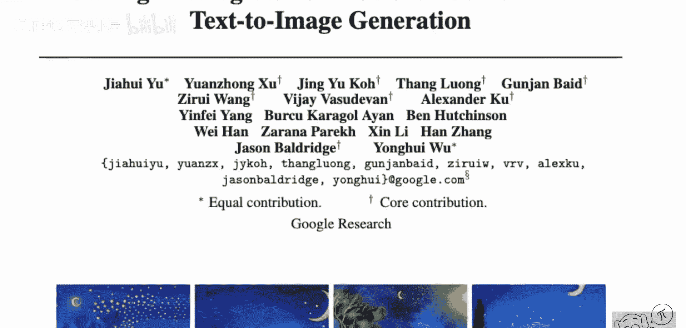
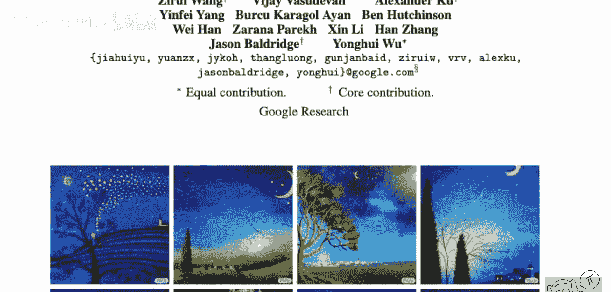
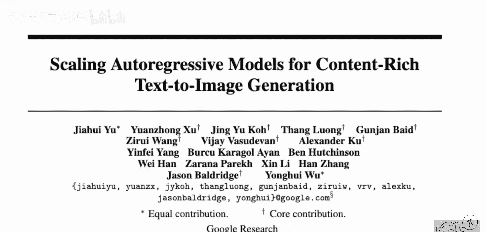
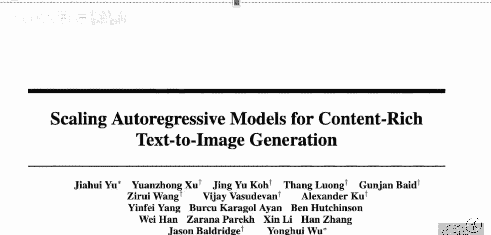
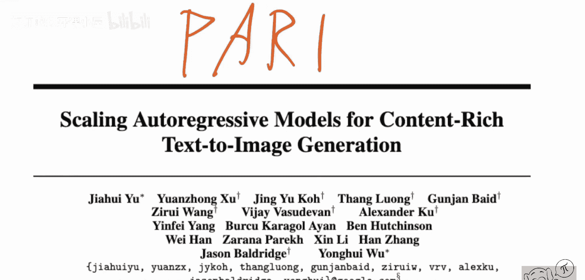
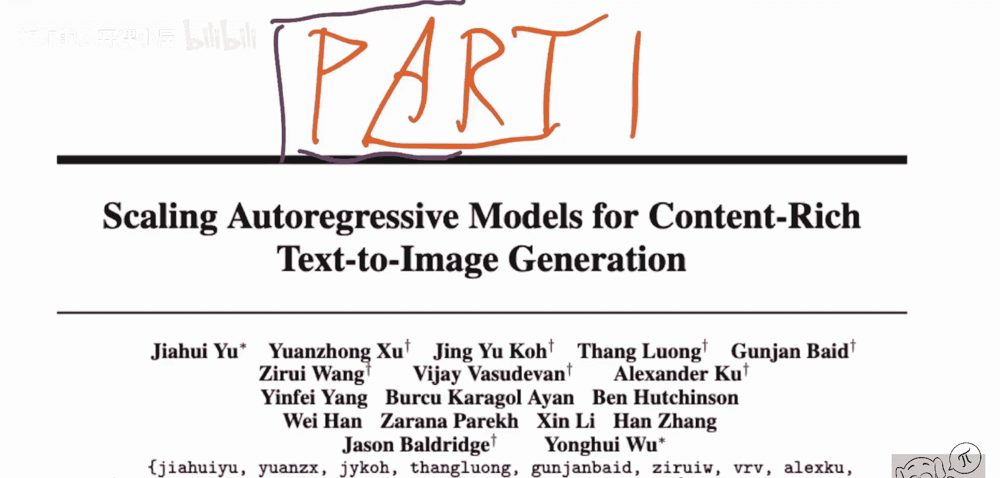
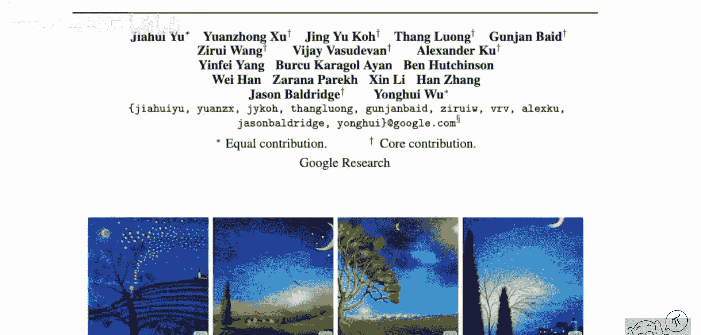
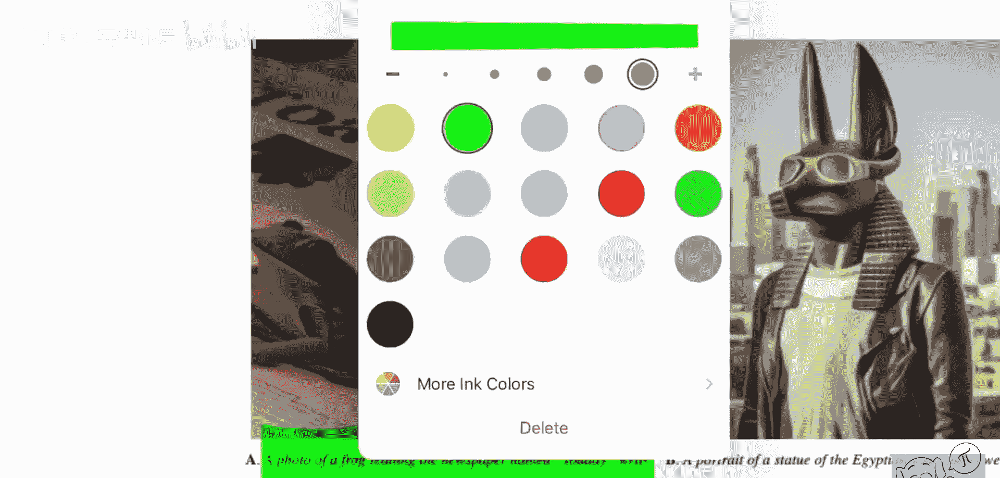
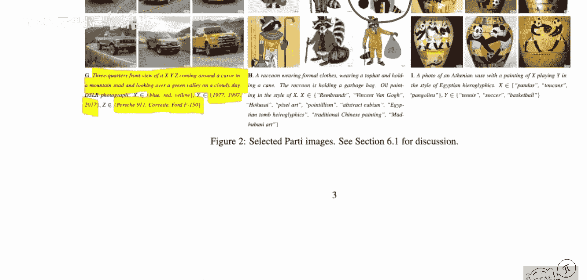
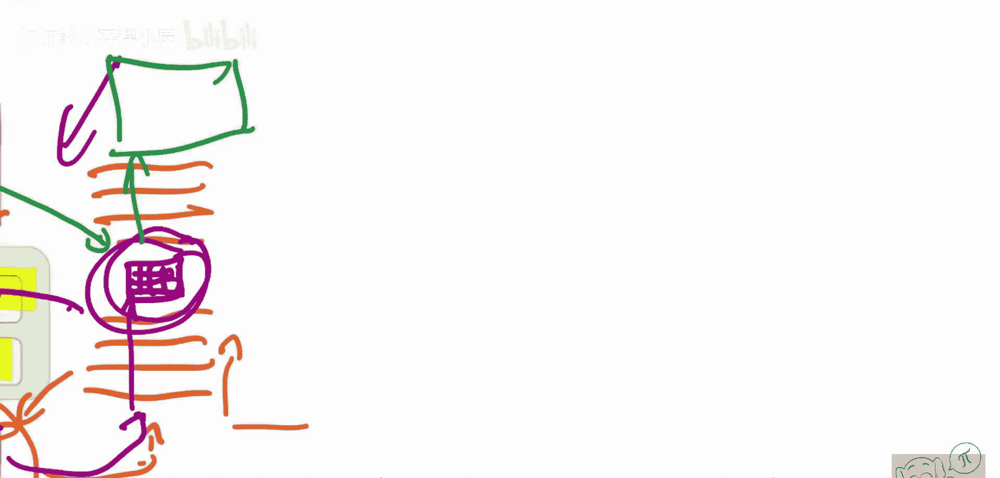

# 087：Parti - 用于内容丰富的文本到图像生成的规模化自回归模型（论文详解）🚀

## 概述

在本节课中，我们将要学习一篇来自谷歌研究团队的论文，该论文介绍了一个名为Parti的文本到图像生成模型。与当时流行的扩散模型不同，Parti是一个自回归模型。我们将探讨其工作原理、架构特点，以及它如何通过规模化训练实现令人惊叹的图像生成能力，包括处理复杂、详细的文本描述。

---

## 模型能力展示 🎨

如今，几乎每天都有新的AI图像生成模型发布。

请看顶行的图像，并听一下生成它们的提示词。

> “一幅描绘蓝色夜空的油画，充满翻腾的能量。顶部是一轮模糊而明亮的黄色新月，下方是爆炸的黄色星星和辐射状的蓝色漩涡。一个遥远的村庄静静地坐落在右侧。连接大地与天空的，是左侧一棵火焰般的柏树，有着卷曲摇曳的树枝。一座教堂尖顶像灯塔一样矗立在起伏的蓝色山丘之上。”

这是对文森特·梵高的《星夜》的一段67个词的描述。它同时也是生成顶行图像的提示词。

论文展示这一点是为了说明，图像生成模型，特别是这个模型，已经变得极其强大，不仅能够融合各种天马行空的概念，还能处理图像中事物的细节、位置和外观。

我们已经从只能生成10个类别之一的条件生成对抗网络，发展到了可以输入一小段关于我们想看什么的“文章”并得到相应图像的程度。

## 模型背景与名称 🤔

这项研究由谷歌研究院的一组研究人员完成。

这篇论文是与你可能见过的Imagen模型并行的工作。

这篇论文名为《用于内容丰富的文本到图像生成的规模化自回归模型》，但模型本身被称为Parti。

我不确定这个名字如何发音。可能是“Party”，也可能是“Partai”。我们暂且称它为“Party”。

Parti是一个从文本生成图像的模型，就像我们已有的许多模型一样。然而，它的工作方式与Imagen这类扩散模型不同。它是一个自回归模型。

## 令人印象深刻的生成示例 ✨

这里你可以看到许多其他输出，例如这张图。

这太不可思议了。请看左侧这里。

> “一张青蛙读报纸的照片，报纸名叫‘Toe day’。”

这本身就很有趣。我们知道这些文本到图像模型通常不擅长在图像中拼写文字。但这个模型不同，正如你在这里看到的，它完全拼写正确。它并非总是正确，但正确的频率足够高。

或者这个例子：
> “埃及神祇阿努斯戴着飞行员护目镜的雕像肖像，就像另一位眼镜鉴赏家，穿着T恤和皮夹克。背景是洛杉矶市。高清单反相机照片。”

这简直就是学术版的“引擎提示词”技巧。你可以看到生成的图像非常精准。这不仅需要知道什么是单反照片，还需要了解洛杉矶的天际线、埃及神祇阿努斯的样子，以及如何构图。这位神祇可能从未被描绘成穿皮夹克的样子，但模型做到了。

你还可以在这里看到更多例子。

我特别喜欢左侧的这个例子。提示词是：
> “一辆X、Y、Z的四分之三前视图，在盘山公路上转弯，俯瞰多云天气下的绿色山谷。”

其中，X是颜色（蓝、红、黄），Y是年份（1977、1997、2017），Z是车型。

现在看，模型基本上能追踪这些汽车的历史演变。它不仅知道保时捷是什么，还知道1977年的保时捷大概是什么样子。这非常惊人。

这里还有更多例子，他们做了很多关于动物的示例，我特别喜欢这张立体主义风格的浣熊。

## 技术潜力与未来展望 🔮

这将成为非常强大的技术。我们可以立即看到，这些模型的质量提升得非常快。

在可预见的未来，我们将拥有超级强大的工具，仅通过文本就能创建和编辑图像。

请看左侧这里：“一条由沙拉制成的巨型眼镜蛇蛇。” 我知道他们甚至说这些是精选的示例，但这仍然令人震惊。

## 核心思想：规模化而非复杂架构 ⚙️

现在，我很想告诉你，在这些酷炫发展的背后是一个真正酷炫的想法，比如一个聪明的架构之类的。但恐怕事实并非如此。

核心就是规模化。当然，你必须有正确的基础架构。这里没有特别酷炫的架构发明，也没有涉及什么巧妙技巧。

真的只是把基本的东西组合在一起，把它们做得非常大，然后用大量数据长时间训练，你就能获得高质量的结果。

## 模型架构总览 🏗️

这就是Parti模型的概览图。正如我已经说过的，与Imagen不同，它是一个自回归模型，而不是扩散模型。

其流程如下：在这一侧，有一个VQ-GAN图像编码器。

他们不称之为编码器和解码器，而是称为分词器和去分词器。

如果你不了解自回归模型，它们是基于标记工作的。在自然语言处理中，标记通常是单词或单词的一部分。所以这些是标记：标记1、标记2……直到标记N。

然后你要做的是尝试预测下一个标记。这就是自回归性。你输入一部分标记序列，比如句子的一部分，尝试预测下一个标记。这正是你在架构图中看到的。

你输入句子起始标记，尝试预测第一个标记；然后输入第一个标记，根据这两个预测第二个标记；接着输入这三个，预测第三个标记，依此类推。这是文本中的自回归，效果很好。

然而，在图像中，如何做到这一点并不明显。这就是为什么你首先需要将图像空间映射到标记空间。

我们需要一种方法，对于任何给定的图像，都能得到一个标记序列。它不能是像素本身，因为我们希望标记是某种潜在的、具有一定意义的，而不仅仅是单个像素。首先，像素太多；其次，单个像素包含的信息量不大。

因此，我们使用这个图像分词器和去分词器。这是一个由视觉变换器驱动的VQ-GAN。

本质上，这是一个接收图像的模型。图像经过一系列层处理。最终，假设图像开始时有很多行、很多列的像素。它经过一系列下采样等操作。实际上，因为它是一个视觉变换器，它可能在一开始就将图像分块。这些就是图像块。

然后，这些图像块通过一个变换器转换到潜在空间，可能被压缩。最终你得到标记。你可以将这些潜在表示中的元素作为图像标记，然后基本上“展开”这个图像，并将其输入到模型中。

---

## 总结

本节课中，我们一起学习了Parti模型，这是一个基于自回归架构的文本到图像生成模型。我们了解到，其卓越性能的关键并非复杂的算法创新，而是将经过验证的组件（如VQ-GAN和变换器）进行大规模组合与训练。模型通过先将图像编码为离散标记序列，再像处理文本一样自回归地预测这些标记，最终解码回图像空间，从而实现了对复杂、细致文本描述的精准理解和图像生成。这标志着通过纯粹的数据和算力规模化，AI在内容生成领域取得了重大进展。