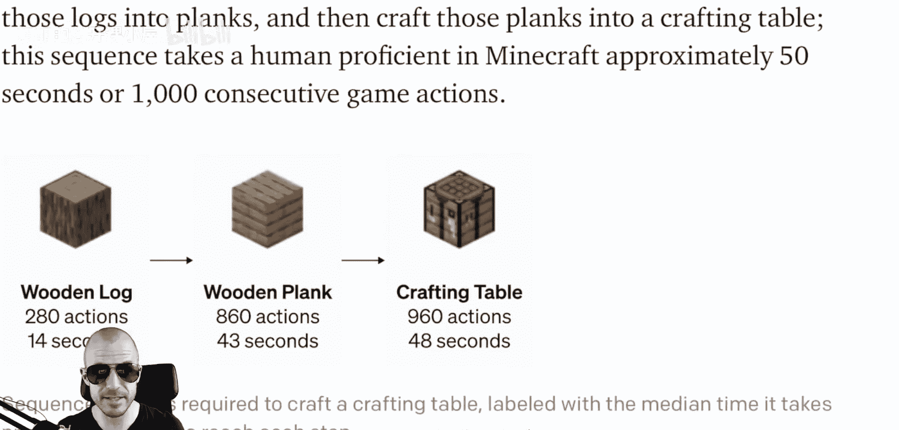
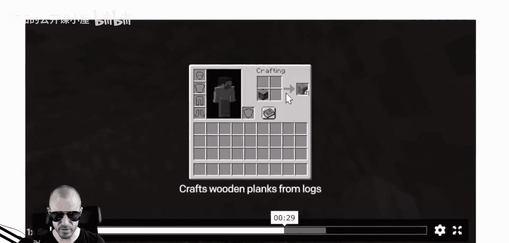
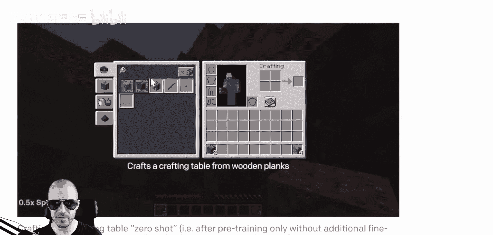
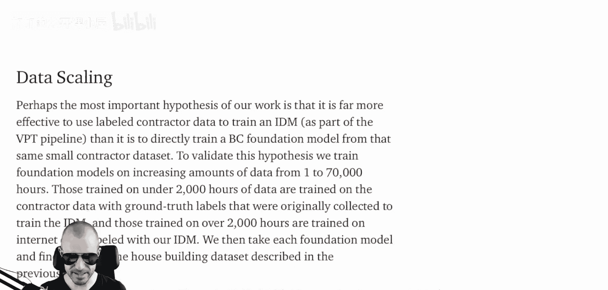
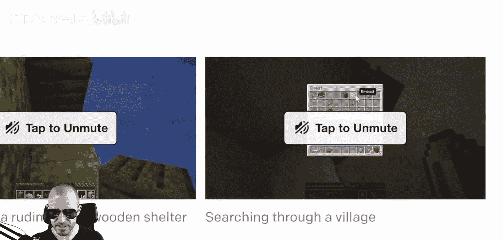
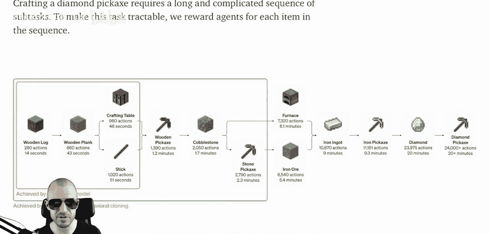
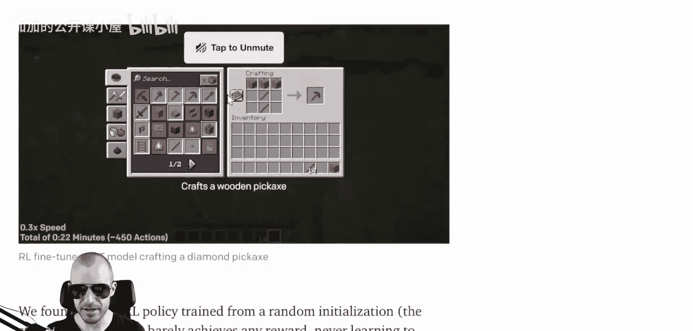
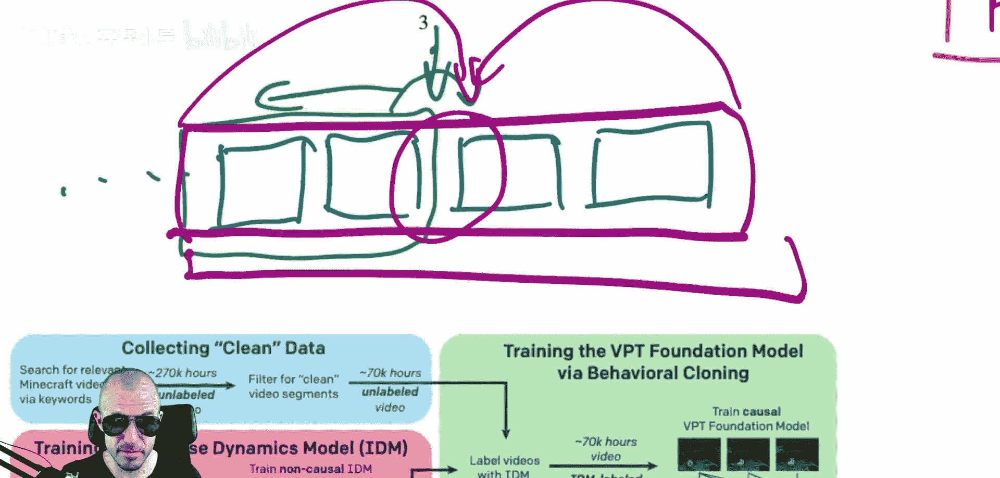
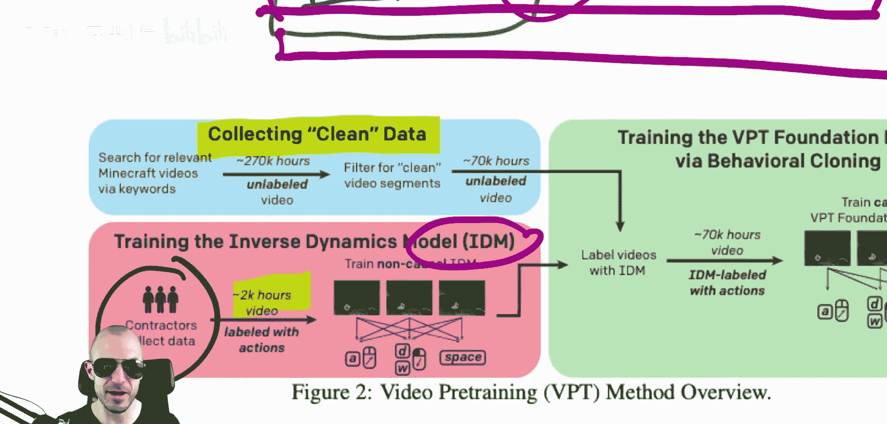

# 088：通过观看未标记在线视频学习行动

## 概述
在本节课中，我们将要学习一篇来自OpenAI团队的论文。这篇论文介绍了一种名为“视频预训练”的方法，旨在通过观看大量未标记的在线视频来训练智能体学习复杂的行动。该方法首次成功地在《我的世界》游戏中制作出了钻石镐，这是一个里程碑式的成就。

## 背景：《我的世界》作为强化学习的测试平台
《我的世界》多年来一直是强化学习算法的测试平台。这个游戏非常困难。你处在一个开放世界中，可以拆解任何方块。首要任务是徒手砍树以获得木头，然后将木头加工成木板，再用木板制作工作台。合成过程在一个类似右上角的菜单界面中进行，你需要排列物品来创造新物品。虽然有配方书，但有时也需要知道自己在做什么。








然后你在这个开放世界中行走。游戏世界非常复杂，有村庄，地形是随机生成的，每次开始游戏都是全新的地形。即使有预定义的动作，游戏也很困难。如果像本系统一样只使用鼠标和键盘，那就几乎不可能完成。游戏中有一系列需要建造的物品，比如木镐、石镐、铁镐，最终目标是钻石镐。




本论文中的智能体学会了突袭村庄，在村庄中四处查看。游戏进程非常长，从木镐到石镐，再到铁镐，最后用铁镐挖掘钻石。每局游戏时长约为10到15分钟。对人类玩家来说，在这么短的时间内集齐制作钻石镐所需的三颗钻石已经相当困难。








如果仅仅使用强化学习从一个随机初始化的模型开始训练，是无法成功的。核心问题在于：如何以尽可能低的成本让智能体学会这些操作？这正是本篇论文要解决的问题。

## 核心问题：如何最有效地分配资源
论文探讨了一个根本性问题：如何最有效地分配有限的资源（例如资金）来训练一个高性能的智能体。

我们可以将资金想象成一个盒子。资金可以用于以下几种方式：
1.  **收集有标签的数据**：雇佣人员玩游戏，记录他们的操作（如按键和鼠标移动）。这样我们就得到了带有“标签”（即人类输入）的视频数据集，可以用于行为克隆。
2.  **收集无标签的数据**：用同样的资金可以收集到数量多得多的无标签视频数据（例如从YouTube上获取），但这些数据没有对应的操作记录。
3.  **进行数据标注**：资金也可以用于对已有的无标签数据进行标注。

那么，问题在于：为了获得性能尽可能好的智能体，资金的最佳分配策略是什么？当然，还需要资金来训练系统本身。

## 论文方法：利用“后见之明”降低学习难度
本论文采用的方法非常巧妙，为未来解决类似领域的问题提供了一个很好的范例。他们认识到一个简单的事实：从视频序列中推断动作的难度是不同的。

假设有一个视频帧序列：`frame1, frame2, frame3, frame4, ...`。如果你想推断下一时刻的动作（例如下一个鼠标移动或按键），你只能基于过去的帧进行因果预测。这要求模型理解玩家的意图和计划，是一个困难的任务。

然而，如果你已经拥有了包含过去和未来帧的完整视频序列，那么从“后见之明”的角度，推断中间某个时刻所采取的动作就会容易得多。因为你可以看到动作带来的未来结果，甚至可以推断玩家的计划。这是一个比纯因果预测简单得多的任务。

**公式表示**：
*   **因果预测（困难）**: `action_t = model(past_frames: frame_{t-k} ... frame_{t-1})`
*   **逆向动力学预测（容易）**: `action_t = inverse_dynamics_model(past_frames: frame_{t-k} ... frame_{t-1}, future_frames: frame_{t+1} ... frame_{t+m})`

特斯拉在自动驾驶数据标注中也使用了类似的思想：通过回顾完整的视频序列，可以更轻松地确定车辆在过去每一时刻的位置。

## 方法实施：两阶段训练流程
基于上述洞察，论文采用了两个主要步骤：

**第一步：在小规模有标签数据上训练“逆向动力学模型”**
他们首先雇佣人员玩了2000小时的《我的世界》，并记录其所有按键和鼠标操作，从而获得一个有标签的数据集。他们利用这个数据集训练了一个“逆向动力学模型”。这个模型接收一个包含过去和未来帧的窗口，然后尝试预测窗口中间某一帧对应的动作。



**代码概念描述**：
```python
# 伪代码示意
def inverse_dynamics_model(video_window):
    # video_window 包含过去、当前和未来的帧
    past_frames = video_window[:center_index]
    future_frames = video_window[center_index+1:]
    # 模型整合所有信息，预测中心帧时刻的动作
    predicted_action = model(past_frames, future_frames)
    return predicted_action
```

这个模型本身不能直接用作智能体，因为真实的智能体在行动时无法看到未来。

**第二步：利用大规模无标签视频进行预训练**
接下来，他们从互联网（主要是YouTube）上收集了海量的、未标记的《我的世界》游戏视频。他们只需要确保收集的是“干净”的游戏过程视频。然后，他们使用第一步训练好的“逆向动力学模型”为这些无标签视频自动生成动作标签。



这个过程可以表示为：
1.  从无标签视频中采样一个片段。
2.  使用“逆向动力学模型”预测该片段中间帧的动作。
3.  将 `(视频片段, 预测的动作)` 作为新的训练数据对。


通过这种方式，他们用相对较低的成本（仅标注2000小时数据），生成了一个规模巨大、带有（模型生成的）动作标签的视频数据集。最后，他们在这个大规模数据集上训练最终的行为克隆模型，从而得到了一个能力强大的《我的世界》智能体。


## 总结
本节课我们一起学习了OpenAI的“视频预训练”方法。其核心思想是利用“后见之明”的便利性，先在小规模有标签数据上训练一个逆向动力学模型，再用该模型为海量无标签视频自动生成伪标签，从而极大地降低了获取高质量训练数据的成本。这种方法成功训练出了首个能在《我的世界》中制作钻石镐的智能体，并且作为一种通用方法，可广泛应用于其他需要从视频中学习复杂行动的领域。