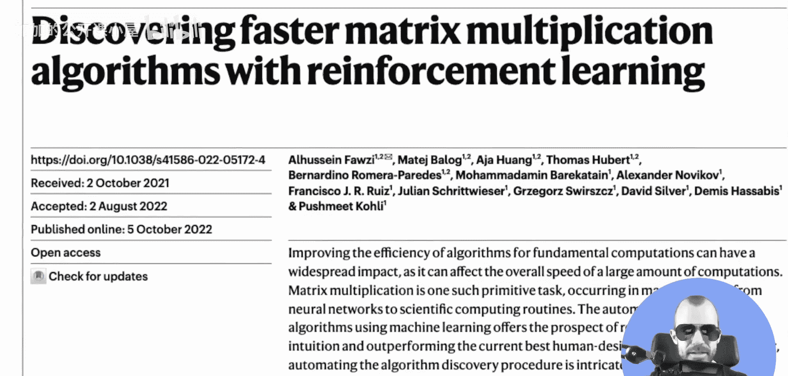
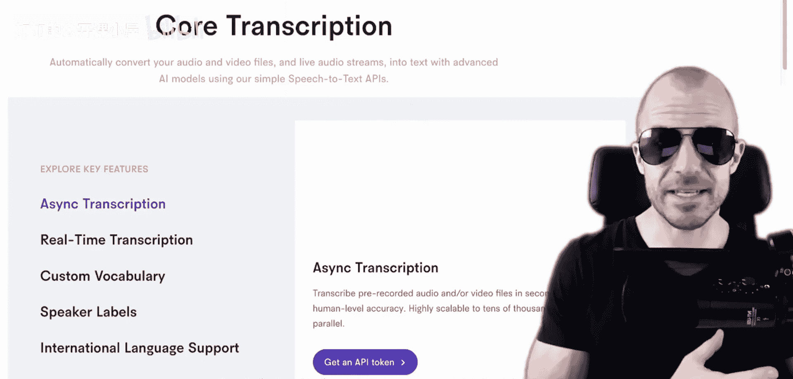
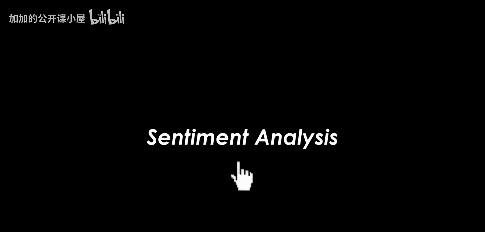
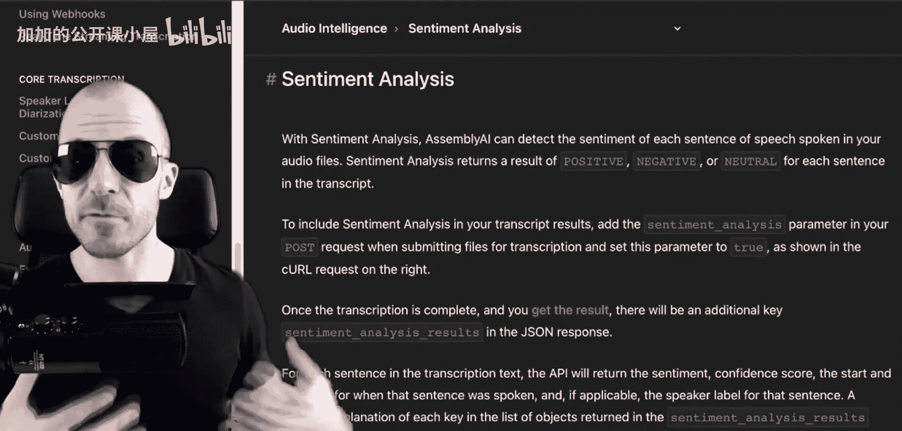
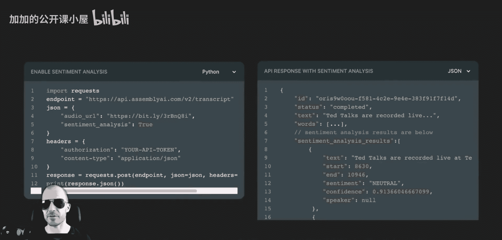
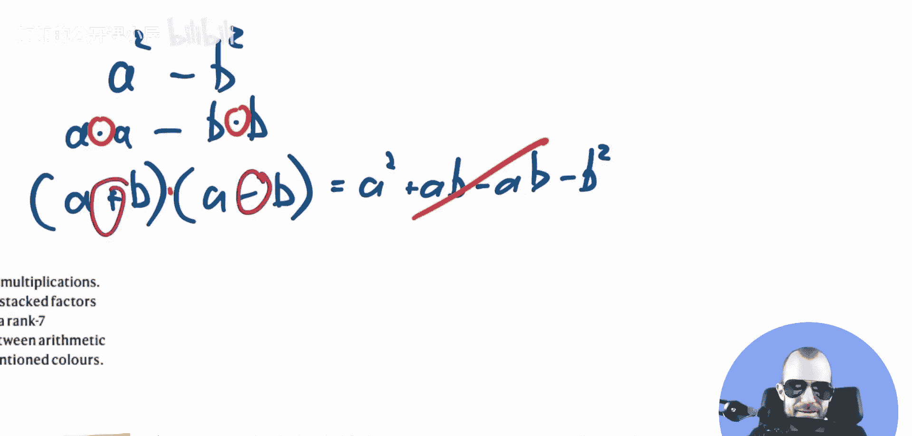

# 090：颠覆性的突破！DeepMind AlphaTensor技术解析

## 概述

在本节课中，我们将学习DeepMind发表的一篇名为《AlphaTensor》的论文。这篇论文提出了一种利用强化学习加速矩阵乘法运算的系统。虽然加速矩阵乘法听起来不如DeepMind的其他成果那样引人注目，但由于矩阵乘法是几乎所有科学计算的基础，因此即使只提升10%、20%甚至1%的速度，其影响也是巨大的。这展示了DeepMind如何将其在游戏领域的原始想法（如AlphaGo）成功应用到实际的科学问题中。

## 矩阵乘法：问题与经典算法

上一节我们介绍了AlphaTensor的目标。本节中，我们来看看矩阵乘法究竟是什么，以及为什么加速它如此重要。

矩阵本质上是一个数字的矩形阵列。矩阵乘法有特定的规则：将一个矩阵的行与另一个矩阵的列进行点积运算，得到结果矩阵的对应元素。

例如，对于两个2x2的矩阵A和B，其乘积C的左上角元素计算如下：
`C[1,1] = A[1,1]*B[1,1] + A[1,2]*B[2,1]`

以下是经典算法的步骤：
1.  取第一个矩阵的一行。
2.  取第二个矩阵的一列。
3.  计算行与列对应元素的乘积之和（点积）。

在硬件层面，加法运算比乘法运算快得多。因此，进行矩阵乘法时，处理器花费的大部分时间都在执行标量乘法。对于一个n x n的矩阵，经典算法需要大约 **O(n³)** 次乘法。

## 更快的可能性：Strassen算法示例

既然我们了解了经典算法的复杂度，本节中我们探讨是否存在更快的算法。答案是肯定的，这听起来有些不可思议。

一个著名的例子是Strassen算法，它可以将两个2x2矩阵的乘法从8次乘法减少到7次。其核心思想是用更多的加法来换取更少的乘法。

以下是一个简化的类比，说明这是如何实现的：
计算 `a² - b²`。
*   **直接计算**：需要两次乘法（`a*a` 和 `b*b`）。
*   **因式分解**：`(a+b)*(a-b)`。这只需要一次乘法（计算`(a+b)`和`(a-b)`的乘积），但增加了加法和减法操作。

Strassen算法的原理与此类似，它通过精心设计中间计算步骤，用额外的加法/减法开销换取了乘法次数的减少。这证明了矩阵乘法所需的乘法次数并非固定不变，可以通过算法进行优化。

## AlphaTensor的核心思想：将问题构建为游戏

我们已经看到算法可以优化矩阵乘法。那么，DeepMind的AlphaTensor是如何发现新算法的呢？其关键创新在于将寻找高效矩阵乘法算法的问题，构建成一个“单人游戏”。

这个游戏被称为“张量游戏”。在这个框架中：
*   **状态**：当前计算步骤的中间表示。
*   **动作**：选择如何组合矩阵元素来创建新的中间项（类似于Strassen算法中的M1, M2...）。
*   **目标**：用尽可能少的步骤（即尽可能少的乘法操作）完整地表示出整个矩阵乘法运算。

通过这种方式，寻找最优矩阵乘法算法的问题，就转化为了一个可以通过强化学习（特别是类似AlphaZero的技术）来探索和解决的序列决策问题。智能体通过不断尝试动作、获得奖励（例如，为减少乘法次数给予正奖励），来学习如何高效地“玩”这个游戏，从而发现人类未曾想到的新算法。

## 结果与意义

最后，我们来看看AlphaTensor取得了哪些实际成果。

AlphaTensor成功发现了在许多矩阵规模下，比已知最佳算法（包括Strassen算法及其变种）更快的算法。例如，它找到了计算4x4矩阵乘法的新方法，其效率超过了已使用数十年的现有算法。

这项工作的意义深远：
1.  **实际加速**：为从科学计算到人工智能的广泛领域带来了潜在的底层计算加速。
2.  **方法论验证**：证明了将复杂科学问题构建为游戏，并应用强化学习解决这一方法的强大威力。
3.  **基础突破**：在计算机科学最基础的问题之一上取得了实质性进展，展示了AI驱动科学发现的能力。

## 总结

本节课中，我们一起学习了DeepMind的AlphaTensor。
我们首先理解了加速矩阵乘法这一基础运算的重要性。
接着，我们回顾了经典算法和像Strassen这样的优化算法，明白了可以通过增加加法来减少乘法的核心思想。
然后，我们探讨了AlphaTensor如何将寻找算法的问题构建成一个“张量游戏”，并利用强化学习来求解。
最后，我们看到了该方法发现的更优算法及其广泛的应用前景。这项工作不仅是计算效率的突破，更是AI用于基础科学发现的一次精彩示范。