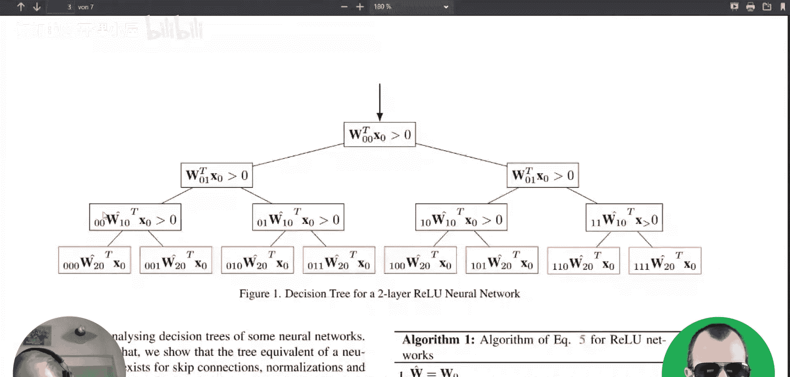
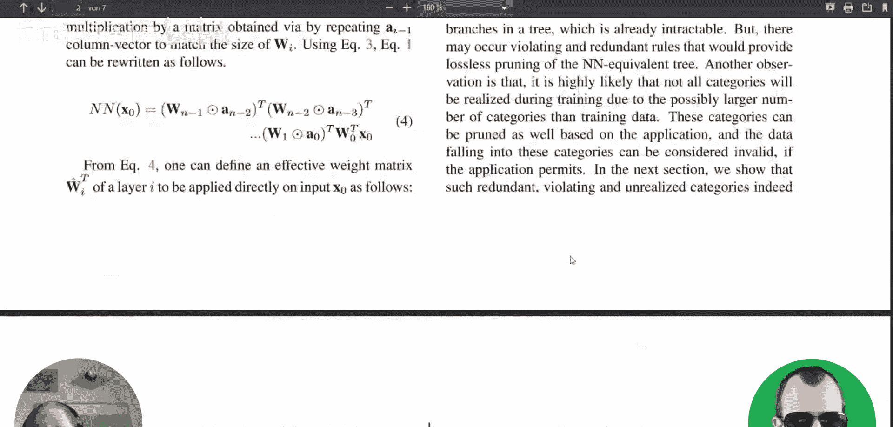
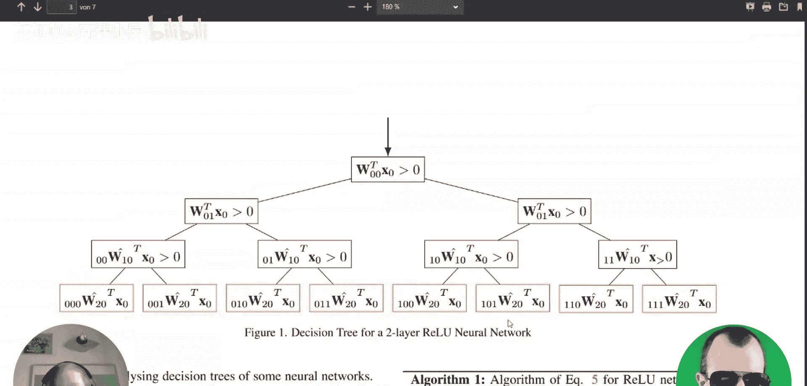
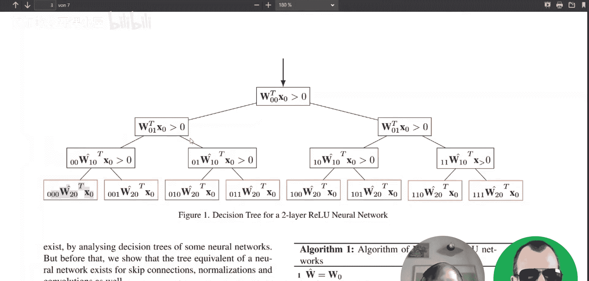
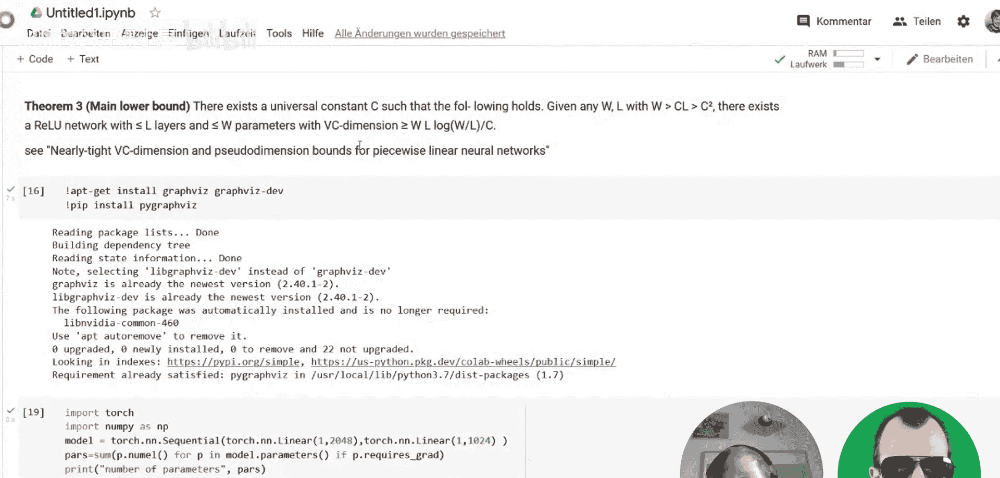
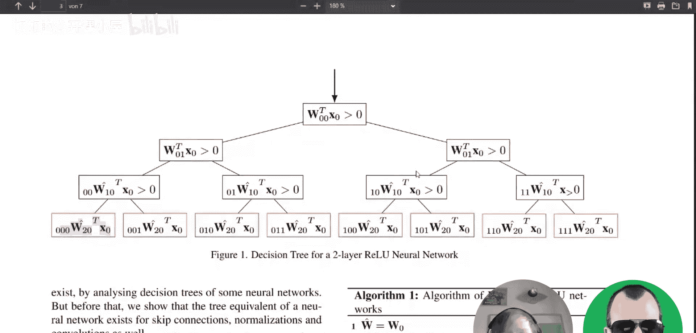
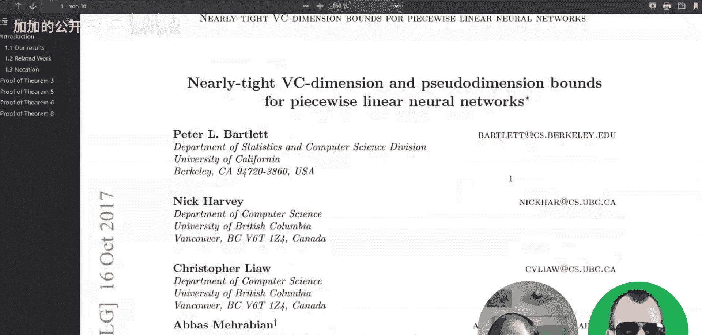

# 091：神经网络即决策树（与亚历山大·马蒂克合作） 🧠🌳

在本节课中，我们将学习一篇探讨神经网络与决策树之间关系的论文。我们将了解如何将使用分段线性激活函数（如ReLU）的神经网络精确地转换为决策树结构，并讨论这种转换的理论意义与实际应用价值。

---

上一节我们介绍了课程主题，本节中我们来看看这篇论文的核心思想。论文的核心观点是，对于使用分段线性激活函数的神经网络，可以将其精确地重写为一个决策树。这源于神经网络本质上是多个分段线性函数的组合。

具体而言，考虑一个具有ReLU激活函数的神经网络。对于输入空间中的一个点，如果我们进行微小的移动，只要不跨越任何ReLU的“激活边界”（即输入从正变为零或反之），那么整个网络的输出变化将是线性的。因此，整个输入空间可以被划分为许多这样的线性区域，在每个区域内，网络的行为就像一个简单的线性函数。

论文展示的转换过程，就是通过系统地“展开”这些由先前层激活模式决定的不同路径，将网络的结构显式地表达为一棵树。树的每个叶子节点对应一个特定的线性区域，并包含一个该区域内的线性变换（权重和偏置）。

以下是转换过程的直观理解：
*   **根节点**：代表输入。
*   **内部节点**：代表网络中某个ReLU单元的激活决策（例如，输入是否大于0）。这决定了信号在网络中向前传播的路径。
*   **叶子节点**：代表最终到达的线性区域，其输出由该区域特有的线性函数 `y = W_hat * x + b_hat` 计算。

---

上一节我们理解了转换的基本原理，本节中我们探讨这种转换的意义和不同视角。

将神经网络转换为决策树可以从多个角度进行解读：
*   **研究决策树**：这个视角帮助有限。因为神经网络本身比决策树更复杂，通过研究神经网络来理解决策树算法（如CART）的构建过程比较困难。此外，标准的决策树生长过程（分裂节点）可能无法直接映射回原神经网络的结构。
*   **研究神经网络**：这个视角更有前景。决策树的结构可以帮助我们分析神经网络的某些理论性质，例如其划分输入空间的能力（与VC维相关）。不过，许多基于“分段线性”的分析（如样条理论）并不需要显式地构建出整个决策树。
*   **增强可解释性**：这是该论文引起广泛关注的主要原因。决策树通常被认为比神经网络更易于解释。理论上，我们可以将一个训练好的ResNet转换为决策树，从而获得对模型决策过程的洞察。

---

上一节我们讨论了转换的应用视角，本节中我们来看看在实际应用，特别是在可解释性方面面临的挑战。

虽然将神经网络转换为决策树听起来是获得可解释性的完美方案，但在实践中存在重大障碍，主要原因是**规模爆炸**。

神经网络之所以强大，部分原因在于其参数量大、容量高，能够拟合极其复杂的函数。当将其转换为决策树时，这会导致树的节点数量变得极其庞大。论文中提到，一个网络能够产生的线性区域数量的一个理论下界公式大致为：

`区域数量 ≥ O((W/L) * log(W/L))`

其中 `W` 是网络权重总数，`L` 是网络深度。对于现代大型网络（`W` 很大），这个数字可能非常巨大，导致生成的决策树复杂到人类根本无法直观理解，从而失去了可解释性的意义。

因此，虽然这种转换在理论上是精确的，并为我们理解神经网络的内部工作机制提供了有力的数学框架，但它未必是获得实用、简洁、可解释模型的有效工具。

---

本节课中我们一起学习了“神经网络即决策树”这篇论文的核心内容。我们了解到，对于使用ReLU等分段线性激活函数的神经网络，存在一种精确的数学方法将其重写为决策树形式，其中树的每个叶子节点对应输入空间的一个线性区域。我们从研究决策树、研究神经网络和提升可解释性三个角度探讨了这种转换的意义。最后，我们指出了该方法的实际局限性，即对于大型网络，转换得到的决策树规模会爆炸性增长，反而难以实现可解释性的初衷。这项研究更重要的贡献在于深化了我们对神经网络函数本质（即复杂的分段线性函数）的理论理解。