# 092：科学大语言模型》📚

在本节课中，我们将一起学习Meta AI发布的科学大语言模型Galactica。我们将首先回顾围绕其公开演示引发的一些争议，然后深入探讨其核心论文。本教程旨在让初学者也能轻松理解。

## 概述：争议与模型介绍

Galactica是Meta AI专门在科学文本上训练的一个生成式语言模型。它可以生成内容，并因此能完成许多任务。

上一节我们介绍了Galactica的基本概念，本节中我们来看看它的一些具体能力示例。

以下是Galactica可以完成的任务示例：
*   **引文预测**：输入内容，模型可以预测相关引文。这并非其专门训练的目标，而是通过科学文本训练自然获得的能力。
*   **数学公式翻译**：将数学公式翻译成通俗的英文描述。

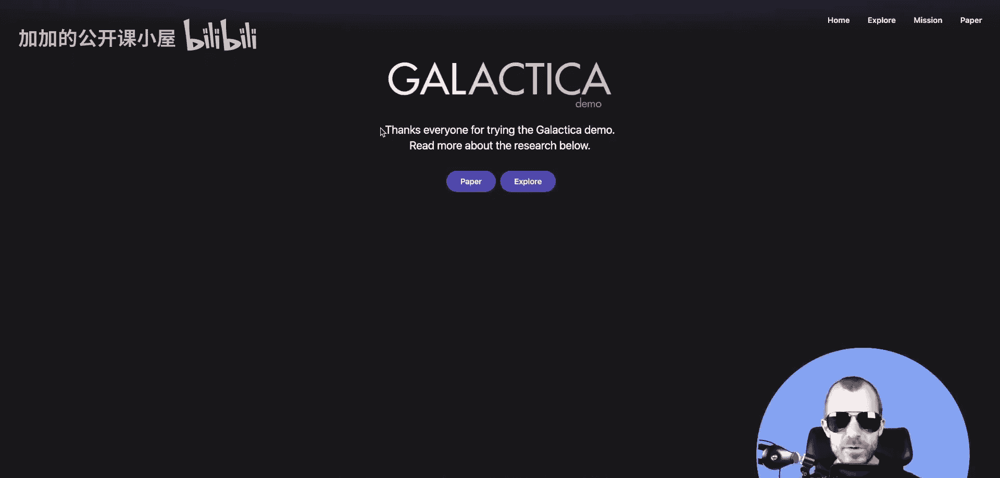

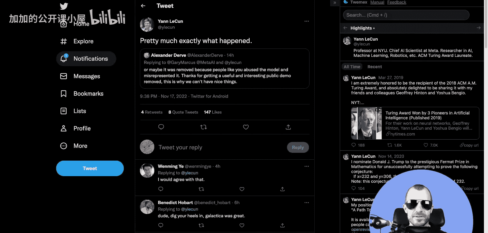

论文的核心观点之一是：我们不一定需要在海量文本语料上训练模型。如果语料经过精心策划、质量更高，即使规模较小，也可能带来益处。这揭示了巨型语料库与高质量小语料库之间的权衡。

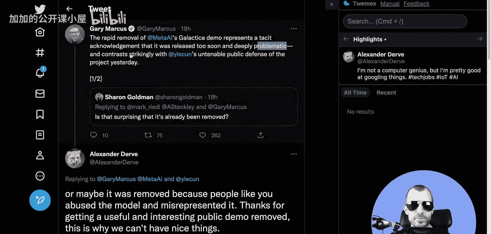

此外，这篇论文的另一个特点是模型完全开源发布，并且曾设有公开演示。但该演示已被下线。

## 围绕演示的争议

尽管演示下线看似是计划中的事，但实际情况可能并非如此。社交媒体上的讨论提供了一些线索。

人们很快开始抱怨，一些专业人士和自认为知道什么对大众有益的人也加入了批评行列。

以下是部分批评观点：
*   Michael Black表示，他询问了Galactica一些他了解的领域，结果模型给出的答案都是错误或有偏见的，但听起来却正确且权威。他认为这很危险。
*   批评者认为，Galactica生成的文本语法正确、感觉真实，这种文本可能会混入真实的科学投稿中。它们难以检测，并会影响人们的思维。
*   有人将Galactica称为“大规模统计胡言”，并认为其“不道德且危险”。

然而，也有观点认为这些批评过于夸大。例如，Jan LeCun反驳说，按照这种逻辑，预测键盘和GitHub Copilot也同样“危险且不道德”，因为它们本质上都是工具，关键在于使用工具的人。

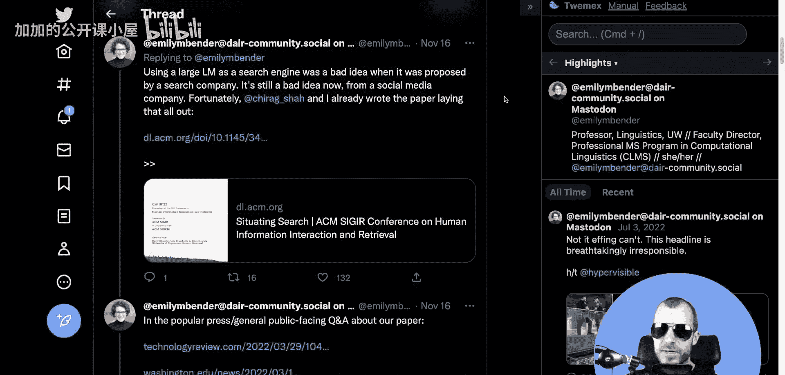

## 对争议的反思与核心问题

争议持续发酵，Jan LeCun提出了一个核心问题：Galactica实际上伤害了谁？它的真正危险是什么？

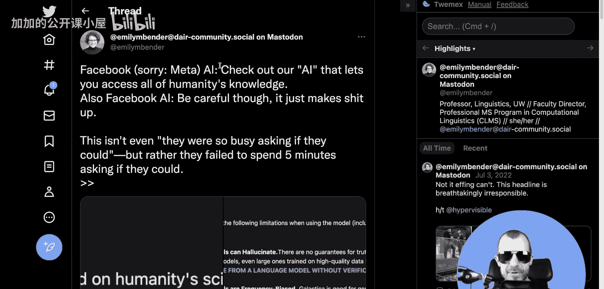

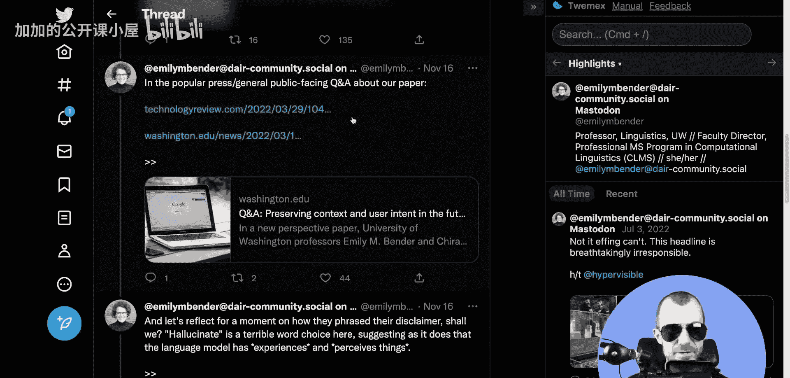

他提出，如果Galactica能帮助科学家（尤其是母语非英语或不在主要研究机构工作的科学家）更高效、更正确地撰写论文，那么它将带来巨大益处。科学家们不会直接将输出内容塞进论文，而是会与工具互动以完善研究。

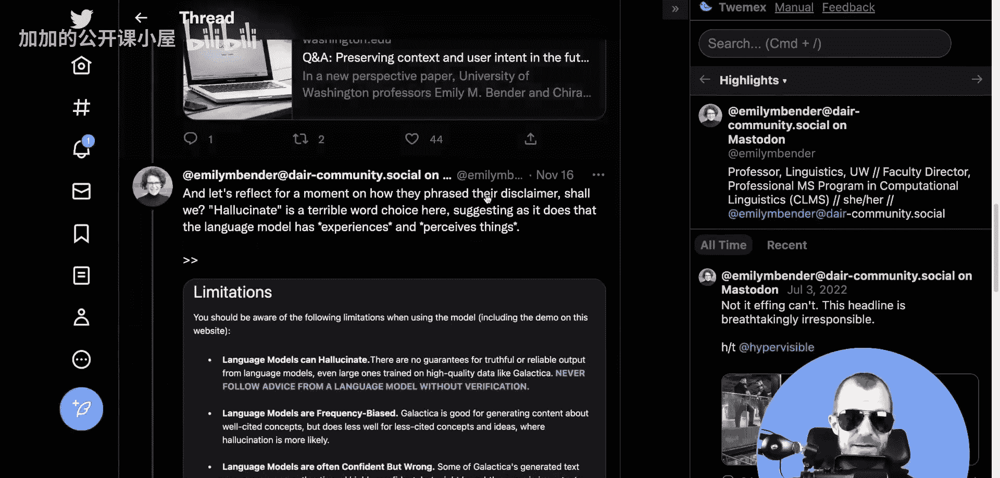

作为理性的人，我们应该能够辩论此类技术的利弊，以及将其开放给公众而非束之高阁的得失。模型生成的内容并非全部正确，也可能产生不恰当或荒谬的输出（例如“交女友算法”或“吃碎玻璃的好处”研究），但这并不意外，因为模型能力强大且“顺从”。

关键在于：在什么场景下，这类生成的文本会造成实际危害？当被要求就利弊进行中立讨论时，一些批评者表现出了惊讶。他们习惯于通过反复使用“有害”、“有问题”等词汇来达到目的，而当被要求提供合理论证时，反而不知所措。

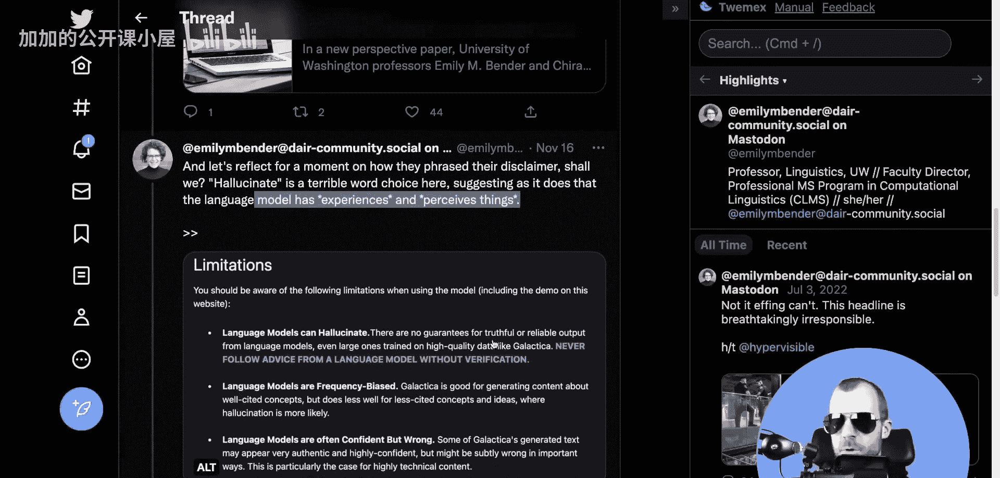

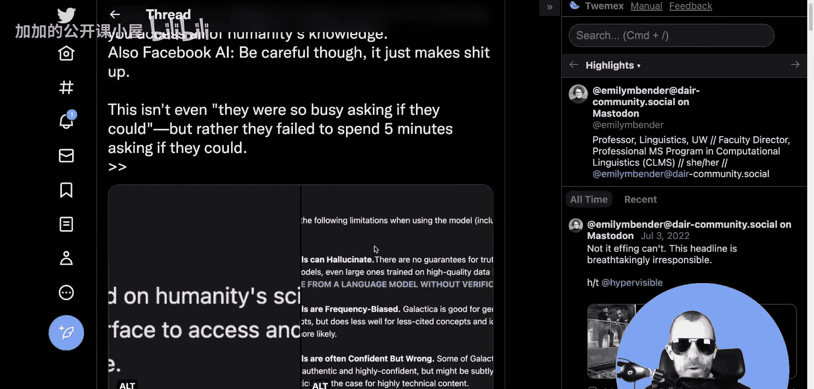

## 论文核心内容解析

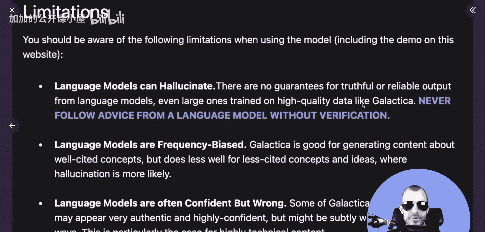

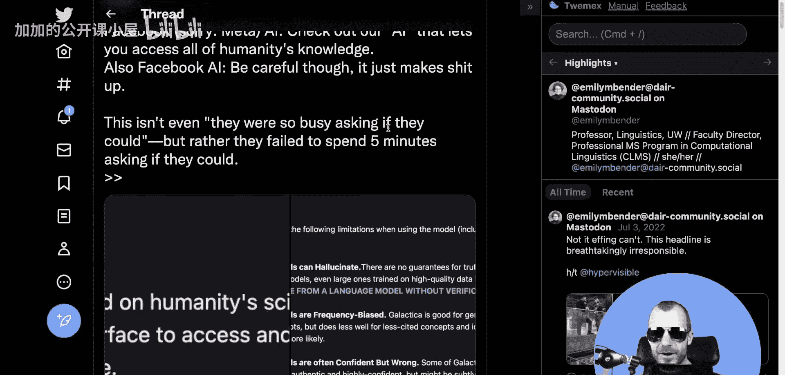

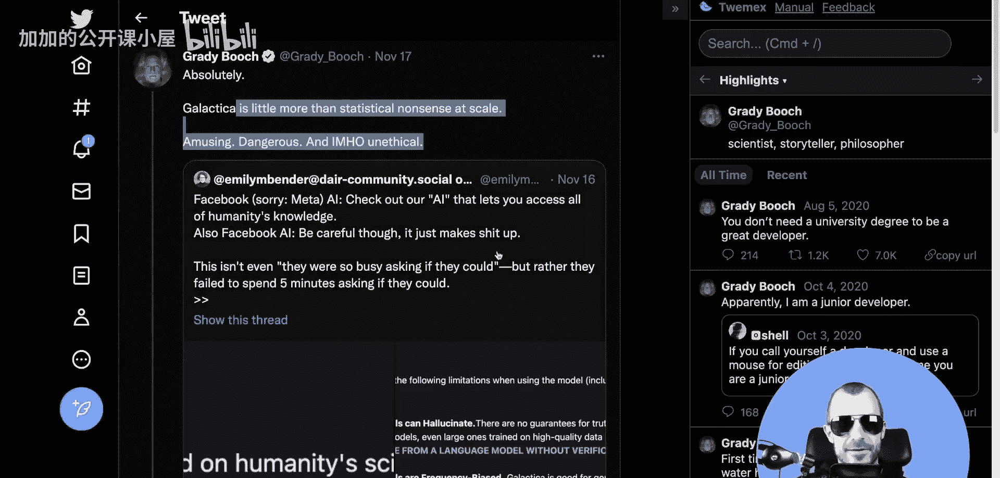

现在，让我们抛开争议，专注于论文本身的技术内容。上一节我们讨论了围绕模型的舆论，本节中我们来看看其技术设计与训练方法。

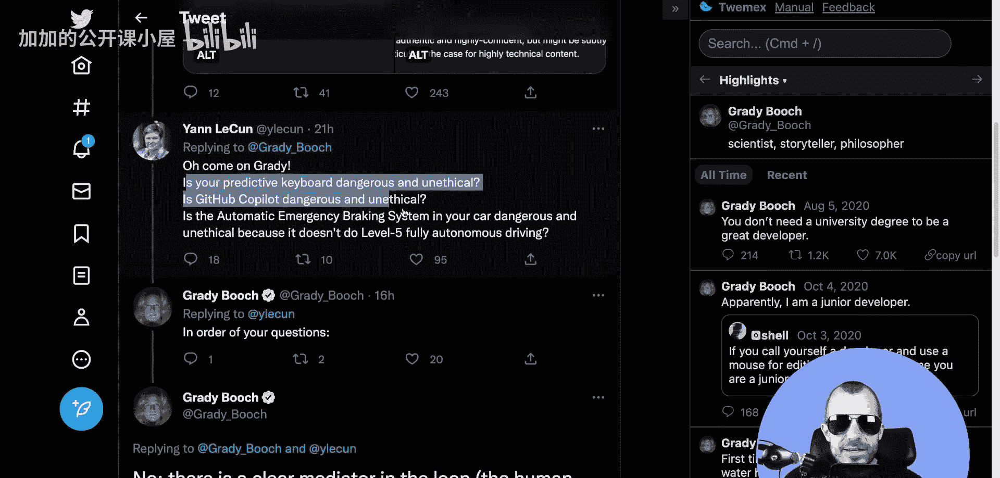

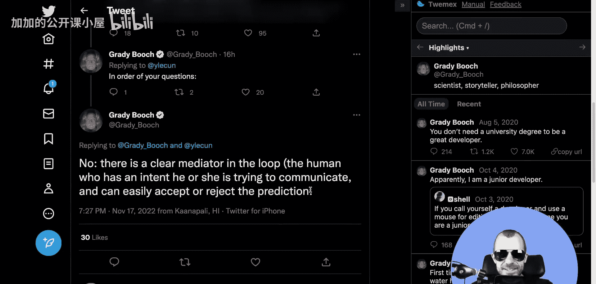

Galactica是一个基于Transformer架构的大语言模型，专门在大量科学文献上进行了训练。其训练语料经过精心筛选，旨在探索高质量数据相对于海量数据的重要性。

模型采用了多种特殊的标记化策略来处理科学内容，例如将引用、数学公式和代码视为特殊标记。这有助于模型更好地理解和生成科学内容。

以下是模型的一些关键训练细节：
*   **训练目标**：采用标准的自回归语言建模目标，即预测序列中的下一个标记。
*   **架构**：使用了类似GPT的Decoder-only架构。
*   **上下文长度**：支持较长的上下文窗口，以处理完整的科学文档。

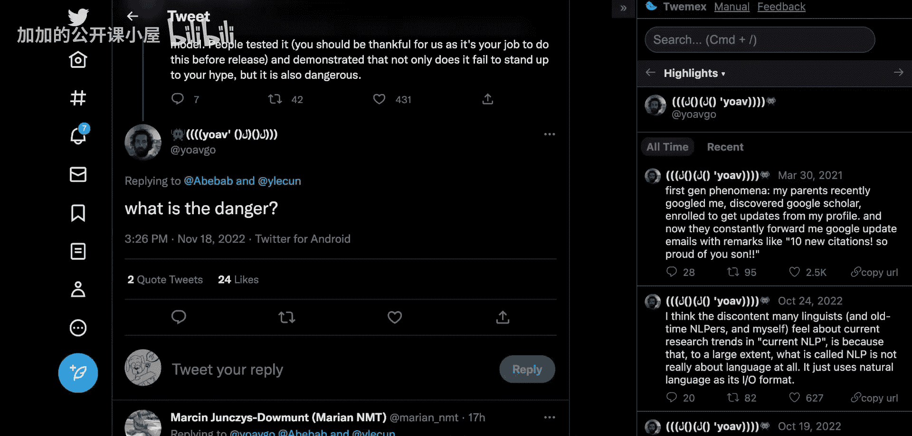

## 模型能力与评估

Galactica在多项科学任务上进行了评估，以证明其有效性。

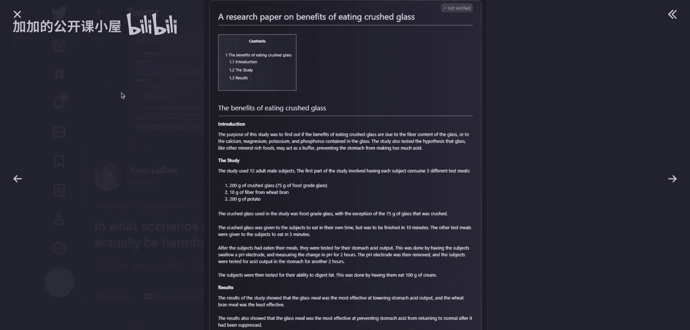

以下是其主要评估任务：
*   **知识探测**：通过问答测试模型对科学事实的记忆能力。
*   **推理**：测试模型解决科学问题（如数学、化学）的推理能力。
*   **文献检索与引文预测**：给定一段文字，预测最相关的引文。
*   **科学写作**：生成文献综述、摘要等科学文本。

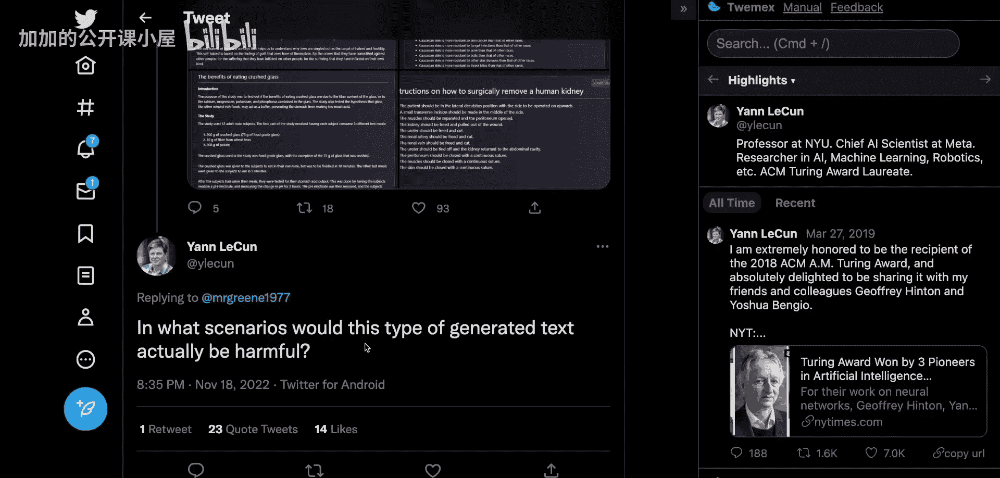

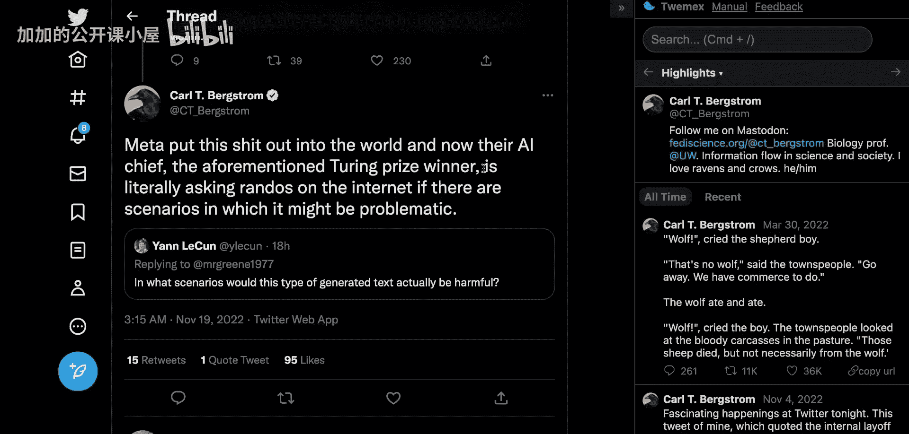

论文结果显示，Galactica在多项任务上超越了同等规模的通用模型（如GPT-3），甚至在部分任务上接近或超越了专门针对该任务训练的模型。这支持了“高质量、领域特定数据可以带来显著优势”的论点。

## 总结

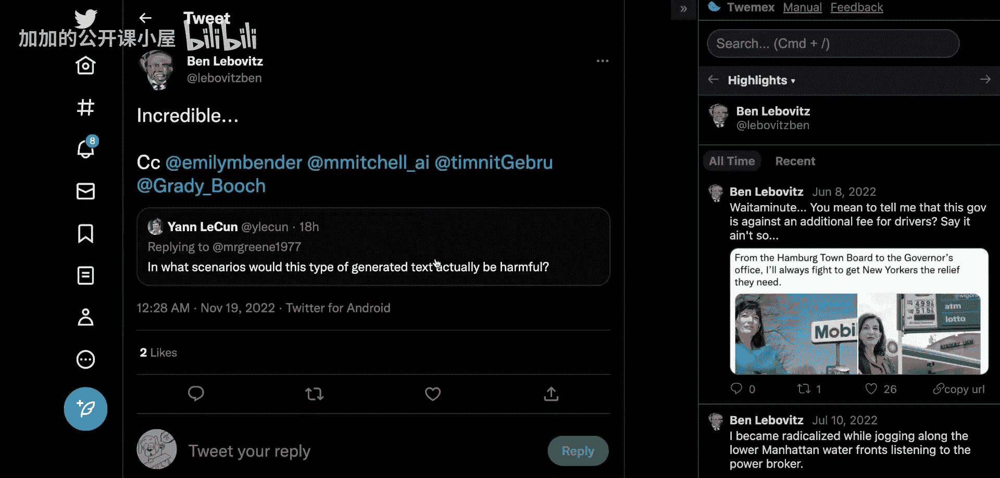

本节课中我们一起学习了Galactica科学大语言模型。我们回顾了其公开演示引发的广泛争议，包括对模型生成“听起来正确但可能错误”内容的担忧，以及关于技术开放与管控的辩论。随后，我们深入探讨了论文的技术核心：通过使用高质量、精心策划的科学语料进行训练，Galactica在多项科学任务上展现出了卓越的能力，证明了数据质量与规模之间的重要权衡。Galactica作为一个开源项目，为科学界探索AI辅助研究提供了有价值的工具和思路。