# 093：能与人类谈判、说服并协作的人工智能体

在本节课中，我们将学习由Meta AI开发的智能体CICERO。这是一个能够在复杂策略游戏《外交》中与人类玩家进行谈判、协作与竞争的AI。我们将探讨其核心架构、工作原理，以及它如何结合语言模型与战略推理来达到人类顶尖玩家的水平。

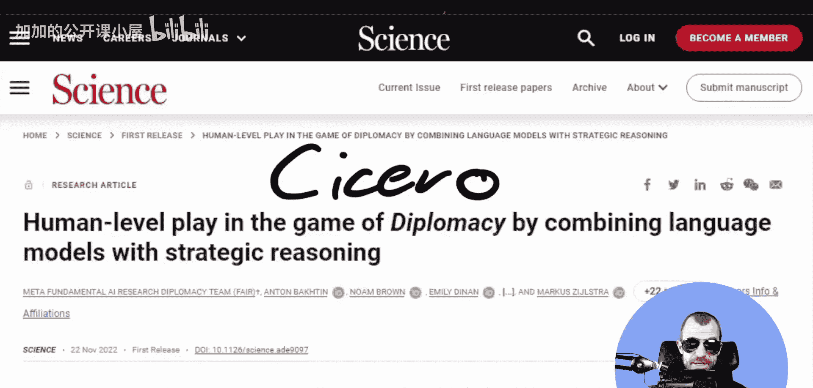

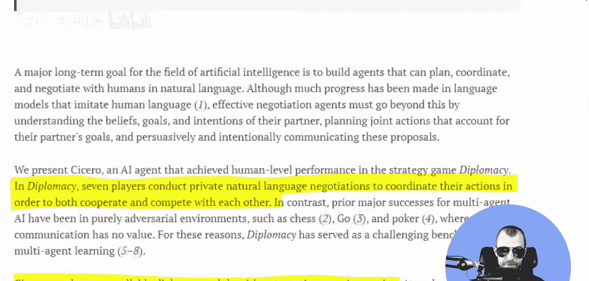

## 游戏背景：《外交》简介

上一节我们介绍了CICERO的目标，本节中我们来看看它所挑战的游戏环境。《外交》是一款特殊的棋盘游戏，其核心在于玩家间的沟通与协作。

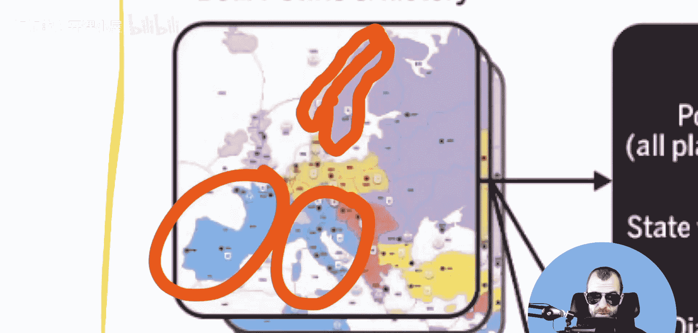

游戏中有7名玩家，他们通过私密的自然语言聊天信息进行谈判，以协调行动、建立联盟，同时也在相互竞争。游戏版图被划分为多个由不同颜色代表的派系领土。

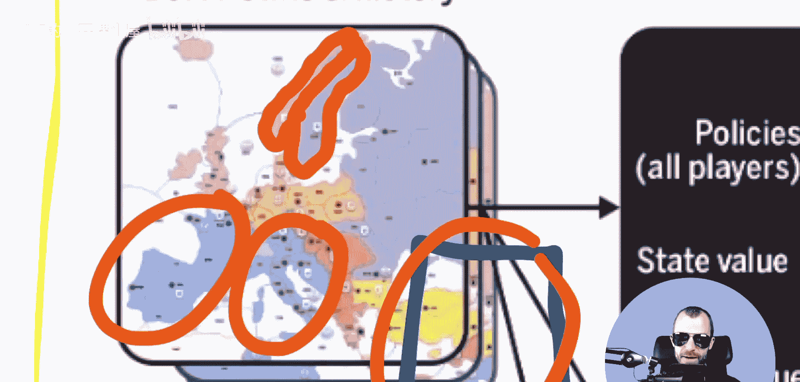

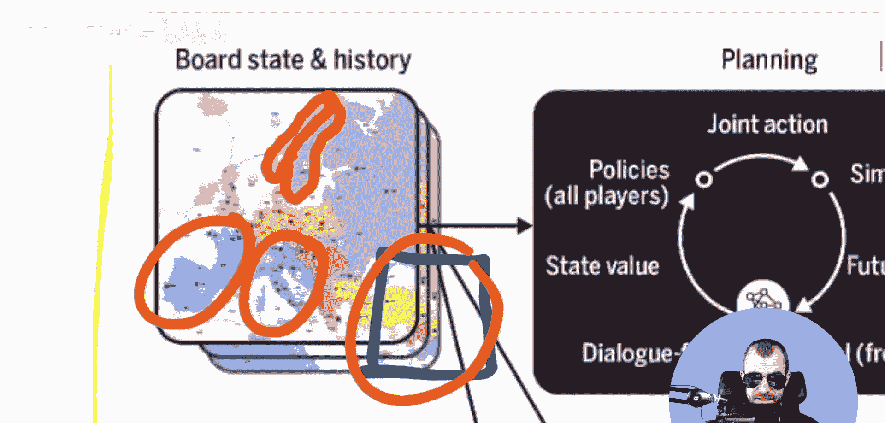

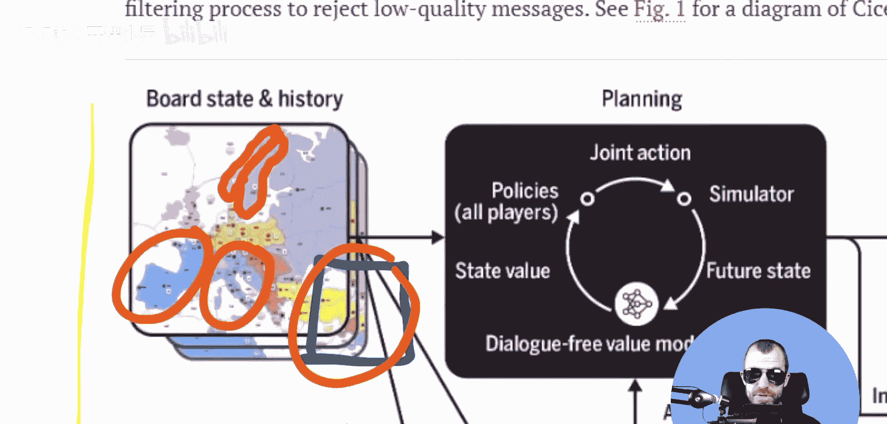

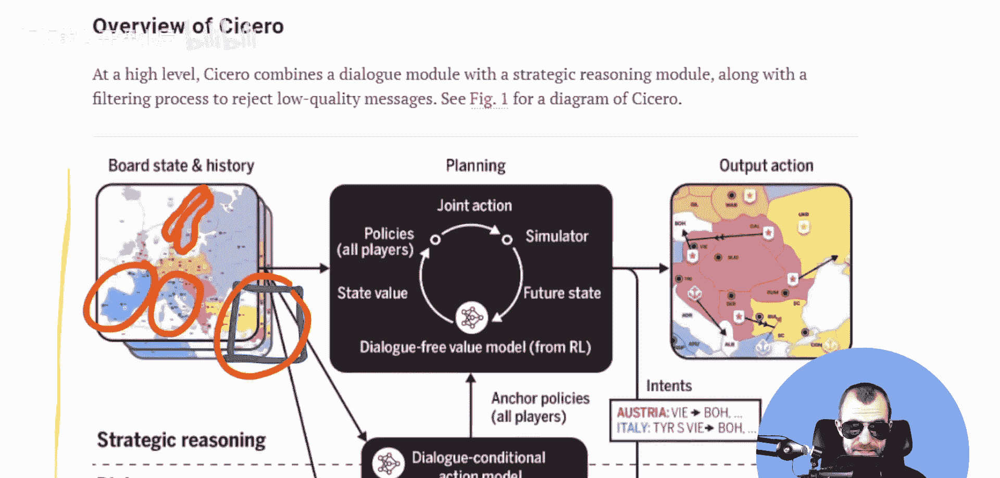

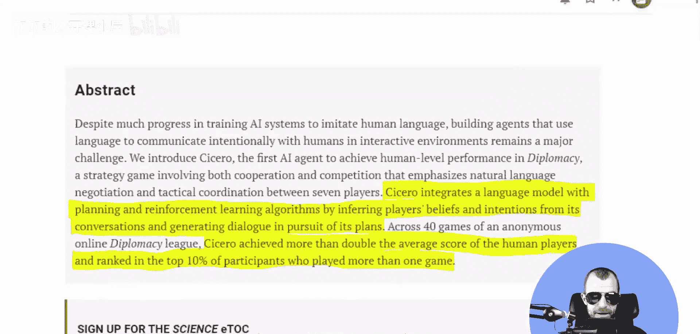

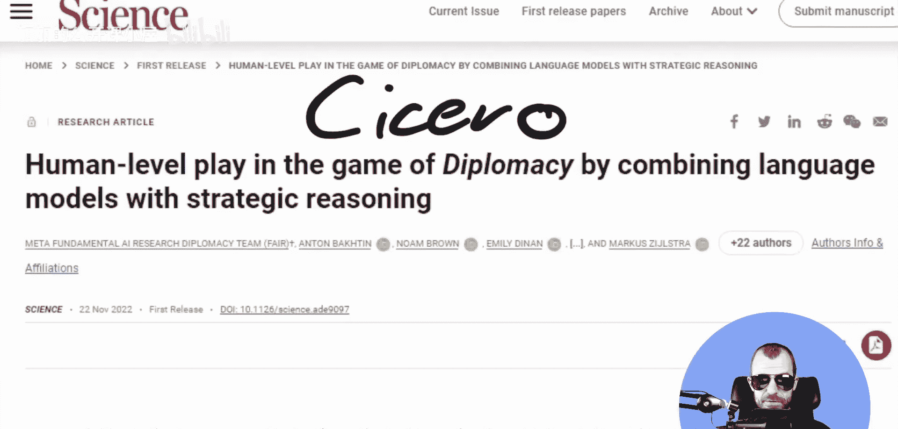

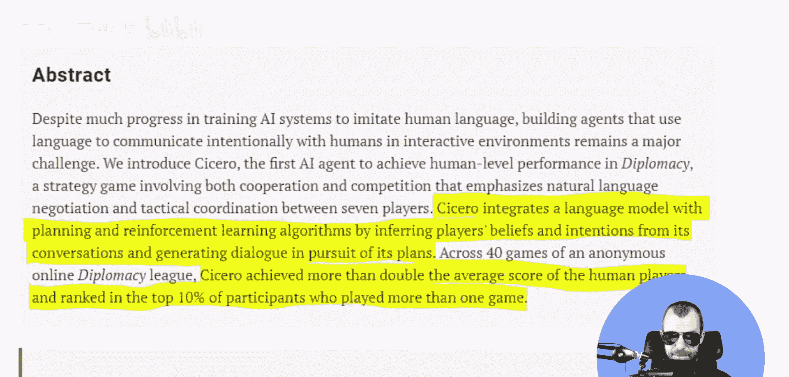

玩家的目标是尽可能多地占领带有补给中心的领土。可执行的操作包括移动军队、攻击其他领土，或者支援其他玩家的攻击行动。正是这些需要协调的操作，使得游戏中的聊天功能至关重要。

在常规游戏中，玩家通过聊天窗口与其他玩家交流，可以协调计划、结成联盟并建立信任。这对AI智能体提出了多方面的挑战：它需要像人类一样沟通，同时处理不完全信息（因为其他玩家之间也会私下交流），并在合作与竞争之间找到平衡。

## CICERO的成就与核心思路

了解了游戏背景后，我们来看看CICERO取得了怎样的成绩。Meta开发的这个智能体在多个锦标赛中表现优异，其排名进入了所有人类玩家的前10%，平均得分是人类玩家的两倍以上。

相关论文题为《通过结合语言模型与战略推理在<外交>游戏中实现人类水平的表现》。摘要中指出，CICERO通过从对话中推断玩家的信念和意图，并为其计划生成对话，成功整合了语言模型与规划及强化学习算法。

然而，需要指出的是，CICERO的成功部分源于人类玩家在游戏中的非完全理性行为。《外交》游戏对人类玩家的吸引力很大程度上在于“人性化”的互动，如建立信任、处理背叛带来的情绪反应等。而最高水平的玩家有时也会受情绪影响，做出非最优的战略决策。从纯粹博弈论的角度看，在一局有明确终点的游戏中，“信任”的价值有限，因为玩家随时可能为利益背叛盟友。CICERO的策略更侧重于高效协调，而非完全模拟复杂的人类社交心理。

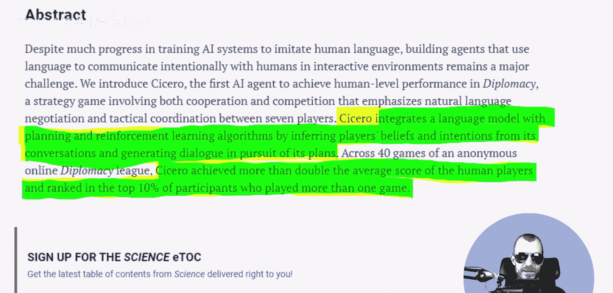

## 系统架构：对话模型与战略推理引擎

现在，我们来深入探讨CICERO是如何构建的。其核心架构由两部分耦合而成：一个可控的对话模型和一个战略推理引擎。

*   **战略推理引擎**：负责决定CICERO在游戏中的行动（移动、攻击等）。它会进行前瞻性规划，其决策在一定程度上受到对话信息的影响。
*   **可控对话模型**：负责与其他玩家进行聊天交流。它的主要作用是将推理引擎产生的战略“意图”翻译成自然语言。

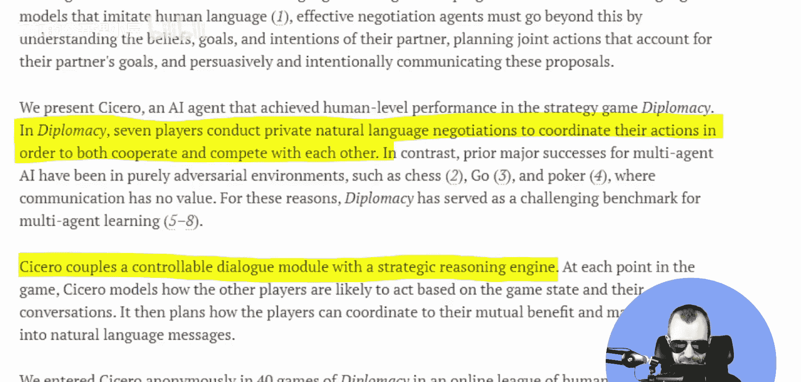

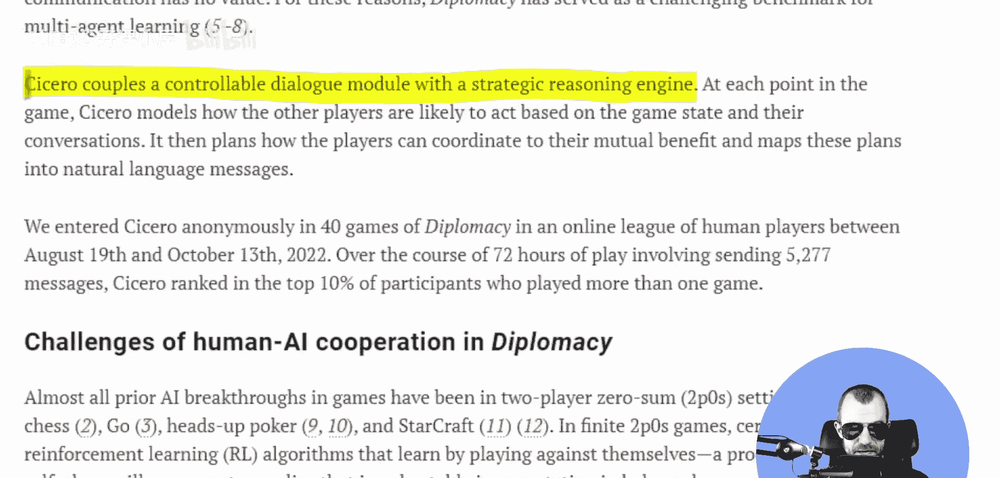

以下是两者协作的简化流程：
1.  推理引擎分析游戏状态，制定行动计划。
2.  对话模型将这些计划（例如“军队A移动到领土B”）转化为友好的协商语句（例如“我打算将军队A调往B区域，你同意吗？”）。
3.  对话模型也会解析收到的消息，提取他人的意图，反馈给推理引擎以更新其规划。

需要指出的是，在这种架构下，语言本身并未被深度地作为战略工具。CICERO主要是用语言来沟通其既定计划，而不是将“说什么话”本身作为一种独立的、可规划的欺诈或心理博弈策略。这为未来的研究留下了改进空间。

## 总结与展望

本节课中，我们一起学习了Meta AI的CICERO智能体。我们了解到它如何通过结合**战略推理引擎**与**可控对话模型**，在高度依赖沟通与协作的《外交》游戏中达到顶尖人类水平。

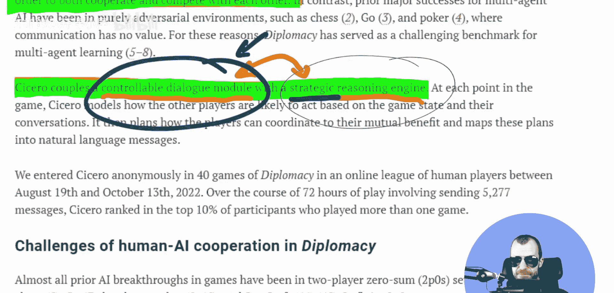

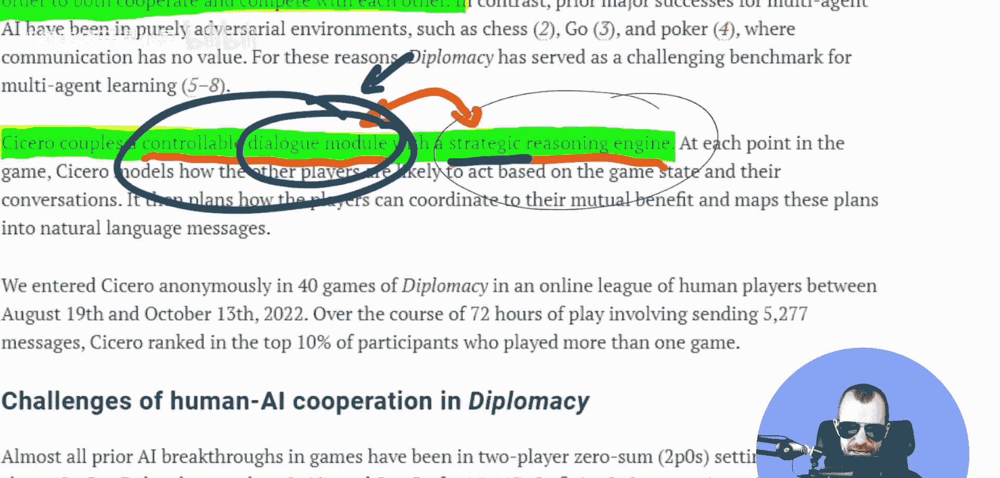

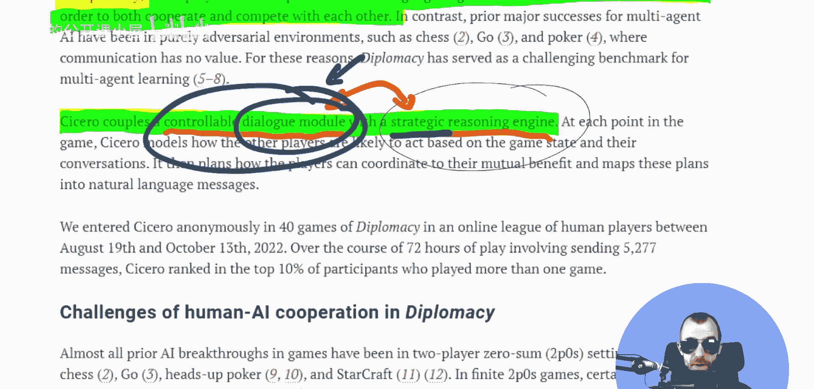

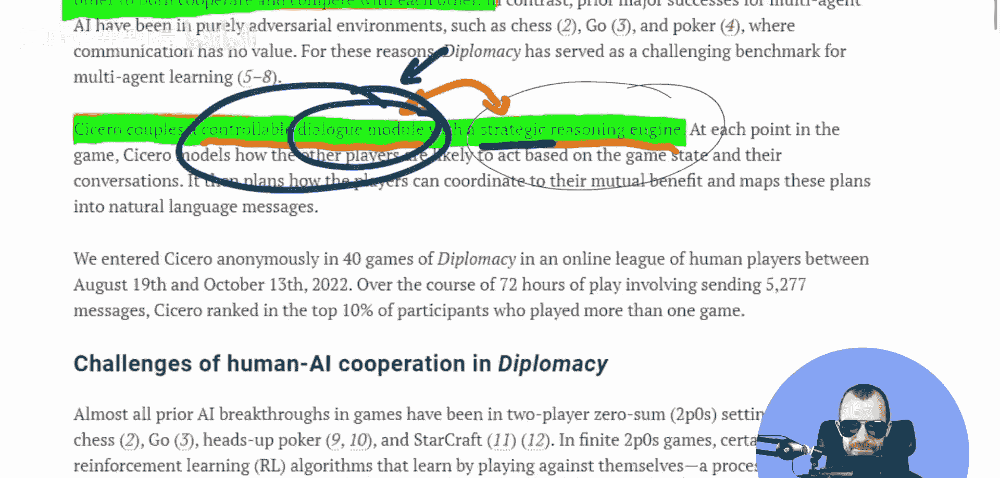

其成功表明，AI已经能够在复杂、多智能体、不完全信息的环境中进行有效的战略规划和自然语言沟通。尽管当前系统在将语言深度整合为战略工具方面尚有局限，但CICERO无疑为未来开发更强大、更人性化的协作型AI奠定了重要的基础。