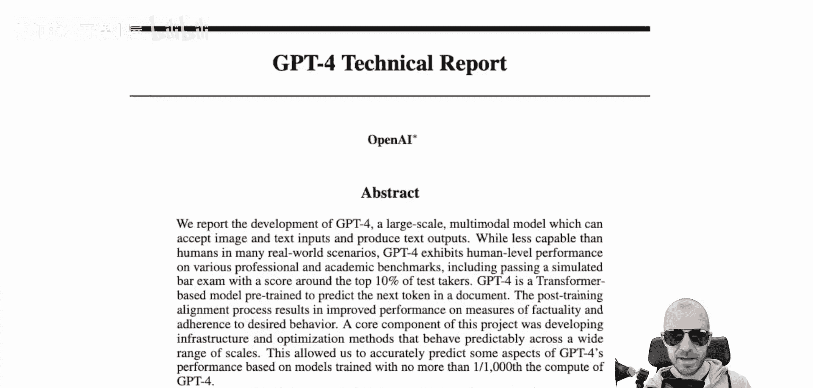
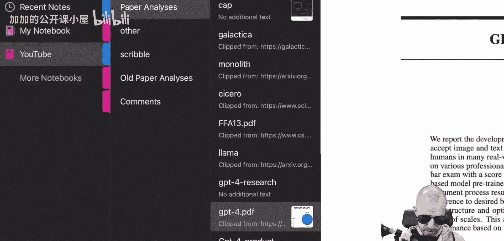
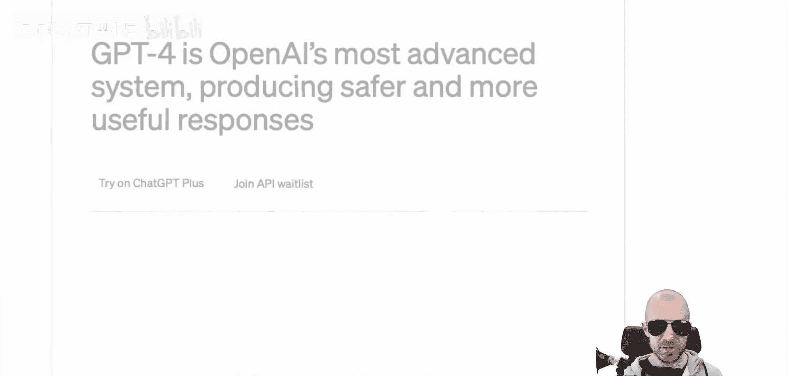
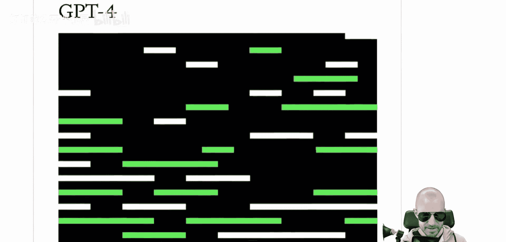
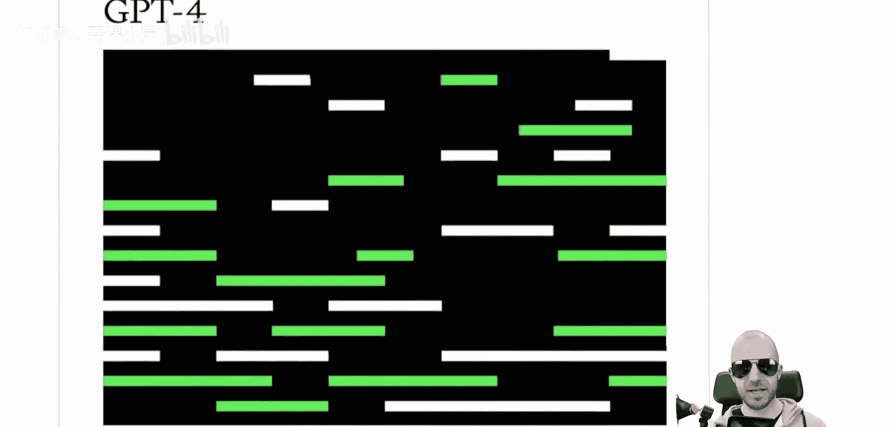
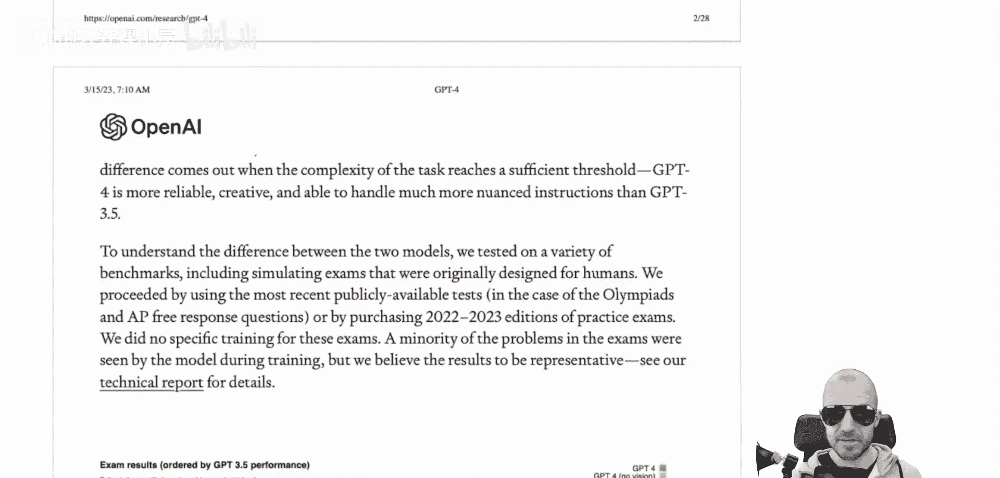
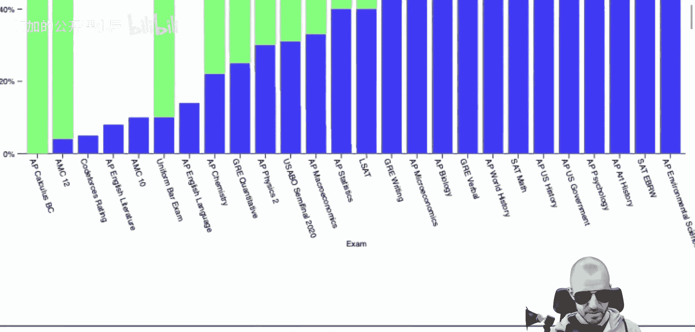
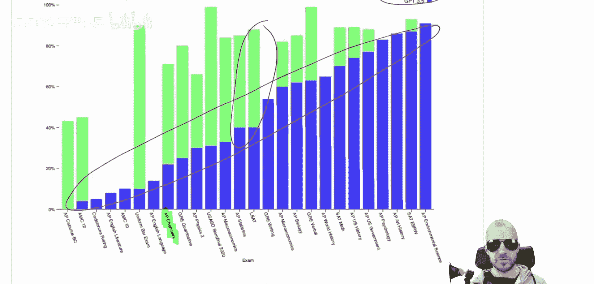

# 095：GPT-4震撼发布！全方位解析已知核心特性

在本节课中，我们将要学习OpenAI最新发布的GPT-4模型。我们将解析其官方技术报告，了解其核心能力、评估方式，并讨论其发布策略所引发的争议。

## 模型发布与定位

GPT-4终于发布了。其展现出的能力令人惊叹。

正如这张梗图所示，感谢Discord社区成员提供的素材。我们将深入探讨GPT-4的发布、其技术报告（或称研究报告），以及OpenAI此次发布的内容和GPT-4的能力。同时，我们也会讨论其颇具争议的发布方式——即对模型细节几乎闭口不谈。

需要提前说明的是，如果你期待像往常一样，在本视频中讨论模型的参数量、训练方法或使用的技巧等通常来自研究实验室的细节，那么你在这里将一无所获。这份长达98页的报告，大部分内容都在陈述“我们训练了一个模型，它很好，很安全”。他们花了大量篇幅确保你相信它非常、非常安全。此处的“安全”并非指对人类或防止偏见的安全，而更多是指产品层面的安全，即你可以将其集成到产品中，而无需过分担心它会失控并冒犯你的客户。

我们现在看到，OpenAI正彻底远离任何研究机构的形态，转向产品机构。这是一个产品，你可以使用它，它可能在某些应用中相当出色。但我们必须面对一个事实：大型研究实验室正变得更加产品导向。我坚信，作为一个研究社区，我们不应接受这一点。我们应该为此批评OpenAI。这不再是研究，你现在是一家软件商店。这本身没问题，但请不要声称自己“开放”。

## 官方发布内容

这份文件被称为“技术报告”。除了这份技术报告，他们还发布了其他多项内容。

他们发布了一个产品页面。这是一个产品宣传网站，上面有人们看着iPad并发出惊叹的视频，以及与ChatGPT的对比，声称GPT-4比ChatGPT好得多。他们还发布了一个研究网站。他们有两个网站：一个是 `product/products/gpt-4`，另一个是 `research/gpt-4`。研究网站可能是大多数人看到或正在浏览的。

研究网站本质上是技术报告的简短浓缩版。他们声称：“我们创造了GPT-4，这是OpenAI在扩展深度学习努力中的最新里程碑。它是一个大型多模态模型。”

## 核心能力：多模态输入

“多模态”意味着它能接受图像和文本输入，并输出文本。在我看来，这有点令人失望。当然，GPT-4除了让人失望外别无可能，因为人们的期望实在太高了。人们曾猜测它是否能处理视频，或者是否能输出图像等。实际上，它能接受文本和图像输入，并输出文本。因此，你从OpenAI文本API中习惯的一切功能仍然可用，但现在你还能提供图像。

在发布当天，Greg Brockman为开发者进行了一场直播演示。他画了一个简单的网站草图，比如画了一个按钮和一个笑话，然后是一个显示笑点的按钮。他只是粗略地画了一个网站，将图片输入GPT-4，然后GPT-4就输出了创建该网站的代码，包括功能按钮等。这非常酷。

现在这已成为可能。在论文中，他们还有各种关于模型对信息图进行推理的报告。例如，你可以截取某个内容的截图，输入给模型，并向它提问。这相当酷。

## 评估方式：人类考试基准

他们做的另一件事，也是最让大多数人惊讶的是，他们在人类考试上评估了GPT-4。现在，这些模型越来越多地在人类考试上进行测试，而不仅仅是学术基准。

你可以在这里看到各种考试，例如化学考试、代数考试等。其中一个（或多个）结果让很多人惊讶。例如，这里的LSAT考试。你现在看到的数字是模型的百分位数。第88个百分位本质上意味着，如果这是一个人类，他在100个人中能排到什么位置。在这种情况下，GPT-4在100个人中能排到第88位。

特别有一项是律师资格考试。它在模拟律师资格考试中的得分大约位于前10%的考生水平。相比之下，旧模型GPT-3.5的得分大约在后10%。因此，它在这个考试中比90%的人类表现得更好。

人们对此发出了很多警报。显然，这些语言模型在需要复述知识并以详尽方式书写下来的领域会非常、非常出色。但你必须注意这些人类考试基准。这些模型不是人类，而考试是专门为人类设计的。考试着眼于人类彼此之间的差异点，并专门测试那个维度。这个维度可能是我们训练的模型特别擅长或不擅长的，但这并不一定能说明它们在实际工作中与人类相比究竟如何。

例如，如果你想成为一名律师，你还需要与客户互动、写邮件、安排预约。模型也许能做到这些，但你还需要理解客户、与他们交谈、建立联系，并在现实世界中推理下一步该做什么。偶尔，你可能还需要爬楼梯或乘电梯。因此，有许多对工作真正重要的事情是人类必须做的。我的例子可能不太恰当，但我希望你能理解我的意思。这些考试只测试人类彼此差异的地方，在此之上评估模型是好的，能告诉我们一些进展，但无法真正触及核心问题：这是AGI吗？我们的律师未来会失业吗？这很像让计算机做一个计算测试，比如你在小学低年级做的乘法表计算。然后你拿出计算机，计算机完胜孩子们。但这并不意味着它们将成为数学家，甚至不意味着它们是好的快速计算器。

我希望我已经说清楚了。当你将机器应用于为人类设计、并专门针对人类差异点的基准测试时，必须多加注意。话虽如此，GPT-4（无论是否包含视觉功能）几乎在所有地方都超越了旧模型GPT-3.5。

你可以在这里看到蓝色的百分位数，那是OpenAI旧模型达到的百分位。而在许多项目中，新模型确实显著超越了旧模型。

## 总结

本节课中，我们一起学习了GPT-4的发布概况。我们了解到GPT-4是一个大型多模态模型，能接受图像和文本输入并输出文本，其核心应用之一是理解草图并生成代码。OpenAI采用人类考试百分位来展示其性能，例如在律师资格考试中达到前10%的水平。同时，我们也讨论了需要谨慎看待这类为人类设计的基准测试。最后，我们指出了此次发布策略的争议性，即OpenAI未披露模型规模、架构等细节，标志着其进一步向产品化公司转型。