# 097：利用大型语言模型进行缜密问题解决（全文评析） 🌳

在本节课中，我们将学习一篇名为《思维之树：利用大型语言模型进行缜密问题解决》的论文。这篇论文提出了一种新的解码技术，旨在通过让语言模型进行显式的树状搜索来提升其在复杂问题上的解决能力。我们将逐步解析其核心思想、技术细节以及应用场景。

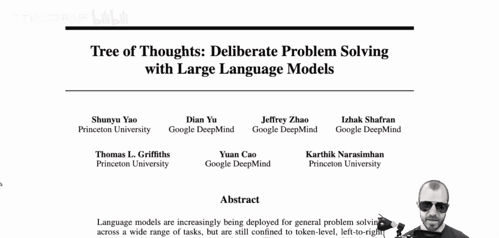

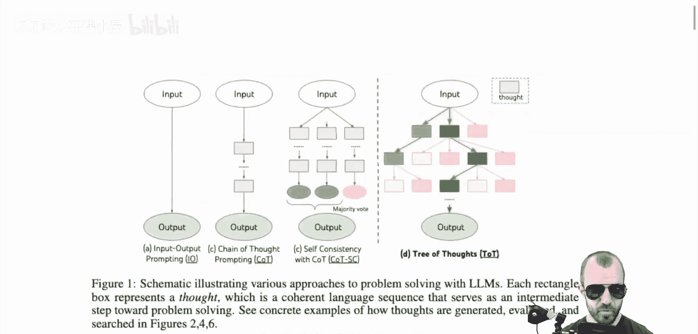

## 概述 📋

论文的核心主张是，传统的提示方法，即使是精心设计的，也存在局限性。作者提出了一种名为“思维之树”的新方法，它允许语言模型在生成答案的过程中进行分支、回溯和评估，从而更系统、更缜密地解决问题。

## 现有提示方法回顾 🔄

上一节我们概述了论文的目标，本节中我们来看看论文中对比的几种现有提示方法，这是理解“思维之树”创新的基础。

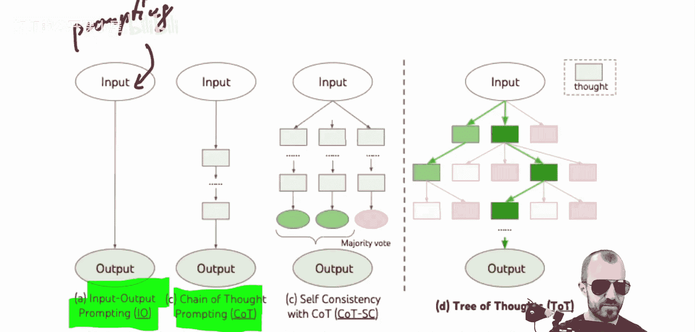

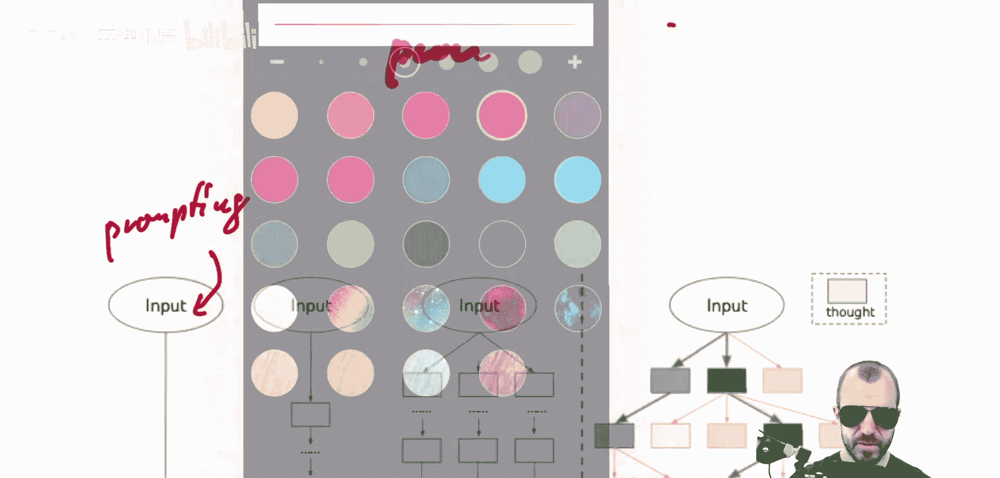

### 输入-输出提示
这是最基础的提示方法。用户向语言模型提出任务，并可选地指定输出格式。
*   **公式/代码描述**：`Prompt = Task Description + [Optional Output Format]`
*   **示例**：要求模型以JSON格式回复，或从给定的几个选项中选择一个词作为答案。

### 思维链提示
这种方法要求语言模型在给出最终答案前，显式地写出推理的中间步骤。
*   **核心思想**：通过指令让模型输出类似“思考：第一步... 第二步... 答案：...”的格式。
*   **优势假设**：这可能为模型提供了“草稿纸”，让后续思考能参考前文；或者通过生成长度更大的文本来投入更多计算资源。

### 自洽性结合思维链
这种方法将思维链与投票机制结合。对同一个问题，让模型进行多次思维链推理，然后对最终答案进行多数投票。
*   **适用场景**：主要用于分类任务，可以聚合多个推理路径的结果。

## 思维之树方法详解 🌲

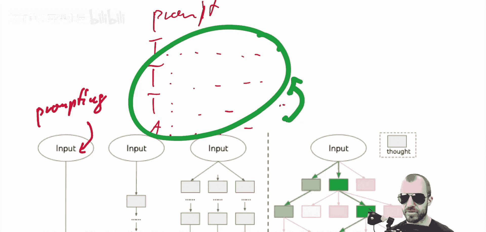

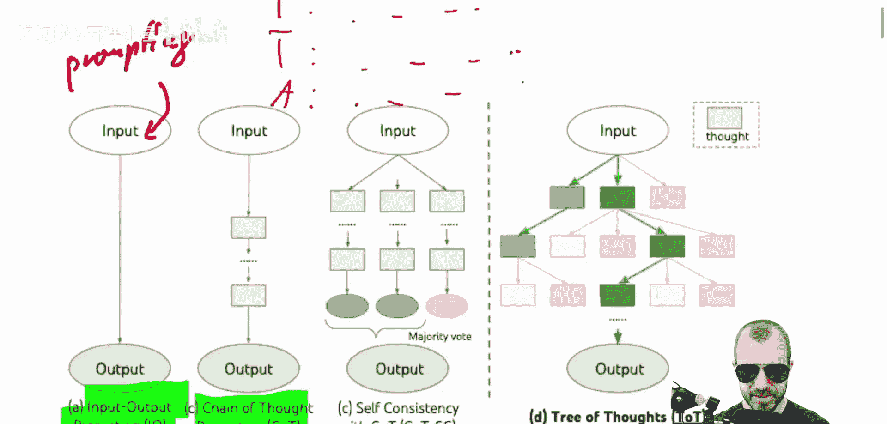

在回顾了现有方法后，我们现在进入核心部分，详细探讨“思维之树”方法是如何工作的。

思维之树的核心是将问题解决过程构建为一棵搜索树，而不仅仅是单一的链条。树的每个节点代表一个“思维”或部分解决方案。

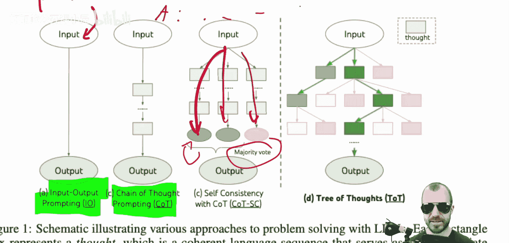

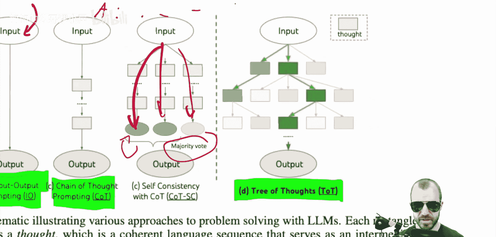

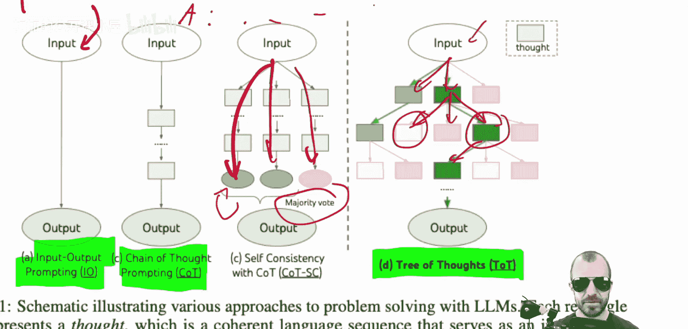

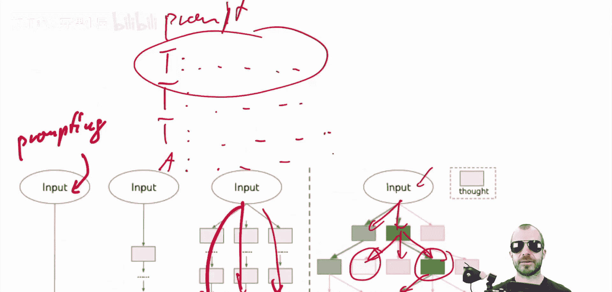

以下是构建和搜索这棵树的关键步骤：

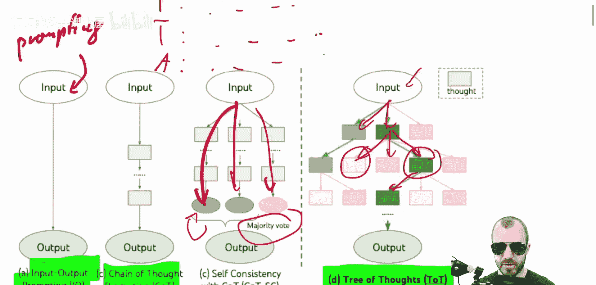

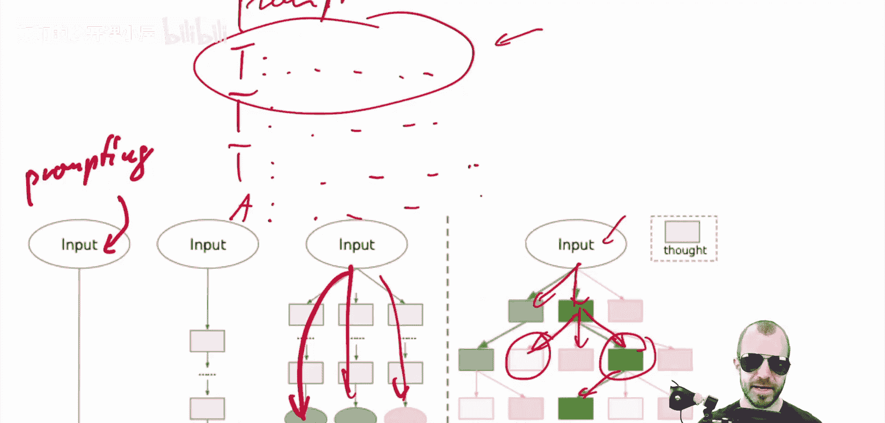

1.  **思维生成**：从当前节点（初始为问题本身）出发，让语言模型生成多个（例如k个）可能的下一步“思维”。这相当于在树中创建了多个分支。
2.  **状态评估**：使用语言模型本身作为“评判者”，评估上一步生成的所有“思维”状态。评估它们对于解决原始问题的“好坏”程度。论文指出，模型在评估方面的能力通常强于生成。
3.  **搜索策略**：根据评估结果，决定后续的搜索路径。例如，可以放弃评估差的节点（剪枝），继续扩展评估好的节点（广度/深度优先搜索）。图中被标红的节点即表示被放弃的分支。

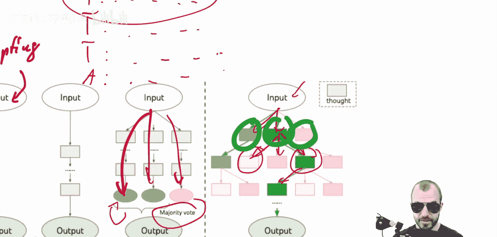

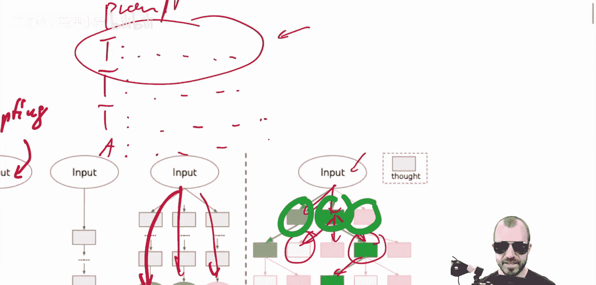

这个过程可以迭代进行：选择一个评估良好的节点，再次进行“思维生成”和“状态评估”，直到找到令人满意的解决方案或达到搜索深度限制。

**与思维链的对比**：思维链是线性的（一条路走到底），而思维之树是发散的，允许探索多种可能性，并通过回溯放弃无效路径，从而进行更系统化的搜索。

## 总结与展望 🎯

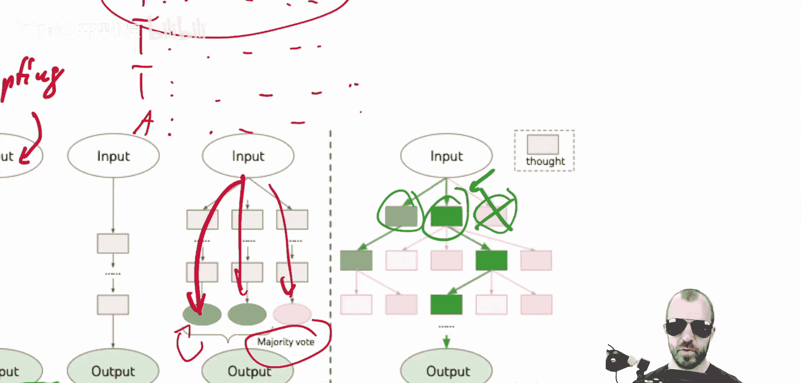

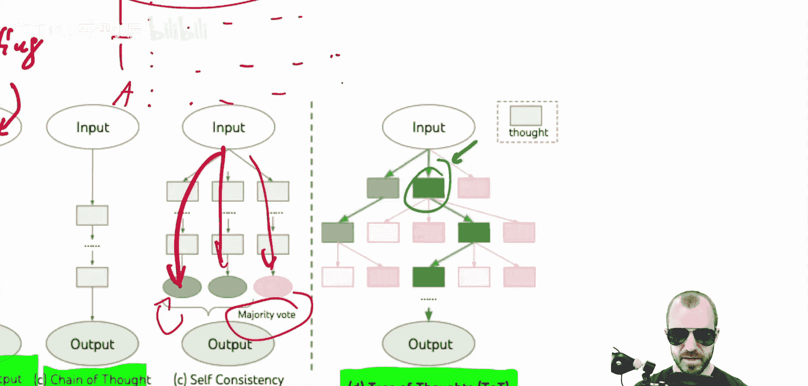

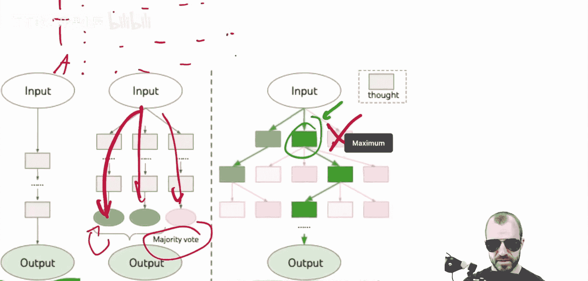

本节课中我们一起学习了《思维之树》这篇论文。它提出了一种将大型语言模型与经典搜索算法（如树搜索）相结合的新颖解码技术。通过让模型自己生成多种可能路径并自我评估，该方法能够在适合探索的复杂任务上取得比传统提示方法更好的效果。

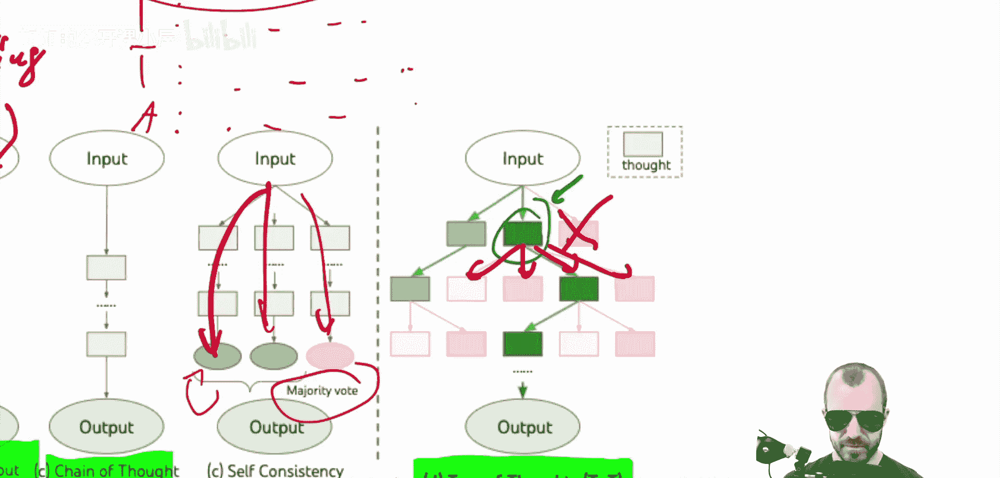

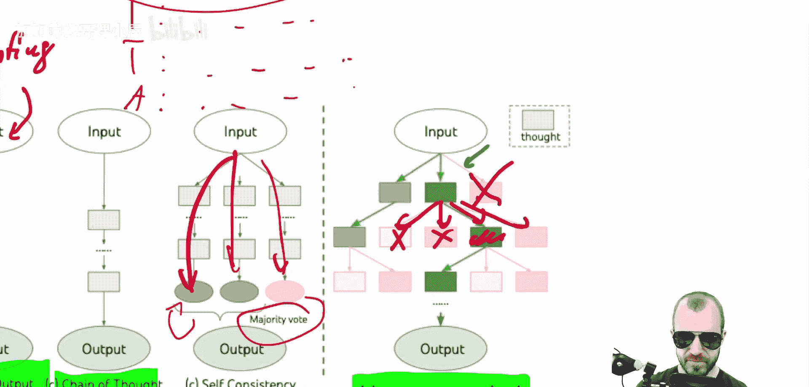

这篇论文代表了将语言模型与算法逻辑相结合的一个重要探索方向，为未来开发更强大、更可靠的问题解决智能体提供了思路。