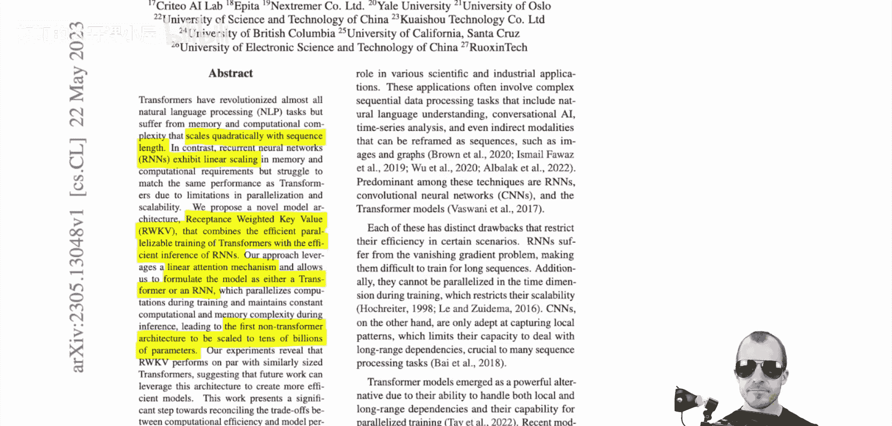

# 098：为Transformer时代重塑RNN（论文详解）📚

在本节课中，我们将要学习一篇名为“RWKV：为Transformer时代重塑RNN”的论文。RWKV是一个独特的模型架构，它试图结合Transformer和循环神经网络（RNN）的优点。我们将探讨其设计原理、核心机制以及它如何解决现有模型的一些关键瓶颈。

## 概述

RWKV模型旨在为Transformer时代重新设计RNN。它是一个非常有趣的项目和模型架构，因为它兼具Transformer的某些特性。具体来说，它是一个在训练方面具有高度可扩展性的模型架构，可以堆叠得很深且仍能有效训练，同时支持训练并行化。

与此同时，它通过本质上作为一个RNN，避免了Transformer所具有的二次方内存瓶颈。在推理过程中，它可以逐步计算输出，并且由于所有信息都被放入一个隐藏状态中，因此始终占用恒定的内存。我们将探讨这两者如何结合，以及它们之间的权衡。

这个项目之所以引人注目，还因为它主要由一个人或极少数人开发完成。相比之下，整个企业都在将人力资源投入到Transformer的研究中。然而，结果显示，在某些情况下（虽然不是所有情况），该模型的性能可以与非常大的Transformer模型相媲美。正如之前提到的，它具有可扩展性，而这正是传统RNN所缺乏的。

我们将通读论文，解析其架构，并了解其实际工作原理。在此过程中，我也会分享一些个人的思考和观点。

## 模型动机与背景

上一节我们介绍了RWKV项目的概况，本节中我们来看看模型设计的核心动机与面临的挑战。

Transformer通常以因果注意力（causal attention）的方式用于语言建模。这意味着序列中的每个标记（token）都可以关注其之前的所有标记。这导致了计算和内存需求随序列长度呈**二次方**增长。具体而言，对于长度为 `T` 的序列，注意力机制需要考虑大约 `T^2` 次交互。

因此，Transformer的能力受到限制：每增加一个标记，就会增加与 `T` 成比例的内存需求，这很快就会变得难以承受。

循环神经网络（RNN）则采用了不同的权衡。RNN在处理序列时，会维护一个隐藏状态（记忆）。它从当前输入和隐藏状态计算输出，并更新隐藏状态以供下一步使用。这个过程是逐步进行的。

RNN有一个非常优秀的特性：**推理时只需要恒定的内存**，因为所有历史信息都被压缩在当前的隐藏状态中。然而，这也带来了瓶颈：模型在预测下一个标记时，只能显式地考虑当前隐藏状态和上一个输入，无法直接访问更早的历史信息。这个信息压缩过程通常是RNN的弱点之一。

此外，RNN还存在梯度消失问题，并且 notoriously 难以训练。因为推理是逐步进行的，训练时必须进行随时间反向传播（BPTT），这既是梯度消失问题的部分原因，也意味着无法像Transformer那样并行化训练。在Transformer中，可以输入一个长度为50的标记序列，并通过因果注意力掩码同时获得50个训练样本。而在RNN中，对于50个标记的序列，一次仍然只能计算一个标记的损失。

**RWKV的目标正是在这两者之间找到一个折衷方案。**

## RWKV的核心思想：线性注意力与卷积视角

在了解了传统Transformer和RNN的局限后，我们进入RWKV的核心。作者声称其拥有一个线性注意力机制，并可以将模型表述为Transformer或RNN两种形式。

然而，需要指出的是，这种“线性注意力”的概念在一定程度上扩展了“注意力”一词的传统含义。虽然RWKV并非首创此概念，但其实现方式颇具特色。

从最基础的角度理解，你可以将RWKV视为一个**在一维标记序列上操作的卷积网络（CNN）**。这是理解其并行训练和高效推理的关键。

论文中指出，Transformer的复杂度随序列长度呈二次方缩放，而RNN呈线性缩放，后者非常有利。RWKV模型结合了Transformer的高效可并行训练与RNN的高效推理。这就像两种可以切换的模式。

以下是RWKV名称的由来，它描述了模型架构的不同组成部分：
*   **R** 代表 Receptance
*   **W** 代表 Weight
*   **K** 代表 Key
*   **V** 代表 Value

## 架构详解与工作机制

现在，让我们深入RWKV的架构细节，看看它是如何运作的。

我们主要探讨的RWKV实例是用于语言建模的。语言建模意味着我们有一段文本，我们希望模型预测下一个标记或下一个词。例如，给定前缀，预测后续内容。

RWKV的关键创新在于其时间混合（Time-mixing）和通道混合（Channel-mixing）模块，它们以线性复杂度的方式模拟了注意力和前馈网络的功能。

其核心公式摒弃了传统的点积注意力。相反，它使用了一种递推形式，使得当前时刻的输出可以基于当前输入和上一个隐藏状态计算得出。这种计算可以被重新组织，以便在训练时以并行、卷积式的方式处理整个序列，而在推理时则以递推、RNN式的方式逐步进行。

具体来说，其“注意力”步骤可以近似理解为一种具有指数衰减权重的卷积操作，跨越整个序列历史。这解释了为何可以并行计算（如同CNN的卷积核扫过整个序列），也解释了为何在推理时只需常数内存（因为衰减权重使得遥远历史的影响很小，信息被有效地压缩在近期的隐藏状态中）。

## 总结

本节课中我们一起学习了RWKV模型。我们了解到，RWKV是一个旨在融合Transformer和RNN优点的混合架构。它通过创新的线性注意力机制，实现了训练时的并行化（如Transformer）和推理时的恒定内存消耗（如RNN）。

其核心在于将序列操作重新表述为一种可并行计算的卷积形式，同时保持递推计算的特性。尽管其对“注意力”的定义有所扩展，但RWKV在工程上展示了一条可行的路径，使得模型能够在保持较强性能的同时，显著提升长序列处理的效率。这个由小团队推动的项目，为大规模序列建模提供了另一种值得关注的思路。